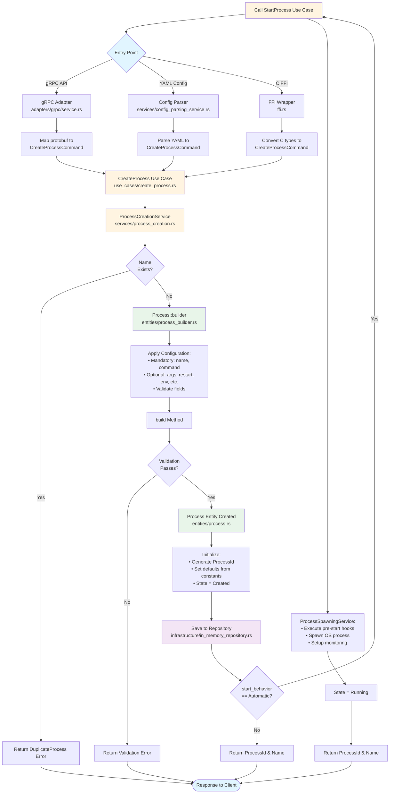
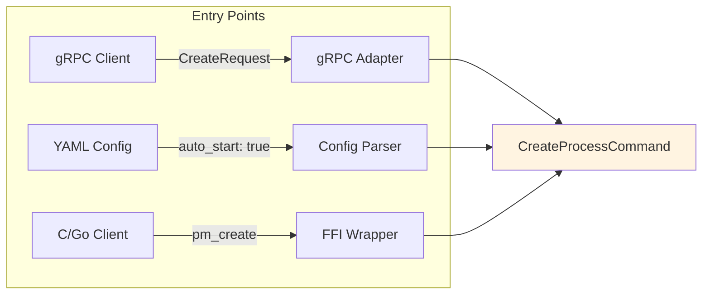
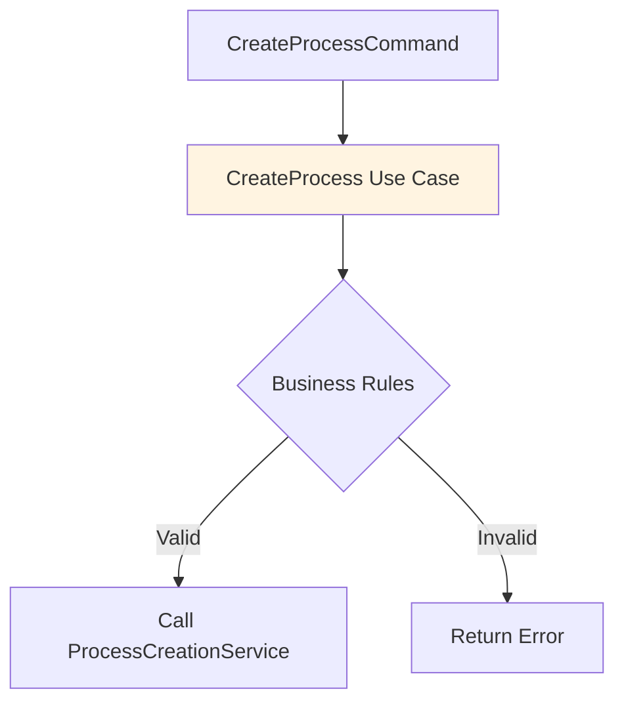
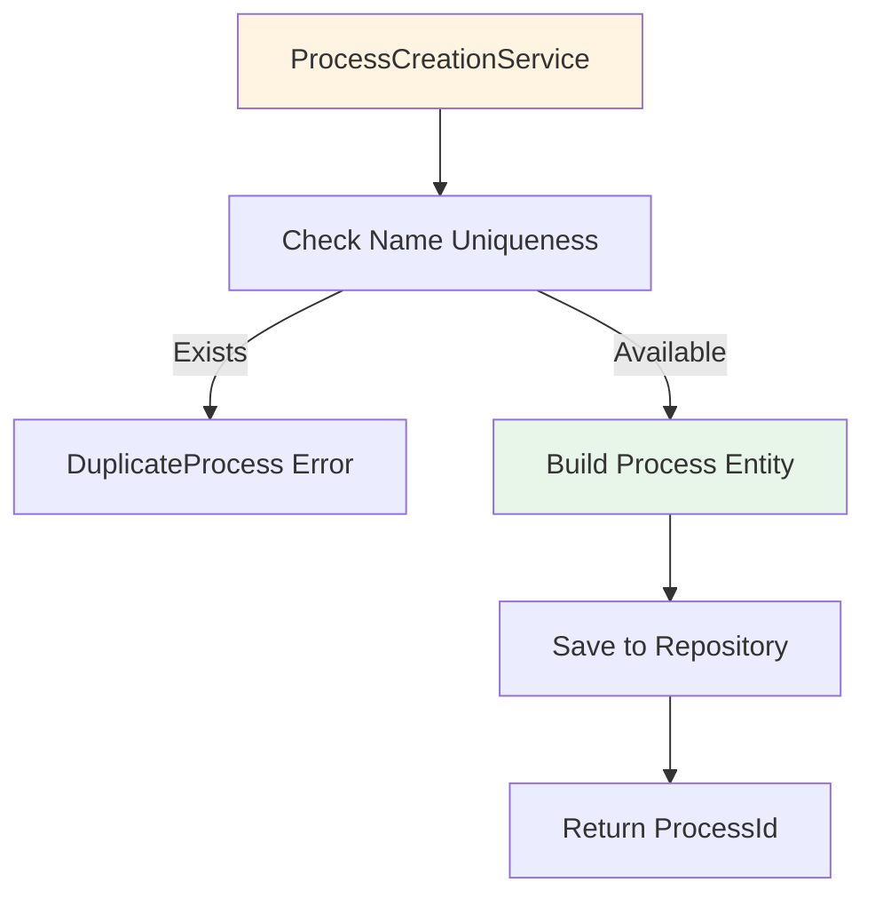
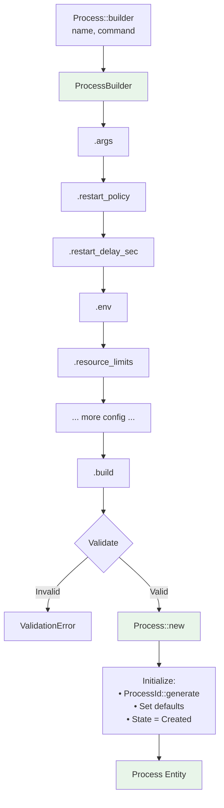
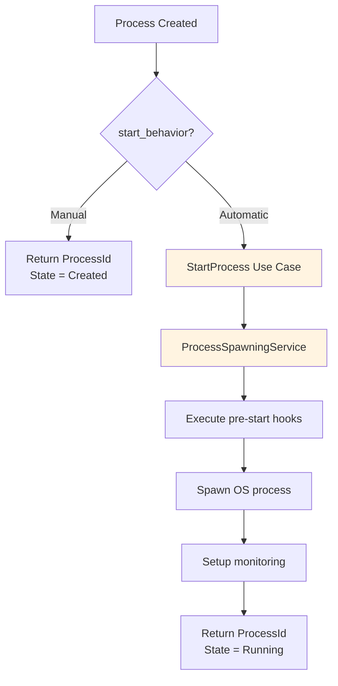
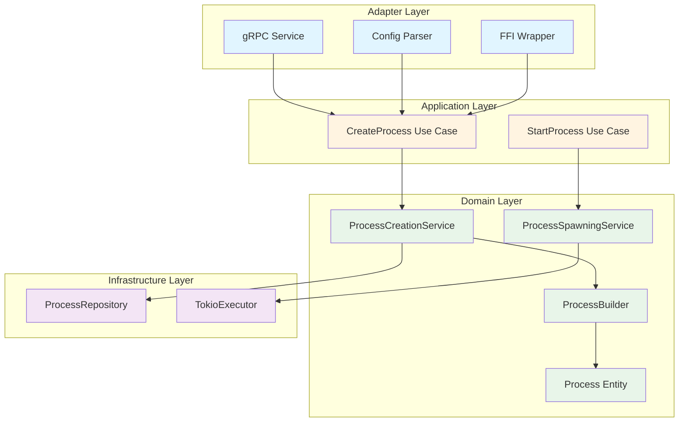
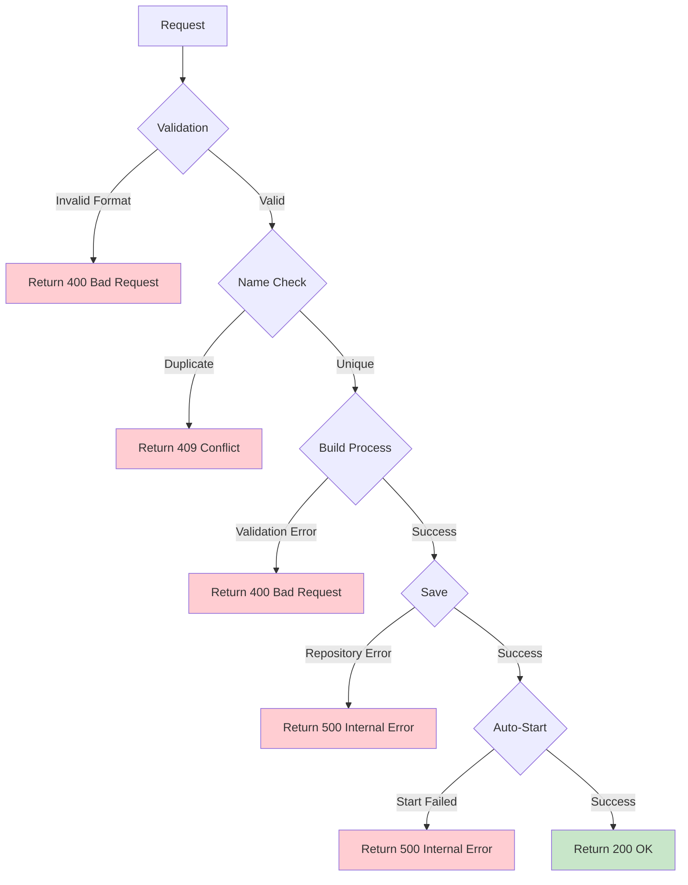

# Process Creation Flow

This document describes the complete flow for creating a process in the Process Manager, from initial request to running process.

## High-Level Flow Diagram



## Detailed Step-by-Step Flow

### Step 1: Entry Point (Adapter Layer)



**Responsibilities:**
- Receive external request (gRPC, YAML, FFI)
- Validate input format
- Map to domain `CreateProcessCommand`

### Step 2: Use Case Execution (Application Layer)



**Responsibilities:**
- Orchestrate the creation flow
- Enforce business rules
- Coordinate between services

### Step 3: Domain Service (Domain Layer)



**Responsibilities:**
- Validate business constraints
- Build process entity
- Persist to repository

### Step 4: Builder Pattern (Domain Layer)



**Responsibilities:**
- Fluent interface for configuration
- Distinguish mandatory vs optional fields
- Validate configuration
- Create Process entity with defaults

### Step 5: Auto-Start (Optional)



**Responsibilities:**
- Conditionally start process
- Execute lifecycle hooks
- Spawn actual OS process
- Setup health monitoring

## Architecture Layers



## Key Components

### CreateProcessCommand (DTO)
```rust
pub struct CreateProcessCommand {
    // Mandatory
    pub name: String,
    pub command: String,
    
    // Optional
    pub args: Vec<String>,
    pub restart: Option<RestartPolicy>,
    pub restart_sec: Option<u64>,
    pub restart_max_delay_sec: Option<u64>,
    pub start_behavior: StartBehavior,
    // ... 40+ more fields
}
```

### ProcessBuilder (Fluent Interface)
```rust
Process::builder("web-server", "/usr/bin/nginx")
    .args(vec!["-g".to_string(), "daemon off;".to_string()])
    .restart_policy(RestartPolicy::Always)
    .restart_delay_sec(5)
    .resource_limits(limits)
    .start_behavior(StartBehavior::Automatic)
    .build()?
```

### Process Entity (Domain Model)
```rust
pub struct Process {
    id: ProcessId,
    name: String,
    command: String,
    state: ProcessState,
    // ... 50+ more fields
}
```

## Error Handling Flow



## Performance Considerations

1. **Uniqueness Check**: O(1) lookup in repository
2. **Builder Pattern**: Zero-cost abstraction (compile-time)
3. **Validation**: Happens once during build
4. **Repository Save**: Async operation, non-blocking
5. **Auto-Start**: Optional, happens asynchronously

## Recent Improvements (Refactoring)

### Phase 1: Builder Pattern
- **Before**: `Process::new()` + 12 setter methods
- **After**: Fluent builder with compile-time validation
- **Benefit**: Clearer API, shorter code

### Phase 2: Consistent Naming
- **Before**: `restart_max_delay` (no unit suffix)
- **After**: `restart_max_delay_sec` (clear units)
- **Benefit**: Self-documenting, no ambiguity

### Phase 3: Boolean Trap Fix
- **Before**: `auto_start: bool` (unclear intent)
- **After**: `start_behavior: StartBehavior` enum
- **Benefit**: Type-safe, extensible, clear intent

## Example: Complete Flow

```mermaid
sequenceDiagram
    participant Client
    participant gRPC as gRPC Adapter
    participant UseCase as CreateProcess UseCase
    participant Service as ProcessCreationService
    participant Builder as ProcessBuilder
    participant Entity as Process Entity
    participant Repo as Repository
    participant Start as StartProcess UseCase
    
    Client->>gRPC: CreateRequest(name="web", cmd="/usr/bin/nginx")
    gRPC->>gRPC: Map protobuf → CreateProcessCommand
    gRPC->>UseCase: execute(command)
    UseCase->>Service: create_from_command(command)
    Service->>Repo: exists_by_name("web")?
    Repo-->>Service: false
    Service->>Builder: Process::builder("web", "/usr/bin/nginx")
    Builder->>Builder: .args(["-g", "daemon off;"])
    Builder->>Builder: .restart_policy(Always)
    Builder->>Builder: .start_behavior(Automatic)
    Builder->>Builder: .build()
    Builder->>Entity: Process::new(validated_config)
    Entity-->>Builder: Process { id, state: Created }
    Builder-->>Service: Process entity
    Service->>Repo: save(process)
    Repo-->>Service: Ok(())
    Service-->>UseCase: Ok((id, name))
    UseCase->>gRPC: CreateProcessResponse { id, name }
    gRPC->>gRPC: Check start_behavior == Automatic
    gRPC->>Start: execute(StartProcessCommand)
    Start->>Entity: spawn_process()
    Entity-->>Start: Ok(pid)
    Start-->>gRPC: Ok(state: Running)
    gRPC-->>Client: CreateResponse { id, state: Running }
```

## See Also

- [Architecture Overview](../ARCHITECTURE.md)
- [Use Cases](../USE_CASES.md)
- [Builder Pattern RFC](../RFC_PROCESS_MANAGER.md)
- [Code Smells Analysis](../CODE_SMELLS_CREATE_PROCESS.md)

