# Log Pattern Clustering Architecture

## Main Data Flow Pipeline

## Core Function Call Graph

## Hash Bucket Architecture

## Memory Layout and Data Structure

## Performance Characteristics

### Algorithm Complexity by Operation

```mermaid
graph LR
    subgraph "Tokenization Pipeline"
        A["Raw Log<br/>O(n) time<br/>O(k) space"] --> B["Token Classification<br/>O(1) per token<br/>Trie + Rules"]
        B --> C["TokenList<br/>O(k) creation<br/>O(k) memory"]
    end

    subgraph "Clustering Pipeline"
        C --> D["Signature Generation<br/>O(k) time<br/>O(1) space"]
        D --> E["Hash Lookup<br/>O(1) avg<br/>O(m) worst"]
        E --> F["Cluster Assignment<br/>O(1) insertion<br/>O(1) space"]
    end

    subgraph "Pattern Pipeline"
        F --> G["Pattern Generation<br/>O(k × c) time<br/>O(k) space"]
        G --> H["Wildcard Detection<br/>O(k × c) comparison<br/>Lazy evaluation"]
    end

    style A fill:#ffecb3
    style E fill:#f3e5f5
    style G fill:#e8f5e8
```

### Performance Analysis

```mermaid
graph TB
    subgraph "Performance Characteristics"
        A["🚀 Tokenization<br/>O(n) always<br/>Single-pass processing"]
        B["📊 Signature<br/>O(k) linear<br/>Cached result"]
        C["🔍 Hash Lookup<br/>O(1) avg, O(m) worst<br/>Rare collisions"]
        D["🎯 Clustering<br/>O(1) typical<br/>Hit existing clusters"]
        E["🎨 Pattern Gen<br/>O(k) single, O(k×c) multiple<br/>Lazy evaluation"]
    end

    A --> B
    B --> C
    C --> D
    D --> E

    style A fill:#e3f2fd
    style B fill:#f3e5f5
    style C fill:#fff3e0
    style D fill:#e8f5e8
    style E fill:#fce4ec
```

### Test Results from Codebase

From the actual test suite (`TestClusteringPerformance`):
- **Input**: 400 similar log messages
- **Output**: 3 clusters created
- **Demonstrates**: Effective pattern consolidation for similar structured logs

### Algorithm Variables

### Key Optimizations

## Production Data Flow Example

## Key Production Functions

### Core Pipeline
- `automaton.TokenizeString()` - Entry point
- `ClusterManager.Add()` - Main clustering logic
- `Cluster.GeneratePattern()` - Pattern extraction
- `TokenList.Signature()` - Clustering key generation

### Support Functions
- `NewClusterManager()` - Initialization
- `NewCluster()` - Cluster creation
- `Cluster.Add()` - Add TokenList to existing cluster
- `ClusterManager.GetCluster()` - Retrieve by signature

### Infrastructure
- `globalTrie.Match()` - Fast token classification
- `Signature.Equals()` - Hash collision resolution
- `computeHash()` - Signature hashing for buckets