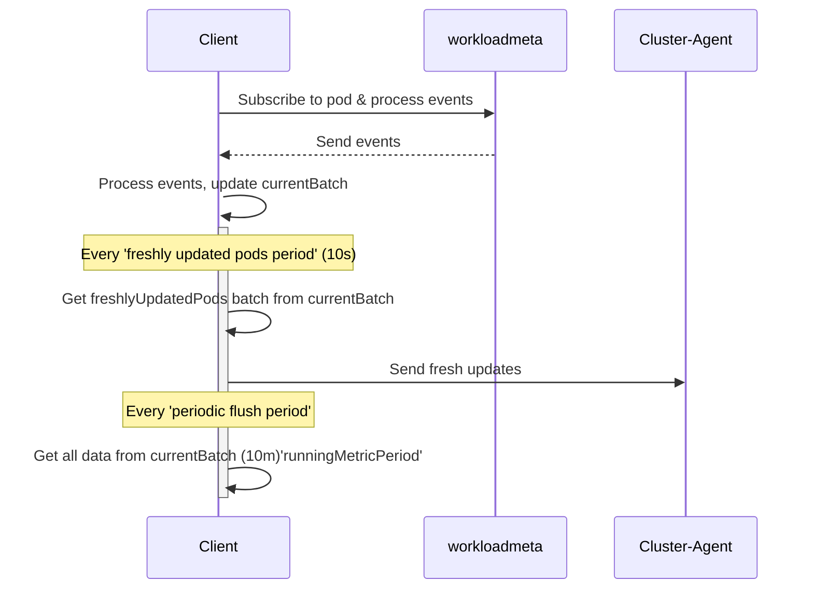

# Language Detection Exporter Client

## Overview

This code comprises the language exporter client implemented by container-integrations for APM libraries injecting. This client is responsible for sending process language information from process events to the Cluster-Agent for processing.

## Mechanism

The client subscribe to process and pod events in workloadmeta. It handles only new processes and pod deletions. The process events capture the language information of a running process with the corresponding container id. The client resolves the associated pod using workloadmeta, including its unique identifier and its detected language.

There are two main periods the client operates in terms of sending data to the Cluster-Agent:

1. The `freshDataPeriod` that sends information about new updated pods as soon as possible. It awaits a few seconds, such that there is a high chance that all processes in a pod are scanned and thus tries limiting the amount of messages sent.
2. The `periodical flush period` is dedicated to sending accumulated data in intervals of a few minutes. This mechanism ensures a `retry`.

Moreover, since there can be a race between the Kubelet and the process-check, if the pod of a given process is not found, the client waits until the kubelet data is pulled before trying again.

For better observability, it uses telemetry to emits metrics, including number of pods processed, time taken to send data etc.

## Mermaid Diagram

Below is a simple sequence diagram visualizing the client's communication with Cluster-Agent:

## Note

- This code assumes that a pod has a single and stable owner.
- For more information about the language detection and library injection feature, refer to [this](https://github.com/DataDog/datadog-agent/blob/main/pkg/languagedetection/util/README.md) document.
