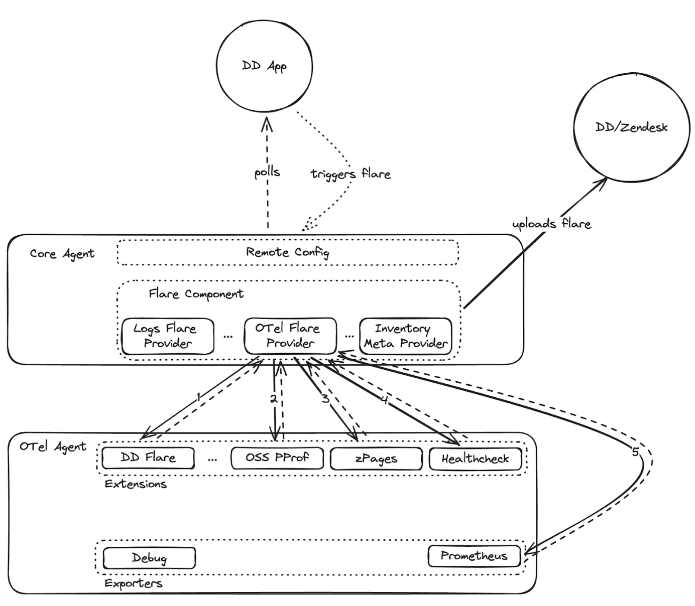

# ddflare Extension

The ddflare extension component allows inclusion of otel-agent data in the datadog-agent [flare](https://docs.datadoghq.com/agent/troubleshooting/send_a_flare/?tab=agent). A flare can be triggered by the core agent process, or remote-config.



## Extension Configuration

The datadogextension will be added automatically by the [converter component](../converter/README.md). If you opted out of the converter, or you want to change the defaults, you are able to configure the extension as so:

*Collector config:*
```
extensions:
 ddflare:
   endpoint: localhost:7777
```

*Agent Config:*
```
otelcollector:
  enabled: true
```

The port is the location in which the otel-agent will expose the data required to build the flare. The core agent then fetches the data from this port.

## Data collected by flare

### Configurations

The flare will collect both the provided collector config and the enhanced config (enhanced via [converter](../converter/README.md)).

The provided collector configs can be found in `otel/otel-flare/customer.cfg` and the enhanced config can be found in `otel/otel-flare/runtime.cfg`.

### Environment variables

The flare will collect all environment variables, and these can be found in `otel/otel-flare/environment.json`.

### Extension data

The flare also adds data collected from extensions. These extensions are added automatically by the [converter component](../converter/README.md). The data collected is from extensions:
- health_check: Found in `otel/otel-flare/health_check`.

Contains a JSON of the latest health check, for example:

```
{"status":"Server available","upSince":"2024-08-14T14:54:00.575804+02:00","uptime":"28.470434291s"}
```
- pprof: Found in `otel/otel-flare/pprof`

Contains a allocs (`dd-autoconfigured_debug_pprof_allocs`), heap (`dd-autoconfigured_debug_pprof_heap`) and cpu (`dd-autoconfigured_debug_pprof_profile`) profile. Profiles can be opened with the [pprof tool](https://github.com/google/pprof), e.g.
```
go tool pprof -http=: otel/otel-flare/pprof/dd-autoconfigured_debug_pprof_heap.dat
```

- zpages: Found in `otel/otel-flare/zpages`

Contains extension (`dd-autoconfigured_debug_extensionz`), feature (`dd-autoconfigured_debug_featurez`), pipeline (`dd-autoconfigured_debug_pipelinez`), service (`dd-autoconfigured_debug_servicez`) and trace (`dd-autoconfigured_debug_tracez`) data. The data is in html format, and can be input in a html viewer.

### Logs

The flare will collect the otel-agent logs which can be found in `logs/otel-agent.log`.

### Raw data

The raw response can be found in `otel-response.json`. This corresponds to the data that is exposed at the datadog extensions port.
