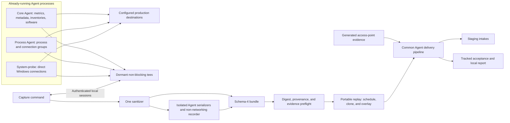

# EUDM simulator architecture

The [simulator overview](../reference/eudm-simulator/index.md) explains the evaluation workflow. This page describes why the command lives in the Agent repository and how capture, replay, and delivery fit together. The [runbook](../how-to/test/eudm-simulator.md) records actual verification and outstanding staging dependencies.

## Comparison with existing eudsim

The main benefit is stronger evidence for **Agent ingestion fidelity and repeatable, complete evaluations**. The existing `eudsim` remains easier to start for synthetic demos and has capabilities this branch deliberately excludes. This is not a claim that the new simulator already produces better Command Center or Bits results: those staging outcomes remain unverified.

This comparison was checked against the local `DataDog/experimental` checkout at commit [`7513e58880de`](https://github.com/DataDog/experimental/tree/7513e58880de3a35053b52e0a5539fc9f1e1aa86/teams/end-user-devices/eudsim). Links below identify that inspected revision, rather than making claims about all future versions of `eudsim`.

| Evaluation concern | Existing `eudsim` | This Agent branch and why it helps |
| --- | --- | --- |
| Realistic endpoint baseline | Device templates plus selected process/application pools construct the fleet. Authors can declare processes and hardware without capturing them. | Observed output from running Agent services supplies metadata, background activity, software, and supported evidence. Preflight rejects absent evidence and impossible resource overlays, reducing the risk of evaluating combinations that the reference device cannot produce. One capture still represents only one device profile. |
| Payload and delivery maintenance | Independent senders own HTTP requests, headers, metric JSON and approximate size splitting, and a three-attempt retry loop. The process sender already uses Agent payload protobuf types. | Agent serializers, compression, batching, queues, headers, and forwarders own the final path. Changes follow the checked-out Agent revision instead of requiring parallel implementations in the external sender. |
| Normal host enrichment | Inventory registration is supplemented by direct REDAPL host-resource writes that bypass the enrichment relationship for synthetic devices. | Cloned host metadata and Agent/host inventories must pass normal ingestion and enrichment. This makes a run useful for testing that relationship, but it also exposes a dependency the bypass avoided. Complete staging device creation is still a required proof. |
| Timing | Metrics/processes/events share a configurable tick, normally 15 seconds; NDM metadata has separate periodic and phase-boundary refreshes. `--fast` compresses time. | Endpoint streams and metric families replay their captured offsets and cadence on one absolute phase clock. A five-minute battery check remains five minutes even when CPU metrics arrive every 15 seconds. Wall-clock runs can exercise actual monitor windows; they take longer and do not force a software/metadata emission at every phase transition. |
| Repeatability | Host-seeded jitter already exists, but the metric loop consumes sequential random draws while iterating a Go map; an existing test explicitly documents the resulting metric nondeterminism. | Variation uses an independent key for each device, phase, stream, sample, and field. Map/worker order cannot change normalized values. Each run records its seed and exact input digests in the report. |
| Delivery completeness | The worker pool covers the declared fleet, but tick-level metric/process send failures are logged and the phase loop continues. Some failures, including registration and initial NDM metadata, are already fatal. | A required cycle counts as delivered only when every chunk/batch is accepted after Agent retry behavior. Undelivered cycles remain visible in the full-fleet ledger and prevent success. A completed phase loop cannot conceal missing required evidence. |
| VPN evidence | The configured stream list has no connection stream. | Captured Windows TCP records support RTT, variance, retransmit, and failure overlays through the portable process submitter. The unchanged VPN-monitor/Command Center path still needs staging proof. |
| Repeated-run isolation | Configurable hostname patterns and an optional generated namespace support identifying simulations; the metric marker is `eudsim:true`. Reusing hostnames also requires clearing old software snapshots. | A fresh opaque run ID scopes endpoint identities and the NDM namespace across streams. Reports retain expected cohorts/conclusions locally, letting evaluation select a run without leaking the intended answer into telemetry. |
| Staging targeting | `--site`/`DD_SITE` can select a destination and the default site is `datadoghq.com`. | `DD_SITE=datad0g.com` is mandatory and all destinations/redirects are checked. This enforces the approved staging-only evaluation scope. |

For example, a process payload rejected halfway through an incident can leave the old phase loop running with an error in the log. The new run fails and reports which required cycles were not delivered, so an investigation over incomplete evidence cannot be counted as a successful scenario evaluation. Similarly, a host populated by direct resource writes can demonstrate a device UI without proving that ordinary Agent metadata creates that device; this branch intentionally requires the latter proof.

Existing `eudsim` already provides cohorts, phase patterns, bounded worker concurrency, process/host CPU correlation, and AP/client BSSID correlation. Those ideas are reused, not claimed as new capabilities. It also supports mixed-platform synthetic fleets; this simulator uses one captured baseline per run, so all cohorts must share its OS. The distinction is their foundation in captured evidence, common Agent delivery, and explicit acceptance accounting. Neither approach reproduces the actual endpoint workload or proves backend correctness merely by receiving HTTP success.

### Costs and capabilities not carried over

- **More setup and revision coupling.** This branch requires an Agent build environment, real Windows/macOS capture devices, a Windows system-probe for connection capture, and time for native collection schedules. The capture timeout defaults to 35 minutes; hourly host system information can require a longer explicit wait. Rebuilding at a new commit requires matching new captures. `eudsim` can generate its baseline directly from templates and scenario declarations.
- **Narrower scenario coverage.** Existing `eudsim` includes Linux templates, notable events and logon-duration scenarios, S3 process archival/replay, stream skipping, dry-run/fast modes, and an endpoint deregistration command. They are absent here. Its S3 replay is process-only; this branch's bundles preserve the required endpoint streams together. Neither tool provides immediate AP deletion through NDM intake.
- **Slower evaluations and less freedom to invent evidence.** Incident runs take real minutes, and missing applications/connections or different hardware require another capture. This is useful for ingestion evaluation but less convenient for a quick UI demonstration.
- **Acceptance remains open.** Live installed-Agent capture passed on macOS; Windows live capture is deferred. Cross-host-OS replay, normal host enrichment, the VPN monitor path, and Bits NDM access still need real results. Use existing `eudsim` for its already-supported synthetic workflows; use this branch to establish the stricter Agent-path evaluation contracts, recording any external blockers.

### Porting an existing scenario

This is not a drop-in CLI or YAML replacement. In `eudsim`, `--config` selects scenario YAML; here `--scenario` selects it, while `DD_SITE` and `DD_API_KEY` supply the site and replay credentials. There is no simulator configuration file. Add `version: 1`, a local `expectation`, and the required incident phases, then supply one baseline with `--bundle /path/to/capture`. Every cohort uses that baseline; scenario overlays produce cohort differences, and all cohorts must match its OS. Split mixed-platform fleets into separate runs. Each run generates fresh hostnames/namespaces, so remove old hostname-pattern/namespace controls and unsupported event/archive declarations. An old `_other` synthetic process or an uncaptured application cannot be used to manufacture missing evidence.

Recheck recovery semantics: existing endpoint metrics carry forward between phases, while this branch's omitted endpoint overlays restore the captured baseline. AP metrics still carry forward and require explicit recovery values. The [scenario reference](../reference/eudm-simulator/scenarios.md) describes the current units, matching rules, and validation rather than assuming all inherited fields behave identically.

The inspected `eudsim` source for this comparison is [configuration and stream defaults](https://github.com/DataDog/experimental/blob/7513e58880de3a35053b52e0a5539fc9f1e1aa86/teams/end-user-devices/eudsim/internal/config/config.go), [HTTP retries](https://github.com/DataDog/experimental/blob/7513e58880de3a35053b52e0a5539fc9f1e1aa86/teams/end-user-devices/eudsim/internal/sender/base.go), [metric batching](https://github.com/DataDog/experimental/blob/7513e58880de3a35053b52e0a5539fc9f1e1aa86/teams/end-user-devices/eudsim/internal/sender/metrics.go), [process encoding](https://github.com/DataDog/experimental/blob/7513e58880de3a35053b52e0a5539fc9f1e1aa86/teams/end-user-devices/eudsim/internal/sender/process.go), [engine registration/scheduling/failure handling](https://github.com/DataDog/experimental/blob/7513e58880de3a35053b52e0a5539fc9f1e1aa86/teams/end-user-devices/eudsim/internal/engine/engine.go), [metric jitter regression test](https://github.com/DataDog/experimental/blob/7513e58880de3a35053b52e0a5539fc9f1e1aa86/teams/end-user-devices/eudsim/internal/engine/event_test.go), and [process archive replay](https://github.com/DataDog/experimental/blob/7513e58880de3a35053b52e0a5539fc9f1e1aa86/teams/end-user-devices/eudsim/internal/replay/replay.go). The sections below describe this branch's corresponding implementation.

## Design decisions

The project began with an external `eudsim` prototype. Its useful scenario concepts were retained: cohorts, phase progression, metric patterns, process and software declarations, and access points. Live Agent output supplies endpoint baselines, and Agent delivery packages replace handcrafted HTTP payloads, approximate batching, and independent retry logic.

| Decision | Reason and consequence |
| --- | --- |
| Separate capture from replay | Live laptop activity would otherwise affect every evaluation. A saved baseline makes replay independent of the operator's current workload. |
| Capture on the represented OS; replay through portable types | Already-running Agent processes collect on their existing schedules; the capture command starts no collectors. Replay uses one Windows or macOS baseline for all cohorts, independently of the replay host OS. This supersedes the early research's same-OS replay proposal. |
| Use one baseline for the entire scenario | Every cohort clones the same captured profile, then receives its scenario overlays. No cohort-to-bundle mapping is required. Missing required evidence or a cohort with an incompatible OS rejects the scenario. |
| Transform typed samples before serialization | Identity and causal relationships span several payloads. Editing compressed wire bytes would be too late and would duplicate Agent encoding knowledge. |
| Require captured evidence and hardware capacity | Variation can change declared values; it cannot demonstrate behavior or capabilities absent from the reference device. Broader coverage requires another capture. |
| Use normal intake and enrichment | Direct resource registration would hide the backend relationship under evaluation. The former REDAPL bypass is intentionally absent. |
| Generate AP evidence using Agent NDM types | An endpoint capture cannot supply an AP's resource inventory or radio counters. The AP side is synthetic, with explicit identity correlation to captured client evidence. |
| Bind replay to the capture-tool commit | Typed structures and serializers may change as the feature branch moves. Replay requires the exact `capture_tool.commit`; producing Agent commits are independently recorded and may differ when they support capture protocol 1. |

The target is repeatable evidence for unchanged products, not emulation of actual application installations, CPU load, network faults, or radio hardware. Production destinations, Linux endpoint simulation, notable events, and direct backend-store writes remain outside the project.

## Capture and replay boundaries

Each daemon owns one capture manager shared by its producing boundaries and local API. Tees remain dormant until the command prepares and activates an authenticated session. Core and Process Agent use existing IPC authentication; every system-probe capture route also requires the IPC middleware. Readiness advertises running, enabled producers and effective schedules, including individual supported metric-check families. The command selects one owner per stream, preferring system-probe for active Windows direct sending. On macOS, it also selects Process Agent connections when that running producer advertises them; unavailable macOS connections are optional.

Capture retains metric cycles throughout the session and requires two observed cycles for every scheduled, supported family: CPU, memory, disk, uptime, WLAN, battery, and network, as advertised by the installed Agent. A family with no enabled check is not invented. Completion also requires two process cycles, two connection cycles when selected, one legacy host-metadata payload, both inventories, and one complete software snapshot. Host system information is selected when its running provider advertises readiness and then requires one observed sample. A slow or empty check can therefore keep capture waiting after faster metrics have arrived. The default 35-minute timeout reports missing evidence and effective cadences instead of forcing collection or accepting incomplete evidence. An advertised hourly host-system-info provider can require `capture --timeout 70m`; increasing the wait does not change its collection schedule.

Observation reserves bounded memory before making an owned copy. Each producer permits 256 records, 128 MiB total, and 64 MiB per logical item, including unfinished assemblies and unacknowledged reads. Overflow or an oversized item fails capture without blocking or changing production submission. The disabled path performs an atomic session check. Tees perform no encoding, sanitization, logging, disk access, or network I/O.

Preparation, activation, reads, heartbeat, and stop use one opaque session ID and protocol version 1. Activation acknowledgements must be within five seconds. A 30-second lease renewed every five seconds disarms abandoned sessions. The coordinator also caps cycle history at 65,536 entries per producer and fails capture if that bound is exhausted. Stop closes admission, waits for reserved copies, and requires acknowledgement of every accepted sequence before returning the final stopped state. Cancellation or writer failure attempts cleanup with a separate bounded context; incomplete sessions cannot produce a valid `COMPLETE` marker.

Normal destinations, retries, forwarding, collection schedules, and service lifecycles stay unchanged. Capture reads installed configuration only to locate APIs and existing authentication artifacts. It does not change `infrastructure_mode`, `network_config.direct_send`, enabled checks, or intervals. Windows direct connections are copied at the sender queue boundary; portable replay never initializes that sender.

| Evidence | Capture boundary and representation | Replay delivery |
| --- | --- | --- |
| Host resource, battery, WLAN, and network-throughput metrics | Selected semantics copied as the serializer consumes the original iterator; actual payload membership joined to initial forwarding routes; separate observed family cadences | `serializer.Serializer.SendIterableSeries` |
| Host/device metadata | Owned semantic projection excluding API keys, resources, and unrelated cloud/container/configuration data before enqueueing; actual provider cadence | `serializer.Serializer.SendHostMetadata` |
| Agent and host inventories | Fixed semantic allowlists copied from normal inventory submissions; credentials, configuration and unrelated inventory tables excluded | `serializer.Serializer.SendMetadata` through `/api/v1/metadata` |
| Optional host system information | One observed `host_system_info_metadata` envelope from an advertised provider, retaining manufacturer/model/chassis fields and a pseudonymous serial at its effective hourly cadence | The same inventory metadata route |
| Processes | Complete ordered encoded group after production queue polling and configured-drop filtering | Tracked process submitter with Agent encoding, headers, weighted queues, and forwarders |
| Connections | Complete ordered group from the direct Windows system-probe sender, or an advertised Process Agent owner on Windows or macOS | The same portable tracked submitter |
| Software inventory | Complete software event before aggregation; other event types ignored | Blocking event-platform delivery for software inventory during replay |
| AP metrics and resource metadata | Generated by the scenario model; not captured from an endpoint | Metric serializer plus `EventTypeNetworkDevicesMetadata` event-platform delivery |

Retries do not create capture cycles. Additional destinations and shadow/failover routes add evidence to the original metric cycle. Local correlation identifiers never enter backend headers, bodies, or serialized retry storage. Captured groups are decoded and checked for size, order, and group identity off the production path.

The implementation extends NDM with `WirelessInterfaceMetadata` and `BatchPayloadsWithWirelessInterfaces`. Existing callers retain the `BatchPayloads` entry point. Each client's emitted BSSID matches its AP wireless-interface resource, while each endpoint has a unique client MAC.

## Sanitization and artifacts

Inventory capture retains the producing Agent version and observed infrastructure mode. Agent inventory supplies the `agent_metadata` envelope used for Agent discovery; host inventory supplies the separate `host_metadata` envelope used for hardware and operating-system enrichment. The legacy host-metadata payload and its `infra_mode:end_user_device` tag do not replace either inventory. Replay rewrites their hostname and UUID with the same identity map used by all other streams and rebases inventory timestamps and Agent startup time. It sends these envelopes through normal Agent delivery, without direct resource registration.

The optional `host_system_info` stream carries the separate native hardware-model
envelope. Known public manufacturers and model identifiers remain useful for
device enrichment; other identifiers become shared model pseudonyms, and serials
remain private to each simulated device. Its singleton sample repeats at the
observed provider cadence, normally one hour. A bundle without this advertised
stream cannot supply or synthesize those additional hardware fields.

One command-owned sanitizer projects observed samples onto known fields before persistence or reserialization, preserving pseudonyms across streams. Hostnames, UUIDs, usernames, paths, arguments, serials, addresses, MAC/BSSID values, SSIDs, network identifiers, and product identities become stable placeholders. Unknown sensitive fields and cloud/container identities are discarded. Authorization headers are excluded from wire references. The isolated recording transport has no networking capability. The running Agents continue sending their original output to their configured backends. Raw observations remain in memory and never enter logs, flares, or status responses.

Connection DNS evidence retains associations with captured endpoint addresses, using stable pseudonymous names ending in `.invalid`. Replay rewrites both endpoint addresses and their DNS lookup keys together, preserving the association across device identities. Unrelated DNS query statistics and application payloads are excluded. Software keeps recognized native source/status values and safe version strings. An observed nonempty version outside the safe syntax becomes a stable opaque `software_version` pseudonym; an originally empty version stays empty. This preserves version identity without inventing a release number or dropping an otherwise eligible installed-software row.

Connection samples also retain an owned projection of the observed
`AgentConfiguration` feature booleans, including whether the configuration was
present. These flags select the backend's EUDM or general network index. Native
macOS EUDM connections can have EUDM enabled while NPM is disabled; capture and
replay preserve that distinction rather than changing the Agent inventory flag.

A complete bundle directory contains:

| File | Purpose |
| --- | --- |
| `manifest.json` | Schema 4; capture-tool version/commit; session and producer inventory; acknowledged boundaries and final sequences; profile, explicit cycles/chunks, relative offsets, stream cadences, `metric_cadences_ns` keyed by check family, sanitized routes, and file digests |
| `sample-000000.json`, … | Sanitized typed samples; chunks from one explicit producer/cycle retain their order and share a relative offset |
| `sample-000000-wire-000.json`, … | Sanitized Agent-serialized request references, with allowlisted headers and encoded body bytes |
| `COMPLETE` | Digest of the completed manifest; written only after coverage, complete groups, final sequence consumption, and every producer stop acknowledgement succeed without drops or failures |

The loader verifies the completion marker, all declared file digests, typed samples, profile inventories, supported versions, independent producer builds, metric-family coverage, and the exact capture-tool/replay commit. Schema-1, schema-2, and schema-3 bundles require recapture; migration cannot invent producer acknowledgements, observed inventories, or missing metric-family timing evidence. It rejects invalid or incomplete bundles and unsafe file layouts. Scenario preflight then checks every captured cycle against the requested overlays and resource bounds. A union of names in the profile is insufficient if a required process or connection is absent from a later cycle.

Wire references are regenerated from sanitized samples through the observed protocols, one logical cycle at a time. Original endpoint authorities, raw headers, and credentials are never persisted. Sanitized initial route evidence is separate from the regenerated bodies. Typed metrics retain exact source enums and fractional timestamps even when a wire format cannot represent them. Replay decodes typed samples, rewrites them, and serializes again. Do not edit bundle files, checksums, or the commit to make them pass validation. Copy complete directories without changing their bytes. Real captures remain operator-managed artifacts; only small synthetic fixtures belong in the repository.

Scenario YAML declares behavior and local expectations; a version-2 local JSON report records what delivery actually completed, its scenario digest, single `bundle_digest`, seed, fresh run ID, and actual start. The runner creates its metadata in memory after loading and validating the inputs. There is no saved plan or bundle-assignment table; cohort counts and ordinals come from the loaded scenario. Optional `validate` performs the input checks without sending telemetry, and `run` repeats them automatically. API keys belong only in the replay environment. Bundle hashes detect corruption and compatibility mismatches; they are not a signature or a source-authentication mechanism.

## Determinism and scheduling

Cohorts expand in declaration order into stable device ordinals, all cloned from the same baseline bundle. Each device receives one identity map for host metadata, Agent and host inventories, metrics, processes, software, connections, and WLAN tags. Run-scoped identities include the opaque run ID; AP resources use the same run namespace. Scenario and cohort labels used to describe the expected incident are not emitted as telemetry.

Variation is keyed by `(seed, cohort, device ordinal, phase, stream, sample ordinal, field)`. It does not consume a shared random generator, so map iteration, worker order, and another stream's activity do not shift values. Repeated evaluations compare cohort membership, relative timing, and values after normalizing absolute start and generated identities. Network arrival time and backend processing are not deterministic guarantees.

Each stream repeats its captured collection offsets. Metrics are split into their observed check families before scheduling, so a serializer flush containing both battery and CPU series does not give them a shared cadence. Each family's repeat period is the span between its first and last captured cycles plus its recorded family cadence; other streams use their stream cadence. Chunks sharing an explicit producer/cycle identity remain one cycle; equal timestamps alone do not merge independent cycles. Singleton streams repeat at their recorded cadence. All cohorts share one phase clock starting after validation and setup, and only cycles before scenario end are scheduled. Phase transitions do not force extra host-metadata, inventory, or software snapshots; choose phase lengths that allow the required evidence to arrive at native cadence.

Endpoint overlays start from a fresh baseline copy for every cycle. Process CPU and RSS changes are reconciled into host CPU and memory metrics using captured CPU topology and capacity; software overlays update existing entries. Connection overlays select captured TCP records and convert RTT milliseconds to the Agent's microsecond fields. AP metrics have their own 15-second schedule and NDM metadata a 5-minute schedule. Their omitted metric declarations carry forward, as described in the [scenario reference](../reference/eudm-simulator/scenarios.md#access-points-and-wi-fi).

## Delivery and failure accounting

Workers limit concurrency, not fleet size. The runner uses eight workers and a replay/process queue capacity of 128 internally; these limits are not CLI options. Full queues apply backpressure. Process submissions use the supplied device hostname for payload headers and request IDs, retaining the production submitter interface for other callers. Optional forwarder trackers observe terminal acceptance after normal Agent retries, including event-platform delivery.

A scheduled cycle is delivered only after all its chunks or batches are accepted. Encoding failures, impossible queue payloads, permanent HTTP rejection, or failure to finish before the deadline fail the run. The deadline is actual start plus total scenario duration plus an internal five-minute delivery allowance. Under load, backpressure can delay actual submission; timestamps remain tied to scheduled time, and the run cannot claim success with a truncated fleet.

The report path defaults to `eudm-run-<run_id>.json` in the current directory, can be changed with `--report`, and is printed by the command. It is reserved before forwarders start. Reports contain every declared device and its expected cycle counts, delivered/failed counts, separate network-device accounting, input digests, phase offsets, selectors, and the local expectation. Unsent cycles after cancellation remain in `expected`; `failed` need not count every missing cycle. An independent observer copies accounting under the workers' lock, then writes the report and terminal progress outside that lock every 30 seconds, including while delivery is blocked or draining. Reports are replaced atomically, with a final snapshot on termination. Progress includes observation time, elapsed/planned duration, phase, and activity. A hard process kill can leave the last snapshot marked `running`; snapshots cannot resume a run.

`status: succeeded` establishes delivery completion. It does not establish EUDM enrichment, monitor evaluation, or the Bits conclusion. Those require the [two staging proofs and scenario acceptance record](../how-to/test/eudm-simulator.md#required-proof-1-normal-eudm-host-enrichment).

## Code map and extension points

| Area | Entry point |
| --- | --- |
| Command lifecycle and build task | <<<repo("cmd/eudm-simulator/command")>>>; <<<repo("tasks/eudm_simulator.py")>>> |
| Contracts, endpoint safety, and bundle loading | <<<repo("cmd/eudm-simulator/internal/schema")>>>; <<<repo("cmd/eudm-simulator/internal/safety")>>>; <<<repo("cmd/eudm-simulator/internal/bundle")>>> |
| Live coordination and per-stream sanitizers | <<<repo("cmd/eudm-simulator/internal/capture")>>> |
| Typed samples, timing, overlays, and identity | <<<repo("cmd/eudm-simulator/internal/telemetry")>>>; <<<repo("cmd/eudm-simulator/internal/engine")>>>; <<<repo("cmd/eudm-simulator/internal/overlay")>>>; <<<repo("cmd/eudm-simulator/internal/identity")>>> |
| Delivery adapters and local accounting | <<<repo("cmd/eudm-simulator/internal/output")>>>; <<<repo("cmd/eudm-simulator/internal/report")>>> |
| AP resources and batching | <<<repo("cmd/eudm-simulator/internal/accesspoint")>>>; <<<repo("pkg/networkdevice/metadata")>>> |
| Shared Agent changes | <<<repo("pkg/telemetrycapture")>>>; <<<repo("pkg/serializer/live_capture.go")>>>; <<<repo("pkg/process/runner/submitter_tracked.go")>>>; <<<repo("comp/forwarder/defaultforwarder/transaction/delivery_tracker.go")>>>; <<<repo("comp/forwarder/eventplatform/impl/isolated.go")>>>; <<<repo("comp/softwareinventory/impl/inventorysoftware.go")>>> |
| Integration fixtures and acceptance probes | <<<repo("cmd/eudm-simulator/integration")>>>; <<<repo("cmd/eudm-simulator/testdata")>>> |

Adding an evidence stream requires an observation boundary in its running producer, a bounded owned projection, authenticated readiness, a sanitization allowlist, typed persistence and validation, identity rewriting, a common delivery adapter, and complete ledger accounting. Extend privacy tests with unique secrets in all new identity locations and decode actual Agent payloads in integration tests. Adding a scenario requires captured evidence, a healthy comparison, phase/capacity validation, and a complete-fleet test; larger fleets must repeat the constrained-queue load checks. A recording test cannot substitute for a missing staging relationship.
