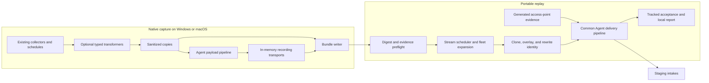

# EUDM simulator architecture

The [simulator overview](../reference/eudm-simulator/index.md) explains the evaluation workflow. This page describes why the command lives in the Agent repository and how capture, replay, and delivery fit together. The [runbook](../how-to/test/eudm-simulator.md) records actual verification and outstanding staging dependencies.

## Design decisions

The project began with an external `eudsim` prototype. Its useful scenario concepts were retained: cohorts, phase progression, metric patterns, process and software declarations, and access points. Native capture replaces invented endpoint baselines, and Agent delivery packages replace handcrafted HTTP payloads, approximate batching, and independent retry logic.

| Decision | Reason and consequence |
| --- | --- |
| Separate capture from replay | Live laptop activity would otherwise affect every evaluation. A saved baseline makes replay independent of the operator's current workload. |
| Capture on the represented OS; replay through portable types | Windows APIs and macOS collectors run only during capture. One replay process can schedule both bundle types with one phase clock and report. This supersedes the early research's same-OS replay proposal. |
| Transform typed samples before serialization | Identity and causal relationships span several payloads. Editing compressed wire bytes would be too late and would duplicate Agent encoding knowledge. |
| Require captured evidence and hardware capacity | Variation can change declared values; it cannot demonstrate behavior or capabilities absent from the reference device. Broader coverage requires another capture. |
| Use normal intake and enrichment | Direct resource registration would hide the backend relationship under evaluation. The former REDAPL bypass is intentionally absent. |
| Generate AP evidence using Agent NDM types | An endpoint capture cannot supply an AP's resource inventory or radio counters. The AP side is synthetic, with explicit identity correlation to captured client evidence. |
| Bind bundles to an exact commit | Typed structures and serializers may change as the feature branch moves. Reuse is safe only within the recorded revision and supported bundle/sanitizer versions. |

The target is repeatable evidence for unchanged products, not emulation of actual application installations, CPU load, network faults, or radio hardware. Production destinations, Linux endpoint simulation, notable events, and direct backend-store writes remain outside the project.

## Capture and replay boundaries

There is no single complete Agent capture hook. The command installs narrow, optional transformers at the required typed boundaries. Normal Agent construction leaves these transformers unset. Capture configures `infrastructure_mode: end_user_device`, disables output paths outside the capture contract, and installs recording transports before collection starts. Windows connections use `network_config.direct_send: false` and the common process submission path; replay never initializes the platform's live connection sender.

| Evidence | Capture boundary and representation | Replay delivery |
| --- | --- | --- |
| Host resource and WLAN metrics | Agent metric series at the demultiplexer/serializer boundary, including metric source and interval | `serializer.Serializer.SendIterableSeries` |
| Host/device metadata | Typed host metadata before serialization | `serializer.Serializer.SendHostMetadata` |
| Processes | `CollectorProc` at process submission | `CheckSubmitter.SubmitForHost` with Agent encoding, headers, weighted queues, and forwarders |
| Windows connections | `CollectorConnections` at process submission | The same portable tracked submitter |
| Software inventory | Complete per-host snapshot before event submission | Blocking event-platform delivery for software inventory |
| AP metrics and resource metadata | Generated by the scenario model; not captured from an endpoint | Metric serializer plus `EventTypeNetworkDevicesMetadata` event-platform delivery |

The implementation extends NDM with `WirelessInterfaceMetadata` and `BatchPayloadsWithWirelessInterfaces`. Existing callers retain the `BatchPayloads` entry point. Each client's emitted BSSID matches its AP wireless-interface resource, while each endpoint has a unique client MAC.

## Sanitization and artifacts

Sanitizers copy native samples and allow only known fields before persistence or serialization. Hostnames, UUIDs, usernames, paths, arguments, serials, addresses, MAC/BSSID values, SSIDs, network identifiers, and product identities become stable placeholders. Unknown sensitive fields and cloud/container identities are discarded. Authorization headers are excluded from wire references. Recording transports do not contact staging, and native diagnostic logging is disabled because OS errors can contain raw device paths.

A complete bundle directory contains:

| File | Purpose |
| --- | --- |
| `manifest.json` | Bundle/sanitizer versions; Agent version and commit; OS, architecture, and device profile; duration; stream inventory; sample offsets and cadences; file digests |
| `sample-000000.json`, … | Sanitized typed samples; process chunks from one collection share a relative offset |
| `sample-000000-wire-000.json`, … | Sanitized Agent-serialized request references, with allowlisted headers and encoded body bytes |
| `COMPLETE` | Digest of the completed manifest; written only after capture coverage is assembled |

The loader verifies the completion marker, all declared file digests, typed samples, profile inventories, supported versions, and exact Agent commit. It rejects invalid or incomplete bundles and unsafe file layouts. Scenario preflight then checks every captured cycle against the requested overlays and resource bounds. A union of names in the profile is insufficient if a required process or connection is absent from a later cycle.

Wire references are evidence of the capture serializer output; replay decodes typed samples, rewrites them, and serializes again. Do not edit bundle files, checksums, or the commit to make them pass validation. Copy complete directories without changing their bytes. Real captures remain operator-managed artifacts; only small synthetic fixtures belong in the repository.

Three additional artifacts have distinct roles: scenario YAML declares behavior and local expectations; a JSON run plan fixes the scenario digest, bundle assignments, seed, run ID, and start; a local JSON report records what delivery actually completed. API keys belong only in the replay environment. Bundle hashes detect corruption and compatibility mismatches; they are not a signature or a source-authentication mechanism.

## Determinism and scheduling

Cohorts expand in declaration order into stable device ordinals. Each device receives one identity map for host metadata, metrics, processes, software, connections, and WLAN tags. Run-scoped identities include the opaque run ID; AP resources use the same run namespace. Scenario and cohort labels used to describe the expected incident are not emitted as telemetry.

Variation is keyed by `(seed, cohort, device ordinal, phase, stream, sample ordinal, field)`. It does not consume a shared random generator, so map iteration, worker order, and another stream's activity do not shift values. Repeated evaluations compare assignments, relative timing, and values after normalizing absolute start and generated identities. Network arrival time and backend processing are not deterministic guarantees.

Each stream repeats its captured collection offsets. Its repeat period is the span between its first and last captured cycles plus its recorded cadence. Multiple chunks at one offset remain one cycle. Singleton streams repeat at their recorded cadence. All cohorts share the plan's phase clock, and only cycles before scenario end are scheduled. Phase transitions do not force extra host-metadata or software snapshots; choose phase lengths that allow the required evidence to arrive at native cadence.

Endpoint overlays start from a fresh baseline copy for every cycle. Process CPU and RSS changes are reconciled into host CPU and memory metrics using captured CPU topology and capacity; software overlays update existing entries. Connection overlays select captured TCP records and convert RTT milliseconds to the Agent's microsecond fields. AP metrics have their own 15-second schedule and NDM metadata a 5-minute schedule. Their omitted metric declarations carry forward, as described in the [scenario reference](../reference/eudm-simulator/scenarios.md#access-points-and-wi-fi).

## Delivery and failure accounting

Workers limit concurrency, not fleet size. Full queues apply backpressure. Process submissions use the supplied device hostname for payload headers and request IDs, retaining the production submitter interface for other callers. Optional forwarder trackers observe terminal acceptance after normal Agent retries, including event-platform delivery.

A scheduled cycle is delivered only after all its chunks or batches are accepted. Encoding failures, impossible queue payloads, permanent HTTP rejection, or failure to finish before the deadline fail the run. The deadline is planned start plus total scenario duration plus delivery grace. Under load, backpressure can delay actual submission; timestamps remain tied to scheduled time, and the run cannot claim success with a truncated fleet.

The report path is reserved before forwarders start. Reports contain every declared device and its expected cycle counts, delivered/failed counts, separate network-device accounting, input digests, phase offsets, selectors, and the local expectation. Unsent cycles after cancellation remain in `expected`; `failed` need not count every missing cycle. Reports are written at startup and termination, not continuously as a live progress feed. A hard process kill can leave a report marked `running`.

`status: succeeded` establishes delivery completion. It does not establish EUDM enrichment, monitor evaluation, or the Bits conclusion. Those require the [two staging proofs and scenario acceptance record](../how-to/test/eudm-simulator.md#required-proof-1-normal-eudm-host-enrichment).

## Code map and extension points

| Area | Entry point |
| --- | --- |
| Command lifecycle and build task | <<<repo("cmd/eudm-simulator/command")>>>; <<<repo("tasks/eudm_simulator.py")>>> |
| Contracts, endpoint safety, and bundle loading | <<<repo("cmd/eudm-simulator/internal/schema")>>>; <<<repo("cmd/eudm-simulator/internal/safety")>>>; <<<repo("cmd/eudm-simulator/internal/bundle")>>> |
| Native collection and per-stream sanitizers | <<<repo("cmd/eudm-simulator/internal/capture")>>> |
| Typed samples, timing, overlays, and identity | <<<repo("cmd/eudm-simulator/internal/telemetry")>>>; <<<repo("cmd/eudm-simulator/internal/engine")>>>; <<<repo("cmd/eudm-simulator/internal/overlay")>>>; <<<repo("cmd/eudm-simulator/internal/identity")>>> |
| Delivery adapters and local accounting | <<<repo("cmd/eudm-simulator/internal/output")>>>; <<<repo("cmd/eudm-simulator/internal/report")>>> |
| AP resources and batching | <<<repo("cmd/eudm-simulator/internal/accesspoint")>>>; <<<repo("pkg/networkdevice/metadata")>>> |
| Shared Agent changes | <<<repo("pkg/serializer/capture.go")>>>; <<<repo("pkg/process/runner/submitter_tracked.go")>>>; <<<repo("comp/forwarder/defaultforwarder/transaction/delivery_tracker.go")>>>; <<<repo("comp/forwarder/eventplatform/impl/isolated.go")>>>; <<<repo("comp/softwareinventory/impl/capture.go")>>> |
| Integration fixtures and acceptance probes | <<<repo("cmd/eudm-simulator/integration")>>>; <<<repo("cmd/eudm-simulator/testdata")>>> |

Adding an evidence stream requires native collection where supported, a sanitization allowlist, typed persistence and validation, identity rewriting, a common delivery adapter, and complete ledger accounting. Extend privacy tests with unique secrets in all new identity locations and decode actual Agent payloads in integration tests. Adding a scenario requires captured evidence, a healthy comparison, phase/capacity validation, and a complete-fleet test; larger fleets must repeat the constrained-queue load checks. A recording test cannot substitute for a missing staging relationship.
