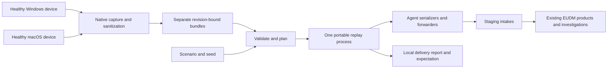

# EUDM scenario simulator

`eudm-simulator` creates repeatable endpoint incidents for evaluating End User Device Monitoring (EUDM) in Datadog staging. It captures a healthy Windows or macOS device once, sanitizes its telemetry into a reusable bundle, and replays copies as distinct devices with scenario-controlled behavior. The intended consumers are the existing device explorers, monitors, Command Center, and Bits investigations.

This is an evaluation project on `focus/create-eudm-simulator`. [PR #57126](https://github.com/DataDog/datadog-agent/pull/57126) must remain a draft and must never be merged. The command is built separately and is absent from production packages and installers.

## Start here

| Goal | Read |
| --- | --- |
| Build, capture, validate, plan, and run | [Operator runbook](../../how-to/test/eudm-simulator.md#build-and-capture-separately) |
| Try it on a Windows laptop | [PowerShell walkthrough](../../how-to/test/eudm-simulator.md#windows-walkthrough) |
| Understand the approach and the Agent changes | [Architecture and design decisions](../../architecture/eudm-simulator.md) |
| Adapt a scenario or combine Windows and macOS cohorts | [Scenario reference](scenarios.md) |
| Diagnose a rejected bundle or unsuccessful run | [Troubleshooting](../../how-to/test/eudm-simulator.md#troubleshooting) |
| Assess what has actually been verified | [Local verification](../../how-to/test/eudm-simulator.md#recorded-local-verification) and [staging proof record](../../how-to/test/eudm-simulator.md#proof-record-and-later-acceptance) |

## Why it exists

Real endpoint incidents are hard to reproduce on demand. Evaluations need a known affected cohort, healthy comparisons, sustained evidence for monitor windows, and a known expected conclusion. They also need identities, software versions, process resource usage, connection health, and wireless evidence to agree across products.

The simulator controls the emitted telemetry rather than reproducing the workload that caused it. Healthy background evidence comes from an actual device. Overlays change captured evidence, while generated access-point evidence supplies the network side of a Wi-Fi investigation. Every delivery uses Agent payload code, so normal intake and enrichment behavior remain part of the evaluation.

## The workflow

1. Build with `dda inv eudm-simulator.build` at the same Agent commit on each capture device and the replay host. Use the repository's [development setup](../../setup/required.md) and [platform build guidance](../../setup/manual.md).
1. Run `capture` separately on a healthy device. Allow the default 35-minute deadline; it stops earlier once required stream coverage is complete. Capture uses recording transports and needs no staging key.
1. Copy the entire completed bundle directory to the replay host. A Windows cohort needs a Windows bundle, and a macOS cohort needs a macOS bundle. A single replay process can use both.
1. Run `validate`, then `plan`, with a scenario, explicit staging configuration, and an explicit bundle assignment for every cohort. Plans record the exact inputs, seed, opaque run ID, and absolute start time.
1. Supply the staging organization's `DD_API_KEY` and run the saved plan before its start expires. Inspect the local report, then use its selectors to perform the product acceptance checks.

Capture runs on the OS represented by its bundle. Replay does not start native collectors. Linux is not a simulated device or capture platform; replay there requires a successful common build and remains unverified. WSL or a Linux container cannot capture the surrounding Windows laptop.

## Scenario library

Definitions live in <<<repo("cmd/eudm-simulator/scenarios")>>>. The [reference](scenarios.md#shipped-scenarios) explains their cohorts and evidence prerequisites.

| Scenario | Declared fleet | Expected investigation |
| --- | --- | --- |
| Healthy macOS | 3 endpoints | Healthy evidence, no scenario incident |
| Healthy Windows | 3 endpoints | Healthy evidence, no scenario incident |
| Chrome update regression | 7 macOS endpoints | High process CPU associated with the rollout version |
| SentinelOne regression | 8 Windows endpoints | High security-agent CPU associated with the rollout version |
| VPN degradation | 6 Windows endpoints | Degraded captured VPN connections with healthy host and physical Wi-Fi evidence |
| Wi-Fi degradation | 60 macOS endpoints and 3 APs | Clients and unhealthy AP radios correlate; a comparison AP stays healthy |

The healthy scenarios last 20 minutes; the Chrome, SentinelOne, and VPN incidents last 60 minutes, and Wi-Fi lasts 50 minutes. Delivery retries may use an additional grace period. The two-device host-enrichment probes last 35 minutes. These are wall-clock runs, not accelerated demos.

## What is ready, and what is still unproven

Local implementation includes all four commands, sanitization, exact-revision bundles, portable mixed-platform replay, deterministic overlays, Agent delivery tracking, and the six scenario definitions. Automated tests exercised all declared scenario counts and durations with a fake clock. Recording tests exercised 60 mixed-platform devices with constrained queues and NDM batching across 125 resources. A real macOS capture also completed. See the [dated verification record](../../how-to/test/eudm-simulator.md#recorded-local-verification) for commands, counts, and limits.

Native Windows capture, replay on another host OS, and staging product acceptance are still unverified. Two relationships require explicit staging proof: cloned host metadata must produce complete EUDM devices through normal enrichment, and Windows connection evidence must trigger the existing VPN monitor and Command Center path. Wi-Fi acceptance additionally needs Bits permission to read NDM evidence. A successful delivery report does not establish these results.

## Boundaries to keep in mind

- Only explicit `site: datad0g.com` destinations are accepted. Scenario files, bundles, and plans do not hold credentials.
- Bundles require the binary's exact Agent commit. Any new commit, including a documentation-only commit, changes that requirement when you rebuild. Rebuild and recapture together; do not edit manifests to relabel old captures.
- A bundle represents its real device profile. Overlays cannot add an uncaptured process, application, connection, metric, or hardware profile. The checked-in synthetic bundles are test fixtures and deliberately cannot be used by a normal staging build.
- Expected conclusions and affected cohorts stay in local validation and reports. Telemetry contains an opaque run selector rather than the answer to the investigation.
- There is no implicit capture during replay, direct backend registration, S3 archival, notable-event simulation, interactive scenario mutation, or automatic staging cleanup.
