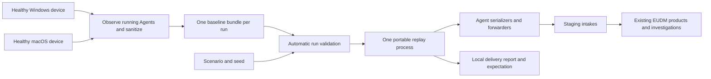

# EUDM scenario simulator

`eudm-simulator` creates repeatable endpoint incidents for evaluating End User Device Monitoring (EUDM) in Datadog staging. It captures a healthy Windows or macOS device once, sanitizes its telemetry into a reusable bundle, and replays copies as distinct devices with scenario-controlled behavior. The intended consumers are the existing device explorers, monitors, Command Center, and Bits investigations.

This is an evaluation project on `focus/create-eudm-simulator`. [PR #57126](https://github.com/DataDog/datadog-agent/pull/57126) must remain a draft and must never be merged. The command is built separately and is absent from production packages and installers.

Live capture also requires custom installed Agent builds containing this branch's
capture hooks. On macOS, `dda inv eudm-simulator.install` builds the simulator and
installs compatible producers into an existing Agent installation, preserving its
configuration. See the [setup prerequisites](../../how-to/test/eudm-simulator.md#build-and-capture-separately).

## Start here

| Goal | Read |
| --- | --- |
| Build, capture, and run | [Operator runbook](../../how-to/test/eudm-simulator.md#build-and-capture-separately) |
| Try it on a Windows laptop | [PowerShell walkthrough](../../how-to/test/eudm-simulator.md#windows-walkthrough) |
| Understand the approach and the Agent changes | [Architecture and design decisions](../../architecture/eudm-simulator.md) |
| Compare with the existing external simulator | [Benefits, tradeoffs, and migration from eudsim](../../architecture/eudm-simulator.md#comparison-with-existing-eudsim) |
| Adapt a scenario or define multiple cohorts | [Scenario reference](scenarios.md) |
| Diagnose a rejected bundle or unsuccessful run | [Troubleshooting](../../how-to/test/eudm-simulator.md#troubleshooting) |
| Assess what has actually been verified | [Local verification](../../how-to/test/eudm-simulator.md#recorded-local-verification) and [staging proof record](../../how-to/test/eudm-simulator.md#proof-record-and-later-acceptance) |

## Why it exists

Real endpoint incidents are hard to reproduce on demand. Evaluations need a known affected cohort, healthy comparisons, sustained evidence for monitor windows, and a known expected conclusion. They also need identities, software versions, process resource usage, connection health, and wireless evidence to agree across products.

The simulator controls the emitted telemetry rather than reproducing the workload that caused it. Healthy background evidence comes from an actual device. Overlays change captured evidence, while generated access-point evidence supplies the network side of a Wi-Fi investigation. Every delivery uses Agent payload code, so normal intake and enrichment behavior remain part of the evaluation.

## The workflow

1. On a macOS capture device with a standard installed Agent, run `dda inv eudm-simulator.install` from this feature branch. It builds the simulator and producers, requests administrator access to install them, restarts the Agent, and checks capture readiness. On a replay-only host, build with `dda inv eudm-simulator.build` at the same Agent commit. Use the repository's [development setup](../../setup/required.md) and [platform build guidance](../../setup/manual.md). Windows installation and verification remain deferred.
1. Prepare compatible running core Agent and Process Agent services; Windows direct connection capture also requires compatible system-probe. Installed producers must support capture protocol 1 and advertise enabled streams, Agent/host inventories, and supported metric-family schedules. Run `capture --cfgpath /path/to/datadog.yaml --output /new/bundle` with access to existing local IPC authentication artifacts. Normal backend delivery continues. The default timeout is 35 minutes; use `capture --timeout 70m` for an advertised hourly host-system-info provider. The command neither forces collection nor changes configuration and needs no staging key.
1. Copy the entire completed bundle directory to the replay host. That single capture supplies the baseline for every cohort, so all cohorts must match its OS. Use separate runs for Windows and macOS baselines.
1. Set `DD_SITE=datad0g.com` and the staging organization's `DD_API_KEY`, then invoke `run --scenario /path/to/scenario.yaml --bundle /path/to/capture`. Run validates automatically; missing evidence required by any cohort rejects the scenario. Optional `validate` checks the same inputs without sending telemetry and needs no API key.
1. Follow terminal progress and report updates every 30 seconds, then use the final report's selectors to perform the product acceptance checks. The default is `eudm-run-<run_id>.json` in the current directory; `--report` selects another path. Progress shows elapsed/planned time, phase, confirmed deliveries, failures, and any final delivery wait. The report records exact input digests, seed (`--seed`, default `1`), a fresh opaque run ID, and the actual start after validation and setup.

Capture runs on the OS represented by its bundle. Replay does not start native collectors. Linux is not a simulated device or capture platform; replay there requires a successful common build and remains unverified. WSL or a Linux container cannot capture the surrounding Windows laptop.

Capture waits for two observed cycles of every scheduled supported metric family,
including slower battery checks when enabled, as well as the required process,
metadata, inventory, and software evidence. Replay keeps each family's observed
cadence: a five-minute battery check is not replayed every 15 seconds alongside
CPU metrics. Windows requires connection evidence. macOS includes connections
when its running Process Agent advertises that capability; it does not enable a
collector or invent connections when the capability is absent.

Host system information is also optional when unavailable. If its running
provider advertises readiness, capture waits for one normal submission of
manufacturer, model, chassis, and serial evidence. It uses the native
`host_system_info_metadata` envelope and hourly cadence; replay scopes serials to
each simulated device while preserving shared hardware-model identities.

## Scenario library

Definitions live in <<<repo("cmd/eudm-simulator/scenarios")>>>. The [reference](scenarios.md#shipped-scenarios) explains their cohorts and evidence prerequisites.

| Scenario | Declared fleet | Expected investigation |
| --- | --- | --- |
| Healthy macOS | 3 endpoints | Healthy evidence, no scenario incident |
| Healthy Windows | 3 endpoints | Healthy evidence, no scenario incident |
| Chrome update regression | 7 macOS endpoints | High process CPU associated with the rollout version |
| SentinelOne regression | 8 Windows endpoints | High security-agent CPU associated with the rollout version |
| VPN degradation | 6 Windows endpoints | Degraded captured VPN connections with healthy host and physical Wi-Fi evidence |
| Wi-Fi degradation | 60 macOS endpoints and 3 APs | Clients and unhealthy AP radios correlate; a comparison AP stays healthy |

The healthy scenarios last 20 minutes; the Chrome, SentinelOne, and VPN incidents last 60 minutes, and Wi-Fi lasts 50 minutes. Delivery retries may use up to five additional minutes. The two-device host-enrichment probes last 35 minutes. These are wall-clock runs, not accelerated demos.

## What is ready, and what is still unproven

Local implementation includes command-armed `capture`, `validate`, and `run`, one cross-stream sanitizer, schema-4 producer/cycle evidence, mandatory Agent/host inventories, optional host system information, metric-family schedules, exact capture-tool/replay revision checks, portable replay, deterministic overlays, Agent delivery tracking, and six scenarios. The earlier schema-2 macOS race suites and two live captures passed their then-required streams, privacy and decoded wire comparisons, unchanged services/configuration, normal backend forwarding, and recovery from capture-command loss. A subsequent staging probe delivered its cycles but produced no Fleet or EUDM devices because it omitted Agent inventory. Schema 3 added both inventories. Schema 4 additionally requires observed coverage and timing for every scheduled metric family and permits advertised macOS connections. These changes require fresh capture and product checks; implementation alone is not product acceptance. The [dated verification record](../../how-to/test/eudm-simulator.md#recorded-local-verification) includes commands and evidence. Its historical mixed-platform runs and saved plans predate the current interface and do not describe currently supported modes.

Windows build and live capture are deferred by operator request. Replay on another host OS and staging product acceptance remain unverified. Two relationships require explicit staging proof: cloned host metadata and Agent/host inventories must produce complete EUDM devices through normal enrichment, and Windows connection evidence must trigger the existing VPN monitor and Command Center path. Wi-Fi acceptance additionally needs Bits permission to read NDM evidence. A successful delivery report does not establish these results.

## Boundaries to keep in mind

- Replay accepts only `DD_SITE=datad0g.com`, with credentials from `DD_API_KEY`. Capture preserves the installed Agents’ existing delivery destinations. Scenario files, bundles, and reports do not hold credentials.
- Replay requires the exact `capture_tool.commit`. Producing Agent commits are independently recorded and may differ with protocol 1 support and the required capability schedules. Schema-1, schema-2, and schema-3 bundles require recapture to obtain the current inventory and metric-family evidence; never edit manifests to invent provenance or relabel captures.
- A bundle represents its real device profile. Overlays cannot add an uncaptured process, application, connection, metric, or hardware profile. The checked-in synthetic bundles are test fixtures and deliberately cannot be used by a normal staging build.
- Captured DNS associations use stable `.invalid` pseudonyms, with lookup addresses rewritten alongside connection endpoints. Recognized software source/status values and safe versions are preserved; other nonempty versions become stable opaque pseudonyms, while originally empty versions stay empty. Product visibility still depends on normal backend ingestion and enrichment.
- Expected conclusions and affected cohorts stay in local validation and reports. Telemetry contains an opaque run selector rather than the answer to the investigation.
- There is no implicit capture during replay, direct backend registration, S3 archival, notable-event simulation, interactive scenario mutation, or automatic staging cleanup.
