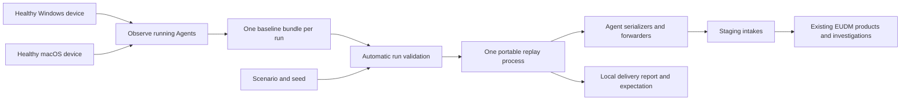

# EUDM scenario simulator

`eudm-simulator` creates repeatable endpoint incidents for evaluating End User Device Monitoring (EUDM) in Datadog staging. It captures a healthy Windows or macOS device once, preserves its emitted telemetry in a reusable bundle, and replays copies as distinct devices with scenario-controlled behavior. The intended consumers are the existing device explorers, monitors, Command Center, and Bits investigations.

This is an evaluation project on `focus/create-eudm-simulator`. [PR #57126](https://github.com/DataDog/datadog-agent/pull/57126) must remain a draft and must never be merged. The command is built separately and is absent from production packages and installers.

Live capture also requires custom installed Agent builds containing this branch's
capture hooks. On macOS, `dda inv eudm-simulator.install` builds the simulator and
installs compatible producers into an existing Agent installation, preserving its
configuration. See the [setup prerequisites](../../how-to/test/eudm-simulator.md#build-and-capture-separately).

## Start here

| Goal | Read |
| --- | --- |
| Build, capture, and run | [Operator runbook](../../how-to/test/eudm-simulator.md#build-and-capture-separately) |
| Try it on a Windows laptop | [PowerShell walkthrough](../../how-to/test/eudm-simulator.md#windows-walkthrough) |
| Understand the approach and the Agent changes | [Architecture and design decisions](../../architecture/eudm-simulator.md) |
| Compare with the existing external simulator | [Benefits, tradeoffs, and migration from eudsim](../../architecture/eudm-simulator.md#comparison-with-existing-eudsim) |
| Adapt a scenario or define multiple cohorts | [Scenario reference](scenarios.md) |
| Diagnose a rejected bundle or unsuccessful run | [Troubleshooting](../../how-to/test/eudm-simulator.md#troubleshooting) |
| Assess what has actually been verified | [Local verification](../../how-to/test/eudm-simulator.md#recorded-local-verification) and [staging proof record](../../how-to/test/eudm-simulator.md#proof-record-and-later-acceptance) |

## Why it exists

Real endpoint incidents are hard to reproduce on demand. Evaluations need a known affected cohort, healthy comparisons, sustained evidence for monitor windows, and a known expected conclusion. They also need identities, software versions, process resource usage, connection health, and wireless evidence to agree across products.

The simulator controls the emitted telemetry rather than reproducing the workload that caused it. Healthy background evidence comes from an actual device. Overlays change captured evidence, while generated access-point evidence supplies the network side of a Wi-Fi investigation. Every delivery uses Agent payload code, so normal intake and enrichment behavior remain part of the evaluation.

## The workflow

1. On a macOS capture device with a standard installed Agent, run `dda inv eudm-simulator.install` from this feature branch. It builds the simulator and producers, requests administrator access to install them, restarts the Agent, and checks capture readiness. On a replay-only host, build with `dda inv eudm-simulator.build`; compatible schema-7 bundles can be reused across simulator commits. Use the repository's [development setup](../../setup/required.md) and [platform build guidance](../../setup/manual.md). Windows installation and verification remain deferred.
1. Prepare compatible running core Agent and Process Agent services; Windows direct connection capture also requires compatible system-probe. Installed producers must support capture protocol 4 and advertise enabled streams, Agent/host inventories, and supported metric-family schedules. Run `capture --duration 35m --cfgpath /path/to/datadog.yaml --output /new/bundle` with access to existing local IPC authentication artifacts. Normal backend delivery continues. Capture requests one fresh host-system-info submission through the running Agent; other collections use their normal schedules. It changes no configuration and needs no staging key.
1. Copy the entire completed bundle directory to the replay host. That single capture supplies the baseline for every cohort, so all cohorts must match its OS. Use separate runs for Windows and macOS baselines.
1. Set `DD_SITE=datad0g.com` and the staging organization's `DD_API_KEY`, then invoke `run --scenario /path/to/scenario.yaml --bundle /path/to/capture`. Run validates automatically; missing evidence required by any cohort or a scenario longer than the recording rejects the run before delivery. Optional `validate` checks the same inputs without sending telemetry and needs no API key.
1. Follow timestamped terminal delivery events, then use the final report's exact ledger hostnames to perform the product acceptance checks. Events identify the component, metric families or item counts, simulated device, phase, and cycle, with lifecycle and failure messages. The JSON report still updates every 30 seconds; terminal output has no periodic summaries. The default report is `eudm-run-<run_id>.json` in the current directory; `--report` selects another path. It records exact input digests, seed (`--seed`, default `1`), a fresh local run ID, and the actual start after validation and setup.

Capture runs on the OS represented by its bundle. Replay does not start native collectors. Linux is not a simulated device or capture platform; replay there requires a successful common build and remains unverified. WSL or a Linux container cannot capture the surrounding Windows laptop.

Capture records every complete observation for the explicit duration, greater than zero and at most two hours. The window begins when all selected producers are active. `--timeout` bounds setup, recording, and completion; it defaults to duration plus five minutes, must exceed the duration, and is limited to two hours five minutes. Required coverage includes two observed cycles of every advertised supported metric family and the selected process/connection streams, plus metadata, inventories, and software. Missing coverage fails capture when the window ends.

Replay sends recorded samples once at their captured offsets, without looping or filling gaps. A five-minute battery check does not acquire extra samples beside CPU metrics. A shorter scenario must still reach the first sample of every selected stream and metric family. Windows requires connection evidence; macOS includes connections when its running Process Agent advertises them.

Host system information is optional when unavailable. An advertised provider submits fresh manufacturer, model, chassis, and serial evidence once after capture activation through normal Agent delivery, avoiding an hourly wait. The ordinary hourly schedule remains unchanged. Replay scopes serials to each simulated device while preserving shared hardware-model identities.

## Checked-in scenario

The definition lives in <<<repo("cmd/eudm-simulator/scenarios")>>>. The [reference](scenarios.md#checked-in-scenario) explains its cohort and evidence prerequisites.

| Scenario | Declared fleet | Expected investigation |
| --- | --- | --- |
| Healthy macOS | 3 endpoints | Healthy evidence, no scenario incident |

The healthy scenario lasts 20 minutes. Delivery retries may use up to five additional minutes. Capture for at least the scenario duration. This is a wall-clock run, not an accelerated demo.

## What is ready, and what is still unproven

Local implementation includes command-armed `capture`, `validate`, and `run`, minimal time/identity normalization, schema-7 typed samples with producer/cycle identities, mandatory Agent/host inventories, optional host system information, metric-family schedules, schema/protocol compatibility checks across simulator revisions, portable replay, deterministic overlays, Agent delivery tracking, and one checked-in healthy macOS scenario. The earlier schema-2 macOS race suites and two live captures passed their then-required streams, privacy and decoded wire comparisons, unchanged services/configuration, normal backend forwarding, and recovery from capture-command loss. A subsequent staging probe delivered its cycles but produced no Fleet or EUDM devices because it omitted Agent inventory. Schema 3 added both inventories. Schema 4 added observed coverage and timing for every scheduled metric family and advertised macOS connections. Schema 5 retains those fields but removes regenerated wire files and per-payload routing proofs; replay tests inspect serialization in memory. Schema 6 removed blanket anonymization and required protocol-3 producers. Schema 7 records an explicit continuous window with no replay looping; protocol 4 adds the fresh hardware submission. Prior live results describe older versions. These changes require fresh capture and product checks; implementation alone is not product acceptance. The [dated verification record](../../how-to/test/eudm-simulator.md#recorded-local-verification) includes commands and evidence. Its historical mixed-platform runs and saved plans predate the current interface and do not describe currently supported modes.

Replay on another host OS and staging product acceptance remain unverified. Cloned host metadata and Agent/host inventories must produce complete EUDM devices through normal enrichment. A successful delivery report does not establish that result.

## Boundaries to keep in mind

- Replay accepts only `DD_SITE=datad0g.com`, with credentials from `DD_API_KEY`. Capture preserves the installed Agents’ existing delivery destinations. Scenario files, bundles, and reports do not hold credentials.
- Replay accepts the current bundle schema and producer protocol across simulator commits. Capture-tool and producer commits remain independently recorded provenance. Earlier bundle schemas require recapture with compatible producers; never edit manifests to invent provenance or relabel captures.
- Capture stores up to 1 GiB of sample files, with 64 MiB per file and a 4 MiB manifest limit. Native payload sizes and chunk counts determine how much recording fits; reaching a limit fails capture. Files are uncompressed.
- A bundle represents its real device profile. Overlays cannot add an uncaptured process, application, connection, metric, or hardware profile. The checked-in synthetic bundles are test fixtures, not staging acceptance evidence, and must not be used as real captures.
- Capture preserves native process/application names, publishers, versions, product codes, paths, installation dates, domains, metric dimensions, and hardware labels. Replay changes device identities and observation times; remote destinations and product identities remain unchanged unless a scenario overrides them. Credentials and Agent configuration blobs are excluded. Real bundles are native telemetry exports and remain outside the repository.
- Expected conclusions, affected cohorts, and run identifiers stay in local validation and reports. Telemetry contains no simulator marker or expected answer.
- There is no implicit capture during replay, direct backend registration, S3 archival, notable-event simulation, interactive scenario mutation, or automatic staging cleanup.
