# 1Hz Lookback V1 Sender And Scheduler Plan

Status: draft

Scope owner: sender and scheduler only.

This plan captures the V1 decisions from the Confluence implementation plan and
the follow-up session notes. It intentionally excludes storage/query/consumer
work except for the writer interface needed by the sender.

## Status Tracker

As of 2026-06-08:

| Slice | PR | Status | Notes |
| --- | --- | --- | --- |
| Sender skeleton and shared scalar sample formatting | [#51958](https://github.com/DataDog/datadog-agent/pull/51958) | Open; ready for re-review | Replacement for the accidentally merged sender PR after reverting on `qbranch-1hz`. Covers embeddable base sender reuse, lookback sender skeleton, scalar buffering hardening, no-op default sender, and explicit telemetry deferral. |
| Shadow config derivation | [#51828](https://github.com/DataDog/datadog-agent/pull/51828) | Open | Stacked after the sender PR. Covers system-wide and per-instance enablement derivation, including global enablement without per-instance override. |
| Shadow scheduler/coordinator | [#51884](https://github.com/DataDog/datadog-agent/pull/51884) | Open; ready for re-review | Stacked after the config PR. Shares normal check-loading/config parsing through `pkg/collector/checkloader`, reuses runner/worker execution through one shared dedicated shadow runner, keeps one lookback sender manager per shadow check, records shadow runs in existing runner expvars under `:shadow` IDs, and does not wire AutoConfig or Agent status yet. |
| AutoConfig shadow adapter | [#51892](https://github.com/DataDog/datadog-agent/pull/51892) | Open; may need restack after scheduler changes | Stacked after the shadow scheduler PR. Adds the AutoConfig-facing adapter/worker boundary so callbacks return quickly and synchronous shadow loading happens outside the AutoConfig scheduler controller lock. Agent startup registration is deferred until the real lookback writer/storage dependency is available. |
| Agent status and telemetry | Not opened | Planned | Add a distinct shadow checks subsection in `agent status` by splitting `:shadow` IDs out of existing runner check stats, plus telemetry for delayed ticks, append failures, and unsupported method drops. |

## Decisions

- V1 only.
- Implement an additive shadow path; do not modify the normal backend-emitting
  check path.
- Support Go/core checks first.
- Python checks are out of this first implementation slice.
- Create a separate shadow check instance from the same logical check
  configuration.
- Give each shadow check a distinct ID using the suffix
  `<normal-check-id>:shadow`.
- Run shadow checks at `metric_lookback.interval`, defaulting to 1s.
- Enable shadow checks from both system-wide config and per-instance config.
- Per-instance shadow enablement should be available through normal check
  config sources, including files and Autodiscovery-provided configs.
- Do not run overlapping shadow executions. Shadow scheduling may block or
  delay inside the isolated shadow path, matching normal runner backpressure;
  normal checks are unaffected.
- The lookback sender may block while appending to the lookback writer, but only
  inside the isolated shadow path.
- Blocking must never involve the normal check instance, normal sender, normal
  scheduler, aggregator, default sender, or backend stream.
- Shadow blocking must be cancellable or otherwise bounded during unschedule and
  shutdown. A stuck lookback writer append must not block AutoConfig scheduler
  changes or Agent shutdown indefinitely.
- Register lookback scheduling as a separate AutoConfig scheduler, replaying the
  same scheduled configs under a dedicated scheduler name. Do not wrap or fork
  the normal check scheduler for V1.
- V1 stores scalar metric submissions as submitted.
- V1 drops `Distribution`, `HistogramBucket`, and `OpenmetricsBucket`.
  Drop telemetry is deferred to the observability/status PR.
- V1 buffers all scalar metrics emitted by enabled shadow check instances.
- Shadow checks appear in `agent status` under the `:shadow` identity.
- Reuse existing check loading and check implementations.
- Reuse the existing `sender.Sender` and `sender.SenderManager` contracts.
- Extract or share narrow sender identity/scalar sample-building logic so the
  lookback sender does not duplicate normal sender host, tag, and sample-field
  behavior.
- Do not change normal collector behavior for this V1 slice. Narrow reusable
  seams are allowed when default normal behavior is preserved: shared
  check-loading in `pkg/collector/checkloader`, and an injectable worker status
  emitter so shadow execution can reuse the normal worker path without emitting
  normal integration status service checks.
- Use one shared dedicated shadow runner for all shadow checks. Do not create a
  runner per shadow check. Per-check isolation is provided by the `:shadow` ID,
  the worker running-check tracker, and one lookback sender manager per shadow
  check.

## Evidence

- The Confluence V1 plan defines a separate shadow check and gives
  `<normal-check-id>:shadow` as the example identity.
- The Confluence V1 plan says shadow runs must not overlap. Based on the
  session decision, V1 may handle shadow backpressure by delaying/blocking
  inside the isolated shadow runner path, mirroring normal check scheduling.
- The Confluence V1 plan says shadow runs appear in `agent status`, tracked under
  the shadow identity.
- Checks are configured against `sender.SenderManager`, so a lookback sender
  manager can be injected without changing check implementations:
  `pkg/collector/check/check.go`.
- Go checks are loaded through `GoCheckLoader.Load`, which accepts a
  `sender.SenderManager` and calls `Configure` with it:
  `pkg/collector/corechecks/loader.go`.
- Shared loader-selection behavior now lives in
  `pkg/collector/checkloader/loader.go`; the normal
  `pkg/collector/scheduler.go` path delegates check loading to it, and
  `pkg/collector/metriclookback` uses its instance-loader and loader parsing
  helpers.
- The concrete normal `checkSender` is coupled to `BufferedAggregator` channels
  and should not be reused directly for lookback:
  `pkg/aggregator/sender.go`, `pkg/aggregator/demultiplexer_senders.go`.
- The reusable part of the normal sender is the identity/sample construction
  behavior: default host, disabled default host, check tags, service tag,
  `NoIndex`, metric type, timestamp, and source.
- The existing scheduler can block while enqueueing checks into the runner:
  `pkg/collector/scheduler/job.go`.
- The runner channel is unbuffered:
  `pkg/collector/runner/runner.go`.
- The normal worker already skips overlapping executions by check ID via
  `RunningChecksTracker.AddCheck`, so V1 shadow checks can reuse the worker
  overlap guard when each shadow check has a distinct `:shadow` ID:
  `pkg/collector/worker/worker.go`,
  `pkg/collector/runner/tracker/tracker.go`.
- The normal worker writes process-global runner expvars and default sender
  service-check status directly. Based on the session decision, V1 shadow runs
  may use existing runner expvars under `:shadow` check IDs, but must not emit
  normal integration status service checks:
  `pkg/collector/worker/worker.go`.
- The runner and collector already use bounded stop/cancel waits, which is the
  closest local lifecycle pattern for active checks:
  `pkg/collector/runner/runner.go`, `comp/collector/collector/impl/collector.go`.
- `agent status` renders normal check run stats from the existing runner
  expvars, and normal workers publish those stats with `expvars.AddCheckStats`:
  `pkg/status/collector/status.go`,
  `pkg/status/collector/status_templates/collector.tmpl`,
  `pkg/collector/worker/worker.go`,
  `pkg/collector/runner/expvars/expvars.go`.
- Shadow checks do not go through the normal collector map or normal runner
  instance, but they do use one shared dedicated runner/worker path. Completed
  shadow run stats are acceptable in the existing runner expvars under full
  `:shadow` check IDs for V1.
- The Confluence status requirement should be implemented as a distinct shadow
  checks subsection in `agent status` by splitting `:shadow` IDs out of the
  normal Running Checks rendering.
- AutoConfig already supports multiple named schedulers and replays current
  configs on registration:
  `comp/core/autodiscovery/impl/autoconfig.go`,
  `comp/core/autodiscovery/scheduler/controller.go`.
- AutoConfig dispatches schedule/unschedule events to active schedulers while
  holding the scheduler controller lock, so lookback `Schedule` and `Unschedule`
  must not perform unbounded waits:
  `comp/core/autodiscovery/scheduler/controller.go`.
- The current shadow scheduler component loads shadow checks synchronously.
  AutoConfig integration must add an adapter/worker boundary so AutoConfig
  callbacks enqueue lookback lifecycle work and return quickly, while
  `ShadowScheduler.Schedule` runs outside the AutoConfig scheduler controller
  lock.
- The normal check scheduler is registered under the `"check"` scheduler name in
  Agent startup wiring:
  `cmd/agent/subcommands/run/command.go`.
- Python checks use process-global rtloader/GIL locking, so Python shadowing is
  not part of the Go-first V1 slice:
  `pkg/collector/python/check.go`, `pkg/collector/python/init.go`.

## Architecture

```mermaid
flowchart LR
    AD["Autodiscovery / config schedule"] --> Normal["Normal collector scheduler"]
    AD --> Hook["Lookback AutoConfig scheduler"]

    Normal --> SharedLoader["Shared check loading<br/>pkg/collector/checkloader"]
    SharedLoader --> NormalCheck["Normal check instance"]
    NormalCheck --> NormalSender["Normal aggregator sender"]
    NormalSender --> Aggregator["BufferedAggregator"]
    Aggregator --> Backend["Backend metric stream"]

    Hook --> ShadowScheduler["Lookback shadow scheduler"]
    ShadowScheduler --> SharedLoader
    SharedLoader --> ShadowCheck["Shadow check instance<br/><normal-id>:shadow"]
    ShadowScheduler --> ShadowRunner["One shared dedicated shadow runner<br/>no status service checks"]
    ShadowRunner --> ShadowCheck
    ShadowCheck --> LookbackSender["Lookback sender"]
    LookbackSender --> Writer["Lookback writer interface"]
    Writer --> Storage["Lookback storage<br/>(owned by storage workstream)"]

    LookbackSender -. "drop/no-op now<br/>telemetry later" .-> Unsupported["V1 unsupported:<br/>Distribution, buckets, events, service checks"]

    classDef normal fill:#eef6ff,stroke:#4b79a1,color:#111;
    classDef shadow fill:#f3f7ee,stroke:#6b8f3a,color:#111;
    classDef out fill:#fff2e8,stroke:#b56b2a,color:#111;

    class AD,Normal,SharedLoader,NormalCheck,NormalSender,Aggregator,Backend normal;
    class Hook,ShadowScheduler,ShadowRunner,ShadowCheck,LookbackSender,Writer shadow;
    class Storage,Unsupported out;
```

The shadow path is additive. Blocking writer appends are allowed only inside the
green shadow path. The blue normal path must not be blocked or modified by
lookback capture.

## Component-Oriented PR Sequence

### PR 1. Shared Contracts And Reuse Boundary

Define the package shape, V1 writer contract, and reuse boundary before adding
behavior. This PR should be mostly interfaces, package docs, fake test helpers,
and compile-time wiring scaffolding.

Reuse as-is:

- Go/core check loader;
- Go/core check implementations;
- `check.Check`;
- `sender.Sender`;
- `sender.SenderManager`;
- `metrics.MetricSample`;
- metric type constants;
- common check configuration behavior.

Required narrow refactor:

- extract or share only normal sender identity/scalar sample-building logic so
  the lookback sender preserves hostname, tags, service, no-index, timestamp,
  and source behavior without copying a second implementation.
- do not refactor sender pooling, aggregator registration, commit behavior,
  sender lifecycle, or normal sender output channels for V1.

New V1 code:

- lookback sender manager;
- lookback sender output sink;
- shadow scheduler/coordinator;
- shadow lifecycle map;
- shadow runner/status-emitter wiring.

Out of scope:

- normal collector refactor;
- normal scheduler refactor;
- broad normal runner/worker refactor;
- generic check executor for agent runtimes.

Done when:

- Package docs make clear which pieces are reused, which are refactored, and
  which are new.
- The writer interface accepts batches of scalar `metrics.MetricSample` values.
- The interface can report append success/failure for telemetry.
- Tests can provide a fake writer that accepts, blocks, or fails appends.
- Exclusions are documented: Python checks, sketch capture, query API,
  consumer/flush path, storage engine choice, per-metric allowlists, and broad
  collector/runner refactors.

### PR 2. Sender Component

Extract or share a small helper for the normal aggregator sender's identity and
scalar sample construction behavior so the lookback sender does not duplicate
that logic. This is a reuse aid, not permission to refactor normal sender
lifecycle or aggregator coupling.

The shared helper should cover:

- default hostname;
- disabled default hostname;
- custom check tags;
- service tag finalization;
- `SetNoIndex`;
- scalar `metrics.MetricSample` construction.

The shared helper must not cover:

- sender pooling;
- aggregator registration or deregistration;
- commit behavior;
- sender lifecycle;
- normal sender output channels;
- backend or aggregator submission.

Done when:

- Existing normal sender tests still pass.
- New focused tests verify the helper builds the same scalar sample fields the
  normal sender used to build.
- The helper has no dependency on `BufferedAggregator` or aggregator channels.

Add the shadow sender manager and V1 scalar sender. This PR owns the sender
component end-to-end, but should not wire the sender into real scheduling yet.

Sender manager behavior:

- `GetSender` returns one sender per shadow check ID.
- `DestroySender` releases the sender for an unscheduled shadow check.
- Sender stats are scoped to the shadow ID.

Scalar methods stored as submitted:

- `Gauge`
- `GaugeNoIndex`
- `Rate`
- `Count`
- `Counter`
- `MonotonicCount`
- `MonotonicCountWithFlushFirstValue`
- `Histogram`
- `Historate`
- `GaugeWithTimestamp`
- `CountWithTimestamp`

Identity behavior preserved:

- explicit hostname
- default hostname
- disabled default hostname
- custom tags
- service tag
- `SetNoIndex`

V1 drop behavior:

- `Distribution`
- `HistogramBucket`
- `OpenmetricsBucket`
- service checks
- events
- event platform events
- orchestrator metadata and manifests

Done when:

- Unit tests cover manager lifecycle.
- Unit tests verify sample fields, metric types, timestamps, host behavior,
  tag behavior, service tag behavior, no-index behavior, and sender stats.
- Timestamped methods reject invalid timestamps consistently with the normal
  sender.
- Tests verify dropped methods do not call the writer.
- Unsupported-drop telemetry is explicitly deferred to PR 5.
- No per-sample hot-path logging is introduced.
- Blocking fake-writer tests show blocking remains inside sender calls and does
  not involve normal sender or aggregator code.

### PR 3. Scheduler Component

Add a small scheduler/coordinator for Go/core shadow checks without hooking it
into the normal config lifecycle yet.

Scheduler/coordinator reuse decision:

- Best design is to share the config/instance-to-check loading behavior with
  the normal `pkg/collector/scheduler.go` path, while keeping normal and shadow
  execution separate.
- The shared behavior lives in `pkg/collector/checkloader` and includes
  init-level loader selection, instance-level loader override, default loader
  order, JMX skip, filtered config handling, and loader error handling.
- `pkg/collector/metriclookback/config.go` should reuse the same loader parsing
  helpers for eligibility selection, while preserving the V1 policy that an
  empty loader is not inferred as `core`.
- Shadow lifecycle should remain separate because it needs a lookback sender
  manager, `:shadow` identity, lookback interval, and later shadow-specific
  status rendering.
- Boundary: shared loading and shared runner execution, separate shadow
  lifecycle and no normal integration status service-check emission.
- Route shadow checks through a dedicated runner/worker execution path with
  normal runner expvar recording. Do not route them through the normal collector
  scheduler or normal runner instance for V1.
- Avoid a broader refactor that parameterizes the normal `CheckScheduler` with
  an execution sink unless reviewers explicitly want a larger normal-path
  abstraction. That design would increase review risk because the shadow path
  does not want the normal scheduler queue/runner semantics.

Reuse existing helpers and patterns:

- Go/core check loading and check implementations;
- `sender.SenderManager` injection;
- shared check loader selection and instance loading behavior from
  `pkg/collector/checkloader`;
- normal runner/worker execution, panic recovery, watchdog behavior, runner
  backpressure, and per-check overlap protection through one shared dedicated
  shadow runner;
- normal collector/runner stop and cancel timeout pattern;
- normal worker's run accounting pattern: start time, error/warnings, sender
  stats, run duration, running-check bookkeeping;
- collector status rendering conventions;
- existing check ID/name behavior.

New code should be limited to the pieces that cannot be reused because shadow
checks intentionally do not use the normal runner instance or normal status
service-check emission:

- config-digest to shadow-check lifecycle map;
- shadow enablement evaluation from system-wide config and per-instance config;
- shadow config derivation or cloning for enabled instances;
- `:shadow` ID assignment;
- per-shadow-check ticker loop;
- shared dedicated shadow runner construction;
- shadow runner construction that disables normal integration status service
  check emission while leaving existing runner expvar stats enabled;
- unschedule/shutdown cleanup for shadow check state and sender resources.

Behavior:

- schedule only configured/enabled check instances;
- enable checks through either system-wide shadow configuration or a
  per-instance shadow flag;
- load a second Go/core check instance with the lookback sender manager;
- use `pkg/collector/checkloader` instead of rewriting loader matching logic;
- assign the shadow ID `<normal-check-id>:shadow`;
- enqueue shadow checks into one shared dedicated runner configured with no
  normal integration status emission;
- run at `metric_lookback.interval`;
- do not overlap runs;
- allow shadow-only scheduling delay/backpressure through the dedicated runner
  without affecting the normal runner instance;
- stop/cancel/release sender on unschedule and shutdown;
- cancel or unblock writer appends on unschedule/shutdown before waiting for the
  active shadow run to exit;
- wait only for a bounded timeout during unschedule/shutdown, then mark the
  shadow run cancelled/abandoned for telemetry/status;
- record shadow run stats through the existing runner expvars under the full
  `:shadow` check ID;
- do not emit normal integration status service checks from shadow runs;
- remove shadow check stats from runner expvars when the source config is
  unscheduled or stopped.
- keep one lookback sender manager per shadow check even though runner execution
  is shared, because the sender manager is injected during check load/configure.

Done when:

- Tests verify the scheduler can run a supplied Go/core check at
  `metric_lookback.interval`.
- Tests verify system-wide shadow enablement selects the expected instances.
- Tests verify per-instance shadow enablement works for normal check config
  sources.
- Tests verify shadow IDs use `<normal-check-id>:shadow`.
- Tests verify long runs delay subsequent shadow runs through the dedicated
  runner without overlapping or affecting the normal runner instance.
- Tests verify multiple shadow checks share one dedicated runner rather than
  creating one runner per shadow check.
- Tests verify unschedule stops the correct shadow check by config digest.
- Tests verify shutdown releases sender resources.
- Tests verify shutdown behavior for an active run blocked in writer append.
- Tests verify an active blocked shadow run cannot block the normal scheduler,
  normal runner, normal sender, aggregator, or backend path.
- Tests verify completed shadow runs are recorded in runner expvars under the
  `<normal-check-id>:shadow` ID and removed on unschedule.
- This slice does not add `agent status` rendering or a production recorder.

### PR 4. Config Lifecycle Integration

Register the shadow scheduler as a separate AutoConfig scheduler with a
dedicated name, replaying existing configs on registration. The lookback
scheduler receives the same schedule/unschedule events as the normal check
scheduler, but filters to V1-supported Go/core lookback-enabled configs and
does not route shadow checks through the normal runner instance.

The AutoConfig-facing adapter must not call the synchronous
`ShadowScheduler.Schedule` load path while holding the AutoConfig scheduler
controller lock. Its schedule/unschedule callbacks should copy or derive the
needed config data, enqueue lifecycle work onto a lookback-owned worker, and
return quickly. The worker can then call `ShadowScheduler.Schedule` and
`ShadowScheduler.Unschedule` outside the AutoConfig lock.

Done when:

- Agent startup wiring registers the lookback scheduler next to the existing
  `"check"` scheduler when `metric_lookback` is enabled.
- AutoConfig schedule/unschedule callbacks return quickly and do not call
  synchronous shadow check loading while holding the AutoConfig scheduler
  controller lock.
- A normal configured Go/core check can run normally while the corresponding
  shadow check writes only to lookback.
- Unscheduling the source config unschedules the shadow check.
- `Schedule`, `Unschedule`, and `Stop` are quick/bounded and do not hold the
  AutoConfig scheduler controller lock across an unbounded shadow run or writer
  append.
- Normal sender, default sender, normal aggregator, and backend metric stream
  are not invoked by the shadow path.
- Unsupported or disabled configs do not create shadow checks.

### PR 5. Agent Status And Telemetry

Expose enough telemetry to debug shadow capture without relying on backend
metrics from the shadow check.

Add the production status rendering in this slice. It should reuse the existing
runner check stats source, but split full `:shadow` check IDs into a distinct
shadow subsection instead of silently mixing them into the normal Running Checks
rendering.

Preferred implementation shape:

- read the existing runner check stats source;
- split check instances whose full check ID ends in `:shadow` into a shadow
  checks subsection;
- keep normal checks rendered in the existing Running Checks section;
- document that aggregate runner counts may include both normal and shadow runs
  until any future resource/telemetry split is added;
- render a distinct shadow checks subsection in `pkg/status/collector`, near
  but separate from the existing Running Checks section;
- add sender/scheduler counters through a small telemetry boundary, but keep
  exact metric names/tags as a final naming pass with the metrics owner.

Do not:

- emit normal integration status service checks from shadow runs;
- leave shadow check instances rendered inside the normal Running Checks
  section;
- expose shadow metrics through the normal backend sender path.

Minimum telemetry:

- shadow runs started/completed/failed;
- run duration;
- writer append duration;
- delayed shadow ticks;
- dropped unsupported methods;
- writer append failures if the writer reports them.

Done when:

- Tests and manual status review show shadow checks in a distinct `agent status`
  subsection under the `:shadow` identity.
- Tests verify normal check rendering does not include shadow runs.
- Tests verify shadow stats are removed from runner expvars on unschedule.
- `dda inv test --targets=./pkg/collector/metriclookback/...` passes.
- Any touched existing package tests pass.
- Final package docs still say Python checks, sketch capture, query API,
  consumer/flush path, storage engine choice, per-metric allowlists, and broad
  collector/runner refactors are out of this V1 slice.
