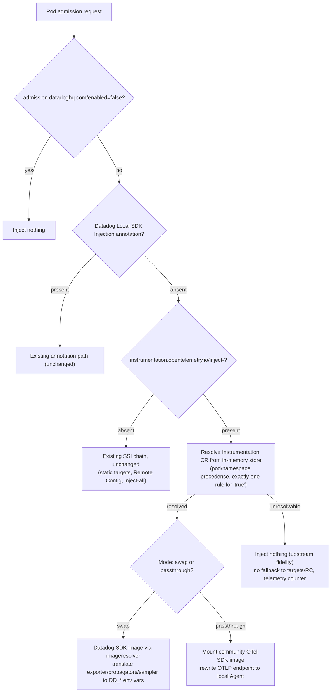

# RFC: OpenTelemetry `Instrumentation` CRD Compatibility for SSI

## Status

Draft — PoC in progress on branch `luc/poc-otel-instrumentation-crd`.

Upstream behaviour is documented separately and authoritatively in
[`otel-instrumentation-upstream-reference.md`](otel-instrumentation-upstream-reference.md),
derived from a direct reading of the community Operator's source. That
document, not this one, is the source of truth for what upstream does; this
RFC only covers what Datadog should do about it.

## Summary

This RFC proposes that the Cluster Agent recognize the community OpenTelemetry
Operator's `Instrumentation` CRD (`opentelemetry.io/v1alpha1`) and its
`instrumentation.opentelemetry.io/inject-<lang>` annotation contract as an
additional input to SSI pod admission, so that workloads already configured
for the community OTel Operator keep working — unmodified — if a customer
replaces that operator with the Datadog Operator / Cluster Agent.

Two injection modes are proposed: **passthrough** (keep the community OTel
SDK images and route telemetry to the Agent's existing OTLP receiver) and
**swap** (replace the images with DDOT SDKs and translate the configuration
to Datadog's native env vars). Both reuse the existing `libraryinjection`
provider infrastructure (init container / CSI / image volume) unchanged,
since it already mounts arbitrary OCI images and does not know about
"Datadog" specifically.

Pod admission never *depends* on the CRD being present: a pod carrying no
OTel annotation, or a cluster without the CRD installed, follows the existing
SSI precedence chain bit-for-bit unchanged. But when a pod *does* carry an
OTel annotation that cannot be resolved to a CR, the community Operator's
behaviour is reproduced faithfully — no injection at all, and no fallback to
Datadog `targets`/Remote Config (see Decisions).

## Scope

This is one of two independent tracks identified while scoping "native OTel
support in the Datadog Operator" (see Related documents). It stands on its
own: a deployment that only needs OTel `Instrumentation` compatibility never
needs `DatadogInstrumentation`, and vice versa.

Language coverage is bounded by an intersection, not by a choice: the OTel
CRD carries blocks for `java`, `nodejs`, `python`, `dotnet`, `go`,
`apacheHttpd` and `nginx`, while Datadog SSI supports `java`, `js`,
`python`, `dotnet`, `ruby`, `php` and `c`. Four languages are therefore
mappable (`java`, `nodejs`→`js`, `python`, `dotnet`); `ruby`/`php`/`c` have
no OTel block to read at all, and `go`/`apacheHttpd`/`nginx` have no SSI
equivalent (see Non-Goals). "All languages" and "four languages" mean the
same thing here.

Explicitly out of scope:

- **The `OpenTelemetryCollector` CRD** (Collector deployment/management).
  Separate concern, owned by whichever team ends up building Collector
  lifecycle management into the Datadog Operator.
- **`DatadogInstrumentation` CRD support and its precedence design.**
  Covered by `datadoginstrumentation-crd-ssi-precedence-rfc.md`. The two
  mechanisms may eventually need to be ordered relative to each other in the
  same precedence chain, but neither implementation depends on the other.
- **Shipping the `Instrumentation` CRD definition itself.** The Cluster Agent
  only ever consumes the CRD, and adopting one that already exists is the
  common case in a drop-in migration — see [CRD ownership](#crd-ownership) for
  why installing it belongs to the packaging layer rather than here, and why
  the greenfield case is deferred.
- **Go auto-instrumentation.** See Non-Goals.

## Context

The community OTel Operator's `Instrumentation` CRD holds SDK/exporter
configuration (`exporter`, `propagators`, `sampler`, per-language `image` +
`env` blocks). Targeting is not part of the CRD: workloads opt in via the
`instrumentation.opentelemetry.io/inject-<lang>` annotation on the pod
template or on the namespace, with values `"true"` (default CR in namespace),
`"<name>"`, `"<namespace>/<name>"`, or `"false"`.

The product brief ["Native OTel support in the Datadog
Operator"](https://docs.google.com/document/d/1xrWOjGyjHB8mFFCRFhl2Ow0upBVfzZL1fy5WKdwRQMU/edit)
(Dinesh Gurumurthy, Cyrille Le Clerc) lists reconciling this CRD "for a
defined set of languages" as a P0 for a Q4 2026 cross-team OKR, and a
reviewer (Dan Gazineu) explicitly flagged that this should involve, and
possibly be led by, Injection Platform.

One terminology point from that brief's comment thread matters for the
design below: **"DDOT SDKs" are Datadog's own build of the OTel SDKs**, not
`dd-trace-*` with the `DD_TRACE_OTEL_ENABLED` API bridge (Cyrille Le Clerc:
*"'Community OTel SDKs'. 'DDOT SDKs' are OTel SDKs as well as community
ones."*). The `dd-trace-*` + `DD_TRACE_OTEL_ENABLED` bridge documented at
[OpenTelemetry API
Support](https://docs.datadoghq.com/opentelemetry/instrument/dd_sdks/api_support.md)
is a real, separate mechanism (an application already coded against the OTel
API can be backed by a `dd-trace` tracer instead of an OTel SDK), and should
be considered a secondary/legacy swap path, not the primary one this RFC
assumes.

Confirmed constraint from the brief's discussion (Wassim Dhif, replying to
Matthew David): the mutating webhook stays in the Cluster Agent — *"No, this
is strictly a Cluster Agent feature."* The Datadog Operator's role, if any,
is limited to installing the CRD and wiring RBAC, matching the existing
pattern for `DatadogInstrumentation` (Cluster Agent as the de facto
"operator" for pod-mutation-relevant CRDs, per Mark Spicer's RFC).

## Problem

Today the Cluster Agent has no awareness of `opentelemetry.io/v1alpha1
Instrumentation` or its annotation contract. A customer migrating from the
community OTel Operator to the Datadog Operator has to rewrite every
workload's annotations and re-point every SDK's exporter configuration —
exactly the friction the product brief is trying to remove.

## Proposal

### Two injection modes

| | Passthrough | Swap |
|---|---|---|
| What gets injected | The community OTel SDK image named in `<lang>.image`, unchanged, or the default image table's entry when that field is empty | The DDOT SDK image for that language, resolved the same way `imageresolver` resolves `dd-trace` images today for `targets` |
| `exporter.endpoint` | Rewritten to point at the Agent's local OTLP receiver (`otlp_config`, 4317/4318) if it doesn't already | Ignored — DDOT/`dd-trace` tracers talk to the Trace Agent natively (8126) |
| `propagators` | Kept as-is, `OTEL_PROPAGATORS` | Mapped to `DD_TRACE_PROPAGATION_STYLE` |
| `sampler.type` / `sampler.argument` | Kept as-is | Mapped to `DD_TRACE_SAMPLE_RATE` / `DD_TRACE_SAMPLING_RULES` |
| `<lang>.env` | Merged, OTel's 4-layer precedence preserved | Merged into the resulting `ddTraceConfigs`-equivalent env vars |
| Application code using the OTel API | Unaffected | Unaffected (DDOT SDKs *are* OTel SDKs; no `DD_TRACE_OTEL_ENABLED` bridge needed in the primary path) |

Both modes reuse `libraryinjection.LibraryInjectionProvider` unchanged —
`InitContainerProvider`, `CSIProvider`, and `ImageVolumeProvider` already
mount an arbitrary `Package{Name, Registry, Version}` OCI image via
`LibraryConfig`, with no assumption baked in about who built the image.

### Targeting: recognizing the OTel annotation contract

`instrumentation.opentelemetry.io/inject-<lang>` sits one tier *below*
today's Datadog annotations and above everything else, giving the chain:

```
admission.datadoghq.com/enabled=false   (absolute opt-out, wins over all)
  > Datadog Local SDK Injection annotations
  > instrumentation.opentelemetry.io/inject-<lang>
  > static targets > Remote Config policies > SSI inject-all
```

An OTel annotation is itself an **explicit opt-in**, equivalent to
`admission.datadoghq.com/enabled=true`. It is therefore honoured even on a
pod with no Datadog label in a cluster where `mutateUnlabelled` is false —
otherwise the compatibility promise would fail in the most common
configuration, which is precisely the migrating customer's situation.

Resolution follows upstream exactly (details and source citations in the
upstream reference document):

1. Parse the annotation value: `"true"`, `"<name>"`, `"<ns>/<name>"`, or
   `"false"`.
2. For `"true"`, there is **no default CR name** — contrary to what
   opentelemetry.io states. Upstream lists every `Instrumentation` in the
   pod's namespace and requires *exactly one*; zero or several is an error.
   The store therefore needs namespace-wide listing, not just a keyed lookup.
3. Pod and namespace annotations do **not** follow "pod always wins": when
   the pod says `"true"` and the namespace names a CR, the **namespace**
   wins, because `"true"` on the pod only means "yes, instrument me" and
   delegates the choice of CR. For `"false"` or an explicit name, the pod is
   final.
4. If the annotation cannot be resolved (no CR in the namespace, several CRs
   with `"true"`, named CR missing), reproduce upstream: **inject nothing**,
   and do not fall back to Datadog `targets`/Remote Config. Admission itself
   is never blocked or failed. A telemetry counter makes this refusal
   diagnosable rather than silent.

5. Resolution is **per language, not per pod**: upstream calls its lookup once
   for each enabled language, so a single pod may legitimately point `java`
   and `python` at two *different* `Instrumentation` CRs. The resolution
   result therefore carries a CR per requested language, not one CR for the
   pod.
6. Failure, however, *is* pod-level: upstream bails out on the **first**
   language that fails to resolve and leaves the pod entirely
   uninstrumented, even where a later language would have resolved. Lookups
   are per-language; one unresolvable language poisons the whole pod.

Consequence of (4) and (6), accepted deliberately: a pod injected today via
static targets or Remote Config stops being injected if it also carries an
unresolvable OTel annotation. The blast radius is bounded by the
off-by-default feature flag, and this case must be covered explicitly by the
backward-compatibility review.

One asymmetry follows from the language scope. A pod annotated *only* for an
out-of-scope language — `inject-go` being the realistic case — presents no
recognized annotation at all, so it falls through to the normal Datadog
chain. If a static target or Remote Config policy matches it, it receives
Datadog injection. The practical effect for a customer replacing the
community operator is that such a pod loses its eBPF Go instrumentation
(that operator is gone) and gains Datadog mounts that do nothing for a Go
binary. Harmless but not free, and worth calling out in migration guidance.

## Design Overview



### Mode selection

Both modes are in scope, selected by a Cluster Agent config setting, with the
selector present from the start. **Swap is implemented first**, which
reverses this RFC's original recommendation of passthrough-first. The reason
is that passthrough is by far the more expensive of the two:

- Swap lands almost entirely on existing rails. Producing a `targetInternal`
  with `libVersions` + `envVars` is enough; `libraryinjection` and its
  CSI/init-container/image-volume providers then work unchanged.
- Passthrough requires reproducing upstream's per-language environment
  construction (`JAVA_TOOL_OPTIONS`, `PYTHONPATH`, `NODE_OPTIONS`,
  `CORECLR_*`), which the Datadog pipeline does not do at all — its LD_PRELOAD
  injector handles this at runtime instead. Upstream has a separate
  `opentelemetry-injector` project and a plan to adopt it in the Operator
  (see [Appendix: upstream LD_PRELOAD injector](#appendix-upstream-ld_preload-injector)),
  but that path is not shipped. The contract this RFC reproduces is still
  init-container plus runtime env vars. See
  [Passthrough injection](#passthrough-injection) for what that means in
  practice and what it leaves out.
- Passthrough also inherits a gap that only appears once the community Operator
  is gone: SDK images and init-container resources are filled in by upstream's
  **`Instrumentation` CR defaulting webhook**, not by its pod webhook. With that
  operator removed, customer CRs arrive with empty image fields, so passthrough
  needs its own default SDK image table. That table now exists (`images.go`),
  mirroring upstream's repository naming and its `versions.txt` tags, and
  `ResolveImage` returns the CR's image when it has one and the table's default
  otherwise. Init-container *resources* are still not defaulted.

#### One tri-state setting, not a boolean plus a mode

The selector and the feature switch are the same setting, holding one of three
values:

| Value | Behaviour |
|---|---|
| `disabled` | No store, no informer, no watch, no RBAC needed. Custom resources are ignored entirely. |
| `otel` | Store runs; a resolved custom resource is honoured in passthrough. |
| `datadog` | Store runs; a resolved custom resource is honoured in swap. |

Both non-disabled values need the store, since the custom resource has to be
read either way — only the translation differs. Splitting this into a boolean
plus a mode would allow a state that means nothing ("mode is passthrough but
custom resources are not read"), so the PoC's
`apm_config.instrumentation.otel_instrumentation_crd_enabled` becomes
`..._crd_mode`. There is no compatibility cost: the flag defaults to off and
nothing consumes it yet.

#### `<lang>.image` selects the mode per custom resource

The setting above is only a *default*. The custom resource itself carries a
stronger signal, and swap must stop ignoring it: an image the customer chose
deliberately is a request for the community SDK, and honouring the request
means passthrough for that language, whatever the default says.

Telling a deliberate image from a defaulted one does not need a heuristic in
the common case, because upstream's defaulting webhook stamps
`instrumentation.opentelemetry.io/default-auto-instrumentation-<lang>-image`
on the custom resource with the value it used — unconditionally, even when the
user supplied the image themselves. Comparing the two fields is exact, and it is
what upstream's own upgrade path uses to decide whether it may rewrite an image:

| `<lang>.image` | Defaulting annotation | Reading | Mode |
|---|---|---|---|
| empty | — | no intent | the configured default |
| equal to it | present | operator's default | the configured default |
| different from it | present | deliberate | passthrough |
| set | absent | typed by hand, no webhook ran | heuristic |

The first row is where an empty image would leave passthrough with nothing to
inject, which is what the default image table answers: the language falls back
to upstream's own default rather than to swap.

The last row is the only one needing a guess, and it is exactly the
post-migration world where no defaulting webhook runs any more. A custom
resource copied from upstream's documentation lands there, and reading it as a
deliberate choice would be wrong, so a name test against the well-known
upstream image is the fallback. Keeping it *last* matters: the cases that break
name matching — an upstream image mirrored into a private registry, an old
upstream version pinned on purpose — all carry the annotation and never reach it.

One blind spot is shared with upstream by construction: a user who types
exactly the operator's current default is read as "defaulted". Upstream's
upgrade path treats that case the same way and rewrites the image, so matching
its behaviour is the correct answer for a drop-in replacement rather than a
limitation to fix.

### Defaulting the custom resource ourselves

Full replacement removes upstream's defaulting webhook, so custom resources
created afterwards keep an empty `<lang>.image`. That is harmless in swap, which
never reads the field, and it is a landmine anywhere else.

**Upstream hard-fails on an empty image.** There is no guard: the dispatch only
checks that an `Instrumentation` was resolved, `validate()` never requires an
image, and the init container is built with `Image: <lang>Spec.Image` verbatim.
An empty value therefore produces an init container with no image, which the API
server rejects outright — `spec.initContainers[N].image: Required value` — so the
pod is never created and a Deployment simply stops producing pods. Combined with
the fact that upstream's defaulting runs on `CREATE`/`UPDATE` only and is never
retroactive, a customer who reinstalls the community operator finds every
workload governed by a custom resource we created broken, silently, until
someone edits each one.

Stamping the same fields ourselves is what makes the round trip safe, and it
turns "drop-in replacement" into a property that can be tested in both
directions: a custom resource created under either side must work under the
other.

**Done right, the custom resource repairs itself.** Upstream registers a startup
runnable that lists every `Instrumentation` in the cluster and rewrites the image
of those whose `<lang>.image` still equals the defaulting annotation. So if our
`Default()` writes the field *and* upstream's annotation key with the same value,
a reinstalled community operator recognises the custom resource as one of its own
defaults and upgrades it to its current image, with no manual step. Two
conditions carry that property:

- **Use upstream's annotation key.** With a Datadog-only key, the startup sweep
  matches nothing and our image stays frozen for ever — valid, but never
  following upstream's versions again.
- **The image must satisfy upstream's init-container contract**, which is fixed
  by the operator and not by the custom resource: `cp -r /autoinstrumentation/.`
  into `/otel-auto-instrumentation-<lang>`, or `/autoinstrumentation-musl/.`
  depending on the platform annotation. Stamping the upstream default is
  therefore the low-risk option, at the cost of tracking its version; stamping a
  DDOT image requires that image to carry the same layout, which is a
  verifiable constraint rather than a matter of preference.

A second, Datadog-specific annotation records *who* defaulted the custom resource
and with which Cluster Agent version. It exists purely for debugging — upstream
ignores annotations it does not know, so it survives a round trip untouched and
changes no behaviour. Without it, "why does this pod carry that image" is only
answerable from Cluster Agent logs.

The cost is a mutating webhook on a CRD we do not own, and upstream's equivalent
runs with `failurePolicy: Fail`, meaning a webhook that is down blocks custom
resource creation. Non-Goals already excludes a *validating* webhook on this CRD
for needing a product conversation; a defaulting webhook is a different animal,
but deserves the same one. Out of scope for the PoC.

### Passthrough injection

Passthrough does not go through `libraryinjection`, and this is not a matter of
wiring. That package implements *Datadog's* injection contract, whatever the
delivery mechanism: the init container it builds runs a copy script that only
exists in Datadog SDK images, it mounts at `/opt/datadog-packages/...`, and the
runtime wiring it produces is `LD_PRELOAD` pointing at the Datadog injector. A
community SDK image has none of that — its payload sits at
`/autoinstrumentation`, it expects `/otel-auto-instrumentation-<lang>`, and it
is loaded by `JAVA_TOOL_OPTIONS`, `NODE_OPTIONS`, `PYTHONPATH` or `CORECLR_*`.
Passing an upstream image to the existing providers yields an init container
that fails on its first command.

So passthrough reproduces upstream's mutation instead, in
`otelinstrumentation/passthrough.go`: a per-language table of copy command,
mount path and runtime variables, and a builder turning a resolved custom
resource into concrete init container, volume, mounts and environment. Applying
that to the pod is the only part shared with swap, through
`libraryinjection.PodPatcher`, which is generic pod editing and carries no
Datadog assumption.

It plugs into the mutator at the same single point swap does. `annotationResult`
carries the injections next to the target, so a custom resource sending Java to
swap and Python to passthrough produces both, and `MutatePod` applies the
passthrough ones first, then runs the Datadog pipeline only if a target came out
of the translation. The reinvocation guard gains a check for upstream's init
container prefix — the Datadog volume it looks at today is never added by
passthrough, and a second pass would append the SDK to `JAVA_TOOL_OPTIONS`
twice.

One consequence is worth stating: `ShouldMutatePod` still answers on the Datadog
target alone, so a pod that resolved to passthrough only is *not* seen as
mutable by the `config` and `tagsfromlabels` webhooks. That is deliberate —
those inject `DD_AGENT_HOST`, `DD_ENV` and friends, which configure a tracer
that is not in the pod. It also means the community SDK gets no endpoint unless
`spec.exporter.endpoint` provides one.

The upstream behaviour this reproduces is documented in
[the upstream reference](otel-instrumentation-upstream-reference.md); the parts
worth calling out are the ones that are silent when wrong: `PYTHONPATH` is
*wrapped*, not appended, or the SDK's `sitecustomize.py` is never reached;
Java's mount path carries the container name where the other languages share
one; and a variable the injection must merge into but which the container
populates with `valueFrom` makes upstream skip that container entirely rather
than overwrite the user's value.

#### What passthrough does not support

The list is kept in the file's package documentation as well, next to the code
it constrains, and each entry a custom resource can actually ask for is counted
in `otel_instrumentation_passthrough_unsupported`:

| Not supported | Consequence |
|---|---|
| musl images (`otel-python-platform`, `otel-dotnet-auto-runtime`) | the glibc payload and profiler path are always used |
| `<lang>.volumeClaimTemplate` | the payload always lands in an `emptyDir` |
| `java.extensions` | no extension init container, no `-Dotel.javaagent.extensions` |
| Kubernetes-derived resource attributes | only `k8s.namespace.name` and `k8s.container.name` are emitted |
| `resource.addK8sUIDAttributes` | follows from the above |
| owner-derived service names | `OTEL_SERVICE_NAME` falls back to the container name |
| exporter TLS material | only `exporter.endpoint` is forwarded |
| restricted Pod Security Standard namespaces | the init container carries no security context |
| CSI and image volumes | upstream knows only `emptyDir` plus an init container |

The resource-attribute gap is the one with a design reason rather than a scope
one. Upstream builds those attributes out of `$(VAR)` references to downward-API
variables, which Kubernetes only expands against variables declared **earlier**
in the same container — upstream's own code has to move
`OTEL_RESOURCE_ATTRIBUTES` to the end of the list for this to work, and gets it
wrong often enough that it is tracked as issue #3022. Emitting only the
attributes that need no reference keeps that ordering constraint out of this
implementation entirely; the owner-derived ones need API reads on top.

Init-container resources are the remaining defaulting gap: upstream's defaulting
webhook fills them in, so a custom resource created after that operator is gone
carries none and the init container runs unbounded. Unlike the SDK image, there
is no table to fall back on yet.

### Reading the CR

The `DatadogInstrumentation` (DDI) platform in `pkg/clusteragent/instrumentation/`
is already shipped, and its **CR access infrastructure is the pattern reused
here**: dynamic informer over an unstructured GVR, conversion helpers with
tombstone handling, non-fatal wait for the CRD to appear, config-flag gating.
Lookups hit an in-memory cache only and never issue an API call on the
admission path; a cache miss or unsynced cache is an ordinary negative
result, never an error that could stall admission.

What is *not* reused is DDI's `Handler` interface. That model is
event-driven, with the CR acting as the trigger for reconciliation. An OTel
`Instrumentation` CR is a passive configuration store: nothing needs to
happen when one is created, it only matters when a pod referencing it is
admitted. Modelling it as a DDI handler would be a category error.

How the store reaches the admission path matters, and the obvious route does
not exist: `TargetMutator.MutatePod(pod, ns, _ dynamic.Interface)` **discards**
its dynamic client parameter. Every dependency here is constructor-injected
through `NewAutoInstrumentation` → `NewTargetMutator` → `mutatorCore`, so the
store is threaded the same way, following `libraryinjection.CSIDriverWatcher`:
a **nil interface value means "feature disabled"**. Gating then needs no
conditional at the call site, and the flag being off leaves the admission path
byte-for-byte as it is today.

The CRD's Go types come from `github.com/open-telemetry/opentelemetry-operator/apis`,
a lightweight module separate from the operator itself (only `goccy/go-yaml`,
`k8s.io/api` and `k8s.io/apimachinery` as direct dependencies) — directly
analogous to the existing `github.com/DataDog/datadog-operator/api`
dependency. It must be pinned to a version whose `k8s.io/api` requirement
stays within this repo's pin, since the module's tip requires a newer
Kubernetes than the Agent's and would otherwise force a repo-wide bump.

### Upstream behaviours that are easy to get wrong

Documented in full in the upstream reference; listed here because each one is
a silent-failure trap for a reimplementation:

- **Environment variable order is load-bearing.** `OTEL_RESOURCE_ATTRIBUTES`
  must be emitted last: its value references
  `$(OTEL_RESOURCE_ATTRIBUTES_POD_NAME)`, and Kubernetes only expands
  references to variables declared earlier. Getting the order wrong ships
  literal `$(VAR)` strings into customer telemetry.
- **Activation variables are appended, not set.** Java and Node.js append to
  any existing `JAVA_TOOL_OPTIONS`/`NODE_OPTIONS` (leading space); Python
  wraps `PYTHONPATH` on both sides; .NET concatenates three variables with
  `:` and lets the pre-existing value win for four others. Upstream's
  documented "4-layer precedence" does not apply to these.
- **Java mounts the same volume at two different paths**: the init container
  writes to `/otel-auto-instrumentation-java`, while the application
  container mounts per-container at `/otel-auto-instrumentation-java-<container>`.
- **A `valueFrom` on an activation variable makes upstream skip the container
  entirely** — no volume, no env.
- **The idempotency guard is broad**: upstream treats a pod as already
  instrumented as soon as any container carries
  `OTEL_RESOURCE_ATTRIBUTES_NODE_NAME`, whatever put it there.
- **Upstream's owner resolution reads an informer cache, not the API server**
  (ReplicaSet→Deployment, Job→CronJob, to derive resource attributes). The pod
  mutator holds `mgr.GetClient()`, which is controller-runtime's cache-backed
  client, so those `Get` calls cost no API round-trip; the retry loop around
  them fires on `NotFound` only, to absorb cache lag. Worth stating explicitly
  because it takes admission latency off the table as an argument: the reason to
  prefer Datadog's own owner resolution is that the Agent's tagger already
  carries the equivalent tags, not that upstream is slow.
- **`container-names` is validated against `^[a-zA-Z0-9-,]+$`**, rejecting
  dots and underscores, and the nginx key is inconsistently named
  `inject-nginx-container-names`.

### CRD ownership

The target is **full replacement**: the community OTel Operator is uninstalled
and the Cluster Agent takes over its `Instrumentation` webhook. Coexistence —
keeping the upstream controller for `OpenTelemetryCollector` and merely
disabling its `Instrumentation` webhook — is not the goal, though the two
webhooks do have to be kept apart during a migration, since both react to the
same annotation and would otherwise race to inject the same pod.

The admission-path design above is unaffected either way: it only reads the CR
and never assumes who installed the CRD. What full replacement does raise is who
installs it, and that question has a wrong answer worth ruling out explicitly.

**Not the Cluster Agent, even though it is the component reading the CR.** DDI
already sets that precedent: the Cluster Agent runs the
`DatadogInstrumentation` controller, yet its `ClusterRole` holds no
`apiextensions.k8s.io` rule at all — only get/list/watch on the resource and
patch/update on its status. Three reasons to keep it that way:

- **Privilege.** CRD writes are cluster-scoped and not granular: whoever can
  modify one CRD can rewrite the schema of every other. That is a large blast
  radius for a component that otherwise only reads.
- **Lifecycle.** The Cluster Agent is a replicated, upgradable and
  *downgradable* workload; a CRD is a cluster-scoped singleton. Two versions
  coexist during a rolling upgrade and would contend for one schema, and a
  downgrade would narrow it — after which the API server silently prunes the
  now-unknown fields from stored objects. Invisible data loss triggered by a
  rollback.
- **Deletion.** Removing a CRD cascades to every CR of that kind. A workload has
  no way to express "this outlives me", whereas the packaging layer has
  ownership metadata and `helm.sh/resource-policy` for exactly that.

**The installer is the `datadog-crds` chart**, where DDI's CRD already lives as
`templates/datadoghq.com_datadoginstrumentations_v1.yaml`. Two details of that
chart are deliberate and must be reproduced: the CRDs sit in `templates/`, not
in the `crds/` directory Helm only ever applies at install time and never
upgrades; and each carries `helm.sh/resource-policy: keep` under `keepCrds`, so
that uninstalling the chart does not take the customer's CRs with it. Each CRD
is gated by its own value (`crds.datadogInstrumentations`), and the files are
resynchronised from the Operator's `config/crd/bases` by `update-crds.sh`.

How that chart gets pulled in is the part worth copying, because DDI already
demonstrates the exact shape this feature needs: `datadog-crds` is a
*conditional* dependency of the `datadog` chart, and one of the conditions
listed in its `requirements.yaml` is `datadog.instrumentationCrd.enabled` — the
very flag that turns the DDI controller on. Enabling the feature therefore
installs its CRD in the same gesture, with no separate step for the user, while
a cluster that does not use it carries neither. The `datadog-operator` chart
pulls the same subchart in under the alias `datadogCRDs`.

**A foreign CRD carries risks DDI does not.** `instrumentations.opentelemetry.io`
belongs to another project, which means vendoring its schema at a pinned version
and tracking its drift, in particular the upstream [v1beta1
RFC](https://github.com/open-telemetry/opentelemetry-operator/blob/main/docs/rfcs/instrumentation-v1beta1.md).
Two failure modes follow, and the second is the dangerous one:

- **Ownership collision.** If the upstream operator installed the CRD first,
  Helm refuses to adopt a resource whose ownership metadata is not its own.
- **Field pruning.** If the vendored schema is older than the CRs already in the
  cluster, applying it drops their unknown fields in place. A drop-in
  replacement that quietly truncates customer configuration is worse than one
  that declines to install.

**Default: adopt if present, never install.** In a drop-in scenario the customer
is migrating away from the upstream operator, so the CRD is almost always
already there — the common case is adoption, not creation. That is what the
Store does today: it waits for the CRD, stays inert while it is missing, and
starts serving whenever it appears. Installing the CRD ourselves only matters
for a greenfield cluster that wants OTel-shaped configuration without ever
having run the upstream operator, which is a narrower need and out of scope
here.

## Deployment prerequisites

Reading the CR needs RBAC that no Datadog distribution currently grants. The
Helm chart's Cluster Agent `ClusterRole` mentions the `opentelemetry.io` group
nowhere, and there is no wildcard rule covering it, so with the feature flag on
and the CRD installed the informer still fails with `forbidden` and every
resolution comes back unresolvable — the feature looks inert for a reason
unrelated to the admission logic. The same applies to the Operator's generated
`ClusterRole`.

DDI is the pattern to copy: `charts/datadog/templates/cluster-agent-rbac.yaml`
carries a block gated on `should-enable-instrumentation-crd-controller` granting
get/list/watch on `datadoginstrumentations`. Ours needs the same shape, gated on
the OTel flag, but read-only — no `status` subresource rules, since nothing here
reconciles or writes back.

Shipping this feature therefore spans three repositories: the Cluster Agent
(this RFC), `helm-charts`, and `datadog-operator`. The PoC works around it with
a standalone `ClusterRole` applied by hand, which is enough for a local cluster
and nothing else: an agent that starts without those rules gets a `403`, treats
it as permanent, and never recovers on its own.

## Non-Goals

- **Go auto-instrumentation.** The community Operator's `go` block relies on
  an eBPF-based sidecar/daemon that traces an already-running binary — a
  fundamentally different mechanism from Datadog's LD_PRELOAD-based SSI
  injector. `dd-trace-go` has no runtime-injection equivalent (manual
  instrumentation or compile-time Orchestrion only). Swap mode is not
  achievable for `go`; passthrough mode may be, but needs its own
  investigation since it doesn't go through `libraryinjection` at all.
- **`apacheHttpd` / `nginx` blocks.** No direct equivalent in the current SSI
  pipeline (`libraryinjection` targets language runtimes, not web server
  modules).
- **A validating webhook for the `Instrumentation` CRD.** The community CRD
  has no such thing upstream; adding Datadog-specific validation on a
  community-owned schema is out of scope here and would need its own product
  conversation.
- **Reconciling `OpenTelemetryCollector`.**

## Decisions

Settled while scoping the PoC:

| Question | Decision |
|---|---|
| Injection modes | Both, selected by config; swap implemented first |
| Shape of that config | One tri-state setting `..._crd_mode` (`disabled`/`otel`/`datadog`), not a boolean plus a separate mode — the split would allow a meaningless state |
| Mode when the custom resource names an image | The image wins over the configured default: a deliberate image is a request for the community SDK. Deliberate is told from defaulted by comparing against upstream's defaulting annotation, with a name-based fallback only when that annotation is absent |
| Language coverage | The four that both sides support: `java`, `nodejs`→`js`, `python`, `dotnet` |
| CRD Go types | Upstream `opentelemetry-operator/apis` module, pinned to avoid a repo-wide Kubernetes bump; minimal local structs as a pre-authorised fallback |
| CR access | Informer-backed in-memory store, mirroring DDI's infrastructure but not its `Handler` model |
| Deployment shape | Full replacement of the upstream operator, not coexistence |
| CRD installation | Adopt if present, never install: the Store waits for the CRD and stays inert without it. Installing it would belong to the packaging layer, never to the Cluster Agent (see CRD ownership) |
| Datadog vs OTel annotation on the same pod | Datadog wins, OTel ignored |
| …even when the Datadog annotation is itself inert | Yes: a Datadog library annotation suppresses the OTel path on an unlabelled pod too, where it would not have been honoured. The alternative makes adding a Datadog annotation the thing that triggers an OTel-driven injection |
| OTel annotation as opt-in | Yes — honoured even when the pod is unlabelled and `mutateUnlabelled` is false |
| `admission.datadoghq.com/enabled=false` | Absolute opt-out, beats the OTel annotation |
| Unresolvable OTel annotation | Upstream fidelity: inject nothing, no fallback to targets/RC |
| Feature gating | `apm_config.instrumentation.otel_instrumentation_crd_mode`, default `disabled` |
| Acceptance criterion | Manual demo on a local cluster via `injector-dev` |

| Where passthrough's default SDK images come from | A table in the Cluster Agent mirroring upstream's image repository and `versions.txt` tags, refreshed with the community Operator releases we track. Reused by the mode discriminator, and by a defaulting webhook if we build one |

One decision deliberately deferred: defaulting the custom resource ourselves,
which is what would make a reinstalled community operator repair its own custom
resources. It is specified in *Defaulting the custom resource ourselves* and
left out of the PoC; it reuses the same image table.

## Open Questions

- **Disabling upstream's webhook during a migration.** Full replacement is the
  target, but the two webhooks necessarily overlap while a customer switches
  over, and both react to the same annotation. What stops upstream's
  `Instrumentation` webhook from double-injecting in that window needs an
  explicit disablement story, not just documentation. The levers upstream's
  chart offers are all blunt: `admissionWebhooks.create=false` drops the whole
  `MutatingWebhookConfiguration`, including the `Instrumentation` defaulting
  webhook that fills in SDK image defaults on CR creation, and
  `namespaceSelector`/`objectSelector` are shared by every webhook in that
  configuration, so narrowing them to spare pods also narrows the
  `OpenTelemetryCollector` ones. Per-language flags stop injection but leave the
  webhook registered on every pod creation. Which lever we tell customers to
  pull, and whether the Cluster Agent can detect that they did, is open.
- **DDOT SDK image resolution.** Swap mode needs an `imageresolver`-equivalent
  for DDOT SDK images (registry, versioning, default-vs-pinned semantics).
  Does this reuse the existing `dd-trace` image resolution machinery, or is
  a DDOT SDK image a genuinely different artifact? Note that the answer is
  constrained the moment we default custom resources ourselves: an image written
  into `<lang>.image` has to be runnable by upstream's init container, whose
  command is fixed at `cp -r /autoinstrumentation/.`, so a DDOT image is only
  usable there if it carries that layout.
- **Translated samplers inherit a rate limit upstream does not have.**
  `DD_TRACE_RATE_LIMIT` defaults to 100 traces/second *per service instance*, and
  the tracers apply it precisely when `DD_TRACE_SAMPLE_RATE` or
  `DD_TRACE_SAMPLING_RULES` is set — otherwise rate limiting is delegated to the
  Agent. Swap mode emits both for every translatable sampler, so any pod whose
  `Instrumentation` sets a sampler picks up a ceiling it never asked for: an
  `always_on` stops meaning "everything", and a `traceidratio` of 0.25 stops
  meaning "a quarter of everything", once an instance passes 100 traces/second.
  Below that the two behave identically, which is why this is easy to miss.
  Emitting a high `DD_TRACE_RATE_LIMIT` would restore fidelity but would also
  remove a deliberate protection against ingestion overages, and there is no
  documented "unlimited" value to reach for. **Deliberately out of PoC scope**:
  the PoC emits no rate limit and inherits the tracer default, and the trade-off
  is a product decision to settle before GA rather than a constant to guess here.
- **Schema drift risk.** Tracking the v1beta1 RFC upstream — should the
  Cluster Agent support both v1alpha1 and v1beta1 shapes from day one, or
  v1alpha1 only until upstream stabilizes?

## Related documents

- [Upstream reference: what the community OTel Operator actually injects](otel-instrumentation-upstream-reference.md) — source of truth for upstream behaviour, derived from its Go source; read this before implementing anything in the annotation or translation layers.
- [Product brief: Native OTel support in the Datadog Operator (Google Doc)](https://docs.google.com/document/d/1xrWOjGyjHB8mFFCRFhl2Ow0upBVfzZL1fy5WKdwRQMU/edit) — the product motivation this RFC responds to.
- [RFC: DatadogInstrumentation CRD as an Overridable Precedence Tier for SSI](datadoginstrumentation-crd-ssi-precedence-rfc.md) — companion track, same fallback-never-hard-dependency principle, independent implementation.
- [RFC: SSI On Demand with Remote Config](ssi-on-demand-remote-config-rfc.md) — existing precedence chain this mechanism plugs alongside.
- [RFC: Datadog CSI driver auto-detection](csi-driver-detection-rfc.md) — same architectural pattern (cluster-wide watch feeding an in-memory cache, zero per-admission API cost).
- [DatadogInstrumentation CRD for Workload-Scoped Product Enablement (Confluence)](https://datadoghq.atlassian.net/wiki/spaces/CONTP/pages/6564659495/DatadogInstrumentation+CRD+for+Workload-Scoped+Product+Enablement) — cites the OTel `Instrumentation` CRD as prior art for the config-shape (not targeting) side of that design.
- [OpenTelemetry Operator — `Instrumentation` CRD docs](https://github.com/open-telemetry/opentelemetry-operator/blob/main/docs/auto-instrumentation/README.md)
- [Datadog docs — OpenTelemetry API Support](https://docs.datadoghq.com/opentelemetry/instrument/dd_sdks/api_support.md) — the `dd-trace` + `DD_TRACE_OTEL_ENABLED` bridge, relevant as a secondary/legacy swap path.
- [Appendix: upstream LD_PRELOAD injector](#appendix-upstream-ld_preload-injector) — why the community Operator does not use `opentelemetry-injector` today, and the issues that track a future adoption.

## Code references

- `pkg/clusteragent/admission/mutate/autoinstrumentation/target_mutator.go` — `getTargetFromAnnotation`, `resolveTargetAndSSI`. OTel resolution is inserted at the function's **two `shouldContinue: true` exit points** (the `mutateUnlabelled` guard and the final return), leaving the rest of the function untouched. That single placement yields the whole decided precedence chain for free: `enabled=false` still short-circuits first, the Datadog annotation checks still short-circuit before OTel is consulted, and with no OTel annotation both exits return exactly what they return today.
- `pkg/clusteragent/admission/mutate/autoinstrumentation/otelinstrumentation/` — new package: CRD types, informer-backed store, annotation resolution, translation. `mode.go` holds the mode enum and the per-CR discriminator; `images.go` holds the default SDK image table, upstream's defaulting annotation key, and the name test the discriminator falls back on; `passthrough.go` holds upstream's per-language injection contract and the list of what it does not support.
- `pkg/clusteragent/instrumentation/` — the shipped DDI platform whose informer/conversion/CRD-wait patterns are mirrored (see `AGENTS.md` there); `pkg/util/kubernetes/apiserver/controllers/instrumentation_controller.go` for the non-fatal CRD wait.
- `pkg/clusteragent/admission/mutate/autoinstrumentation/libraryinjection/provider.go` — `LibraryInjectionProvider` interface, used unchanged by swap mode. It implements Datadog's injection contract (Datadog image layout, `LD_PRELOAD` injector) and is therefore **not** reusable for passthrough; only `pod_patcher.go`, which is generic pod editing, is shared by both modes.
- `pkg/clusteragent/admission/mutate/autoinstrumentation/libraryinjection/factory.go` — `ProviderFactory.GetProviderForPod`: delivery-mechanism resolution (init container / CSI / image volume) for Datadog SDK images. Orthogonal to this RFC's swap/passthrough distinction, and reached only by swap.
- `pkg/clusteragent/admission/mutate/autoinstrumentation/annotation/` — existing annotation parsing conventions to extend with the OTel annotation namespace.

## Appendix: upstream LD_PRELOAD injector

Datadog SSI is one injector (`auto_inject`, `LD_PRELOAD`) for hosts, Docker,
and Kubernetes. Upstream split the same job in two:

| | Community Operator | `opentelemetry-injector` |
|---|---|---|
| Where | Kubernetes admission | Linux host / VM |
| How | Init container copies the agent; the webhook writes `JAVA_TOOL_OPTIONS` / `NODE_OPTIONS` / `PYTHONPATH` / `CORECLR_*` onto the pod spec | `libotelinject.so` (Zig) preloaded via `LD_PRELOAD` or `/etc/ld.so.preload`; it detects the runtime and sets those same variables at process start |
| When | Operator auto-instrumentation since ~2021 | Splunk donation, ~2025; rewrite by Dash0 |

The Operator does not need the injector for the happy path: the webhook can
already see the pod spec and write the activation variables. The injector
exists for a problem admission cannot see — env vars that come from the
image, `envFrom`, or a ConfigMap — which is why `JAVA_TOOL_OPTIONS` from a
ConfigMap is overwritten or missed. An "enhanced injection" that tried to
read those ConfigMaps from the webhook was **removed in Operator v0.116.0**.

Maintainers do plan to adopt the injector for that gap, not as a rewrite of
the current path. It is not shipped, has no date, and is not the contract
this RFC reproduces. Current energy on the injector is host packaging
(`deb`/`rpm`, Packaging SIG), plus OBI/eBPF for languages without an SDK.

| What | Link |
|---|---|
| Injector repo | [open-telemetry/opentelemetry-injector](https://github.com/open-telemetry/opentelemetry-injector) |
| Tracker: use `LD_PRELOAD` in the Operator | [opentelemetry-operator#2375](https://github.com/open-telemetry/opentelemetry-operator/issues/2375) |
| Maintainer statement: adopt once the injector is mature | [opentelemetry-operator#4157](https://github.com/open-telemetry/opentelemetry-operator/issues/4157) |
| Operator PoC (`Injector` type, `inject-auto` annotation) | [opentelemetry-operator#3731](https://github.com/open-telemetry/opentelemetry-operator/pull/3731) — not merged |
| Donation announcement | [OpenTelemetry blog, 2025](https://opentelemetry.io/blog/2025/otel-injector/) |
| Host packaging | [OpenTelemetry blog, 2026](https://opentelemetry.io/blog/2026/packaging-first-repo/) |

Issue #4157, in the Operator maintainers' words: *"The plan is to achieve
this using a LD_PRELOAD hook. See #2375. This is now part of a larger
project: opentelemetry-injector, so it might take some time before it's
available in a mature enough form for the operator to adopt."*

The SIG discussion on #2375 / #3731 sketched an `Injector` field that would
carry only an `Image`, reuse each language block's `env` and `resources`,
and opt in with `inject-auto`. Adoption cost is real: glibc vs musl
(Alpine), a large blast radius inside the container, and an
`Instrumentation` CR shaped around per-language images rather than one
injector plus agents beside it.

Until that ships, passthrough must keep reproducing init-container plus
runtime env vars. If `inject-auto` ever lands, a cluster that only speaks
OTel would move closer to Datadog's SSI model; that is not a dependency of
this work.
