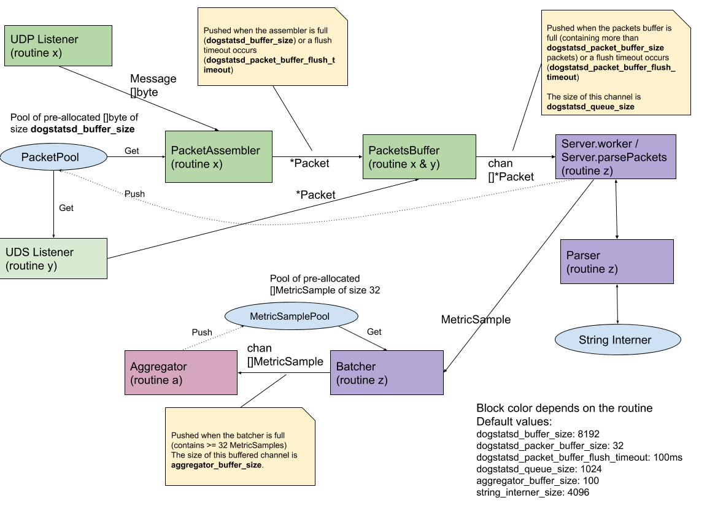

# DogStatsD

Information on DogStatsD, configuration and troubleshooting is available in the Datagdog documentation:
[https://docs.datadoghq.com/developers/dogstatsd/][1]

**The documentation available in this directory is intended for Dogstatsd developers.**

[1]: https://docs.datadoghq.com/developers/dogstatsd/

# Dogstatsd Internals

## Packet

In Dogstatsd, a Packet is a bytes array containing one or multiple metrics in the Dogstatsd format (separated by a \n when there are several). Its maximum size is `dogstatsd_buffer_size`.

## PacketAssembler

Input: a datagram from an UDP socket

Output: a Packet containing multiple metrics packed together, separated by a \n

The PacketAssembler gathers multiple datagrams into one Packet of maximum size, `dogstatsd_buffer_size`, and sends it to the PacketsBuffer which avoids running the whole parsing pipeline with only one metric per packet. The bytes buffer used comes from the PacketPool, which avoids re-allocating the bytes buffer every time. 

**Note**: The UDS pipeline does not use the PacketAssembler because each UDS packet also contains metadata (origin tags) which are used to enrich the metrics tags, making them impossible to be packed together by the PacketAssembler.

The PacketAssembler does not allocate a bytes array every time it has to use one. It retrieves one from a pool containing pre-allocated arrays and this pool never empties. The PacketAssembler allocates a new bytes array when it’s needed.
Once fully assembled by the PacketAssembler, the bytes array is sent through the rest of the Dogstatsd pipeline and ownership is allocated to each part using it (PacketsBuffer, Worker). Eventually, the Worker takes care of returning it to the pool when the part has processed its content.

## PacketBuffer

Input: a Packet containing one or several metrics in the Dogstatsd format (separated by a \n)
Output: multiple Packets send in a row to the Worker

The PacketsBuffer buffers multiple Packets (in a slice), this way the parsing part of the pipeline is going through several Packets in a row instead of only one each time it is called. This leads to less CPU usage. PacketsBuffer sends the Packets for processing when either:
* The buffer is full (contains `dogstatsd_packet_buffer_size, default value: 32`)
or

* A timer is triggered (i.e. `dogstatsd_packer_buffer_flush_timeout, default value: 100ms`)

The PacketBuffer sends it in a Go buffered channel to the worker / parser, meaning that the channels can buffer the Packets on their own while waiting for the worker to read and process them.

In theory, the max memory usage of the PacketBuffer is:
* packet buffer size * packet size * channel buffer size
* `dogstatsd_packer_buffer_size` * `dogstatsd_buffer_size` * `dogstatsd_queue_size`
* 32 * 8192 * 1024 =  256MB

## Worker

Input: slice of Packets

Output: MetricSample sent

The Worker is the part of the Dogstatsd server responsible for parsing the metrics in the bytes array and turning them into MetricSamples. The server spawns multiple workers based on the amount of cores available on the host (the amount of workers created is equal to the number of cores on the machine minus 2. If this result is less than 2, 2 workers are spawned).
The Worker is using a system called StringInterner to not allocate memory every time a string is needed. Note that this StringInterner is caching a finite number of strings and when it is full it is emptied to start caching strings again. Its size is configurable with `dogstatsd_string_interner_size`.

The MetricSamples created are not directly sent to the Agent aggregator but first to a part called the Batcher.

## Batcher

Input: MetricSample from the Worker

Output: slices of MetricSample sent to the aggregator

The role of the Batcher is to accumulate multiple MetricSamples before sending them to the Agent aggregator. Every time it has accumulated 32 MetricSample, it sends them to the aggregator. These 32 MetricSamples are sent in a channel buffering 100 sets.

The size of a MetricSample depends on the size of the host hostname, its metric name, and its amount of tags. Based on hostname = 20 chars, metric name = 40 chars and tags = 200 chars, a MetricSample has a size of approximately 264 bytes. In theory, it can use 844kb of memory.
