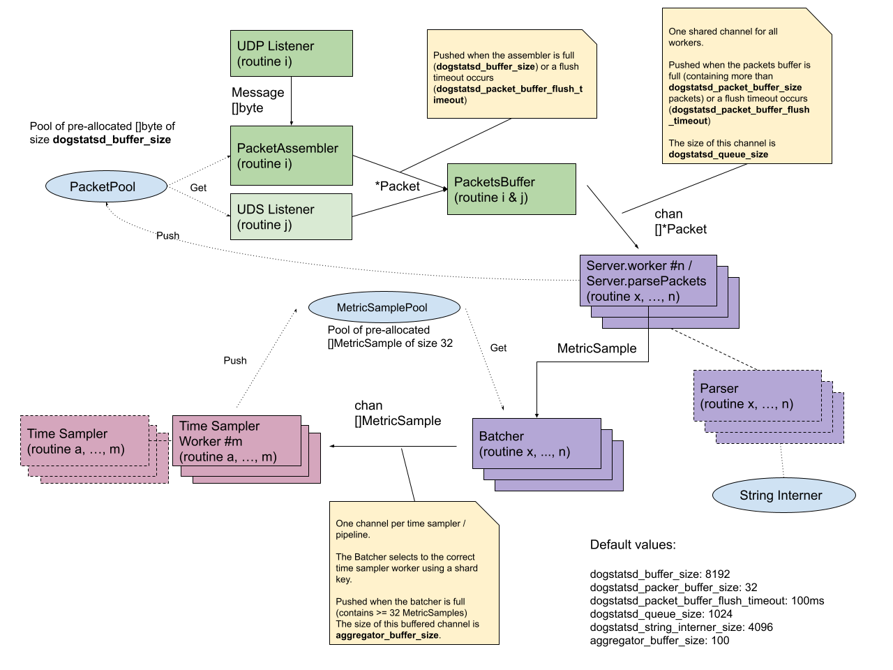

# DogStatsD internals

<figure markdown>
  { loading=lazy role="img" }

<figcaption markdown>(click to enlarge)</figcaption>
</figure>

Information on DogStatsD, configuration and troubleshooting is available in the [Datadog documentation](https://docs.datadoghq.com/developers/dogstatsd/).

## Packet

In DogStatsD, a Packet is a bytes array containing one or multiple metrics in the DogStatsD format (separated by a `\n` when there are several). Its maximum size is `dogstatsd_buffer_size`.

## PacketAssembler

- Input: a datagram from a UDP socket
- Output: a Packet containing multiple metrics packed together, separated by a `\n`

The PacketAssembler gathers multiple datagrams into one Packet of maximum size, `dogstatsd_buffer_size`, and sends it to the PacketsBuffer which avoids running the whole parsing pipeline with only one metric per packet. The bytes buffer used comes from the PacketPool, which avoids re-allocating the bytes buffer every time.

!!! note
    The UDS pipeline does not use the PacketAssembler because each UDS packet also contains metadata (origin tags) which are used to enrich the metrics tags, making them impossible to be packed together by the PacketAssembler.

The PacketAssembler does not allocate a bytes array every time it has to use one. It retrieves one from a pool containing pre-allocated arrays and this pool never empties. The PacketAssembler allocates a new bytes array when it’s needed. Once fully assembled by the PacketAssembler, the bytes array is sent through the rest of the DogStatsD pipeline and ownership is allocated to each part using it (PacketsBuffer, Worker). Eventually, the Worker takes care of returning it to the pool when the part has processed its content.

## PacketBuffer

- Input: a Packet containing one or several metrics in the DogStatsD format (separated by a `\n`)
- Output: multiple Packets send in a row to the Worker

The PacketsBuffer buffers multiple Packets (in a slice), this way the parsing part of the pipeline is going through several Packets in a row instead of only one each time it is called. This leads to less CPU usage. PacketsBuffer sends the Packets for processing when either:

a. The buffer is full (contains `dogstatsd_packet_buffer_size, default value: 32`)

or

b. A timer is triggered (i.e. `dogstatsd_packer_buffer_flush_timeout, default value: 100ms`)

The PacketBuffer sends it in a Go buffered channel to the worker / parser, meaning that the channels can buffer the Packets on their own while waiting for the worker to read and process them.

In theory, the max memory usage of this Go buffered channel is:

* packet buffer size * packet size * channel buffer size
* `dogstatsd_packer_buffer_size` * `dogstatsd_buffer_size` * `dogstatsd_queue_size`
* 32 * 8192 * 1024 =  256MB

## Worker

- Input: slice of Packets
- Output: MetricSample sent

The Worker is the part of the DogStatsD server responsible for parsing the metrics in the bytes array and turning them into MetricSamples.

The server spawns multiple workers based on the amount of cores available on the host:

* When the server is not running multiple time sampling pipelines: the server creates `(number of cores - 2)` workers. If this result is less than 2, the server spawns 2 workers.
* When the server is running multiple time sampling pipelines: the server creates `(number of cores / 2)` workers.  If this result is less than 2, the server spawns 2 workers.

The Worker is using a system called StringInterner to not allocate memory every time a string is needed. Note that this StringInterner is caching a finite number of strings and when it is full it is emptied to start caching strings again. Its size is configurable with `dogstatsd_string_interner_size`.

The MetricSamples created are not directly sent to the Agent Demultiplexer but first to a part called the Batcher.

## Batcher

- Input: MetricSample from the Worker
- Output: slices of MetricSample sent to the Agent Demultiplexer (which is distributing them to the TimeSamplerWorkers)

The role of the Batcher is to accumulate multiple MetricSamples before sending them to the Agent Demultiplexer. Every time it accumulates 32 MetricSamples, the Batcher sends them to the Demultiplexer. The Batcher sends 32 MetricSamples in a channel buffering 100 sets. There is one channel per TimeSampler.

The size of a MetricSample depends on the size of the host's hostname, its metric name, and its number of tags. An example MetricSample with a 20 character hostname, 40 character metric name, and 200 characters of tags has a size of approximately 264 bytes. A Batcher can use a maximum of 844kb of memory.

## TimeSamplerWorker

- Input: slice of MetricSamples

The TimeSamplerWorker runs in an infinite loop. It is responsible for the following:

* Process slices of MetricSamples sent by the Batcher (through the AgentDemultiplexer). A TimeSampler embedded in the TimeSamplerWorker actually does the sampling.
* Flush on a signal.
* Stop on a signal.

The following calculations determine the number of TimeSamplerWorker and TimeSampler instances:

* If `dogstatsd_pipeline_autoadjust` is `true` then the workers count will be automatically adjusted.
* If `dogstatsd_pipeline_count` has a value, the number of TimeSampler pipelines equals that value.
* If neither condition above is true, one TimeSampler pipeline runs.

`dogstatsd_pipeline_autoadjust_strategy` can be set to the following values:

* `max_throughput`: The number of TimeSampler pipelines is adjusted to maximize throughput. There are `(number of core/2) - 1` instances of TimeSampler.
* `per_origin`: The number of TimeSampler pipelines is adjusted to improve data locality. The number of dsdWorker instances is equal to half the number of cores.
        and the number of TimeSampler pipelines is equal `dogstatsd_pipeline_count` or twice the number of cores. This strategy will provide a better compression
        ratio in shared environments and improve resource allocation fairness within the agent.

## NoAggregationStreamWorker

- Input: slice of MetricSamples

The NoAggregationStreamWorker runs an infinite loop in a goroutine. It receives metric samples with timestamps, and it batches them to be sent as quickly as possible to the intake. It performs no aggregation nor extra processing, except from adding tags to the metrics.

It runs only when `dogstatsd_no_aggregation_pipeline` is set to `true`.

The payload being sent to the intake (through the normal `Serializer`/`Forwarder` pieces) contains, at maximum, `dogstatsd_no_aggregation_pipeline_batch_size` metrics. This value defaults to `2048`.
