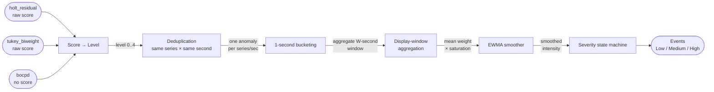
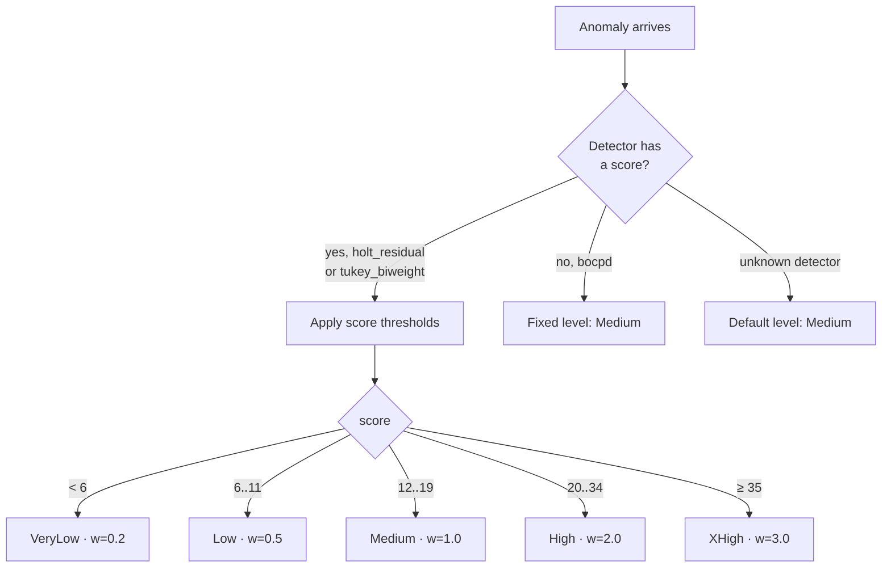
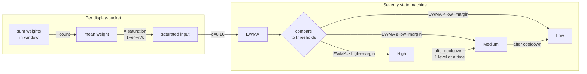
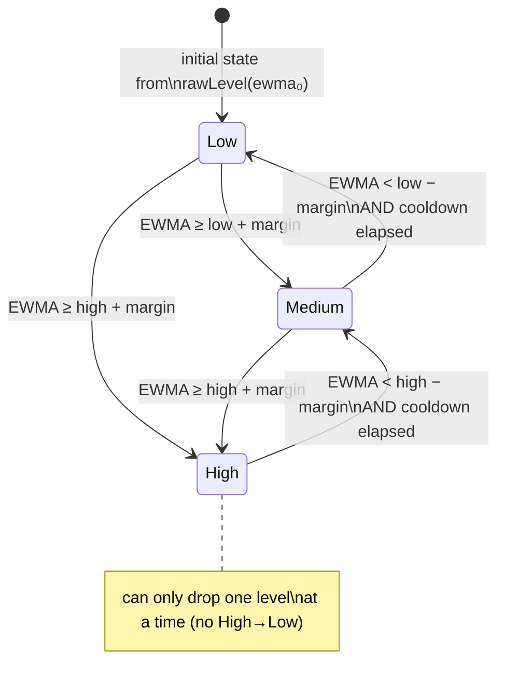

# Anomaly Scoring & Severity Pipeline

This document describes the post-detector scoring pipeline that aggregates
raw anomaly events from multiple detectors into a single smoothed intensity
signal and derives discrete severity state transitions from it.

---

## Part 1 — Overview (visual)

### 1.1 High-level data flow



### 1.2 Scoring: raw score → unified level



### 1.3 From buckets to severity events



### 1.4 Severity state machine — transition rules



---

## Part 2 — Full algorithm specification

### 2.1 Step 0 — Deduplication

When multiple detectors fire on the **same series** at the **same Unix second**,
only the highest-level anomaly is kept.  This prevents one physical incident
from inflating the EWMA count.

```
key = floor(anomaly.timestamp) + ":" + anomaly.sourceSeriesId
For each key, keep the anomaly with the highest level.
Anomalies with no sourceSeriesId are never merged.
```

---

### 2.2 Step 1 — Level assignment

Each anomaly is mapped to an integer level **L ∈ {0, 1, 2, 3, 4}** and a
corresponding weight **w**.

| Level | Name     | Weight w |
|-------|----------|----------|
| 0     | VeryLow  | 0.2      |
| 1     | Low      | 0.5      |
| 2     | Medium   | 1.0      |
| 3     | High     | 2.0      |
| 4     | XHigh    | 3.0      |

**Scored detectors** (`holt_residual`, `tukey_biweight`) — apply threshold table:

| Score range | Level |
|-------------|-------|
| score < 6   | 0 — VeryLow |
| 6 ≤ score < 12  | 1 — Low |
| 12 ≤ score < 20 | 2 — Medium |
| 20 ≤ score < 35 | 3 — High |
| score ≥ 35  | 4 — XHigh |

Thresholds were calibrated from 3 scenarios (dns-upstream-outage,
kafka-partition-saturation, postmark):
- Baseline: mean = 8.3, P95 = 15.8
- Disruption: P50 = 13.1, P95 = 36.8, P99 = 49.4

**Fixed-level detectors:**

| Detector | Level | Reason |
|----------|-------|--------|
| `bocpd`  | 2 — Medium (w = 1.0) | Emits no score; change-point detection is a reliable signal |

**Default (unknown detector):** Level 2 — Medium (w = 1.0)

---

### 2.3 Step 2 — 1-second bucketing

Anomalies are placed into 1-second integer buckets by `floor(timestamp)`.

For each 1-second bucket `s`:

```
bins[s][L]   += 1          for each anomaly at level L
weightSum[s] += w(L)       for each anomaly
count[s]     += 1
```

---

### 2.4 Step 3 — Display-window aggregation

1-second buckets are aggregated into display buckets of width
`W` seconds (default: auto-fit to ~80 bars, or user-selected).

For display bucket `i` spanning `[t_i, t_i + W)`:

```
scoreSum_i = Σ  weightSum[s]   for s in [t_i, t_i+W)
total_i    = Σ  count[s]       for s in [t_i, t_i+W)
bins_i[L]  = Σ  bins[s][L]    for s in [t_i, t_i+W)
```

---

### 2.5 Step 4 — Saturated input

For each display bucket `i`, compute the saturated EWMA input:

```
meanWeight_i = scoreSum_i / total_i        (0 if total_i = 0)

input_i = meanWeight_i × (1 − exp(−total_i / k))
```

The saturation factor `(1 − exp(−n/k))` dampens the mean when `n` is small
(early/sparse buckets) and approaches 1 as `n → ∞`.

**Default constant:** `k = 5`

| n (anomaly count) | saturation factor (k=5) |
|-------------------|------------------------|
| 1  | 0.18 |
| 3  | 0.45 |
| 5  | 0.63 |
| 10 | 0.86 |
| 20 | 0.98 |

---

### 2.6 Step 5 — EWMA

```
ewma[0] = input[0]
ewma[i] = α × input[i] + (1 − α) × ewma[i−1]
```

**Default constant:** `α = 0.16`

Recent inputs are weighted exponentially more than older ones.  Higher `α`
makes the signal react faster to new data; lower `α` smooths over longer
windows.  At α = 0.16, the effective memory half-life is roughly
`−1 / log₂(1 − α) ≈ 4` buckets.

---

### 2.7 Step 6 — Severity state machine

The EWMA stream drives a 3-state machine: **Low (0)**, **Medium (1)**,
**High (2)**.

The **initial state** is computed directly from `ewma[0]` using the raw
thresholds (no hysteresis): `≥ high → High`, `≥ low → Medium`, else `Low`.
In practice `ewma[0] = input[0]` which is near zero, so the machine
always starts at Low.  If a scenario opens mid-incident (EWMA seed already
elevated), the correct state is entered immediately.

#### Thresholds

| Parameter | Default | Description |
|-----------|---------|-------------|
| `low`     | 0.25    | EWMA level that defines the Low/Medium boundary |
| `high`    | 0.50    | EWMA level that defines the Medium/High boundary |
| `margin`  | 0.15    | Hysteresis half-width (avoids chattering at boundaries) |
| `cooldown`| 300 s   | Minimum time to spend in any elevated state before stepping down |

#### Transition logic

From state `cur`, the **target** state for EWMA value `v` is:

```
cur = Low (0):
  v ≥ high + margin  →  High (2)      # direct jump to High allowed on way up
  v ≥ low  + margin  →  Medium (1)
  otherwise          →  Low (0)        # no change

cur = Medium (1):
  v ≥ high + margin  →  High (2)
  v <  low  − margin →  Low (0)
  otherwise          →  Medium (1)     # no change

cur = High (2):
  v <  high − margin →  Medium (1)    # one step down only — never High→Low directly
  otherwise          →  High (2)      # no change
```

#### Cooldown enforcement

A **decrease** transition (target < cur) is **suppressed** if:

```
now − lastStateEntryTimestamp < cooldown
```

`lastStateEntryTimestamp` is updated on **every** transition (increases and
decreases alike), so the cooldown timer resets each time a new state is
entered.  This ensures the cascade `High → Medium → Low` takes at minimum
`2 × cooldown` total time.

`lastStateEntryTimestamp` is initialised to `−∞`, which means the first
decrease from the initial state is **never** blocked — correct when a
scenario opens in an already-elevated state that the pipeline did not
itself cause.

---

### 2.8 Constants summary

| Constant | Default | Notes |
|----------|---------|-------|
| Score thresholds | `[6, 12, 20, 35]` | Calibrated from 3 scenarios |
| `LEVEL_WEIGHTS`  | `[0.2, 0.5, 1.0, 2.0, 3.0]` | Per-level EWMA weight |
| `bocpd` fixed level | 2 (Medium, w=1.0) | No score emitted |
| Saturation k | 5 | Count at which saturation ≈ 63 % |
| EWMA α | 0.16 | Smoothing factor |
| Low threshold | 0.25 | EWMA units |
| High threshold | 0.50 | EWMA units |
| Hysteresis margin | 0.15 | EWMA units |
| Cooldown | 300 s (5 min) | Minimum dwell time per elevated state |
