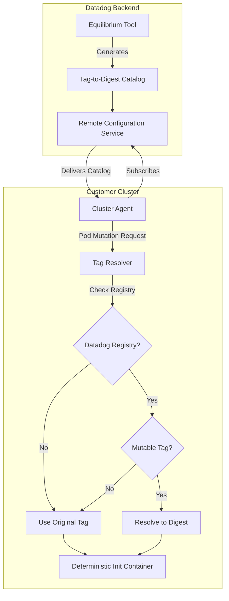

# Deterministic Auto-instrumentation via Remote Configuration

## Overview

This design implements deterministic behavior for APM auto-instrumentation by resolving mutable container image tags to immutable digests via Remote Configuration. This addresses the time-sensitive, non-deterministic behavior where the same pod specification could result in different library versions being injected depending on deployment time.

## Problem Statement

### Current Behavior (Non-deterministic)
```yaml
# User specifies mutable tag
metadata:
  annotations:
    admission.datadoghq.com/java-lib.version: "latest"

# Results in time-dependent behavior
# Monday: gcr.io/datadoghq/dd-lib-java-init:latest → v1.29.0
# Friday: gcr.io/datadoghq/dd-lib-java-init:latest → v1.30.0 (after new release)
```

### Root Causes
1. **Mutable Tags**: Tags like `latest`, `v1`, `v1.2` can point to different images over time
2. **Default Fallback**: System defaults to `"latest"` when no version specified (`language_versions.go:145`)
3. **Direct Tag Usage**: Images constructed directly with tags (`language_versions.go:40`)

## Solution Architecture

### High-Level Flow



### Core Principles

1. **Selective Resolution**: Only resolve mutable tags in Datadog registries
2. **Zero Configuration**: No user configuration required
3. **Backward Compatibility**: Existing behavior preserved for non-Datadog images
4. **Transparent Operation**: Resolution happens automatically via RC

## Technical Design

### 1. Remote Configuration Integration

#### A. New RC Product
```go
// pkg/remoteconfig/state/products.go
const ProductAutoInstrumentationCatalog = "AUTO_INSTRUMENTATION_CATALOG"
```

#### B. Catalog Data Structure
```go
type AutoInstrumentationCatalog struct {
    Version string                 `json:"version"`
    Images  []InstrumentationImage `json:"images"`
}

type InstrumentationImage struct {
    Repository       string `json:"repository"`        // gcr.io/datadoghq/dd-lib-java-init
    Tag              string `json:"tag"`               // latest, v1, v1.2
    Digest           string `json:"digest"`            // sha256:abc123...
    CanonicalVersion string `json:"canonical_version"` // v1.29.0
    Language         string `json:"language"`          // java, python, etc.
}
```

### 2. Tag Resolution Logic

#### A. Resolution Conditions
Resolution only applies when **BOTH** conditions are met:

1. **Datadog Registry**: Image from Datadog-controlled registries
   - `gcr.io/datadoghq/*`
   - `datadog/*`
   - `public.ecr.aws/datadog/*`

2. **Mutable Tag**: Tag matches mutable patterns
   - `latest`
   - `v1`, `v2`, etc. (major versions)
   - `v1.2`, `v2.1`, etc. (minor versions)
   - `main`, `master`
   - `dev`, `development`

#### B. Resolution Examples

| Input Image | Registry Check | Tag Check | Resolution |
|------------|----------------|-----------|------------|
| `gcr.io/datadoghq/dd-lib-java-init:latest` | ✅ Datadog | ✅ Mutable | **Resolved to digest** |
| `gcr.io/datadoghq/dd-lib-python-init:v2` | ✅ Datadog | ✅ Mutable | **Resolved to digest** |
| `gcr.io/datadoghq/dd-lib-java-init:v1.29.0` | ✅ Datadog | ❌ Specific | **No change** |
| `myregistry/custom-tracer:latest` | ❌ Non-Datadog | ✅ Mutable | **No change** |
| `docker.io/openjdk:11` | ❌ Non-Datadog | ❌ Specific | **No change** |

### 3. Implementation Components

#### A. TagResolver Component
- **Purpose**: Core resolution logic and RC integration
- **Location**: `pkg/clusteragent/admission/mutate/autoinstrumentation/tag_resolver.go`
- **Responsibilities**:
  - Subscribe to RC catalog updates
  - Maintain tag-to-digest mappings
  - Apply selective resolution logic
  - Handle fallback scenarios

#### B. Integration Points
1. **`language_versions.go`**: Add resolver parameter to image construction
2. **`namespace_mutator.go`**: Pass resolver to library extraction
3. **`target_mutator.go`**: Pass resolver to library extraction
4. **`injector.go`**: Apply resolution to injector images
5. **`auto_instrumentation.go`**: Initialize resolver with RC client

### 4. Remote Configuration Flow

#### A. Catalog Generation (Backend)
```bash
# Daily CI/CD process
equilibrium catalog \
  --format json \
  --output catalog.json \
  gcr.io/datadoghq/dd-lib-java-init \
  gcr.io/datadoghq/dd-lib-python-init \
  # ... other instrumentation images

# Transform to RC format and push
datadog-rc-cli push \
  --product AUTO_INSTRUMENTATION_CATALOG \
  --file transformed-catalog.json
```

#### B. Catalog Consumption (Cluster Agent)
1. **Subscription**: Agent subscribes to `AUTO_INSTRUMENTATION_CATALOG` product
2. **Updates**: RC delivers catalog updates automatically
3. **Processing**: TagResolver rebuilds internal mappings
4. **Application**: New pods get deterministic image references

## Implementation Plan

### Phase 1: Core Infrastructure
1. Add RC product constant
2. Implement TagResolver with basic resolution logic
3. Add catalog data structures and parsing

### Phase 2: Integration
4. Update image construction functions
5. Integrate resolver into mutators
6. Add RC subscription handling

### Phase 3: Testing & Validation
7. Unit tests for resolution logic
8. Integration tests with mock RC data
9. E2E testing with actual catalogs

## Behavioral Changes

### Before Implementation
```yaml
# Pod with annotation
metadata:
  annotations:
    admission.datadoghq.com/java-lib.version: "latest"

# Generated init container (time-dependent)
spec:
  initContainers:
  - name: datadog-init-java
    image: gcr.io/datadoghq/dd-lib-java-init:latest  # ⚠️ Non-deterministic
```

### After Implementation
```yaml
# Same pod annotation
metadata:
  annotations:
    admission.datadoghq.com/java-lib.version: "latest"

# Generated init container (deterministic)
spec:
  initContainers:
  - name: datadog-init-java
    image: gcr.io/datadoghq/dd-lib-java-init@sha256:abc123...  # ✅ Deterministic
```

### Logging Examples
```
INFO: Resolved mutable tag gcr.io/datadoghq/dd-lib-java-init:latest -> gcr.io/datadoghq/dd-lib-java-init@sha256:abc123... (canonical: v1.29.0)

WARN: No digest mapping found for mutable tag gcr.io/datadoghq/dd-lib-python-init:v4, using original (non-deterministic)

DEBUG: Skipping resolution for specific version gcr.io/datadoghq/dd-lib-java-init:v1.29.0

DEBUG: Skipping resolution for non-Datadog registry myregistry/tracer:latest
```

## Metrics & Observability

### Proposed Metrics
1. `autoinstrumentation.tag_resolution.attempts_total{registry, language, tag, resolved}`
2. `autoinstrumentation.tag_resolution.catalog_updates_total{status}`
3. `autoinstrumentation.tag_resolution.fallbacks_total{reason}`

### Telemetry Tags
- `registry`: Registry hostname (gcr.io, public.ecr.aws, etc.)
- `language`: Programming language (java, python, etc.)
- `tag`: Original tag (latest, v1, etc.)
- `resolved`: Whether resolution occurred (true/false)
- `reason`: Fallback reason (no_mapping, parse_error, etc.)

## Configuration

### No User Configuration Required
This feature requires **zero configuration** from users. It operates transparently via Remote Configuration.

### Internal Configuration (Development/Testing)
For development and testing purposes, internal configuration options may be added:
```yaml
# Internal development config only
admission_controller:
  auto_instrumentation:
    tag_resolution:
      _debug_enabled: true
      _fallback_behavior: "warn"  # error, warn, silent
```

## Rollout Strategy

### Phase 1: Shadow Mode
- Deploy with resolution logic but without applying changes
- Collect metrics on what would be resolved
- Validate catalog delivery and parsing

### Phase 2: Gradual Rollout
- Enable for specific languages (start with Java)
- Monitor resolution success rates
- Expand to additional languages

### Phase 3: Full Deployment
- Enable for all instrumentation images
- Monitor deterministic behavior
- Document operational procedures

## Rollback Plan

### Immediate Rollback
- Remote Configuration allows instant catalog withdrawal
- Feature can be disabled via RC without code deployment
- Falls back to original non-deterministic behavior

### Code Rollback
- All changes are additive and backward compatible
- Can be rolled back via standard deployment process
- Original behavior preserved when resolver is nil

## Security Considerations

1. **Image Integrity**: Digest references ensure exact image content
2. **Supply Chain**: Centralized catalog reduces risk of tag confusion
3. **Audit Trail**: All resolutions logged for security analysis
4. **RC Security**: Leverages existing RC security model

## Testing Strategy

### Unit Tests
- Tag pattern matching logic
- Registry detection logic
- Catalog parsing and mapping
- Fallback behavior scenarios

### Integration Tests
- RC subscription and update handling
- End-to-end image resolution
- Multiple language scenarios
- Error condition handling

### E2E Tests
- Full webhook flow with resolved images
- Pod creation with deterministic containers
- Catalog update propagation
- Rollback scenarios

## Future Enhancements

### Potential Extensions
1. **Custom Registry Support**: Extend to customer-controlled registries
2. **Policy Controls**: Allow customers to configure resolution behavior
3. **Caching**: Local caching of resolved mappings
4. **Metrics Dashboard**: Dedicated observability for tag resolution

### Compatibility
This design maintains full backward compatibility and provides a foundation for future enhancements without breaking changes.
