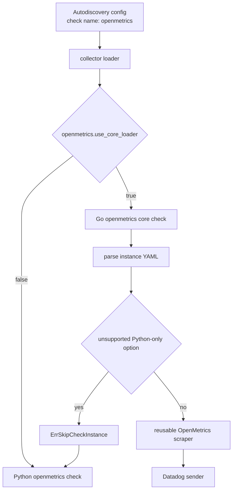
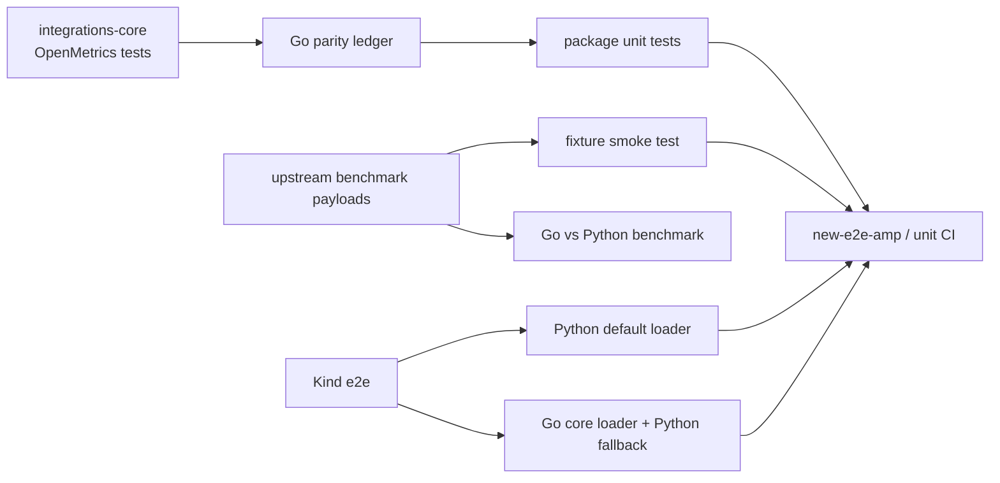

# OpenMetrics Core Check

This package contains the Go implementation of the generic `openmetrics` check.
The migration is Agent-gated by `openmetrics.use_core_loader`, which defaults to
`false`.

## Loader Path



The Agent-level flag is intentionally separate from OpenMetrics instance
configuration. Users do not need to edit pod annotations or other AD templates
to participate in the migration.

## Reusable Scraper

Core checks that expose a Prometheus or OpenMetrics endpoint can reuse the
generic scraper instead of reimplementing config parsing, HTTP, label handling,
metric transformers, and metadata submission.

```go
scraper, err := openmetrics.NewScraperFromYAML(instanceYAML, string(c.ID()))
if err != nil {
    if openmetrics.IsUnsupportedConfig(err) {
        return fmt.Errorf("%w: %v", check.ErrSkipCheckInstance, err)
    }
    return err
}

return scraper.Scrape(sender)
```

`NewScraperFromYAML` accepts the same instance YAML as the generic
`openmetrics` integration. The public wrapper deliberately keeps the
configuration surface data-driven, so future core checks share the same parity
suite and behavior.

## Validation Map



The parity ledger only tracks tests applicable to the generic check behavior.
Python-only constructor, subclass, decorator, and method-mutation seams are
excluded from that ledger rather than counted as skips.
