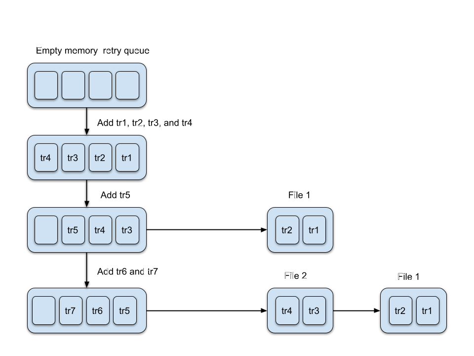
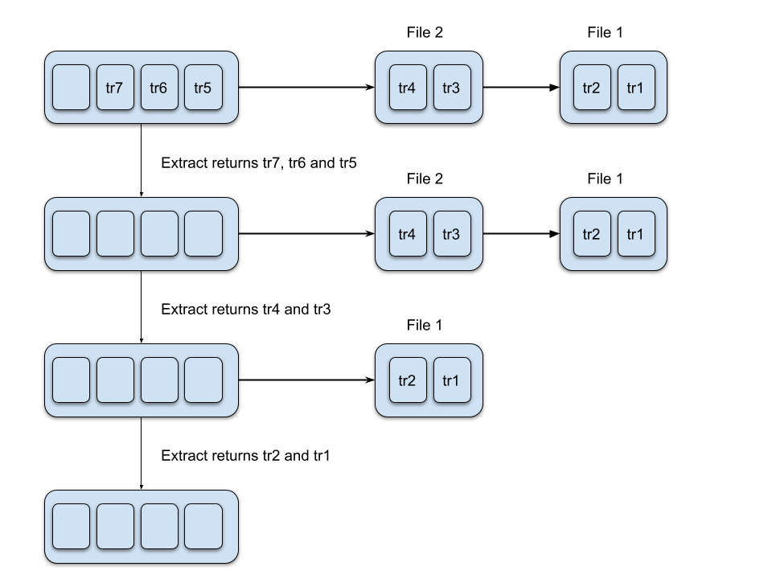

## `retry` package 
### Introduction

If the network becomes unavailable, the Agent stores the metrics in memory.
The maximum memory usage for storing the metrics is defined by the `forwarder_retry_queue_payloads_max_size` configuration setting. When this limit is reached and Agent's on-disk transaction storage is not enabled (see below), the metrics are dropped.

The Agent can also store the metrics that have not yet been sent on disk when the memory limit is reached.
Enable this capability by setting `forwarder_storage_max_size_in_bytes` to a positive value indicating the maximum amount of storage space, in bytes, that the Agent can use to store the metrics on disk.

On-disk metrics are stored in the folder defined by the `forwarder_storage_path` setting, which is by default `/opt/datadog-agent/run/transactions_to_retry` on Unix systems and `C:\ProgramData\Datadog\run\transactions_to_retry` on Windows.

To avoid running out of storage space, by default the Agent stores the metrics on disk only if the target disk has not reached 95% capacity. This limit can be adjusted via `forwarder_storage_max_disk_ratio` setting.

### How does it work?

When the retry queue in memory is full and a new transaction need to be added, some transactions from the retry queue are removed and serialized into a new file on disk. The amount of transaction data serialized at a time from the Agent is controlled by the option `forwarder_flush_to_disk_mem_ratio`.

When the forwarder attempts to retry previously failed transactions, it first retries the HTTP transactions stored in memory. Once the in-memory retry queue is empty, the forwarder then retries the transactions stored in the newest on-disk transaction file and removes it.

### Adding transactions to the retry queue

Consider the following example where the in-memory retry queue can store up to 4 transactions.

At the beginning, the retry queue in memory is empty. When the transactions `tr1`, `tr2`, `tr3` and `tr4` fail, they are added sequentially to the retry queue which then becomes full. When trying to add `tr5`, the oldest transactions are removed from the retry queue in memory and serialized into the file `File 1`. The number of transactions to serialize to disk is defined as a percent of the size of the retry queue. In this example, when the retry queue is full, 50% of the transactions (in terms of payload size) are serialized on disk. 
When adding the transactions `tr6` and `tr7`, the retry queue becomes full again and the `tr4` and `tr3` are serialized to the on-disk transaction file `File 2`.

##### Removing transactions from the retry queue

Once the Agent is able to send data again, initially `tr7`, `tr6` and `tr5` are returned since they are the ones residing in the in-memory queue.
When those transactions are sent, `File 2` content is read and removed, sending the transactions `tr4` and `tr3`.
Finally, `File 1` is read and removed, sending the `tr2` and `tr1` to the intake.

#### Implementations notes

* There is a single retry queue for all the endpoints.
* The files are read and written as a whole which is efficient as few reads and writes on disk are performed.
* At agent startup, previous files are reloaded. Unknown domains and old files are removed.
* Protobuf is used to serialize on disk. See [Retry file dump](https://github.com/DataDog/datadog-agent/blob/main/tools/retry_file_dump/README.md) to dump the content of a `.retry` file.
