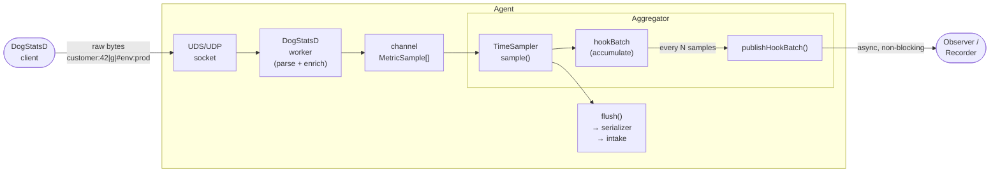
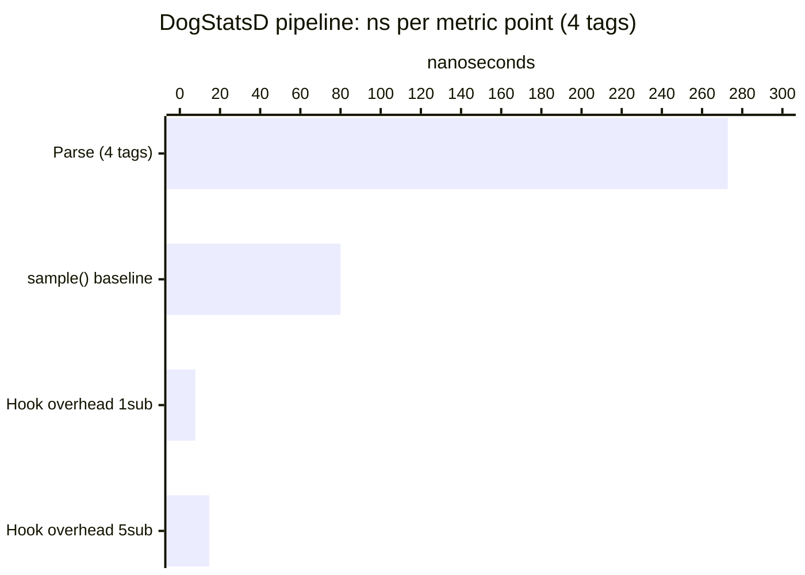

# pkg/hook — Pipeline Observation with Minimal Overhead

## The problem

As new platform features emerge — anomaly detection, real-time analysis, the Observer
pipeline — there is a recurring need to tap into the Agent's data pipelines and observe
the metrics and logs flowing through them. The naive solution is to inject a consumer
directly into the pipeline, but this creates tight coupling, forces every binary to carry
the consumer even when disabled, and limits observation to a single consumer at a time.

`pkg/hook` solves this with a generic, type-safe publish/subscribe mechanism. Pipelines
publish data at well-defined tap points; observers subscribe independently. The key
requirement: the overhead on the hot path must be negligible.

This document measures exactly that.

---

## The DogStatsD metrics pipeline

A DogStatsD metric travels through several stages before being aggregated:



**Stage breakdown for a single metric point:**

| Stage | What happens |
|---|---|
| **Socket receive** | OS reads bytes from UDS/UDP socket |
| **Parse & enrich** | Text protocol → `MetricSample` struct; tag resolution, origin detection |
| **Channel send** | Batch of `MetricSample` sent to aggregator worker channel |
| **`sample()`** | Context key computation (murmur3), bucket assignment, `hookBatch` append |
| **`publishHookBatch()`** | Non-blocking fan-out to subscriber channels (once per batch) |
| **Flush** | Periodic (10 s): serialize aggregated metrics → Datadog intake |

The tap point (`hookBatch` append + `publishHookBatch`) sits inside the aggregator, after
context resolution. `publishHookBatch` is called **once per worker batch** (typically
32 samples), so the publish cost is amortized across all samples in the batch.

---

## The hook system

`pkg/hook` exposes a single generic interface:

```go
type Hook[T any] interface {
    Publish(producerName string, payload T)
    Subscribe(consumerName string, callback func(T), opts ...Option[T]) (unsubscribe func())
    HasSubscribers() bool
}
```

### Key design properties

**Zero overhead when idle.** `Publish` reads an atomic counter first. If zero, it
returns immediately — no lock, no allocation, no channel operation. This is the common
case in production when no observer is active.

**Never blocks the pipeline.** Each subscriber has a private buffered channel. If a
subscriber falls behind, its channel fills up and payloads are dropped for that subscriber
only. The pipeline and other subscribers are unaffected.

**Accumulator pattern.** Rather than publishing one sample at a time, `TimeSampler` keeps
a reusable `hookBatch []MetricSampleSnapshot` slice. Each call to `sample()` appends
one snapshot (zero allocation — the slice grows to batch capacity on the first burst and
stays). After the worker finishes the full pooled sample batch, it calls
`publishHookBatch()` once, amortizing the publish cost across all samples.

```
┌─ TimeSampler ─────────────────────────────────────────────────────────┐
│                                                                        │
│  for each MetricSample in batch:                                       │
│    contextKey = resolver.trackContext(sample)  ← main work            │
│    hookBatch  = append(hookBatch, snapshot{..., ContextKey})  ← free  │
│                                                                        │
│  publishHookBatch()  ← once per batch                                  │
│    if !hook.HasSubscribers() { return }  ← atomic read, fast-path     │
│    hook.Publish("dogstatsd", hookBatch)                                │
│      for each subscriber:                                              │
│        select { case ch <- payload: default: drop }  ← non-blocking   │
│                                                                        │
└────────────────────────────────────────────────────────────────────────┘
```

---

## Benchmark methodology

We measure each stage independently using `testing.B` with `b.ReportAllocs()`, running
on the same machine (arm64 Linux, 10 cores) to eliminate cross-machine variability.

**Parser cost** (`BenchmarkParseMetric` — `comp/dogstatsd/server/convert_bench_test.go`):
measures the cost of converting one raw DogStatsD message (`"metric:42|g|#tag:v"`) into
a fully-enriched `MetricSample`, varying the tag count.

**Sampler cost** (`BenchmarkTimeSamplerHook` — `pkg/aggregator/time_sampler_bench_test.go`):
two sub-benchmarks per hook mode:
- `sample_only` — one `sample()` call; isolates context resolution + hookBatch append
- `batch32_publish` — 32× `sample()` + `publishHookBatch()`; amortized publish cost

Hook modes compared:
| Mode | Description |
|---|---|
| `noop_hook` | `NewNoopHook()` — absolute baseline, no machinery |
| `0sub` | Real hook, zero subscribers — atomic fast-path |
| `1sub` | Real hook, one no-op subscriber |
| `5sub` | Real hook, five no-op subscribers |

Subscriber channels are sized to `b.N × batchSize + 1` so sends never block during the
benchmark — we measure delivery cost, not congestion.

---

## Results

### Per-stage latency (4 tags — typical production metric, arm64)



| Stage | Latency (ns) | % of parse+sample total |
|---|---|---|
| Parse & enrich (4 tags) | 272.8 | 77% |
| `sample()` — context resolution + bucket | 80.0 | 23% |
| **Total CPU path (no hook)** | **352.8** | **100%** |
| Hook overhead — 0 subscribers | 0.2 | 0.06% |
| Hook overhead — 1 subscriber | 7.7 | 2.1% |
| Hook overhead — 5 subscribers | 14.6 | 4.0% |

### Overhead scales with tag count

Parsing dominates for high-cardinality metrics. As tag count grows, the hook's relative
share shrinks further:

| Tag count | Parse (ns) | sample() (ns) | Total (ns) | Hook 1sub % | Hook 5sub % |
|---|---|---|---|---|---|
| 1 tag | 195 | 80 | 275 | 2.8% | 5.0% |
| 4 tags | 273 | 80 | 353 | 2.1% | 4.0% |
| 16 tags | 616 | 80 | 696 | 1.1% | 2.1% |
| 64 tags | 2020 | 80 | 2100 | 0.4% | 0.7% |

### Zero allocations on the hot path

```
BenchmarkTimeSamplerHook/sample_only/noop_hook   79.76 ns/op   0 B/op   0 allocs/op
BenchmarkTimeSamplerHook/sample_only/0sub        81.63 ns/op   0 B/op   0 allocs/op
BenchmarkTimeSamplerHook/sample_only/1sub        78.89 ns/op   0 B/op   0 allocs/op
BenchmarkTimeSamplerHook/sample_only/5sub        81.09 ns/op   0 B/op   0 allocs/op

BenchmarkTimeSamplerHook/batch32_publish/noop_hook   2559 ns/op   0 B/op   0 allocs/op
BenchmarkTimeSamplerHook/batch32_publish/0sub        2565 ns/op   0 B/op   0 allocs/op
BenchmarkTimeSamplerHook/batch32_publish/1sub        2805 ns/op   0 B/op   0 allocs/op
BenchmarkTimeSamplerHook/batch32_publish/5sub        3025 ns/op   0 B/op   0 allocs/op
```

**0 allocs/op across all modes.** The GC never sees an allocation on the metric hot path,
regardless of whether subscribers are active. The `hookBatch` slice grows to capacity on
the first burst and is reused; subscribers receive a reference to the same slice (no copy
unless `WithRecycle` is used for pool-based delivery).

---

## Takeaways

1. **Idle overhead is immeasurable.** With 0 subscribers, `publishHookBatch` returns after
   a single atomic read. The measured delta vs noop is 0.2 ns — within benchmark noise.

2. **Active overhead is bounded and linear.** Each additional subscriber adds one
   non-blocking channel send per batch: ~2.3 ns per subscriber per batch, or ~0.07 ns
   per sample per subscriber at a batch size of 32.

3. **No allocations.** The accumulator pattern (pre-allocated slice, reset to `[:0]` after
   publish) eliminates all GC pressure on the delivery path.

4. **Overhead is dominated by parsing, not by the hook.** Even with 5 subscribers, the
   hook represents 4% of the CPU path for a typical 4-tag metric — and under 1% for
   metrics with 16+ tags, where parsing dominates.

The hook system adds a passive observation layer to the Agent's most critical hot path
with latency overhead that is both bounded and negligible in practice.
