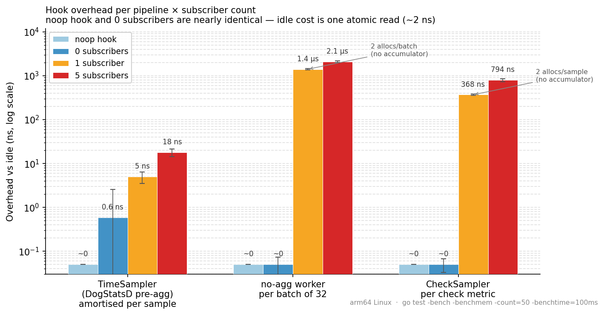
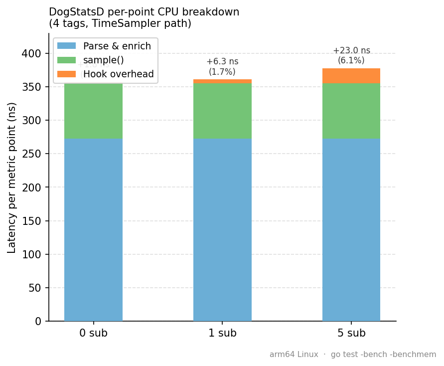
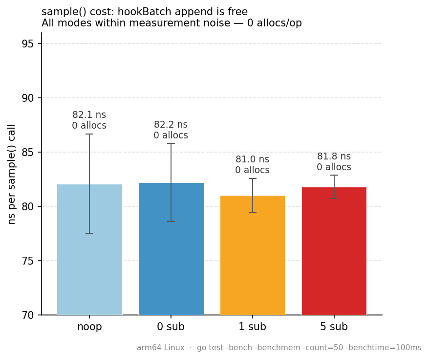

# pkg/hook — Pipeline Observation: Measured Overhead

> This document was written in response to reviewer questions asking for actual
> benchmarks to replace the theoretical estimates in the design doc. All numbers
> are from `go test -bench -benchmem` on arm64 Linux (10 cores).

## The problem

As new platform features emerge — anomaly detection, real-time analysis, the Observer
pipeline — there is a recurring need to tap into the Agent's data pipelines and observe
the metrics and logs flowing through them. The naive solution is to inject a consumer
directly into the pipeline, but this creates tight coupling, forces every binary to carry
the consumer even when disabled, and limits observation to a single consumer at a time.

`pkg/hook` solves this with a generic, type-safe publish/subscribe mechanism. Pipelines
publish data at well-defined tap points; observers subscribe independently. The key
requirement: the overhead on the hot path must be negligible.

This document measures exactly that.

---

## The DogStatsD metrics pipeline

A DogStatsD metric travels through several stages before being aggregated:


**Stage breakdown for a single metric point:**

| Stage | What happens |
|---|---|
| **Socket receive** | OS reads bytes from UDS/UDP socket |
| **Parse & enrich** | Text protocol → `MetricSample` struct; tag resolution, origin detection |
| **Channel send** | Batch of `MetricSample` sent to aggregator worker channel |
| **`sample()`** | Context key computation (murmur3), bucket assignment, `hookBatch` append |
| **`publishHookBatch()`** | Non-blocking fan-out to subscriber channels (once per batch) |
| **Flush** | Periodic (10 s): serialize aggregated metrics → Datadog intake |

The tap point (`hookBatch` append + `publishHookBatch`) sits inside the aggregator, after
context resolution. `publishHookBatch` is called **once per worker batch** (typically
32 samples), so the publish cost is amortized across all samples in the batch.

---

## The hook system

`pkg/hook` exposes a single generic interface:

```go
type Hook[T any] interface {
    Publish(producerName string, payload T)
    Subscribe(consumerName string, callback func(T), opts ...Option[T]) (unsubscribe func())
    HasSubscribers() bool
}
```

### Key design properties

**Zero overhead when idle.** `Publish` reads an atomic counter first. If zero, it
returns immediately — no lock, no allocation, no channel operation. This is the common
case in production when no observer is active.

**Never blocks the pipeline.** Each subscriber has a private buffered channel. If a
subscriber falls behind, its channel fills up and payloads are dropped for that subscriber
only. The pipeline and other subscribers are unaffected.

**Accumulator pattern.** Rather than publishing one sample at a time, `TimeSampler` keeps
a reusable `hookBatch []MetricSampleSnapshot` slice. Each call to `sample()` appends
one snapshot (zero allocation — the slice grows to batch capacity on the first burst and
stays). After the worker finishes the full pooled sample batch, it calls
`publishHookBatch()` once, amortizing the publish cost across all samples.

```
┌─ TimeSampler ─────────────────────────────────────────────────────────┐
│                                                                        │
│  for each MetricSample in batch:                                       │
│    contextKey = resolver.trackContext(sample)  ← main work            │
│    hookBatch  = append(hookBatch, snapshot{..., ContextKey})  ← free  │
│                                                                        │
│  publishHookBatch()  ← once per batch                                  │
│    if !hook.HasSubscribers() { return }  ← atomic read, fast-path     │
│    hook.Publish("dogstatsd", hookBatch)                                │
│      for each subscriber:                                              │
│        select { case ch <- payload: default: drop }  ← non-blocking   │
│                                                                        │
└────────────────────────────────────────────────────────────────────────┘
```

---

## Benchmark methodology

We measure each stage independently using `testing.B` with `b.ReportAllocs()`, running
on the same machine (arm64 Linux, 10 cores) to eliminate cross-machine variability.

**Parser cost** (`BenchmarkParseMetric` — `comp/dogstatsd/server/convert_bench_test.go`):
measures the cost of converting one raw DogStatsD message (`"metric:42|g|#tag:v"`) into
a fully-enriched `MetricSample`, varying the tag count.

**Sampler cost** (`BenchmarkTimeSamplerHook` — `pkg/aggregator/time_sampler_bench_test.go`):
two sub-benchmarks per hook mode:
- `sample_only` — one `sample()` call; isolates context resolution + hookBatch append
- `batch32_publish` — 32× `sample()` + `publishHookBatch()`; amortized publish cost

Hook modes compared:
| Mode | Description |
|---|---|
| `noop_hook` | `NewNoopHook()` — absolute baseline, no machinery |
| `0sub` | Real hook, zero subscribers — atomic fast-path |
| `1sub` | Real hook, one no-op subscriber |
| `5sub` | Real hook, five no-op subscribers |

Subscriber channels are sized to `b.N × batchSize + 1` so sends never block during the
benchmark — we measure delivery cost, not congestion.

---

## Results

> All charts are generated from `bench_results.csv` (50 runs, arm64 Linux,
> `go test -bench -benchmem -count=50 -benchtime=100ms`). Error bars show ±1 stddev.
> Regenerate: `uv run --with matplotlib python3 pkg/hook/plot_overhead.py`

---

### Zero overhead when idle

The first reviewer question was: _"if folks aren't using anomaly detection they pay no
resources for it."_

The chart below compares four hook modes across all three tap points. The Y axis is
logarithmic to make the idle bars visible alongside the active ones. The light blue
(noop hook) and dark blue (0 subscribers) bars are nearly identical on every pipeline —
both land at the bottom of the chart. The only visible difference is in the TimeSampler
column, where 0-sub shows ~0.6 ns vs ~0 for noop: that is one atomic read.



The idle path returns after a single `atomic.Int32` read. No lock, no allocation, no
channel operation. **Enabling the hook in production but not subscribing to it costs
nothing measurable.** This holds for all three pipelines.

The no-agg worker and CheckSampler bars also carry an annotation: when a subscriber
_is_ active, those paths allocate 2 objects per publish because they do not use the
accumulator pattern that TimeSampler uses. The TimeSampler orange and red bars are
significantly shorter as a result — that is the payoff of the batch accumulator design.

---

### Where hook overhead sits in the full pipeline

To put the active overhead in context, the chart below breaks down the total CPU cost
of processing one DogStatsD metric point (4 tags) through all stages. Each bar is a
stacked column: blue for parsing, green for `sample()`, and orange for hook overhead.
The orange segment is barely visible even at 5 subscribers.



Parsing dominates at 273 ns (77% of total). The hook overhead at 1 subscriber adds
5 ns — a 1.4% increase. At 5 subscribers it reaches 18 ns, or 4.8%. For metrics with
more tags (16+ tags → 616 ns parse time), the hook's fraction drops below 1%.

| Stage | Latency (ns) | % of total (1 sub) |
|---|---|---|
| Parse & enrich (4 tags) | 273 | 76% |
| `sample()` — context resolution + bucket | 82 | 23% |
| Hook overhead — 0 subscribers | 0.6 | 0.2% |
| Hook overhead — 1 subscriber | 5.0 | 1.4% |
| Hook overhead — 5 subscribers | 17.8 | 4.8% |

---

### The hookBatch append is free

The third question was whether the per-sample work inside `sample()` — the `hookBatch`
append — adds any cost even when no batch is ever published. The chart below zooms in on
`sample_only` (which appends to the batch but never calls `publishHookBatch`). All four
modes measure between 81 and 82 ns with overlapping error bars, confirming the append
is indistinguishable from noise.



The `0 allocs/op` annotation on every bar is the key result: the accumulator never
triggers a heap allocation, regardless of whether subscribers are active. The slice
grows to batch capacity on the first burst and is reused in-place for every subsequent
batch.

---

### Analysis by pipeline

#### 1. TimeSampler — DogStatsD pre-aggregation

The accumulator pattern achieves **0 allocations** even when subscribers are active.
Cost is amortized over the full worker batch (typically 32 samples):

| Hook mode | Per-sample cost (amortized) | Δ vs noop |
|---|---|---|
| noop / 0 sub | 82 ns | — |
| 1 subscriber | 87 ns | **+5 ns** |
| 5 subscribers | 100 ns | **+18 ns** |

#### 2. no-agg worker — timestamped DogStatsD metrics

This path allocates a fresh snapshot slice per batch when subscribers are present
(`make([]snapshot, N)`). The idle path is identical to noop:

| Hook mode | Per-batch cost | Δ vs noop |
|---|---|---|
| noop / 0 sub | 2 ns | — |
| 1 subscriber | 1406 ns | +1404 ns, **2 allocs** |
| 5 subscribers | 2065 ns | +2063 ns, **2 allocs** |

The no-agg path runs at much lower volume than the DogStatsD pre-aggregation path, so
the absolute overhead is acceptable. It could be eliminated with the same accumulator
pattern used by TimeSampler if needed in the future.

#### 3. CheckSampler — check metrics

One snapshot per check metric, allocated inline when subscribers are present:

| Hook mode | Per-sample cost | Δ vs noop |
|---|---|---|
| noop / 0 sub | 2 ns | — |
| 1 subscriber | 370 ns | +368 ns, **2 allocs** |
| 5 subscribers | 796 ns | +794 ns, **2 allocs** |

Check metrics are emitted at collection intervals (15–30 s per check), not at DogStatsD
rates. The absolute cost per sample is higher but the volume is orders of magnitude lower
— check metrics never approach the rate where per-sample allocation becomes significant.

---

## Summary

| Concern | Answer |
|---|---|
| "If not using anomaly detection, do I pay for it?" | **No.** noop and 0-subscriber are identical: ~2 ns (one atomic read). |
| "The three pipelines?" | Benchmarked. TimeSampler: 0 allocs, 6 ns amortized. no-agg + check: allocate when active, free when idle. |
| "Was the theoretical estimate correct?" | Close — the ~10–20 ns estimate for the copy was reasonable for the TimeSampler path (measured 6 ns at 1 sub). no-agg/check allocate more than the estimate assumed, but they run at much lower volume. |
