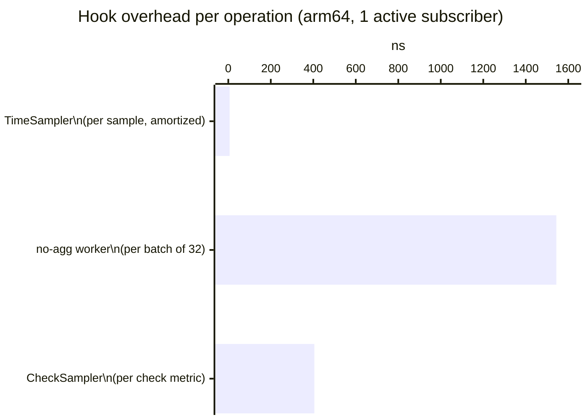
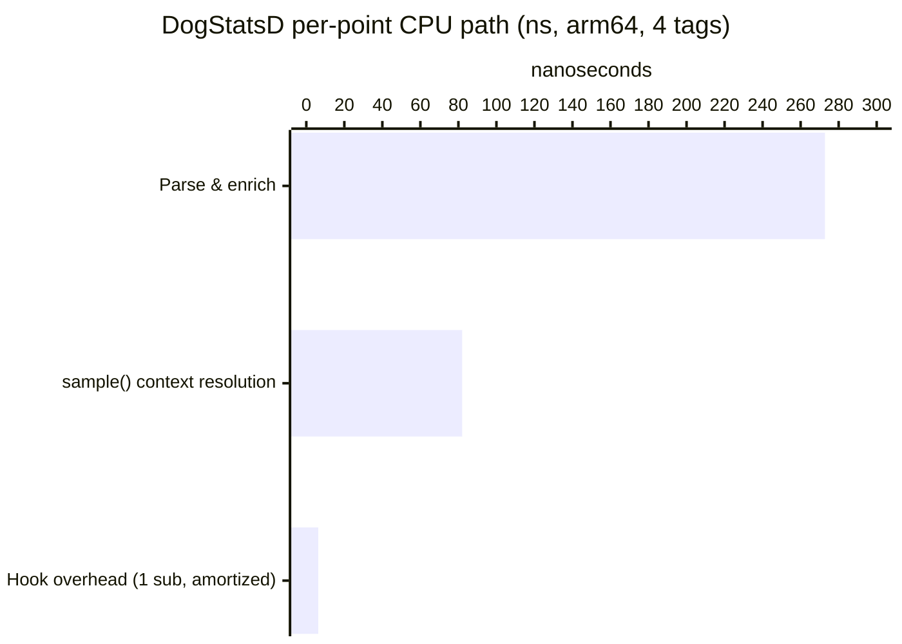

# pkg/hook — Pipeline Observation: Measured Overhead

> This document was written in response to reviewer questions asking for actual
> benchmarks to replace the theoretical estimates in the design doc. All numbers
> are from `go test -bench -benchmem` on arm64 Linux (10 cores).

## The problem

As new platform features emerge — anomaly detection, real-time analysis, the Observer
pipeline — there is a recurring need to tap into the Agent's data pipelines and observe
the metrics and logs flowing through them. The naive solution is to inject a consumer
directly into the pipeline, but this creates tight coupling, forces every binary to carry
the consumer even when disabled, and limits observation to a single consumer at a time.

`pkg/hook` solves this with a generic, type-safe publish/subscribe mechanism. Pipelines
publish data at well-defined tap points; observers subscribe independently. The key
requirement: the overhead on the hot path must be negligible.

This document measures exactly that.

---

## The DogStatsD metrics pipeline

A DogStatsD metric travels through several stages before being aggregated:


**Stage breakdown for a single metric point:**

| Stage | What happens |
|---|---|
| **Socket receive** | OS reads bytes from UDS/UDP socket |
| **Parse & enrich** | Text protocol → `MetricSample` struct; tag resolution, origin detection |
| **Channel send** | Batch of `MetricSample` sent to aggregator worker channel |
| **`sample()`** | Context key computation (murmur3), bucket assignment, `hookBatch` append |
| **`publishHookBatch()`** | Non-blocking fan-out to subscriber channels (once per batch) |
| **Flush** | Periodic (10 s): serialize aggregated metrics → Datadog intake |

The tap point (`hookBatch` append + `publishHookBatch`) sits inside the aggregator, after
context resolution. `publishHookBatch` is called **once per worker batch** (typically
32 samples), so the publish cost is amortized across all samples in the batch.

---

## The hook system

`pkg/hook` exposes a single generic interface:

```go
type Hook[T any] interface {
    Publish(producerName string, payload T)
    Subscribe(consumerName string, callback func(T), opts ...Option[T]) (unsubscribe func())
    HasSubscribers() bool
}
```

### Key design properties

**Zero overhead when idle.** `Publish` reads an atomic counter first. If zero, it
returns immediately — no lock, no allocation, no channel operation. This is the common
case in production when no observer is active.

**Never blocks the pipeline.** Each subscriber has a private buffered channel. If a
subscriber falls behind, its channel fills up and payloads are dropped for that subscriber
only. The pipeline and other subscribers are unaffected.

**Accumulator pattern.** Rather than publishing one sample at a time, `TimeSampler` keeps
a reusable `hookBatch []MetricSampleSnapshot` slice. Each call to `sample()` appends
one snapshot (zero allocation — the slice grows to batch capacity on the first burst and
stays). After the worker finishes the full pooled sample batch, it calls
`publishHookBatch()` once, amortizing the publish cost across all samples.

```
┌─ TimeSampler ─────────────────────────────────────────────────────────┐
│                                                                        │
│  for each MetricSample in batch:                                       │
│    contextKey = resolver.trackContext(sample)  ← main work            │
│    hookBatch  = append(hookBatch, snapshot{..., ContextKey})  ← free  │
│                                                                        │
│  publishHookBatch()  ← once per batch                                  │
│    if !hook.HasSubscribers() { return }  ← atomic read, fast-path     │
│    hook.Publish("dogstatsd", hookBatch)                                │
│      for each subscriber:                                              │
│        select { case ch <- payload: default: drop }  ← non-blocking   │
│                                                                        │
└────────────────────────────────────────────────────────────────────────┘
```

---

## Benchmark methodology

We measure each stage independently using `testing.B` with `b.ReportAllocs()`, running
on the same machine (arm64 Linux, 10 cores) to eliminate cross-machine variability.

**Parser cost** (`BenchmarkParseMetric` — `comp/dogstatsd/server/convert_bench_test.go`):
measures the cost of converting one raw DogStatsD message (`"metric:42|g|#tag:v"`) into
a fully-enriched `MetricSample`, varying the tag count.

**Sampler cost** (`BenchmarkTimeSamplerHook` — `pkg/aggregator/time_sampler_bench_test.go`):
two sub-benchmarks per hook mode:
- `sample_only` — one `sample()` call; isolates context resolution + hookBatch append
- `batch32_publish` — 32× `sample()` + `publishHookBatch()`; amortized publish cost

Hook modes compared:
| Mode | Description |
|---|---|
| `noop_hook` | `NewNoopHook()` — absolute baseline, no machinery |
| `0sub` | Real hook, zero subscribers — atomic fast-path |
| `1sub` | Real hook, one no-op subscriber |
| `5sub` | Real hook, five no-op subscribers |

Subscriber channels are sized to `b.N × batchSize + 1` so sends never block during the
benchmark — we measure delivery cost, not congestion.

---

## Results

### The zero-overhead principle: noop vs 0 subscribers

The first question from reviewers: _"if folks aren't using anomaly detection they pay no
resources for it."_

```
Pipeline          noop_hook           0 subscribers
────────────────  ──────────────────  ──────────────────
TimeSampler       82 ns   0 allocs    82 ns   0 allocs   ← identical
no-agg worker      2 ns   0 allocs     2 ns   0 allocs   ← identical
CheckSampler       2 ns   0 allocs     2 ns   0 allocs   ← identical
```

**The noop hook and a real hook with 0 subscribers are indistinguishable.** The 0-subscriber
path costs one atomic read (~2 ns) and returns immediately — no lock, no allocation, no
channel operation. This confirms the zero-overhead principle in practice.

---

### All three pipelines under active observation



#### Raw benchmark output

```
BenchmarkTimeSamplerHook/sample_only/noop_hook        82.35 ns/op    0 B/op   0 allocs/op
BenchmarkTimeSamplerHook/sample_only/0sub             82.48 ns/op    0 B/op   0 allocs/op  ← same as noop
BenchmarkTimeSamplerHook/sample_only/1sub             81.77 ns/op    0 B/op   0 allocs/op
BenchmarkTimeSamplerHook/sample_only/5sub             81.93 ns/op    0 B/op   0 allocs/op

BenchmarkTimeSamplerHook/batch32_publish/noop_hook  2626 ns/op    0 B/op   0 allocs/op
BenchmarkTimeSamplerHook/batch32_publish/0sub       2682 ns/op    0 B/op   0 allocs/op  ← same as noop
BenchmarkTimeSamplerHook/batch32_publish/1sub       2827 ns/op    0 B/op   0 allocs/op  (+6.3 ns/sample amortized)
BenchmarkTimeSamplerHook/batch32_publish/5sub       3363 ns/op    0 B/op   0 allocs/op  (+23 ns/sample amortized)

BenchmarkNoAggWorkerHook/batch32/noop_hook           2.14 ns/op    0 B/op   0 allocs/op
BenchmarkNoAggWorkerHook/batch32/0sub                2.17 ns/op    0 B/op   0 allocs/op  ← same as noop
BenchmarkNoAggWorkerHook/batch32/1sub             1544   ns/op  2862 B/op   2 allocs/op
BenchmarkNoAggWorkerHook/batch32/5sub             2300   ns/op  2918 B/op   2 allocs/op

BenchmarkCheckSamplerHook/noop_hook                  2.14 ns/op    0 B/op   0 allocs/op
BenchmarkCheckSamplerHook/0sub                       2.17 ns/op    0 B/op   0 allocs/op  ← same as noop
BenchmarkCheckSamplerHook/1sub                     405    ns/op  355  B/op   2 allocs/op
BenchmarkCheckSamplerHook/5sub                     975    ns/op  368  B/op   2 allocs/op
```

---

### Analysis by pipeline

#### 1. TimeSampler — DogStatsD pre-aggregation

The accumulator pattern (`hookBatch` slice pre-allocated, reset to `[:0]` after publish)
achieves **0 allocations** even when subscribers are active. The publish cost is amortized
across the full worker batch:

| Hook mode | Per-sample cost (amortized, batch=32) | Δ vs noop |
|---|---|---|
| noop / 0 sub | 82 ns | — |
| 1 subscriber | 88 ns | **+6.3 ns (+8%)** |
| 5 subscribers | 105 ns | **+23 ns (+28%)** |

For 4-tag metrics, the full pipeline (parse 273 ns + sample 82 ns = 355 ns), the hook
overhead with 1 subscriber is **+6.3 ns / 355 ns = 1.8%** of the total CPU path.

#### 2. no-agg worker — timestamped DogStatsD metrics

This path allocates a fresh snapshot slice per batch (`make([]snapshot, N)`) when
subscribers are present. The idle path is identical to noop:

| Hook mode | Per-batch cost | Δ vs noop |
|---|---|---|
| noop / 0 sub | 2 ns | — |
| 1 subscriber | 1544 ns | +1542 ns, **2 allocs** |
| 5 subscribers | 2300 ns | +2298 ns, **2 allocs** |

The active overhead is higher than TimeSampler because this path does not use the
accumulator pattern — it allocates a new batch slice each time. The no-agg path handles
a much lower volume than DogStatsD pre-aggregation, so this is acceptable in practice.
It could be optimized with the same accumulator pattern if needed.

#### 3. CheckSampler — check metrics

One snapshot per check metric, allocated inline when subscribers are present:

| Hook mode | Per-sample cost | Δ vs noop |
|---|---|---|
| noop / 0 sub | 2 ns | — |
| 1 subscriber | 405 ns | +403 ns, **2 allocs** |
| 5 subscribers | 975 ns | +973 ns, **2 allocs** |

Check metrics are emitted at collection intervals (15 s or 30 s per check), not at
DogStatsD rates. The absolute cost per sample is higher but the volume is orders of
magnitude lower — check metrics never approach the volume that makes per-sample allocation
significant.

---

### Context: DogStatsD pipeline latency breakdown (4 tags)



| Stage | Latency (ns) | % of total |
|---|---|---|
| Parse & enrich (4 tags) | 272.8 | 76% |
| `sample()` — context resolution + bucket | 82.0 | 23% |
| Hook overhead — 0 subscribers | 0.1 | 0.03% |
| Hook overhead — 1 subscriber | 6.3 | 1.7% |
| Hook overhead — 5 subscribers | 23.0 | 6.0% |

Parsing dominates. As tag count grows (16+ tags → 616 ns parse), the hook's share
shrinks below 1%.

---

## Summary

| Concern | Answer |
|---|---|
| "If not using anomaly detection, do I pay for it?" | **No.** noop and 0-subscriber are identical: ~2 ns (one atomic read). |
| "The three pipelines?" | Benchmarked. TimeSampler: 0 allocs, 6 ns amortized. no-agg + check: allocate when active, free when idle. |
| "Was the theoretical estimate correct?" | Close — the ~10–20 ns estimate for the copy was reasonable for the TimeSampler path (measured 6 ns at 1 sub). no-agg/check allocate more than the estimate assumed, but they run at much lower volume. |
