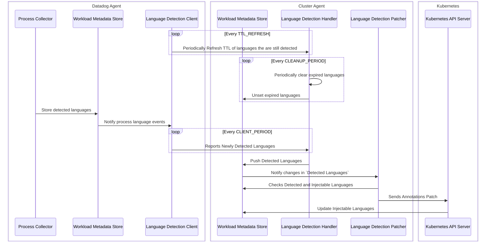

# Language Detection And Library Injection

## Overview

Language detection and library injection feature is composed of several component:
- **Process Collector**:
  - runs in the agent pod on every node of the cluster.
  - collects languages of host processes detected by the process agent and stores them in workloadmeta
- **client**:
  - runs within the agent pod on every node of the cluster.
  - subscribes to process events in workloadmeta
  - reports detected languages (aggregated by pods and containers) to the language detection handler.
  - refreshes language TTL by periodically reporting all actively detected languages to the handler
- **handler**:
  - runs within the cluster agent.
  - responsible for processing requests received from the language detection client
  - keeps track of a TTL (expiration timestamp) for each detected languages
  - periodically checks for expired languages and removes them
  - parses the requests, extracts detected languages, and pushes them to workload metadata store on the appropriate resource type.
  - for a pod that is a child of a deployment, the API handler will push its detected languages to the corresponding deployment entity in workload metadata store.
- **patcher**:
  - runs within the cluster agent.
  - responsible for patching pod owner resources (such as deployments, statefulsets, daemonsets, etc.) with language annotations based on languages reported by the language detection client.
  - subscribes to workload metadata store events.

## Detected Languages vs Injectable Languages

We make a distinction between detected languages and injectable languages:

- `Detected languages` are:
  - detected and reported by the language detection client
  - have a valid TTL (a TTL that didn't expire yet)
  - populated in workload metadata store by the language detection API handler
- `Injectable languages` are:
  - languages parsed from language annotations existing on a kubernetes resource
  - populated in workload metadata store by a kubernetes informer

It is the responsibility of the patcher to make sure that injectable languages always converge to detectable languages.
For this reason, the patcher observes the current state of `injectable languages` and `detected languages` and constructs a patch that modifies the language annotations
so that they contain only the `detected languages`. Once the language annotations are updated, the informer will update the `injectable languages`, which will become identical to
`detected languages`.

For example, when deploying a python application for the first time, the following will happen:
- Initial deployment:
  - `detected languages = []`
  - `injectable languages = []`
  - `language annotations: {}`
- When language detection client reports detecting python:
  - `detected languages = ["python",]`
  - `injectable languages = []`
  - `language annotations: {}`
- When patcher receives update event and patches deployment:
    - `detected languages = ["python",]`
    - `injectable languages = []`
    - `language annotations: {"container-name": "python"}`
- When informer receives annotation update:
    - `detected languages = ["python",]`
    - `injectable languages = ["python",]`
    - `language annotations: {"container-name": "python"}`

## Cleanup Mechanism

After multiple rollouts to their deployments, applications might be modified. Some containers might be removed, others might be added. A cleanup mechanism is implemented in order to make sure that when a language is removed due to modifying the application, the language is removed from the language detection annotations and also from workload metadata store.

As mentioned previously, the PLD API handler keeps track of a TTL (expiration time) for each detected language. The PLD client sends periodic requests to the PLD API Handler in order to refresh the TTL of languages that are still being detected by the node agent.

The cluster agent scans periodically the TTLs of the detected languages, and removes the expired languages from workload metadata store.

Consequently, the patcher will receive an event indicating that Detected Languages have been modified. It then takes action by adjusting the language annotations so that expired languages are removed from language annotations and therefore excluded from the injection process in the admission controller.

## Sequence Diagram
The sequence diagram below shows the flow of execution of the feature:

