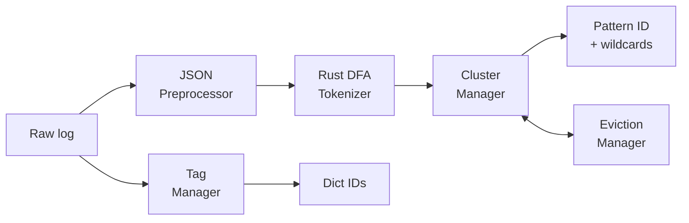
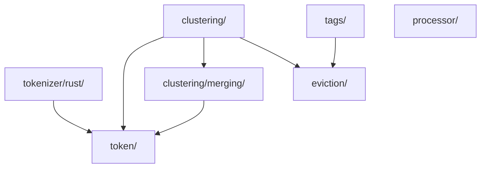
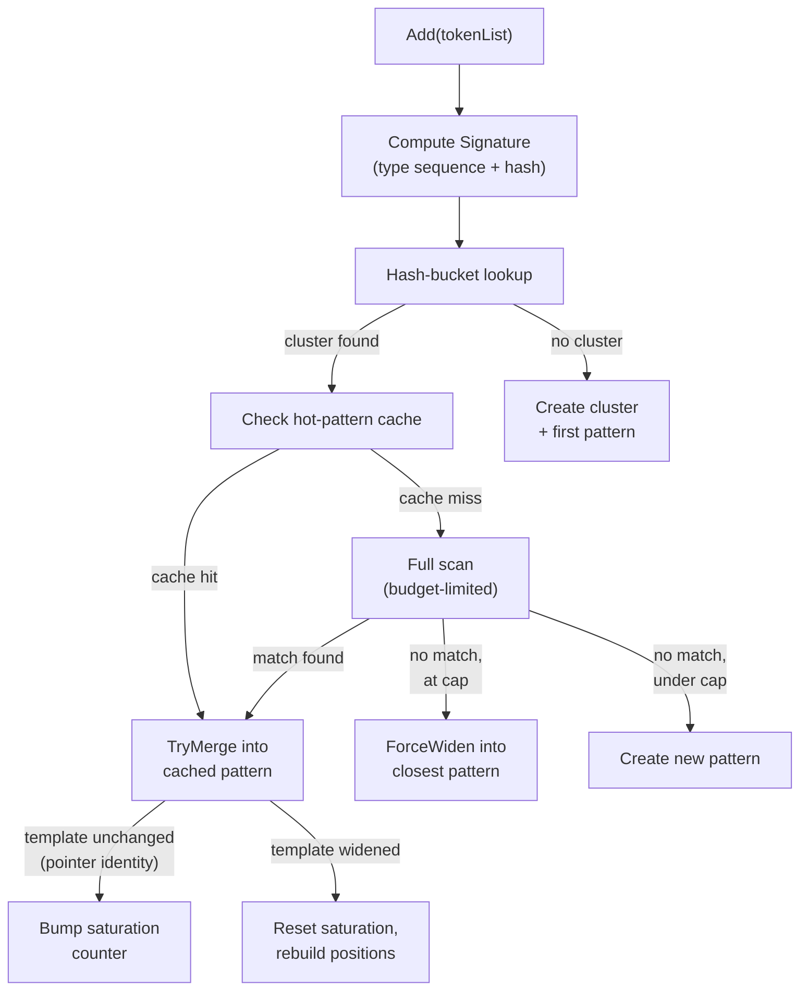
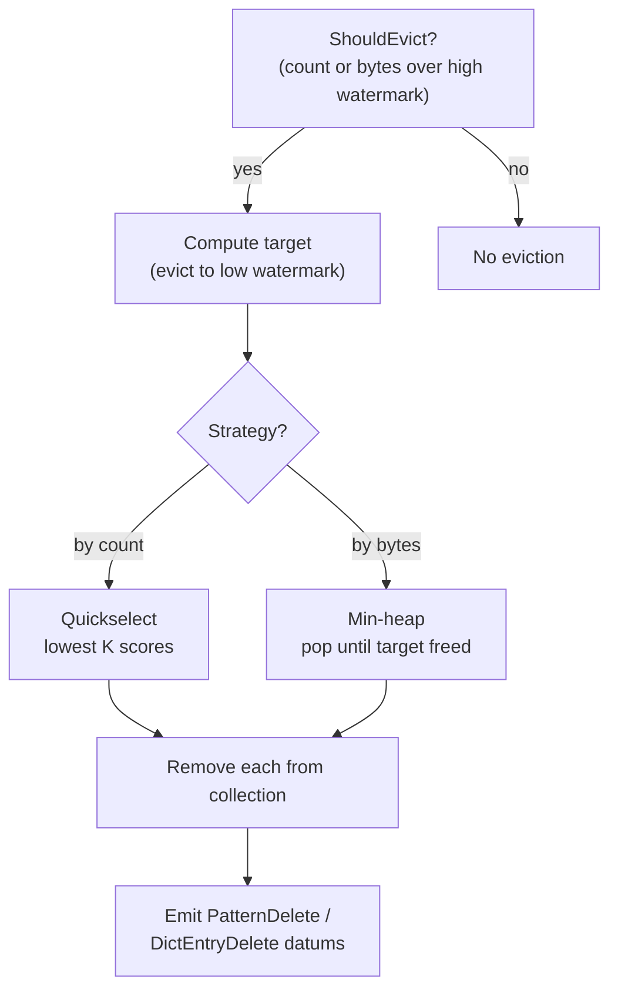

# Log Pattern Extraction — Design Document

> **Scope:** Everything from raw log string to "pattern ID + wildcard values." Transport (gRPC batching, streams, compression) is covered in [`sender/grpc/DESIGN.md`](../sender/grpc/DESIGN.md).

## Table of Contents

1. [What Is Pattern Extraction?](#1-what-is-pattern-extraction)
2. [End-to-End Example](#2-end-to-end-example)
3. [Package Map](#3-package-map)
4. [Tokenization](#4-tokenization)
5. [How Clustering Works](#5-how-clustering-works)
6. [Memory Management: Eviction](#6-memory-management-eviction)
7. [Tag Management](#7-tag-management)
8. [JSON Preprocessor](#8-json-preprocessor)
9. [Configuration Reference](#9-configuration-reference)
10. [Complexity Quick Reference](#10-complexity-quick-reference)

---

## 1. What Is Pattern Extraction?

Logs are repetitive. A web server might emit thousands of lines like:

```
Connection from 10.0.0.1 timed out after 30s
Connection from 10.0.0.2 timed out after 45s
Connection from 10.0.0.3 timed out after 12s
```

Sending each as a raw string wastes bandwidth. Pattern extraction finds the reusable structure — `Connection from * timed out after *` — and assigns it a stable ID. After the first occurrence, subsequent matching logs transmit only the pattern ID plus the wildcard values (`10.0.0.2`, `45s`), reducing wire size by 5–10x for high-volume pipelines.

This document covers the extraction pipeline: tokenization, clustering, eviction, and tag management. Together these subsystems turn a raw log string into a compact `(patternID, wildcardValues, tagDictIDs)` tuple that the transport layer encodes into protobuf datums (`PatternDefine`, `StructuredLog`, `DictEntryDefine` — see [`sender/grpc/DESIGN.md`](../sender/grpc/DESIGN.md) for the wire format).

### Relationship to Prior Work

The clustering algorithm is inspired by **Drain** (He et al., *"Drain: An Online Log Parsing Approach with Fixed Depth Tree"*, IEEE ICWS 2017), with significant adaptations for production agent deployment:

| Aspect | Drain | Our Implementation |
|--------|-------|-----|
| Routing | Fixed-depth prefix tree keyed by message length + first tokens | Hash-bucket keyed by FNV-1a of token type signature |
| Token model | All tokens are strings | 23 typed tokens from Rust DFA (IPv4, Date, SeverityLevel, etc.) |
| Merge decision | Similarity threshold (fraction of matching positions) | Strict type-compatible merging — same-type tokens wildcard, different types conflict, no threshold |
| First-token handling | First tokens used as static tree keys | First-word value embedded in signature + adaptive protection with per-cluster cardinality tracking |
| Comparison bound | `maxChildren` per tree node | `scan_budget` per message + `max_patterns_per_cluster` cap |
| Steady-state optimization | None | Hot-pattern cache, saturation scoring (skip pre-check after N identical merges) |
| Memory management | None (unbounded) | Dual-watermark eviction with quickselect/heap and grace periods |

The typed tokenization is conceptually similar to the regex masking system in **Drain3** (logpai), but integrated into the DFA tokenizer rather than applied as a preprocessing step. The word-position-aware clustering shares roots with **SLCT** (Vaarandi, *"A Data Clustering Algorithm for Mining Patterns from Event Logs"*, IEEE IPOM 2003), though SLCT operates offline in two passes while our approach is streaming.



---

## 2. End-to-End Example

Trace one log through every stage to see how the pieces fit together.

### Input

```json
{"message": "ERROR Connection from 192.168.1.42 timed out after 30s", "service": "api-gateway"}
```

### Step 1 — JSON Preprocessing

[`processor/json.go`](processor/json.go) extracts the `message` field (trying `message`, `msg`, `log`, `text` in order). The remaining fields (`{"service":"api-gateway"}`) become `JSONContext`, serialized with deterministic key ordering for better compression.

| Output | Value |
|--------|-------|
| Message | `ERROR Connection from 192.168.1.42 timed out after 30s` |
| JSONContext | `{"service":"api-gateway"}` |

### Step 2 — Tokenization

The Rust DFA tokenizer ([`tokenizer/rust/`](tokenizer/rust/)) splits the message into typed tokens in a single O(n) pass:

| Position | Type | Value | Wildcard Status |
|----------|------|-------|-----------------|
| 0 | SeverityLevel | `ERROR` | NotWildcard |
| 1 | Whitespace | ` ` | NotWildcard |
| 2 | Word | `Connection` | PotentialWildcard |
| 3 | Whitespace | ` ` | NotWildcard |
| 4 | Word | `from` | PotentialWildcard |
| 5 | Whitespace | ` ` | NotWildcard |
| 6 | IPv4 | `192.168.1.42` | PotentialWildcard |
| 7 | Whitespace | ` ` | NotWildcard |
| 8 | Word | `timed` | PotentialWildcard |
| 9 | Whitespace | ` ` | NotWildcard |
| 10 | Word | `out` | PotentialWildcard |
| 11 | Whitespace | ` ` | NotWildcard |
| 12 | Word | `after` | PotentialWildcard |
| 13 | Whitespace | ` ` | NotWildcard |
| 14 | Numeric | `30s` | PotentialWildcard |

Each token is exactly **24 bytes** (compile-time enforced). The 23 token types are defined in [`token/token.go`](token/token.go).

### Step 3 — Signature

[`token/signature.go`](token/signature.go) computes a structural fingerprint:

```
Position: "ERRORSeverityLevel|Whitespace|Word|Whitespace|Word|Whitespace|IPv4|..."
Hash:     FNV-1a(Position) → 0xA3F7...
Length:   15
```

The first word's *value* (`ERROR`) is embedded in the position string. Two logs with identical type sequences but different first words (e.g., `ERROR ...` vs `WARN ...`) hash to different buckets. This is the foundation of first-word protection (more on that in [Section 5c](#5c-optimizations)).

### Step 4 — Cluster Lookup

[`clustering/cluster_manager.go`](clustering/cluster_manager.go) looks up `hashBuckets[0xA3F7...]`. First time: no cluster exists. A new Cluster is created, containing one Pattern whose Template is the full token list. Pattern ID = 1.

### Step 5 — Second Log Merges In

A new log arrives: `ERROR Connection from 10.0.0.5 timed out after 45s`. Same token types, different IP and number. The cluster manager finds the existing cluster and calls `TryMergeTokenLists`:

- Position 6: `IPv4("192.168.1.42")` vs `IPv4("10.0.0.5")` — same type, different value → **Wildcard**
- Position 14: `Numeric("30s")` vs `Numeric("45s")` — same type, different value → **Wildcard**
- All other positions: identical values → **Identical** (zero allocation)

The pattern template evolves to: `ERROR Connection from * timed out after *`, with wildcard positions `[6, 14]`.

### Step 6 — Steady State

After ~50 more logs match without changing the template, saturation scoring kicks in. The pattern is marked as "converged," and subsequent matches skip the compatibility pre-check entirely — a single O(tokens) pass confirms the match.

### Step 7 — Tag Encoding

[`tags/tag_manager.go`](tags/tag_manager.go) splits `"service:api-gateway"` into key (`service`) and value (`api-gateway`). Each string gets a monotonic dictionary ID on first encounter:

| String | Dict ID | New? |
|--------|---------|------|
| `service` | 1 | yes → emit `DictEntryDefine` |
| `api-gateway` | 2 | yes → emit `DictEntryDefine` |

Subsequent logs with the same tags reuse the IDs (O(1) cached lookup, no allocation).

### Step 8 — Output to Transport Layer

The pipeline produces datums for the transport layer ([`sender/grpc/DESIGN.md`](../sender/grpc/DESIGN.md)):

| Datum Type | Content | When Emitted |
|------------|---------|--------------|
| `PatternDefine` | template=`"ERROR Connection from * timed out after *"`, pattern_id=1, pos_list=[6,14] | First occurrence, or when template widens |
| `DictEntryDefine` | id=1 value=`"service"`, id=2 value=`"api-gateway"` | First occurrence of each tag string |
| `StructuredLog` | pattern_id=1, dynamic_values=[`"10.0.0.5"`, `"45s"`], tags={keyID:1, valueID:2} | Every log |

On eviction, `PatternDelete` and `DictEntryDelete` datums are emitted to keep the server's state in sync.

---

## 3. Package Map

| Package | Role | Key File |
|---------|------|----------|
| [`token/`](token/) | 24-byte Token struct, 23-type enum, TokenList, Signature, Tokenizer interface | `token.go`, `signature.go` |
| [`tokenizer/rust/`](tokenizer/rust/) | CGo/FlatBuffers bridge to Rust DFA tokenizer, batch tokenization | `tokenizer.go`, `token_conversion.go` |
| [`clustering/merging/`](clustering/merging/) | CanMerge, TryMerge (single-pass lazy alloc), ForceWiden | `merging.go` |
| [`clustering/`](clustering/) | ClusterManager, Pattern, Cluster, hot-pattern cache, eviction bridge | `cluster_manager.go`, `cluster.go`, `pattern.go` |
| [`eviction/`](eviction/) | Generic eviction library: quickselect, min-heap, dual-watermark, scoring | `eviction.go`, `score.go`, `eviction_manager.go` |
| [`tags/`](tags/) | TagManager string-to-ID dictionary, tag eviction bridge | `tag_manager.go`, `tag_eviction.go` |
| [`processor/`](processor/) | JSON message extraction (layered key search) | `json.go` |

### Dependency Graph



> The `eviction/` package is a standalone generic library with no domain imports. Both `clustering/` and `tags/` depend on it, but it depends on neither.

---

## 4. Tokenization

### Why Rust?

The original Go tokenizer used a two-phase approach: a finite state automaton (FSA) for basic token boundaries, then regex fan-out for structured types like IPs and dates. The Rust implementation replaces this with a single-pass deterministic finite automaton (DFA) that recognizes all 23 token types in one traversal. Benchmarks show 3–5x throughput improvement.

> **Build requirement:** `dda inv agent.build --build-include=rust_patterns`. Without the `rust_patterns` build tag, a stub is compiled that returns errors at runtime. This allows CI and development without a Rust toolchain.

### How the Bridge Works


1. Go copies the log string to the C heap (`C.CString`)
2. A single CGo call invokes the Rust DFA via `patterns_tokenize_log`
3. Rust returns a FlatBuffer byte slice — zero-copy serialization means Go reads token fields directly from the buffer without intermediate parsing
4. `token_conversion.go` converts FlatBuffer tokens to the agent's 24-byte `token.Token` structs, extracting values from the original Go string by byte offset to avoid normalization mismatches

### Batch Optimization

`TokenizeBatch` amortizes the CGo overhead across N logs:

- **One** `runtime.LockOSThread` call (vs N)
- **One** CGo boundary crossing (vs N)
- Rust allocates a `BatchTokenEntry` array that Go pre-allocates and passes in — Rust writes results directly into Go-owned memory

This reduces cgocall CPU by ~30–40% compared to calling `Tokenize` N times in a loop.

**Files:** [`tokenizer/rust/tokenizer.go`](tokenizer/rust/tokenizer.go) (bridge), [`tokenizer/rust/token_conversion.go`](tokenizer/rust/token_conversion.go) (conversion), [`tokenizer/rust/flatbuffers/patterns_tokenizer.fbs`](tokenizer/rust/flatbuffers/patterns_tokenizer.fbs) (schema)

---

## 5. How Clustering Works

### 5a. The Main Loop

When a new log arrives, `ClusterManager.Add(tokenList)` follows this path:



**Files:** [`clustering/cluster_manager.go`](clustering/cluster_manager.go) (`Add`), [`clustering/cluster.go`](clustering/cluster.go) (`AddTokenListToPatterns`)

### 5b. Merging: The Core Algorithm

Every merge decision starts with `Token.Compare` — a fast-path/slow-path function designed so the compiler can inline the common case:

| Condition | Result | Example |
|-----------|--------|---------|
| Different types | **Conflict** | `Word` vs `IPv4` |
| Same value or already wildcard | **Identical** | `Word("from")` vs `Word("from")` |
| Same type, different value (structured) | **Wildcard** | `IPv4("10.0.0.1")` vs `IPv4("10.0.0.2")` |
| `Word` + both PotentialWildcard + neither NeverWildcard | **Wildcard** | `Word("alice")` vs `Word("bob")` |
| Whitespace | **Conflict** | never wildcards (structural) |

Three merge functions build on `Token.Compare`:

**`CanMergeTokenLists`** — read-only compatibility check. Rejects on first `Conflict`. Used as a cheap pre-filter in the full scan loop.

**`TryMergeTokenLists`** — the workhorse. Does compatibility check *and* merge in a single pass. Key property: if no wildcards are needed, it returns the original template pointer unchanged (no allocation). This pointer identity is how saturation scoring detects convergence.

**`ForceWiden`** — unconditional merge with no first-word protection. Last resort when the pattern cap is reached. Only fails on length mismatch.

**File:** [`clustering/merging/merging.go`](clustering/merging/merging.go)

### 5c. Optimizations

Each optimization was added to address a specific scaling problem observed during SMP benchmarking.

---

#### Hot-Pattern Cache

> **Problem:** In steady state, 1–2 patterns absorb 95% of traffic, but the full scan checks all patterns in the cluster every time.

**Solution:** Each cluster keeps a one-entry MRU cache (`lastMatchedPattern`). The common case becomes O(tokens) instead of O(patterns × tokens).

On cache miss, the matched pattern is promoted to the cache and swapped toward the front of the pattern list. If a cached saturated pattern fails to match, it is immediately desaturated to force a full rescan.

---

#### Saturation Scoring

> **Problem:** For converged patterns (the template hasn't changed in hundreds of matches), running the `CanMerge` pre-check before `TryMerge` is redundant work — two O(tokens) passes instead of one.

**Solution:** `TryMergeTokenLists` returns the template pointer unchanged when no wildcards are needed. The cluster counts consecutive pointer-identical merges. After `saturation_threshold` (default: 50) consecutive identical merges, the pattern is marked saturated and skips the `CanMerge` pre-check entirely.

Any structural change (new wildcard) resets the counter immediately.

**Config:** `logs_config.patterns.saturation_threshold` (default `50`, `0` = disabled)

---

#### Adaptive First-Word Protection

> **Problem:** The first `Word` token often carries semantic meaning (log level: `ERROR`, `WARN`, `INFO`). Wildcarding it collapses unrelated log types into one pattern. But sometimes the first word is high-cardinality (usernames, transaction IDs), and protecting it creates hundreds of separate patterns.

**Solution:** First-word protection is enabled globally by default. Each cluster independently tracks unique first-word values. When the count exceeds `first_word_max_cardinality` (default: 100), protection is permanently disabled for that cluster and the tracking map is freed.

**Config:**
- `logs_config.patterns.first_word_protection` (default `true`)
- `logs_config.patterns.first_word_max_cardinality` (default `100`)

---

#### Scan Budget

> **Problem:** A cluster with many patterns causes O(patterns × tokens) work per incoming log during the full scan.

**Solution:** `pattern_scan_budget` caps the number of `CanMerge` iterations per message. On a match, the pattern is moved toward the front so frequently matched patterns stay within budget on future calls.

**Config:** `logs_config.patterns.pattern_scan_budget` (default `0` = unlimited)

---

#### Max Patterns Per Cluster

> **Problem:** Under churn (many structurally similar but non-mergeable logs), a single cluster can accumulate unbounded patterns.

**Solution:** When `max_patterns_per_cluster` is reached, the system finds the *closest* existing pattern (most identical token positions) and calls `ForceWiden` — unconditionally wildcarding all differing positions. This is a lossy but bounded fallback.

**Config:** `logs_config.patterns.max_patterns_per_cluster` (default `0` = unlimited)

---

## 6. Memory Management: Eviction

The agent runs indefinitely. Without memory bounds, pattern and tag dictionaries grow until OOM. The eviction system provides bounded memory with minimal churn.

### Scoring

Each pattern (or tag) receives a score that balances frequency, age, and recency:

```
score = (frequency / (1 + ageDays)^decayFactor) * (1 + recencyBoost)

where recencyBoost = 1 / (1 + hoursSinceAccess / 24)
```

- **Frequency:** High-traffic patterns score higher
- **Age decay:** Old patterns lose score over time (power-law decay controlled by `age_decay_factor`)
- **Recency boost:** Recently accessed patterns get a secondary boost (hyperbolic decay over hours)

Lower score = higher eviction priority.

**Worked example:** A pattern seen 500 times, created 2 days ago, last accessed 1 hour ago:

```
ageDecay     = 1 / (1 + 2)^0.5 = 0.577
baseScore    = 500 × 0.577 = 288.7
recencyBoost = 1 / (1 + 1/24) = 0.96
finalScore   = 288.7 × (1 + 0.96) = 565.8
```

### Two Eviction Strategies

| Strategy | When Used | Algorithm | Complexity |
|----------|-----------|-----------|------------|
| **By bytes** | Memory usage exceeds watermark | Min-heap (pop until target freed) | O(N + K log N) |
| **By count** | Item count exceeds watermark (and memory is fine) | Quickselect (partial sort) | O(N) average |

**Priority:** When both thresholds are breached simultaneously, bytes wins — memory pressure is the more dangerous condition (OOM risk). After bytes-based eviction, if the count is still over the watermark, the next eviction check will handle it. Only one strategy runs per eviction cycle.

Quickselect uses median-of-three pivot selection to avoid worst-case O(N^2).

### Dual Watermark System

Eviction uses two thresholds to prevent thrashing:

- **High watermark** (trigger): eviction starts when usage exceeds this fraction of the max
- **Low watermark** (target): eviction continues until usage drops to this fraction

**Example for patterns** (defaults: max=700, high=0.95, low=0.85):

```
Trigger at:  700 × 0.95 = 665 patterns
Evict to:    700 × 0.85 = 595 patterns
Buffer:      665 - 595 = 70 patterns before re-triggering
```

This 10% hysteresis buffer prevents the pathological cycle of evicting one pattern, immediately recreating it, and evicting again.

### Grace Period

New patterns are immune to eviction for 30 seconds (configurable). This solves the burst-source problem: a new log source emits many new patterns in quick succession. Without the grace period, the eviction system would evict newly created patterns before they have a chance to accumulate frequency.

> Grace period applies to patterns only. Tags use a grace period of 0.

### Interface Design

The eviction library ([`eviction/`](eviction/)) is domain-agnostic. Both `clustering/` and `tags/` implement the same two interfaces:

- **`Evictable`** — any item that reports frequency, creation time, last access time, and estimated bytes
- **`EvictableCollection`** — any container that can snapshot all items and remove individual items

This means the scoring formula, quickselect, and watermark logic are written once and shared.



**Files:** [`eviction/eviction.go`](eviction/eviction.go) (algorithms), [`eviction/score.go`](eviction/score.go) (scoring), [`eviction/eviction_manager.go`](eviction/eviction_manager.go) (watermarks), [`clustering/pattern_eviction.go`](clustering/pattern_eviction.go) (pattern bridge), [`tags/tag_eviction.go`](tags/tag_eviction.go) (tag bridge)

---

## 7. Tag Management

Tags are log metadata strings like `service:api-gateway` or `env:production`. Rather than sending these strings repeatedly, the tag manager assigns each unique string a monotonic dictionary ID on first encounter.

### How It Works

[`tags/tag_manager.go`](tags/tag_manager.go) maintains two maps: `stringToEntry` (forward lookup) and `idToEntry` (reverse lookup), protected by a `sync.RWMutex` with double-checked locking for the fast path.

**Adding a string:** `RLock` first — if the entry exists, increment usage count and return the existing ID (no write lock needed). If not found, upgrade to `WLock`, double-check, then create a new entry with `nextID.Add(1)`.

**Encoding tags:** `EncodeTagStrings` splits each `"key:value"` string on the first colon, creates separate dictionary entries for key and value, and returns protobuf `Tag` messages with dictionary IDs. New entries also return a `map[uint64]string` of newly created mappings so the caller can emit `DictEntryDefine` datums.

**Memory accounting:** An `atomic.Int64` counter (`cachedMemoryBytes`) is updated on every add and remove — O(1), no map iteration needed for memory checks.

**Eviction:** Tags use the same generic eviction library as patterns, but with separate config keys (`logs_config.tags.*`) and no grace period.

---

## 8. JSON Preprocessor

[`processor/json.go`](processor/json.go) extracts the human-readable message from structured JSON logs using a layered search:

| Priority | Keys Tried |
|----------|------------|
| Layer 0 (top-level) | `message`, `msg`, `log`, `text` |
| Layer 1 (nested) | `data.message`, `event.message`, `payload.message` |

The extracted message is tokenized. Remaining JSON fields are serialized as `JSONContext` with deterministic key ordering (Go's `encoding/json` sorts map keys), which aids compression.

If no message field is found, the log is treated as plain text.

---

## 9. Configuration Reference

All keys are set in `datadog.yaml` and registered in [`pkg/config/setup/config.go`](../../config/setup/config.go).

### Pattern Clustering (`logs_config.patterns.*`)

| Key | Default | Description |
|-----|---------|-------------|
| `max_pattern_count` | `700` | Hard cap on total patterns across all clusters |
| `max_memory_bytes` | `4194304` (4 MiB) | Hard cap on estimated pattern memory |
| `eviction_high_watermark` | `0.95` | Fraction of max that triggers eviction |
| `eviction_low_watermark` | `0.85` | Fraction of max targeted after eviction |
| `age_decay_factor` | `0.5` | Power-law exponent for age decay in eviction scoring |
| `eviction_grace_period_seconds` | `30` | Seconds of immunity for newly created patterns |
| `first_word_protection` | `true` | Prevent first Word token from becoming wildcard |
| `first_word_max_cardinality` | `100` | Unique first-word values before auto-disabling protection |
| `saturation_threshold` | `50` | Consecutive identical merges before skipping pre-check (0 = disabled) |
| `max_patterns_per_cluster` | `0` | Per-cluster pattern cap; triggers ForceWiden (0 = unlimited) |
| `pattern_scan_budget` | `0` | Max CanMerge iterations per message (0 = unlimited) |

### Tag Management (`logs_config.tags.*`)

| Key | Default | Description |
|-----|---------|-------------|
| `max_tag_count` | `700` | Hard cap on total tag dictionary entries |
| `max_memory_bytes` | `4194304` (4 MiB) | Hard cap on estimated tag memory |
| `eviction_high_watermark` | `0.80` | Fraction of max that triggers eviction |
| `eviction_low_watermark` | `0.70` | Fraction of max targeted after eviction |
| `age_decay_factor` | `0.5` | Power-law exponent for age decay in eviction scoring |

### Transport (`logs_config.grpc.*`)

| Key | Default | Description |
|-----|---------|-------------|
| `max_inflight_payloads` | `50` | Max payloads in the inflight ring buffer per worker |

---

## 10. Complexity Quick Reference

| Operation | Time | Space | Hot Path? |
|-----------|------|-------|-----------|
| Tokenize (Rust DFA) | O(n) per log byte | O(tokens) | Yes |
| Compute Signature | O(tokens) | O(position string) | Yes |
| Hash-bucket lookup | O(1) amortized | — | Yes |
| Hot-pattern match (saturated) | O(tokens) single pass | O(1) (zero alloc) | Yes |
| Hot-pattern match (not saturated) | O(tokens) × 2 passes | O(1) or O(tokens) | Yes |
| Full scan | O(budget × tokens) | O(1) per iteration | Rare |
| ForceWiden | O(tokens) | O(tokens) | Rare |
| Eviction — by count | O(N) quickselect | O(N) scored array | Periodic |
| Eviction — by bytes | O(N + K log N) heap | O(N) heap | Periodic |
| Tag lookup (existing) | O(1) map + RLock | O(1) | Yes |
| Tag add (new) | O(1) map + WLock | O(string) | First occurrence |
| JSON preprocessing | O(n) parse + O(fields) | O(json size) | Yes (JSON logs) |

---

## 11. Future Considerations

### Simplify eviction to bytes-only with a hard count ceiling

The current dual-watermark system runs two independent strategies (by count and by bytes), but count-based eviction is a proxy for memory — the real danger is OOM, which bytes-based eviction handles directly. The scan budget and max-patterns-per-cluster cap already address the CPU cost of many patterns.

A simpler model:
- **Bytes-based eviction** remains the sole watermark-driven strategy (trigger at high, evict to low)
- **`max_pattern_count`** becomes a hard ceiling (evict the single lowest-scoring item to make room), similar to Drain3's `max_clusters`
- **`0` disables** either limit, allowing operators to opt out of one dimension

This would eliminate 2 config keys (`eviction_high_watermark` and `eviction_low_watermark` for the count path), simplify the mental model, and keep count as a reliable backstop for cases where `EstimatedBytes()` underestimates.
