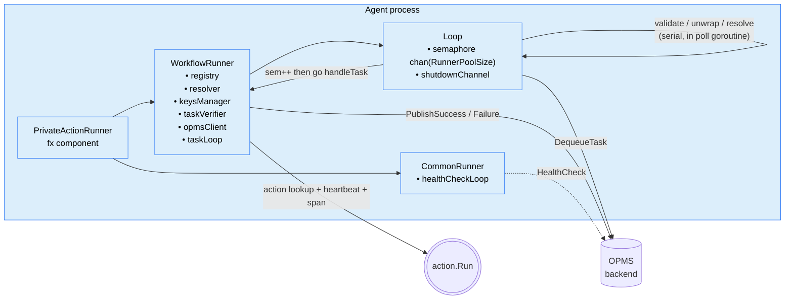
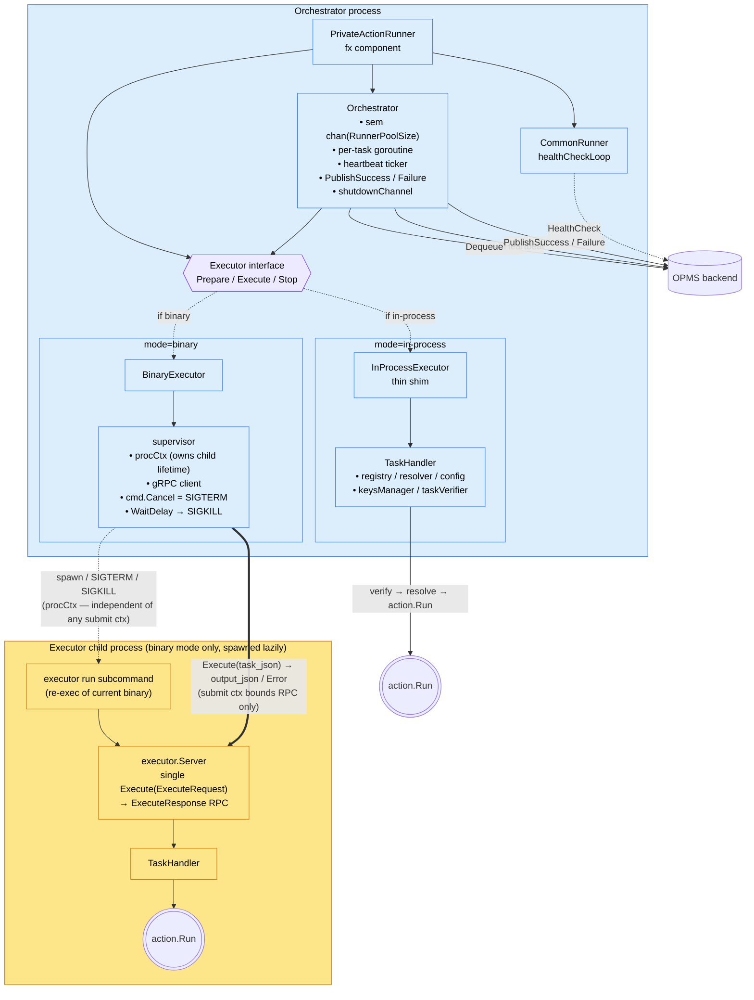
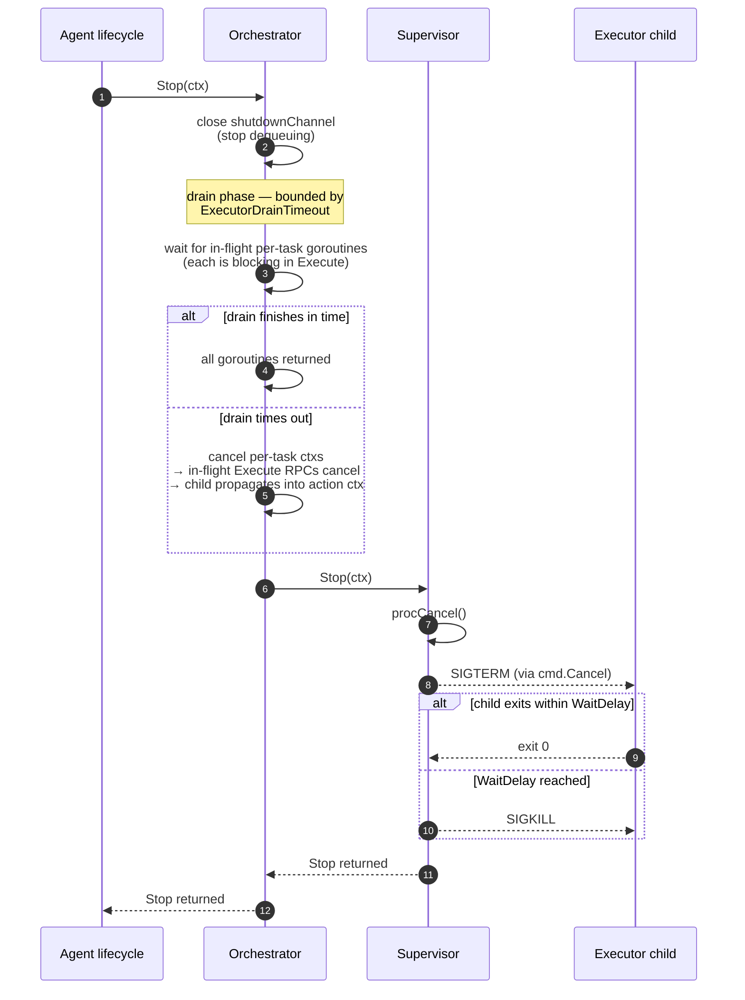

# PAR architecture: before vs. after

## Previous (monolithic, pre-refactor)

Properties:
- One type (`WorkflowRunner`) holds *both* OPMS-orchestration state and per-task execution state.
- Validate / unwrap / resolve happen serially in the polling goroutine; semaphore reserved *after* dequeue.
- No IPC, no subprocess: the action surface is always loaded and running in the agent process.

## New (PR 1 + PR 2)

The seam is **request/response**. Orchestrator owns the full OPMS task lifecycle; Executor owns per-task compute.

Key properties:
- **Concerns split cleanly.** Orchestrator: dequeue, validate, capacity, heartbeat, publish, dispatch. Executor (and its TaskHandler): verify the signed envelope, resolve credentials, run the action, return `(output, error)`. Nothing OPMS-shaped lives in the executor.
- **Capacity stays in the orchestrator.** Same `chan struct{}` semaphore sized by `RunnerPoolSize` as before the refactor. Works identically for in-process and binary mode.
- **In-process mode is a direct Go call.** No socket, no gRPC, no readiness polling — the seam is just an interface dispatch.
- **Binary mode = re-exec.** The orchestrator process re-execs the same agent binary into the hidden `executor run` subcommand. Tasks travel as `bytes task_json` over a local Unix socket / Windows named pipe, gated by an `x-par-executor-token` bearer.
- **Heartbeats use the outer envelope.** `Data.ID`, `Attributes.Client`, `Attributes.JobId`, and `BundleID`/`Name` (for FQN) are all on the dequeued envelope before verify, so the orchestrator never has to unwrap.

## The drain protocol

What this design avoids:
- **No status-poll drain dance.** Earlier sketches had the orchestrator send a Shutdown RPC and poll Status for `active_tasks==0`. With request/response Execute, the orchestrator already knows when its own in-flight calls return — drain is just "wait for my goroutines."
- **Submit ctx never tears the child down.** The child's lifetime is owned by `procCtx`, a fresh `context.Background()`-rooted context held by the supervisor. Submit ctxs bound only the gRPC call. `procCtx` is cancelled exactly once — by `Stop`, after the drain phase finishes.
- **Accepted-but-incomplete tasks are not lost.** If drain times out the orchestrator cancels its in-flight ctxs (child cancels the actions). OPMS lease expiry retries those tasks rather than treating them as failures.
