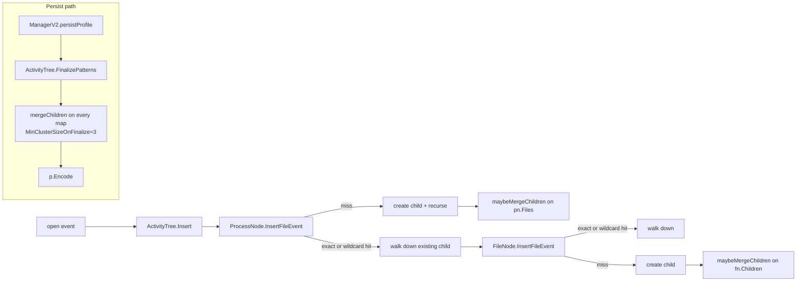
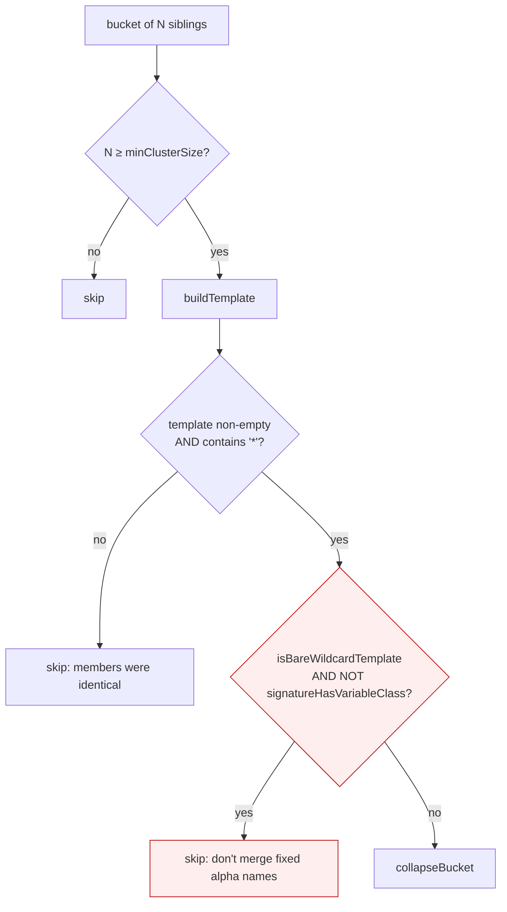

# PR walkthrough — path-pattern mining for security profile v2

Audience: reviewers of this PR. This is not a standalone design doc — it
tracks the diff file by file, explains the invariants the new code relies
on, and calls out the places that deserve extra scrutiny.

## TL;DR

The activity tree is a prefix tree of paths per process. Without any
compression, noisy components (`/tmp/<pid>/...`, `/var/log/pods/<uid>/...`,
rotated log names, session IDs, …) cause the tree to blow past its
per-profile size cap, swamp anomaly detection with "new" entries, and
bloat the serialized profile.

This PR adds **sibling pattern mining** to the activity tree. At two
points in the lifecycle (insertion when a parent's fan-out exceeds a
threshold, and before persisting the profile) we group a parent's
children by a canonical structural signature and, when a group is large
enough, collapse it into a single `FileNode` whose name carries a
wildcard template (e.g. `sess-*`, `2024-01-*.log`, `*`). The walk used by
anomaly detection falls back to matching pattern templates so future
variants don't look like new entries.

**Scope: v2 security profiles only.** The `ActivityTree` type is shared
with v1 profiles and activity dumps, so pattern mining is opt-in per
tree via `Stats.SetPathPatternConfig(...)`. v2 `Profile` construction
passes `WithPathPatterns(activity_tree.DefaultPathPatternConfig())`;
every other caller leaves the config zero-valued (`Enabled: false`) and
every gate in the engine short-circuits. v1 profiles and activity dumps
behave exactly as they did before this PR.

The feature is activated by adding `open` to the default v2 event types.

## Scope of the PR

```
 M pkg/config/setup/system_probe_cws.go
 M pkg/security/metrics/metrics.go
 M pkg/security/security_profile/activity_tree/activity_tree.go
 M pkg/security/security_profile/activity_tree/activity_tree_stats.go
 M pkg/security/security_profile/activity_tree/file_node.go
 M pkg/security/security_profile/activity_tree/process_node.go
 M pkg/security/security_profile/manager_v2.go
?? pkg/security/security_profile/activity_tree/path_patterns.go          (new)
?? pkg/security/security_profile/activity_tree/path_patterns_test.go     (new)
?? pkg/security/security_profile/activity_tree/PATH_PATTERNS.md          (this doc)
```

Two changes outside the pattern-mining feature are bundled in
`manager_v2.go` — flagged explicitly below so reviewers don't miss them.

## How it fits into the tree



Every gated step (`maybeMergeChildren`, `findChildWithPatternFallback`'s
wildcard scan, and `FinalizePatterns`) first consults
`stats.patternCfg.Enabled` and short-circuits to a no-op on v1/activity
dump trees. The only cost they pay is the nil-safe read of the config
struct already carried by `Stats`.

Two call sites invoke the same engine with different thresholds:

| Call site | Threshold | Purpose |
|---|---|---|
| `maybeMergeChildren` after an insertion | `MaxChildren=15`, `MinClusterSize=5` | cap runtime fan-out |
| `FinalizePatterns` before encoding | `MinClusterSizeOnFinalize=3` | catch short-lived profiles that never crossed `MaxChildren` |

Defaults come from `DefaultPathPatternConfig()` in `path_patterns.go` and
are applied per-tree via `Stats.SetPathPatternConfig(...)`; they can be
tuned per-profile in the future by exposing them through a richer
`WithPathPatterns(...)` option.

### How the gate is wired

```mermaid
flowchart LR
    MV2[ManagerV2.createNewProfile<br/>ManagerV2.loadProfileFromStorage]
    MV2 --> PN["profile.New(..., WithPathPatterns(DefaultPathPatternConfig()))"]
    PN --> AT["NewActivityTree(...)"]
    AT --> ST[Stats fresh from NewActivityTreeNodeStats]
    ST --> SPC["Stats.SetPathPatternConfig(cfg)<br/>in profile.New"]
    SPC --> ENG[maybeMergeChildren / findChildWithPatternFallback / FinalizePatterns<br/>read stats.patternCfg]

    MV1[Manager (v1) / ActivityDump]
    MV1 --> PN1["profile.New(...) — no WithPathPatterns"]
    PN1 --> AT2[NewActivityTree]
    AT2 --> ST2[Stats.patternCfg stays zero-valued<br/>Enabled: false]
    ST2 --> NOOP[every gate short-circuits]
```

The `Stats.patternCfg` field is unexported, so it is not serialized with
the tree. When a persisted v2 profile is reloaded via
`Profile.LoadFromNewProfile`, the config is re-applied on the freshly
loaded tree from `Profile.treeOpts.pathPatterns`.

## File-by-file walkthrough

### `pkg/security/security_profile/activity_tree/path_patterns.go` — new

Engine for everything pattern-related. Gated per-tree (see
`Stats.patternCfg`). Three layers:

1. **Structural signature** (`structureSignature`, `classifySubToken`).
   Splits a basename on `-`, `.`, `_`, classifies each sub-token:
   `N`=digits, `A`=alpha, `M`=mixed alphanumeric, otherwise preserved as
   a literal (so we never merge weird names containing `@`, `:`, …).
   Siblings with the same signature share a skeleton.

   | Input | Signature |
   |---|---|
   | `sess-abc` | `A-A` |
   | `sess-42` | `A-N` |
   | `2024-01-15.log` | `N-N-N.A` |
   | `config.json` | `A.A` |
   | `tmp` | `A` |
   | `1337` | `N` |

2. **Template construction** (`buildTemplate`). Walks all members of a
   bucket in lockstep; at each sub-token position keeps a literal if all
   members agree, emits `*` otherwise. Relies on the signature's
   separator layout being identical across members.

   | Members | Template |
   |---|---|
   | `sess-aaa`, `sess-bbb`, `sess-ccc` | `sess-*` |
   | `2024-01-15.log`, `2024-01-16.log` | `2024-01-*.log` |
   | `pod-abc123-xyz`, `pod-def456-xyz` | `pod-*-xyz` |
   | `aa`, `bb`, `cc` | `*`   ← bare wildcard |
   | `1`, `42`, `1337` | `*`   ← bare wildcard |

3. **Bucketing + merging** (`groupChildrenBySignature`, `mergeChildren`,
   `collapseBucket`, `mergeInto`, `maybeMergeChildren`).
   Group → pick buckets with ≥ `minClusterSize` members → produce a
   template → collapse the bucket if the template passes the guards.

Also: `templateMatches` for wildcard-aware lookup, and
`findChildWithPatternFallback` for the caller-visible hook.

#### The decision pipeline (the bit to scrutinize)



Why the bare-wildcard-on-pure-alpha guard exists — concrete scenario the
guard protects against:

A process touches paths under `/tmp/<pid>/subfolder/<pid>`. The process's
`Files` map contains `tmp`, but in a real profile it also contains
`etc`, `var`, `bin`, `usr`, `proc`, … — fixed directory names that are
all short pure-alpha tokens and therefore all share the signature `"A"`.
At `FinalizePatterns` time that bucket has ≥ 3 members, `buildTemplate`
produces the bare wildcard `"*"` (no shared literal survives), and
without the guard `collapseBucket` unions `tmp`, `var`, `etc`, … into a
single `*` node — so `/tmp/*/subfolder/*` becomes `/*/*/subfolder/*`.

The guard rejects the exact pair `(bare-wildcard template, pure-alpha
signature)`. Every other case is unaffected:

| Template | Signature | Decision |
|---|---|---|
| `sess-*` | `A-A` | merge (has literal anchor `sess-`) |
| `2024-01-*.log` | `N-N-N.A` | merge |
| `*` | `N` | merge (bare wildcard but numeric bucket — `/tmp/123`, `/tmp/456`, …) |
| `*` | `M` | merge (mixed alphanumeric bucket — uuid-like) |
| `*` | `A` | **skip** (the bug case) |
| `*` | `A.A` | **skip** (e.g. fixed `foo.bar`, `baz.qux` siblings) |

Two helpers make the guard cheap to state: `isBareWildcardTemplate`
(only `*` and separators) and `signatureHasVariableClass` (contains `N`
or `M`).

#### `collapseBucket` bookkeeping to double-check

For every absorbed sibling: `stats.FileNodes--`, `stats.FileNodesMerged++`.
For each bucket collapsed: `stats.FilePatternsCreated++`. The head node
keeps `stats.FileNodes` unchanged (it's renamed, not removed). If a
pre-existing pattern node with the same template already sits in
`children`, the head is folded into it and we do another `FileNodes--`.

#### Invariants the rest of the code depends on

- Pattern nodes (`IsPattern = true`) are excluded from
  `groupChildrenBySignature`, so they're never re-bucketed. Once
  produced, a template is stable for the tree's lifetime.
- `mergeChildren` never produces an identical-name result: it skips
  templates without a `*`.
- `templateMatches` never crosses path component boundaries — callers
  feed it one basename at a time.
- `collapseBucket` keeps the head's representative `File` metadata
  (hashes, pkg, resolved pathname) and only rewrites `BasenameStr` to
  the template.
- `stats.patternCfg.Enabled = false` ⇒ no pattern nodes can exist on
  the tree. `mergeChildren` is still a pure function and may be called
  directly in tests, but the two insertion-time hooks
  (`maybeMergeChildren`, `findChildWithPatternFallback`) and
  `FinalizePatterns` all gate on the flag.

### `pkg/security/security_profile/activity_tree/path_patterns_test.go` — new

Covers signature classification, template construction, template
matching, grouping, merge thresholds, the bare-wildcard guard, pattern
lookup fallback, and two end-to-end scenarios:

- `TestInsertFileEvent_AnomalyDryRunQuietOnVariants` — dry-run insert of
  a new pattern variant does **not** create a node and does **not**
  report a new entry.
- `TestFinalizePatterns_PreservesFixedAlphaTopLevelDirs` — the reported
  bug, now asserted: a tree with `tmp` (and variable children) plus
  fixed sibling dirs produces `/tmp/*/subfolder/*`, not
  `/*/*/subfolder/*`.
- `TestInsertFileEvent_DisabledByDefaultOnV1Trees` — gate regression
  ensuring a zero-valued `patternCfg` (v1 / activity-dump default)
  preserves every literal and leaves all three new counters at zero,
  even with `MaxChildren+5` variants and a subsequent `FinalizePatterns`
  call.

Helpers you'll recognize from the engine each have direct unit tests
(`TestStructureSignature`, `TestBuildTemplate`, `TestTemplateMatches`,
`TestIsBareWildcardTemplate`, `TestSignatureHasVariableClass`, …).

Not yet covered but worth considering: fuzz test for
`structureSignature`/`buildTemplate` with random ASCII inputs, and a
property test for `templateMatches` (generated templates should always
match their generating members).

### `pkg/security/security_profile/activity_tree/file_node.go`

Two changes inside `FileNode.InsertFileEvent`:

1. Replace the exact map lookup with `findChildWithPatternFallback` so
   an existing pattern node absorbs new variants. When a pattern
   actually swallowed the request (`child.IsPattern && child.Name != parent`)
   we bump `stats.FilePatternLookupHits` — the counter that tells us
   pattern mining is earning its keep.

2. After creating a new child (leaf or intermediate), call
   `maybeMergeChildren`. For intermediate children this raises a subtle
   issue the code handles explicitly:

   ```go
   if entry, stillThere := currentFn.Children[parent]; stillThere {
       currentFn = entry
   } else if entry, ok := findChildWithPatternFallback(currentFn.Children, parent); ok {
       currentFn = entry
   } else {
       currentFn.Children[parent] = newChild
       currentFn = newChild
   }
   ```

   If the merge pass just folded the brand-new intermediate node into a
   pattern template, we must continue the walk from the template node,
   not from a dangling `newChild` that's no longer in the map.
   Defensive branch reinstalls the child; it should not fire in
   practice (flagged with a comment).

**Review hot-spot:** the post-merge pointer rewire. This is the single
place where the merge pass mutates data the caller is still holding a
reference to. If the rewire ever misses, subsequent inserts on this
request would attach the remainder of the path under a node that isn't
reachable from the tree — silent data loss. Worth a fuzz test or at
least a property-style assertion.

### `pkg/security/security_profile/activity_tree/process_node.go`

Same shape of change as `file_node.go`, applied to the top-level
`pn.Files` map:

- lookup uses `findChildWithPatternFallback` + `FilePatternLookupHits`
  on hit,
- `maybeMergeChildren(pn.Files, stats)` runs after the recursive
  `InsertFileEvent` completes.

Because `ProcessNode.InsertFileEvent` recurses through
`child.InsertFileEvent` (not back through itself), we don't need the
post-merge pointer-rewire dance here — the merge runs *after* the
downstream walk has already attached everything.

### `pkg/security/security_profile/activity_tree/activity_tree.go`

Adds `FinalizePatterns` and its two recursive helpers. Entry point for
the persistence-side pass.

```go
func (at *ActivityTree) FinalizePatterns() {
    for _, pn := range at.ProcessNodes {
        at.finalizePatternsOnProcess(pn)
    }
}
```

Post-order on `FileNode.Children` — we merge deepest first. For
`ProcessNode` we merge `pn.Files` then recurse into children processes;
order there doesn't matter (siblings' subtrees are independent).
Idempotent: re-running produces no further changes because pattern
nodes are skipped by `groupChildrenBySignature`.

### `pkg/security/security_profile/activity_tree/activity_tree_stats.go`

Three new cumulative counters on `Stats`:

- `FileNodesMerged`
- `FilePatternsCreated`
- `FilePatternLookupHits`

`SendStats` emits them only if non-zero, resets them, and tags with
`tree_type` (matching the existing pattern). Consistent with the rest
of `Stats`: no atomics, relies on the existing single-goroutine
insertion assumption.

Also adds the unexported `patternCfg PathPatternConfig` field plus
`SetPathPatternConfig` / `PathPatternConfig` accessors. The field is
unexported so it is never serialized with the tree; v2's `Profile`
construction writes it explicitly, and `Profile.LoadFromNewProfile`
re-applies it after loading a tree from disk.

Design note (worth a reviewer sanity check): putting the gate on
`*Stats` rather than on `*ActivityTree` is a pragmatic choice. `*Stats`
is already threaded to every merge call site (`maybeMergeChildren`,
`findChildWithPatternFallback`), which avoids adding a parameter to
`FileNode.InsertFileEvent` / `ProcessNode.InsertFileEvent` and keeps
the diff small. The cost is that `Stats` carries a bit of
behavior-affecting state in addition to its metric counters. If this
gets too much more config, promote `patternCfg` to `*ActivityTree`
proper and thread it through.

### `pkg/security/metrics/metrics.go`

Declares the three corresponding `MetricActivityDump*` names, all
`newRuntimeMetric`. Comments spell out the tag set and semantics.

### `pkg/security/security_profile/profile/profile.go`

Two changes to thread the per-tree config:

1. `activityTreeOpts` gains a `pathPatterns activity_tree.PathPatternConfig`
   field.
2. New option `WithPathPatterns(cfg activity_tree.PathPatternConfig) Opts`.
3. `New()` calls `p.ActivityTree.Stats.SetPathPatternConfig(...)` if
   `pathPatterns.Enabled` is true.
4. `LoadFromNewProfile` re-applies the config after swapping in the
   loaded tree (the patternCfg field is unexported and thus never
   serialized).

### `pkg/security/security_profile/manager_v2.go`

Four changes — **only the first two are pattern-related**:

1. **Pattern-related.** In `persistProfile`, before `p.Encode(format)`,
   call `p.ActivityTree.FinalizePatterns()`. Nil-guarded + internally
   gated on `stats.patternCfg.Enabled`. This is the only place in the
   persist path that mutates the tree; safe because `persistProfile`
   runs after the profile is snapshotted for serialization and no
   further inserts are expected.

2. **Pattern-related.** In `createNewProfile` and `loadProfileFromStorage`,
   add `profile.WithPathPatterns(activity_tree.DefaultPathPatternConfig())`
   to the `profile.New(...)` call. This is the single v2 opt-in — v1
   and activity-dump construction sites (`secprofs.go`,
   `dump/activity_dump.go`) are deliberately left unchanged.

3. **Unrelated — flag this in review.** `tagsResolved` check flipped
   from `image_tag` to `image_name`:

   ```go
   -	tagsResolved := err == nil && len(workloadTags) != 0 && utils.GetTagValue("image_tag", workloadTags) != ""
   +	tagsResolved := err == nil && len(workloadTags) != 0 && utils.GetTagValue("image_name", workloadTags) != ""
   ```

   Semantic change: workloads that have an `image_tag` but no
   `image_name` are now considered unresolved and will not be processed
   through the tagged path. Reviewer should decide whether this is
   intentional (some resolvers set `image_name` but leave `image_tag`
   blank until the container pulls the image's manifest).

4. **Unrelated — flag this in review.** Default image tag fallback in
   `onEventTagsResolved`:

   ```go
   +	if imageTag == "" {
   +		imageTag = "latest"
   +	}
   ```

   The string `"latest"` is used as the image-tag key when the tag
   resolver returned nothing. Downstream consumers that group/display
   by image tag will now show `latest` instead of an empty string, and
   two unrelated untagged workloads will coalesce under the same
   `latest` key. Intentional? If yes, this deserves a release note.

Changes 3 and 4 should arguably be split into their own PR — they have
nothing to do with pattern mining, they're easy to miss in a review
focused on the new feature, and they change tag-resolution behavior in
ways that matter for the activity dump consumers.

### `pkg/config/setup/system_probe_cws.go`

```diff
-	cfg.BindEnvAndSetDefault("runtime_security_config.security_profile.v2.event_types", []string{"exec", "dns", "bind", "connect"})
+	cfg.BindEnvAndSetDefault("runtime_security_config.security_profile.v2.event_types", []string{"exec", "dns", "bind", "connect", "open"})
```

Enables `open` events in v2 profiles by default. This is what makes the
tree accumulate the paths that pattern mining exists to compress — in
other words, pattern mining must ship *at the same time* as this flip,
or v2 profiles under `open` load will grow unboundedly until the size
cap drops events.

Needs a release note (behavior change: new event type enabled by
default).

## Checklist for the reviewer

Scope / v2 gate:
- [ ] v1 profile construction (`secprofs.go`) and activity-dump
      construction (`dump/activity_dump.go`) are **not** touched —
      they must continue to use the zero-valued `PathPatternConfig`
      (disabled).
- [ ] Only `manager_v2.go` opts in via
      `profile.WithPathPatterns(activity_tree.DefaultPathPatternConfig())`.
- [ ] `Profile.LoadFromNewProfile` re-applies `treeOpts.pathPatterns`
      on the freshly-loaded tree — otherwise reloaded v2 profiles lose
      the flag.
- [ ] `TestInsertFileEvent_DisabledByDefaultOnV1Trees` locks the
      default-disabled behavior in.

Functionality:
- [ ] The guard in `mergeChildren` distinguishes "variable bucket" from
      "fixed alpha bucket". Read it carefully — it's the whole
      correctness argument against over-generalization.
- [ ] The post-merge pointer rewire in `FileNode.InsertFileEvent` is
      safe against every branch of the merge outcome (no orphaned
      `newChild`).
- [ ] `FinalizePatterns` is idempotent and never touches the tree again
      after persistence. Nil-guards are present on every level.

Configuration:
- [ ] `MaxChildren=15` / `MinClusterSize=5` / `MinClusterSizeOnFinalize=3`
      — are these the right defaults for your workloads? They are not
      currently user-configurable.
- [ ] Default v2 event types now include `open`. Expected?

Observability:
- [ ] Three new metrics wired end to end; dashboards / docs updated?

Unrelated changes:
- [ ] `image_tag` → `image_name` in `tagsResolved`. Intentional?
- [ ] `imageTag = "latest"` fallback. Intentional? Release note?

Tests:
- [ ] Property/fuzz coverage for `templateMatches` (template must match
      all its generating members).
- [ ] Does any existing integration / e2e test assert on paths that now
      land on a pattern node instead of a literal one? Those assertions
      would need updating.

## Pointers

- Engine: `pkg/security/security_profile/activity_tree/path_patterns.go`
- Tests: `pkg/security/security_profile/activity_tree/path_patterns_test.go`
- Insertion entry points: `process_node.go::ProcessNode.InsertFileEvent`,
  `file_node.go::FileNode.InsertFileEvent`
- Finalize hook: `activity_tree.go::ActivityTree.FinalizePatterns`
- Persist call: `manager_v2.go::ManagerV2.persistProfile`
- Event-type default: `pkg/config/setup/system_probe_cws.go`
- Metrics: `pkg/security/metrics/metrics.go` and
  `pkg/security/security_profile/activity_tree/activity_tree_stats.go`
- Pre-existing regex-based path rewriter (string-level, runs at SECL-rule
  projection time, complementary to tree-level mining):
  `pkg/security/utils/pathutils/path_linux.go::CheckForPatterns`
