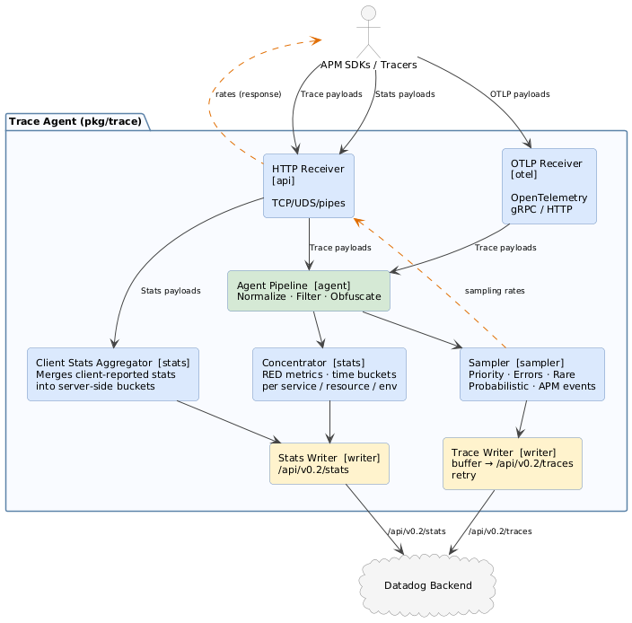

# pkg/trace — Trace Agent

This package contains the core logic of the Datadog Trace Agent: receiving traces from APM SDKs, processing and sampling them, and forwarding trace data and stats to the Datadog backend.

## Overview

The Trace Agent sits between instrumented applications and the Datadog backend. Its main responsibilities are:

- Receiving trace payloads from Datadog APM SDKs and OpenTelemetry instrumentation
- Normalizing, filtering, and obfuscating spans
- Making intelligent sampling decisions to control data volume while preserving signal
- Computing aggregated statistics (RED metrics) over all received spans — independently of sampling
- Forwarding sampled traces and stats to the Datadog backend

## Architecture

The diagram above shows the main components and data flow. See [`architecture.puml`](architecture.puml) for the source.

## Components

### Receiver (`api/`)

The HTTP receiver accepts incoming trace payloads over TCP, Unix Domain Sockets, or Windows named pipes. It supports multiple protocol versions (v0.3, v0.4, v0.5) using MessagePack serialization, plus a gRPC endpoint for OpenTelemetry traces (`otel/`).

Incoming connections are rate-limited. The receiver tracks per-language and per-service stats (span counts, byte counts) and exposes them via the `/info` endpoint so clients can adapt their behavior.

After decoding a payload, the receiver enqueues it for processing via a Go channel. It also returns per-service sampling rates back to the client in the HTTP response, closing the sampling feedback loop.

### Agent Pipeline (`agent/`)

The `Agent` struct is the central orchestrator. It pulls payloads from the receiver channel and runs each trace through a sequential processing pipeline:

1. **Normalization** — validates and normalizes field values (service name, resource, span type, etc.), applying defaults and truncating values that exceed limits.
2. **Filtering** — drops traces matching configured resource blocklist patterns (`conf.Ignore["resource"]`) or required/rejected tag rules.
3. **Tag injection** — merges globally configured tags into each span.
4. **Obfuscation** — redacts sensitive data from span metadata based on span type: SQL query obfuscation, JSON payload scrubbing, URL redaction, and Memcached/Redis command obfuscation.
5. **Truncation** — caps oversized tag values, resource names, and SQL statements.
6. **Top-level span computation** — marks which spans are entry points within their service, used by stats and sampling.
7. **Tag replacement** — applies user-configured regex replacement rules to tag values (e.g., PII scrubbing via `conf.ReplaceTags`).

After this pipeline, the agent fans the trace out to the sampler subsystem and the concentrator in parallel.

### Sampler Subsystem (`sampler/`, `event/`)

Sampling determines which traces are forwarded to the backend. Multiple samplers run independently, and a trace is kept if any sampler decides to keep it. Not all samplers are enabled by default.

**Priority Sampler** is the primary mechanism. It maintains per-service-and-environment target throughput (traces per second) and adjusts sampling rates accordingly. Clients embed a sampling priority in each trace; the priority sampler respects user-set priorities (keep/drop) and uses a rate-based decision for auto-sampled traces. Computed rates are returned to clients via the receiver so they can pre-sample at the source.

**Errors Sampler** ensures traces containing error spans (5xx status codes) are kept even if the priority sampler would drop them, subject to a configurable rate limit.

**Rare Sampler** catches uncommon combinations of `(env, service, span name, resource, HTTP status, error type)` that would otherwise be dropped. It maintains a TTL-based set of recently seen combinations and keeps the first occurrence of any unseen combination within a rate limit window. Sampled spans are tagged with `_dd.rare`.

**Probabilistic Sampler** applies a simple rate-based sampling decision, independent of the other samplers.

**APM Event Processor** (`event/`) runs alongside sampling to extract individual spans as APM Events for Trace Search. Events are extracted based on configured rates per service/operation and are subject to a global events-per-second cap.

### Stats computation (`stats/`)

Stats are produced via two parallel paths, depending on whether the tracer computes them client-side or not.

**Concentrator** — when a tracer does not send pre-computed stats, the agent computes them server-side over all received spans, regardless of sampling decisions. Spans are bucketed by a configurable time window (default: 10 seconds) and aggregated along these dimensions: service, resource, span name, span type, HTTP status code, synthetics flag, and peer tags. At the end of each bucket interval the concentrator flushes a `StatsPayload` to the Stats Writer.

**Client Stats Aggregator** — newer tracer clients can compute RED metrics locally and submit them as `ClientStatsPayload` messages directly to the receiver. These payloads bypass the Agent Pipeline and the Concentrator entirely. The Client Stats Aggregator re-aligns their timestamps to server-side bucket boundaries, merges overlapping buckets, and forwards the result to the Stats Writer.

### Writers and Senders (`writer/`)

**Trace Writer** receives sampled trace chunks from the sampler subsystem, buffers them in memory, and periodically flushes them to the backend. It flushes when the buffer exceeds the max payload size (~3.2 MB) or after a configurable time interval (default: 5 seconds). Payloads are optionally compressed with zstd before sending.

**Stats Writer** receives `StatsPayload` messages from both the Concentrator and the Client Stats Aggregator and forwards them to the backend.

Both writers use a shared **Sender** component which manages the actual HTTP communication. The sender supports configurable concurrency, exponential backoff with retry, and API key rotation.

### Supporting Packages

| Package | Purpose |
|---|---|
| `config/` | Configuration types and loading for the trace agent |
| `containertags/` | Async enrichment of payloads with container-level tags (Kubernetes, Docker) |
| `event/` | APM event extraction and per-second rate limiting |
| `filters/` | Blocklist filtering and tag replacement rules |
| `info/` | Runtime info endpoint (receiver stats, sampling rates) |
| `log/` | Trace-agent-specific logging adapter |
| `pb/` | Protobuf-generated types for the trace protocol |
| `payload/` | `TracerPayloadModifier` hook interface for early payload modification |
| `remoteconfighandler/` | Applies remote configuration updates at runtime |
| `sampler/` | All sampling strategies and the service-signature catalog |
| `semantics/` | Semantic conventions for span attributes |
| `stats/` | Concentrator, client stats aggregation, and stats bucket types |
| `telemetry/` | Internal telemetry and metrics for the agent itself |
| `timing/` | Utility for tracking processing latency |
| `traceutil/` | Span/trace utilities (root span detection, tag accessors, normalization helpers) |
| `transform/` | Payload transformation utilities |
| `version/` | Version information |
| `watchdog/` | CPU and memory usage watchdog |
| `writer/` | Trace Writer, Stats Writer, and the shared Sender |

## Configuration

The agent is configured via `datadog.yaml` under the `apm_config` key. Key areas:

- **Sampling**: `apm_config.max_traces_per_second`, `apm_config.analyzed_rate_by_service`, `apm_config.rare_sampler.*`
- **Obfuscation**: `apm_config.obfuscation.*` (SQL, HTTP, Memcached, Redis, JSON, tags)
- **Filtering**: `apm_config.ignore_resources`, `apm_config.filter_tags`, `apm_config.replace_tags`
- **Receiver**: `apm_config.receiver_port`, `apm_config.connection_limit`
- **Writer**: `apm_config.trace_writer.*`, `apm_config.stats_writer.*`

See `config/` for the full configuration schema.

## Entry Point

The trace agent binary lives in `cmd/trace-agent/`. It uses Uber's `fx` dependency injection framework to wire together all components. The main app bundle is `cmd/trace-agent/subcommands/run/command.go`.
