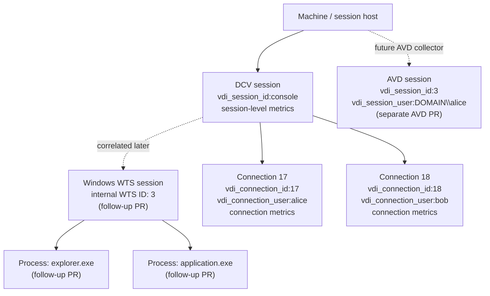
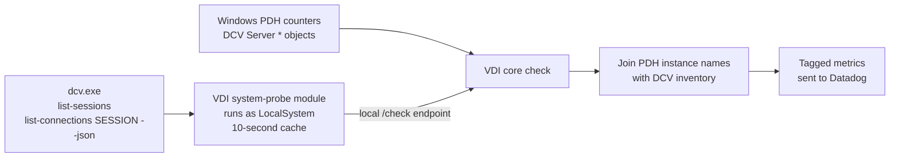

# Provider-neutral VDI sessions and DCV metric tagging

> [!NOTE]
> This document describes the intended design for PR #55010. This PR prepares
> the provider-neutral structure and implements Amazon DCV collection. Azure
> Virtual Desktop collection belongs in a separate follow-up PR. Some changes
> in this plan are not implemented yet.

## Entity model



The model follows these rules:

- A machine has provider-neutral VDI sessions.
- A session can exist with zero active connections.
- A session can have multiple simultaneous connections.
- Connections are optional because not every provider exposes a distinct
  connection entity.
- A connection user belongs to a specific connection.
- A session user is the Windows/WTS user logged into the desktop session.
- Processes belong to a Windows WTS session, not to a particular client
  connection.
- `vdi_session_id` is the only emitted session identity. A Windows/WTS ID can
  remain an internal correlation field without becoming a duplicate tag.

## Provider-neutral data model

PR #55010 should establish neutral names and optional Windows identity rather
than requiring every provider to look like DCV:

```go
type Session struct {
    ID               string
    Protocol         string
    WindowsSessionID *uint32
    User             string
    Owner            string
    State            string
    Connections      []Connection
}

type Connection struct {
    ID                string
    AuthenticatedUser string
    // Provider-specific connection metadata follows.
}

type ProviderInventory struct {
    Sessions []Session
}
```

`InventoryResponse.Providers` is keyed by provider, so `ProviderInventory` does
not repeat the same provider name inside each value.

The fields have explicit scopes:

- `Session.ID` is the single opaque, provider-scoped identity used for
  `vdi_session_id`. For DCV, this is the protocol session ID such as `console`.
- `WindowsSessionID` is optional and holds the local WTS session ID.
- `Session.User` is the Windows/WTS user logged into the session. It is not a
  connection user or process-token user.
- `Connection.AuthenticatedUser` is the identity authenticated for that one
  connection.
- `Connections` can be empty when a provider exposes sessions but not distinct
  connection objects.

For DCV in PR #55010, `ID` contains the DCV session ID, `WindowsSessionID` and
`User` remain empty until a proven WTS correlation exists, and `Connections`
contains the DCV connections.

For AVD in its separate PR, `ID` can be derived from the WTS session ID,
`WindowsSessionID` is populated, `User` is the logged-in WTS user, and
`Connections` can remain empty.

## How data is collected



There are two independent sources:

1. The Agent core check reads DCV Windows Performance Counters through PDH.
2. System-probe runs the privileged, read-only DCV CLI:

   - `dcv list-sessions`
   - `dcv list-connections <session> --json`

The core check correlates them using PDH instance names:

- Session: `<session-id>`
- Connection: `<session-id>:<connection-id>`
- Channel: `<session-id>:<connection-id>:<channel>`
- Imaging: `<session-id>` or `<session-id>:<encoder>`

The DCV CLI adds connection metadata that PDH does not provide:

- Authenticated user
- Transport
- Client mode
- Client version
- Client OS and architecture
- Connection time
- Last interaction time
- First-frame time

If inventory is unavailable, PDH metrics continue. Session and connection IDs
can still come from PDH instance names, but user and client metadata must not be
reused from stale inventory.

## Tag vocabulary

The abbreviations in this section are used in the metric tables.

### Machine tags (`M`)

Every metric and service check receives:

```text
vdi_provider:aws_workspaces
vdi_protocol:dcv
workspaces_product:personal|applications
```

For WorkSpaces Applications, where available:

```text
workspaces_fleet:<resource-name>
workspaces_image:<image-arn>
instance_type:<instance-type>
```

Normal Agent host identity and custom instance `tags` also apply.

### Session tag (`S`)

```text
vdi_session_id:<provider-scoped-session-id>
```

For example:

```text
vdi_session_id:console
```

`vdi_session_id` is the provider-neutral backend grouping key. The accompanying
`vdi_provider` and `vdi_protocol` tags define its namespace. It is enabled by
default through `collect_session_tags` for DCV metrics.

Do not emit a provider-specific or OS-specific alias when it would contain the
same identity. Native IDs such as the WTS session ID can remain structured
internal fields used to produce the canonical `vdi_session_id` after
correlation.

### Connection tag (`C`)

```text
vdi_connection_id:<provider-scoped-connection-id>
```

A connection metric always carries both `S` and `C`, never the connection ID
alone.

### Connection user tag (`U`)

```text
vdi_connection_user:<authenticated-user>
```

This is enabled by default through `collect_user_tags`. It appears only on
connection-scoped metrics. It must not be added to session, server, imaging, or
DCV-process metrics.

### Session user tag

```text
vdi_session_user:<windows-session-user>
```

This is reserved for a real Windows/WTS session user. PR #55010 does not emit
it because DCV-to-WTS correlation is not yet proven. The AVD follow-up can emit
it directly from WTS session data.

### Connection metadata tags (`CM`)

When available from fresh DCV inventory:

```text
dcv_transport:quic|websocket|...
dcv_client_mode:<mode>
dcv_client_version:<version>
dcv_client_os:<os>
dcv_client_arch:amd64|arm64
```

### Aggregate tag (`A`)

```text
vdi_aggregation:total
```

DCV multi-instance performance-counter objects can expose a synthetic `_Total`
instance. That instance summarizes the object and is not a real process,
session, connection, channel, or encoder. Its metrics receive `M + A` and no
entity identity tags. In particular, do not encode `_Total` as a
`vdi_session_id` or `vdi_connection_id`; doing so would create a fake backend
entity. The explicit aggregate tag also distinguishes this intentional absence
of identity from failed enrichment.

### Object-specific tags

```text
dcv_process:<PDH-process-instance>
dcv_agent_type:session_agent|system_agent|user_agent
dcv_channel:<channel-name>
dcv_encoder:<encoder-name>
```

## Server metrics

Source: `DCV Server` PDH object.

Tags: `M` only.

| Metric | Type |
|---|---|
| `vdi.dcv.server.active_sessions` | Gauge |
| `vdi.dcv.server.total_sessions` | Monotonic count |
| `vdi.dcv.server.active_connections` | Gauge |
| `vdi.dcv.server.total_connections` | Monotonic count |
| `vdi.dcv.server.idle_disconnections` | Monotonic count |
| `vdi.dcv.server.ungraceful_disconnections` | Optional monotonic count |
| `vdi.dcv.server.receive_rate` | Gauge |
| `vdi.dcv.server.received_bytes` | Monotonic count |
| `vdi.dcv.server.send_rate` | Gauge |
| `vdi.dcv.server.sent_bytes` | Monotonic count |
| `vdi.dcv.server.http_download_rate` | Gauge |
| `vdi.dcv.server.http_downloaded_bytes` | Monotonic count |
| `vdi.dcv.server.round_trip_time` | Gauge |
| `vdi.dcv.server.minimum_round_trip_time` | Gauge |
| `vdi.dcv.server.total_websocket_connections` | Monotonic count |
| `vdi.dcv.server.active_websocket_connections` | Gauge |
| `vdi.dcv.server.total_quic_connections` | Monotonic count |
| `vdi.dcv.server.active_quic_connections` | Gauge |

These describe the entire DCV server and must not carry session, connection, or
user tags.

## DCV process metrics

Source: `DCV Server Processes` PDH object.

Tags:

```text
M
dcv_process:<instance>
dcv_agent_type:<type>    # when recognized
```

| Metric | Type |
|---|---|
| `vdi.dcv.process.process_id` | Gauge |
| `vdi.dcv.process.cpu` | Gauge |
| `vdi.dcv.process.physical_memory` | Gauge |
| `vdi.dcv.process.virtual_memory` | Gauge |

These do not receive `vdi_session_id` yet because the DCV-process-to-session
mapping has not been proven.

The follow-up PR can use the process ID plus `ProcessIdToSessionId` to derive an
internal `WindowsSessionID`, then correlate that WTS session with a DCV session
and emit the canonical `vdi_session_id`.

## Session metrics

Source: `DCV Server Sessions` PDH object.

Tags: `M + S`.

No `vdi_connection_user`.

| Metric | Type |
|---|---|
| `vdi.dcv.session.duration` | Gauge |
| `vdi.dcv.session.total_pixels` | Gauge |
| `vdi.dcv.session.display_count` | Gauge |
| `vdi.dcv.session.active_connections` | Gauge |
| `vdi.dcv.session.total_connections` | Monotonic count |
| `vdi.dcv.session.idle_disconnections` | Monotonic count |
| `vdi.dcv.session.ungraceful_disconnections` | Optional monotonic count |
| `vdi.dcv.session.receive_rate` | Gauge |
| `vdi.dcv.session.received_bytes` | Monotonic count |
| `vdi.dcv.session.send_rate` | Gauge |
| `vdi.dcv.session.sent_bytes` | Monotonic count |
| `vdi.dcv.session.http_download_rate` | Gauge |
| `vdi.dcv.session.http_downloaded_bytes` | Monotonic count |
| `vdi.dcv.session.round_trip_time` | Gauge |
| `vdi.dcv.session.minimum_round_trip_time` | Gauge |
| `vdi.dcv.session.total_websocket_connections` | Monotonic count |
| `vdi.dcv.session.active_websocket_connections` | Gauge |
| `vdi.dcv.session.total_quic_connections` | Monotonic count |
| `vdi.dcv.session.active_quic_connections` | Gauge |

A disconnected session can continue emitting these metrics with
`vdi_session_id`, even when it has no current connections.

## Connection metrics

Source: `DCV Server Connections` PDH object.

Tags: `M + S + C + U + CM`.

`U` and `CM` are present only when the connection matches fresh DCV inventory.
The synthetic `_Total` instance is the exception: it receives `M + A`, without
session, connection, user, or client metadata tags.

| Metric | Type |
|---|---|
| `vdi.dcv.connection.duration` | Gauge |
| `vdi.dcv.connection.receive_rate` | Gauge |
| `vdi.dcv.connection.received_bytes` | Monotonic count |
| `vdi.dcv.connection.send_rate` | Gauge |
| `vdi.dcv.connection.sent_bytes` | Monotonic count |
| `vdi.dcv.connection.http_download_rate` | Gauge |
| `vdi.dcv.connection.http_downloaded_bytes` | Monotonic count |
| `vdi.dcv.connection.round_trip_time` | Gauge |
| `vdi.dcv.connection.minimum_round_trip_time` | Gauge |

Example:

```text
vdi.dcv.connection.round_trip_time:42
vdi_provider:aws_workspaces
vdi_protocol:dcv
workspaces_product:personal
vdi_session_id:console
vdi_connection_id:17
vdi_connection_user:alice@example.com
dcv_transport:quic
dcv_client_mode:classic
dcv_client_version:2026.0.11738
dcv_client_os:windows
dcv_client_arch:amd64
```

When the connection ends, the Agent stops emitting this connection's series.
It does not emit a numeric zero. The backend treats absence of fresh points as
disconnected.

Historical points retain the user and client metadata that were correct when
those points were collected.

To select only real connection series and exclude the aggregate:

```text
{!vdi_aggregation:total,vdi_connection_id:*}
```

To select only the aggregate series:

```text
{vdi_aggregation:total}
```

## Channel metrics

Source: `DCV Server Channels` PDH object.

Tags:

```text
M + S + C + U + CM
dcv_channel:<channel>
```

| Metric | Type |
|---|---|
| `vdi.dcv.channel.receive_rate` | Gauge |
| `vdi.dcv.channel.received_bytes` | Monotonic count |
| `vdi.dcv.channel.send_rate` | Gauge |
| `vdi.dcv.channel.sent_bytes` | Monotonic count |

Channels are connection-scoped, so they receive the connection's authenticated
user.

## Imaging metrics

Source: `DCV Server Imaging` PDH object.

Tags:

```text
M + S
dcv_encoder:<encoder>    # when present
```

No `vdi_connection_user`.

| Metric | Type |
|---|---|
| `vdi.dcv.imaging.grabbed_frames` | Gauge |
| `vdi.dcv.imaging.grabbed_frames_total` | Monotonic count |
| `vdi.dcv.imaging.sent_frames` | Gauge |
| `vdi.dcv.imaging.dropped_frames` | Gauge |
| `vdi.dcv.imaging.display_latency` | Optional gauge |
| `vdi.dcv.imaging.available_bandwidth` | Gauge |
| `vdi.dcv.imaging.encoded_frames` | Gauge |
| `vdi.dcv.imaging.encoding_time` | Gauge |
| `vdi.dcv.imaging.encoding_time_per_megapixel` | Gauge |
| `vdi.dcv.imaging.frame_quality` | Gauge |
| `vdi.dcv.imaging.frame_compression_ratio` | Gauge |

Imaging is session-scoped even if only one user is currently connected.

## Inventory-derived metrics

Source: the DCV CLI inventory returned by system-probe.

| Metric | Tags | Meaning |
|---|---|---|
| `vdi.session.count` | `M` | Number of DCV sessions in fresh inventory |
| `vdi.connection.discovered` | `M` | Distinct connections seen in inventory or PDH |
| `vdi.connection.enriched` | `M` | Connections matched to an authenticated user |
| `vdi.connection.enrichment_coverage` | `M` | Percentage of discovered connections enriched |
| `vdi.connection.connected` | `M + S + C + U + CM` | Emitted as `1` while the connection is present |
| `vdi.connection.idle_time` | `M + S + C + U + CM` | Seconds since the connection's last interaction |
| `vdi.connection.time_to_first_frame` | `M + S + C + U + CM` | Time between connection and first rendered frame |

`vdi.connection.connected` disappears when the connection disappears. It does
not emit a final `0`.

## Health service checks

| Service check | Tags | Meaning |
|---|---|---|
| `vdi.dcv.health` | `M` | Whether required DCV PDH counters produced usable samples |
| `vdi.session_enrichment.health` | `M` | Whether privileged DCV inventory and connection enrichment are healthy |

Inventory failures initially produce a warning and become critical after
`inventory_stale_ttl`, currently 300 seconds by default. Stale user identities
are never attached to new metric points.

## Changes needed in PR #55010

1. Rename the DCV-shaped model types:
   - `ProtocolSession` becomes `Session`.
   - `DesktopConnection` becomes `Connection`.
   - Connections remain optional.
2. Give `Session` one provider-scoped `ID` plus optional internal fields for its
   Windows/WTS identity, session user, owner, and state. Do not duplicate the
   same identifier in another emitted tag or protocol-specific field.
3. Add only `vdi_session_id` as the provider-neutral session grouping tag. The
   existing `vdi_provider` and `vdi_protocol` tags define its namespace.
4. Rename the emitted connection identity from `dcv_connection_id` to
   `vdi_connection_id` and use `Connection.ID` as its single source.
5. Remove connection-user enrichment from `sessionTags`.
6. Keep `vdi_connection_user` only on:
   - DCV connection metrics
   - DCV channel metrics
   - Inventory-derived per-connection metrics
7. Reserve `vdi_session_user` for an actual Windows/WTS session user. Do not
   emit it for DCV until the DCV-to-WTS mapping is proven.
8. Update the example configuration so it no longer says users are attached to
   "unambiguous session metrics."
9. Remove the unused top-level WTS inventory and unconditional WTS enumeration
   from the DCV runtime path:
   - `WindowsInventory`
   - WTS enumeration in the system-probe module
10. Keep the reusable `pkg/vdi/session/windows` primitives for the upcoming AVD
   collector, but do not execute them during DCV collection.
11. Make system-probe collectors provider-oriented rather than exposing a
    DCV-shaped module contract:

   ```text
   VDI system-probe module
     ├── AWS WorkSpaces/DCV collector
     │     └── Session
     │           └── zero or more Connections
     └── future AVD/WTS collector
           └── Session
                 └── zero or more Connections
   ```

12. Update tests to assert that session and imaging metrics never receive
   `vdi_connection_user`, even when every active connection has the same user.
13. Ensure imaging metrics derive `vdi_session_id` from the PDH instance
    independently of whether the session currently has active connections.
14. Add model tests proving that a provider session with zero connections is
    valid.

## Separate AVD provider PR

AVD collection is explicitly out of scope for PR #55010. Its PR will plug a
WTS-backed collector into the provider-neutral structure established here.

The AVD collector should:

- Enumerate local Windows sessions through WTS.
- Populate `Session.ID` and `WindowsSessionID` from the WTS session ID.
- Populate `Session.User` from the WTS domain and username.
- Populate session state, logon time, and last-input time where available.
- Emit `vdi_provider:azure_virtual_desktop` and `vdi_protocol:rdp`.
- Emit `vdi_session_id` and `vdi_session_user` on applicable AVD session
  metrics. Keep the WTS ID internal when it is the source of the same
  `vdi_session_id` value.
- Leave `Connections` empty unless AVD exposes a distinct, reliable connection
  entity.
- Add AVD-specific metrics and backend behavior without changing the shared
  session model.

## Separate DCV-to-WTS/process-enrichment PR

Another follow-up will introduce DCV-to-Windows-session and process enrichment:

```text
DCV protocol session
        ↕ proven correlation
Windows WTS session
        ↕ ProcessIdToSessionId
Processes
```

That PR should:

- Use the retained WTS primitives under system-probe.
- Populate the internal `WindowsSessionID` on a DCV session only after an exact
  mapping, without automatically emitting it as a second session-ID tag.
- Populate `vdi_session_user` only from the matched Windows/WTS session user,
  never from a DCV connection user.
- Prove the DCV-session-to-WTS-session mapping.
- Resolve each process's WTS session.
- Protect against PID reuse using PID plus process creation time.
- Add process-session enrichment without assigning processes to individual
  connections.
- Decide separately whether authenticated connection users should ever enrich
  process data.
