# RFC: Datadog Agent Process Manager

| Status | Draft |
|--------|-------|
| Author | José Manuel Almaza |
| Created | 2025-01-XX |
| Last Updated | 2025-01-XX |

## Table of Contents

1. [Overview](#1-overview)
   - 1.1 [Current Architecture](#11-current-architecture)
   - 1.2 [Target Architecture](#12-target-architecture)
   - 1.3 [Key Benefits](#13-key-benefits)
   - 1.4 [Architecture Changes](#14-architecture-changes)
2. [Architecture & Components](#2-architecture--components)
3. [Process Lifecycle Management](#3-process-lifecycle-management)
4. [Configuration System](#4-configuration-system)
5. [API Design](#5-api-design)
6. [Platform-Specific Considerations](#6-platform-specific-considerations)
7. [Installation & Upgrade Process](#7-installation--upgrade-process)
8. [Observability & Telemetry](#8-observability--telemetry)
9. [Security Model](#9-security-model)
10. [Migration Strategy](#10-migration-strategy)
11. [Open Questions](#11-open-questions)
12. [Appendices](#12-appendices)

---

## 1. Overview

The Datadog Agent is moving from a multi-service architecture to a unified process manager architecture. This shift centralizes process lifecycle management into a single, agent-controlled component, ensuring consistent operation across all platforms.

> **📋 Scope Note**: The initial implementation (v1) will target **Linux bare-metal/VM environments only**. Kubernetes, macOS, and Windows support will be added in subsequent phases. See [Section 10: Migration Strategy](#10-migration-strategy) for the phased rollout plan.

### 1.1 Current Architecture

- **Multiple OS-managed services**: core-agent, trace-agent, process-agent, security-agent, system-probe
- **Platform-specific management**: systemd (Linux), launchd (macOS), SCM (Windows), kubelet (Kubernetes)
- **External control**: OS service managers handle start/stop, restart policies, and dependencies


> 📄 **Diagram source**: [`diagrams/current-architecture.mmd`](diagrams/current-architecture.mmd)

**Platform-Specific Implementations**:

| Platform | Service Manager | Configuration | Limitations |
|----------|----------------|---------------|-------------|
| Linux | systemd | `.service` unit files | Different behavior per distro |
| macOS | launchd | `.plist` files | Limited dependency support |
| Windows | SCM | Registry + service config | Different failure recovery model |
| Kubernetes | kubelet | Pod specs | Managed by orchestrator |

### 1.2 Target Architecture

- **Single OS-managed service**: process-manager (`datadog-agent`)
- **Unified process management**: All agent components managed as child processes
- **Agent-controlled policies**: Restart strategies, dependencies, and privileges defined and enforced by the agent


> 📄 **Diagram source**: [`diagrams/target-architecture.mmd`](diagrams/target-architecture.mmd)

**Service Hierarchy**:

- **OS Service Manager** (PID 1 / init / systemd / launchd / SCM)
  - Starts/stops the `datadog-agent` service like any other system service
  - Restarts on crash using a simple policy
  - Has **no knowledge** of child processes managed by the Process Manager
  
- **Process Manager** (`dd-procmgrd`) — *supervised by OS Service Manager*
  - Manages all agent component processes as children
  - Enforces restart policies with exponential backoff
  - Resolves dependencies and determines correct start order
  - Monitors health via configurable probes
  - Tracks resource usage (CPU, memory, PIDs)
  - Handles socket activation for on-demand services
  
- **Agent Processes** — *supervised by Process Manager*
  - Core Agent, Trace Agent, Process Agent, Security Agent, System Probe, etc.
  - Each process has its own restart policy, dependencies, and health checks
  - Processes can declare dependencies on other processes (`requires`, `wants`, `binds_to`)

**Process Flow**:

*Startup sequence*:
1. OS service manager starts `datadog-agent` service
2. Process manager binary launches
3. Loads configuration files from `/etc/datadog-agent/process-manager/processes.d/`
4. Resolves dependencies and creates ordered process list
5. Spawns child processes in dependency order
6. Monitors process health and enforces restart policies

*Shutdown sequence*:
1. OS service manager signals `datadog-agent` service (SIGTERM)
2. Process manager receives signal
3. Stops child processes in reverse dependency order
4. Enforces shutdown timeouts (graceful → forceful)
5. Process manager exits cleanly

**Architecture Components (Linux/Windows/macOS)**:

| Component | Role | Responsibilities |
|-----------|------|------------------|
| **Service Manager (OS)** | System service controller | Starts/stops the Agent Process Manager like any other system service and restarts it on failure |
| **Agent Process Manager** | Central orchestrator (daemon) | • Spawns, supervises, and restarts the Agent Processes<br/>• Reads/writes configuration under `/etc/datadog-agent/process-manager/processes.d/`<br/>• Answers lifecycle/status commands from CLI/Installer |
| **Agent Installer** | Installer/upgrader | Creates stable and experiment versions of the agent in the same way it does today |

### 1.3 Key Benefits

| Benefit | Description | v1 (Linux) |
|---------|-------------|:----------:|
| **Consistency** | Same behavior across all platforms (Linux first, then macOS, Windows) | ✅ |
| **Control** | Agent-level policy enforcement without external configuration | ✅ |
| **Security** | Explicit, consistent privilege separation | ✅ |
| **Observability** | Unified metrics and events for all managed processes | ✅ |
| **Simplicity** | Single service to manage instead of multiple OS services | ✅ |
| **Reliability** | Centralized restart policies and dependency management | ✅ |

### 1.4 Architecture Changes

| Aspect | Before | After |
|--------|--------|-------|
| OS visibility | Multiple services (core-agent, trace-agent, etc.) | Single service (`datadog-agent`) |
| Service manager | OS (systemd/launchd/SCM) | Process Manager |
| Configuration | OS-specific service units | Unified YAML configs |
| Control interface | OS tools (systemctl, sc.exe, launchctl) | Agent CLI + OS tools for top-level service |
| Dependency management | OS service dependencies | Agent-defined process dependencies |
| Restart policies | OS service unit configuration | Process manager policies |

**Component Responsibilities**:

| Component | OS Service Manager | Process Manager | Agent |
|-----------|-------------------|-----------------|-------|
| Start/Stop (top-level) | ✓ | ✗ | ✗ |
| Start/Stop (components) | ✗ | ✓ | ✗ |
| Restart on Failure | ✗ | ✓ | ✗ |
| Dependencies | ✗ | ✓ | ✗ |
| Resource Limits | ✗ | ✓ | ✗ |
| Health Monitoring | ✗ | ✓ | ✗ |
| Configuration | ✗ | ✗ | ✓ |

**Configuration Separation**:

| Configuration | Purpose | Location |
|--------------|---------|----------|
| **Agent Configuration** | Agent behavior, integrations, API keys | `/etc/datadog-agent/datadog.yaml` (unchanged) |
| **Process Manager Daemon Config** | Daemon settings (log level, socket path, etc.) | `/etc/datadog-agent/process-manager.yaml` |
| **Process Definitions** | Per-process lifecycle, restart policies, dependencies | `/etc/datadog-agent/process-manager/processes.d/*.yaml` |

The Agent configuration remains unchanged. The Process Manager introduces two new configuration layers:
- **Daemon config**: How the process manager itself behaves (logging, API socket, etc.)
- **Process definitions**: How each managed process is supervised (restart policies, dependencies, health checks)

---

## 2. Architecture & Components

The Process Manager follows a **hexagonal (ports and adapters) architecture** with seven specialized components working together to deliver reliable, observable, and maintainable process lifecycle management.

> 🔧 **PoC Implementation**: The daemon is implemented in Rust using `tokio` for async runtime. The CLI communicates with the daemon via gRPC over Unix socket (`/var/run/datadog/process-manager.sock`).

### 2.1 Internal Architecture

The Process Manager consists of two binaries:

| Binary | Type | Purpose |
|--------|------|---------|
| `dd-procmgrd` | Daemon (long-running) | Supervises agent processes, enforces policies, serves API |
| `dd-procmgr` | CLI (one-shot) | Sends commands to the daemon, displays status/logs |

The daemon (`dd-procmgrd`) is organized into four layers following hexagonal architecture:

| Layer | Purpose | Key Components |
|-------|---------|----------------|
| **Adapters (Driving)** | External interfaces | gRPC Server, REST Server, CLI Client |
| **Application** | Use case orchestration | Application, Commands, Queries |
| **Domain** | Core business logic | Services, Entities, Ports |
| **Infrastructure** | External integrations | Repository, Executor, Config Loader |

**Core Domain Services**:

- **Supervision Service** — Single coordinator for all lifecycle management
  - Combines process watching, health monitoring, and restart logic
  - Enforces restart policies with exponential backoff
  - Handles `binds_to` cascading stops

- **Health Monitoring Service** — Continuous health verification
  - HTTP, TCP, and Exec probes
  - Configurable intervals, timeouts, and thresholds
  - Stops unhealthy processes (supervision handles restart)

- **Process Watching Service** — Low-level exit detection
  - Uses `waitpid` to detect child process exits
  - Emits events consumed by Supervision Service

- **Dependency Resolution Service** — Start/stop ordering
  - Validates dependencies exist and detects cycles
  - Computes topological sort for start order
  - Reverse order used for shutdown

- **Socket Activation Service** — On-demand process startup
  - Pre-creates listening sockets (TCP, Unix)
  - Starts processes when connections arrive

> 📄 **Diagram source**: [`diagrams/high-level-architecture.mmd`](diagrams/high-level-architecture.mmd)

### 2.2 Hexagonal Architecture

The daemon follows the hexagonal (ports and adapters) pattern, with four distinct layers:

**Adapters (Driving)** — External interfaces that invoke the application:

| Adapter | Technology | Purpose |
|---------|------------|---------|
| gRPC Server | tonic | Primary API for CLI and programmatic access |
| REST Server | axum | Alternative HTTP/JSON API |
| CLI Client | `dd-procmgr` | One-shot commands for operators |

**Application Layer** — Orchestrates use cases via the `Application` facade:

| Use Case | Type | Description |
|----------|------|-------------|
| CreateProcess | Command | Register a new process definition |
| StartProcess | Command | Start a process (resolves deps, handles conflicts) |
| StopProcess | Command | Stop a running process |
| RestartProcess | Command | Stop then start a process |
| UpdateProcess | Command | Modify process configuration |
| DeleteProcess | Command | Remove process definition |
| LoadConfig | Command | Load processes from YAML config |
| ListProcesses | Query | List all registered processes |
| GetProcessStatus | Query | Get detailed status of a process |

**Domain Layer** — Core business logic (see section 2.1 for service details):

- **Services**: Supervision, Health Monitoring, Dependency Resolution, Conflict Resolution, Socket Activation, Config Parsing
- **Entities**: `Process`, `HealthCheck`, `ResourceLimits`, `SocketConfig`
- **Ports (Interfaces)**: `ProcessRepository` (storage), `ProcessExecutor` (execution)

**Infrastructure Layer (Driven Adapters)** — Implementations of ports:

| Adapter | Implements | Technology |
|---------|------------|------------|
| In-Memory Repository | `ProcessRepository` | `DashMap` concurrent hashmap |
| Tokio Process Executor | `ProcessExecutor` | `tokio::process`, cgroup v2 |
| Health Check Executor | `HealthCheckExecutor` | HTTP client, TCP connect, command exec |
| Resource Usage Reader | `ResourceUsageReader` | cgroup v2, `rlimit` fallback |

> 📄 **Diagram source**: [`diagrams/hexagonal-architecture.mmd`](diagrams/hexagonal-architecture.mmd)

### 2.3 Component Details

#### 2.3.1 Process Supervision Service (Central Coordinator)

The Process Supervision Service is the heart of the process manager. It coordinates all lifecycle management operations.

> 🔧 **PoC Implementation**: Uses `tokio::select!` to await process exit events from an unbounded channel. When a process exits, it determines whether to restart based on policy, calculates exponential backoff delay using `tokio::time::sleep`, and spawns the new process via `tokio::process::Command`.

**Responsibilities**:
- Event-driven process exit monitoring (no polling)
- Automatic restart handling based on policy
- Exponential backoff with configurable delays
- Start limit protection (prevent restart thrashing)
- Health monitoring coordination
- BindsTo cascade (stop dependent processes)

**Process States**:

| State | Description |
|-------|-------------|
| `Created` | Process registered but not started |
| `Starting` | Process is being spawned |
| `Running` | Process is running (has PID) |
| `Stopping` | Stop requested, waiting for exit |
| `Stopped` | Explicitly stopped (no restart) |
| `Exited` | Exited with code 0 (success) |
| `Failed` | Exited with code ≠ 0 (failure) |
| `Crashed` | Start limit exceeded (terminal, manual intervention required) |

> 📄 **State diagram**: [`diagrams/process-states.mmd`](diagrams/process-states.mmd)

**Process Types**:

| Type | Ready When | Use Case |
|------|------------|----------|
| `simple` | Immediately after fork | Long-running services (default) |
| `oneshot` | After process exits | Setup tasks, migrations |
| `forking` | After parent exits | Legacy daemons that fork |
| `notify` | After sd_notify (future) | Services with explicit readiness |

**Restart Policies**:

Determines when the process manager should automatically restart a process after it exits. Combined with exponential backoff and start limits (below), this provides fine-grained control over process lifecycle.

| Policy | Restarts On | Final State (if no restart) | Use Case |
|--------|-------------|----------------------------|----------|
| `never` | Never | `Exited` (exit=0) or `Failed` (exit≠0) | One-shot tasks, migrations |
| `always` | Any exit (0 or non-zero) | — (always restarts) | Critical long-running services |
| `on-failure` | Non-zero exit only | `Exited` (exit=0) | Services that should stay up but exit cleanly on purpose |
| `on-success` | Zero exit only | `Failed` (exit≠0) | Periodic jobs that retry until success |

**Decision Flow** ([source](diagrams/restart-decision-flow.mmd)):


**Configuration Example**:
```yaml
# Critical service that must always run
name: datadog-agent
restart: always

# One-time setup task
name: init-config
restart: never

# Service that retries on failure but stops on clean exit
name: data-processor
restart: on-failure
```

**Exponential Backoff**:

When a process fails repeatedly, the restart delay doubles each time to prevent thrashing (rapid restart loops that consume resources without recovery). The delay is capped at a maximum value.

```
Delay = min(restart_sec × 2^(failures-1), restart_max_delay_sec)
```

| Parameter | Default | Description |
|-----------|---------|-------------|
| `restart_sec` | 1 | Base delay before first restart (seconds) |
| `restart_max_delay_sec` | 60 | Maximum delay cap (seconds) |
| `runtime_success_sec` | 0 | Runtime threshold to reset failure counter (0 = use health check instead) |

**Runtime Success Threshold**:

The `runtime_success_sec` parameter determines how long a process must run before it's considered "stable". Once the process has been running for this duration, the failure counter resets to zero.

| `runtime_success_sec` | Health Check | Failure counter resets when... |
|----------------------|--------------|--------------------------------|
| `> 0` | Any | Process runs for X seconds |
| `= 0` (disabled) | Configured | Health check returns `Healthy` |
| `= 0` (disabled) | Not configured | Clean exit only (exit code 0) |

This ensures that:
- A process that runs for a while before crashing doesn't accumulate failures indefinitely
- Only rapid crashes (immediate failures) trigger escalating backoff delays
- Health checks can serve as the "successful run" indicator when `runtime_success_sec=0`

**Start Limit Protection**:

Prevents infinite restart loops. If a process is restarted too many times within a time window, it enters the `Crashed` state (terminal - requires manual intervention).

| Parameter | Default | Description |
|-----------|---------|-------------|
| `start_limit_burst` | 5 | Max restarts allowed within interval |
| `start_limit_interval_sec` | 10 | Time window for counting restarts (seconds) |

**Combined Example** with `restart_sec=2`, `restart_max_delay_sec=60`, `start_limit_burst=5`, `start_limit_interval_sec=120`:

| Failure # | Calculation | Delay | Cumulative Wait | Starts in last 120s |
|-----------|-------------|-------|-----------------|---------------------|
| 1st | 2 × 2^0 = 2 | 2s | 2s | 1 |
| 2nd | 2 × 2^1 = 4 | 4s | 6s | 2 |
| 3rd | 2 × 2^2 = 8 | 8s | 14s | 3 |
| 4th | 2 × 2^3 = 16 | 16s | 30s | 4 |
| 5th | 2 × 2^4 = 32 | 32s | 62s | 5 ≥ `start_limit_burst` |
| 6th | **Start Limit exceeded** | — | Process enters `Crashed` state | — |

**How it works**:
- **Exponential Backoff**: Spaces out restart attempts (2s → 4s → 8s → 16s → 32s...)
- **Start Limit**: Counts how many starts occurred within `start_limit_interval_sec` (sliding window)
  - At 62s cumulative, all 5 starts are within the 120s window → limit exceeded on 6th attempt

**Why these mechanisms work together?**
- **Immediate crashes** (fails on startup): Failures accumulate → backoff delays increase → start limit eventually triggers → `Crashed` state
- **Slow crashes** (runs long enough to be healthy or reach `runtime_success_sec`): Failure counter resets → backoff stays minimal → restarts continue indefinitely (expected behavior for processes that work but occasionally fail)
- **Start limit**: Catches pathological cases where even with backoff, too many restarts happen in a short window

**Reset behavior**:
- **Runtime success**: After running for `runtime_success_sec`, failure counter resets to zero (while still running)
- **Health check success**: If `runtime_success_sec=0` and health check passes (`Healthy`), failure counter resets
- **Clean exit**: If process exits with code 0 (`Exited` state), failure counter resets
- **Start times**: Old start times naturally expire as they fall outside the `start_limit_interval_sec` window

**Recovery from `Crashed` state**:
- `Crashed` is a **terminal state** — the process will **not** restart automatically
- Manual intervention required: `dd-procmgr start <process-name>` or system restart
- This prevents runaway restart loops from consuming resources indefinitely

#### 2.3.2 Health Monitoring Service

Monitors process health using configurable probes (Docker/Kubernetes-style).

> ⚠️ **Scope Note**: The process manager only *checks* health endpoints—it does not implement them. Each managed process (e.g., Datadog Agent) is responsible for exposing its own health endpoint. How processes implement their health endpoints is outside the scope of this RFC.

> 🔧 **PoC Implementation**: Spawns a `tokio` task per monitored process that runs a probe at configured intervals. HTTP probes use `reqwest`, TCP probes use `tokio::net::TcpStream::connect`, Exec probes use `tokio::process::Command`. When `restart_after` consecutive failures occur, the process is stopped (supervision service handles restart).

**Probe Types**:

The process manager supports three types of health probes, inspired by Docker and Kubernetes health checks. Each probe runs at a configurable interval and determines whether the process is healthy.

| Type | Description | Use Case |
|------|-------------|----------|
| HTTP | Check HTTP endpoint returns expected status (2xx) | Web services, APIs |
| TCP | Check TCP port is accepting connections | Databases, message queues |
| Exec | Run command and check exit code (0 = healthy) | Custom health scripts |

**How Each Probe Works**:

- **HTTP Probe**: Sends an HTTP request (default: `GET`) to the configured endpoint. The probe succeeds if the response status code matches `http_expected_status` (default: 200) within the timeout. Useful for services that expose a `/health` or `/ready` endpoint.

- **TCP Probe**: Attempts to establish a TCP connection to `tcp_host:tcp_port`. The probe succeeds if the connection is established within the timeout (doesn't send or receive data). Useful for checking if a service is listening on a port (databases, caches, message brokers).

- **Exec Probe**: Runs the specified command (`exec_command` with `exec_args`) inside the process manager's environment. The probe succeeds if the command exits with code 0 within the timeout. Useful for custom health checks that require shell scripts or complex logic.

**Common Parameters**:

| Parameter | Default | Description |
|-----------|---------|-------------|
| `type` | — | Probe type: `http`, `tcp`, or `exec` (required) |
| `interval` | 30 | Seconds between health checks |
| `timeout` | 5 | Seconds before probe times out |
| `retries` | 3 | Consecutive failures before marking unhealthy |
| `start_period` | 0 | Grace period after process start (failures ignored) |
| `restart_after` | 0 | Kill & restart after N consecutive failures (0 = never) |

**Type-Specific Parameters**:

| Type | Parameter | Description |
|------|-----------|-------------|
| HTTP | `http_endpoint` | URL to check (e.g., `http://localhost:8080/health`) |
| HTTP | `http_method` | HTTP method (default: `GET`) |
| HTTP | `http_expected_status` | Expected status code (default: `200`) |
| TCP | `tcp_host` | Host to connect to (default: `localhost`) |
| TCP | `tcp_port` | Port to check |
| Exec | `exec_command` | Command to run |
| Exec | `exec_args` | Arguments for the command |

**Health Statuses**:

| Status | Description |
|--------|-------------|
| `Unknown` | Initial state when process is created, before health monitoring starts. Also used when no health check is configured. |
| `Starting` | Process is within `start_period` grace period. Probes are skipped during this time to allow the process to initialize. |
| `Healthy` | Most recent probe succeeded. If `runtime_success_sec=0`, restart failure counter is also reset. |
| `Unhealthy` | Probe failed (after `retries` consecutive failures). If `restart_after` threshold is reached, the process is killed. |

**Health Status Flow** ([source](diagrams/health-status-flow.mmd)):

```mermaid
stateDiagram-v2
    [*] --> Unknown: Process created

    note right of Unknown: Initial state before<br/>health monitoring starts

    Unknown --> Starting: Monitoring starts (start_period > 0)
    Unknown --> Healthy: First probe succeeds (start_period = 0)
    Unknown --> Unhealthy: First probe fails (start_period = 0)

    note right of Starting: Grace period - probes skipped

    Starting --> Healthy: start_period ends + probe succeeds
    Starting --> Unhealthy: start_period ends + probe fails

    Healthy --> Unhealthy: Probe fails (retries exceeded)
    Unhealthy --> Healthy: Probe succeeds

    Unhealthy --> [*]: restart_after reached → Kill & Restart
```



**Configuration Example**:
```yaml
health_check:
  type: http
  http_endpoint: http://localhost:8080/health
  interval: 30          # Check every 30 seconds
  timeout: 5            # Timeout after 5 seconds
  retries: 3            # Mark unhealthy after 3 failures
  start_period: 60      # Grace period after start
  restart_after: 3      # Kill & restart after 3 consecutive failures
```

#### 2.3.3 Dependency Resolution Service

Manages systemd-like dependencies between processes, ensuring correct startup order and handling lifecycle relationships.

> 🔧 **PoC Implementation**: Uses Kahn's algorithm for topological sort. Builds a dependency graph from `requires`, `binds_to`, `after`, and `before` directives (note: `wants` is validated but doesn't affect ordering since it's a soft dependency). Computes in-degrees and processes nodes with zero in-degree first. Detects cycles by checking if result length equals total processes.

**Dependency Directives**:

The process manager supports six dependency directives inspired by systemd. These control startup order, lifecycle coupling, and mutual exclusion.

| Directive | Auto-Start? | Fails if can't start? | Cascade Stop? | Purpose |
|-----------|-------------|----------------------|---------------|---------|
| `requires` | ✓ Yes | ✓ Yes (hard fail) | ✗ No | Hard dependency - must have |
| `wants` | ✓ Yes | ✗ No (continues) | ✗ No | Soft dependency - nice to have |
| `binds_to` | ✓ Yes | ✓ Yes (hard fail) | ✓ Yes | Tightly coupled lifecycle |
| `conflicts` | ✗ No | ✗ No | ✗ No | Mutual exclusion (see 2.3.4) |
| `after` | ✗ No | ✗ No | ✗ No | Ordering only - start after |
| `before` | ✗ No | ✗ No | ✗ No | Ordering only - start before |

**How Each Directive Works**:

- **`requires`**: If process A requires B, starting A will first start B. If B fails to start, A won't start either. However, if B stops later, A continues running.

- **`wants`**: Like `requires`, but A will start even if B fails to start. Use for optional enhancements (e.g., "wants logging service but can run without it").

- **`binds_to`**: Strongest coupling - if B stops (for any reason), A is also stopped. Use when A cannot function without B (e.g., agent requires its IPC socket server).

- **`after`/`before`**: Pure ordering hints. `A after B` means "if both are starting, start B first". Doesn't create a dependency - A can start without B existing.

- **`conflicts`**: Mutual exclusion - handled by Conflict Resolution Service (2.3.4).

**Start and Stop Order**:

The process manager computes startup order using topological sort based on dependency directives. **Stop order is the reverse of start order** to ensure graceful shutdown.

| If Start Order Is | Then Stop Order Is |
|-------------------|-------------------|
| `db` → `cache` → `app` | `app` → `cache` → `db` |

How each directive affects ordering:

| Directive | Affects Start Order? | Affects Stop Order? | Stop Behavior |
|-----------|---------------------|---------------------|---------------|
| `requires` | ✓ Yes (start dep first) | ✓ Yes (stop dep last) | Dependent stops before dependency |
| `wants` | ✓ Yes (start dep first) | ✓ Yes (stop dep last) | Dependent stops before dependency |
| `binds_to` | ✓ Yes (start dep first) | ✓ Yes (cascade) | **Immediate cascade**: if dep stops, dependent stops too |
| `after` | ✓ Yes (ordering only) | ✓ Yes (reverse) | Stop in reverse order |
| `before` | ✓ Yes (ordering only) | ✓ Yes (reverse) | Stop in reverse order |
| `conflicts` | ✗ No | ✗ No | No effect on ordering |

**Example**: Given `trace-agent` with `after: [datadog-agent]`:
- **Start**: `datadog-agent` starts first, then `trace-agent`
- **Stop**: `trace-agent` stops first, then `datadog-agent`

> 🔧 **PoC Status**: Start order is implemented. Stop order reversal for daemon shutdown is planned.

**Configuration Example**:
```yaml
# trace-agent.yaml
name: trace-agent
requires:
  - datadog-agent      # Hard dependency - must be running
wants:
  - dogstatsd          # Soft dependency - nice to have
after:
  - datadog-agent      # Start order - agent first
  - dogstatsd
```

**Topological Sort Algorithm**:

Uses Kahn's algorithm to compute correct start order, detecting circular dependencies:

```
1. Build dependency graph from all directives
2. Calculate in-degree for each process
3. Add processes with in-degree 0 to queue
4. While queue not empty:
   a. Dequeue process, add to result
   b. For each dependent: decrease in-degree
   c. If in-degree becomes 0, add to queue
5. If result length ≠ total processes → Cycle detected (error)
```

([source](diagrams/topological-sort.mmd)):

```mermaid
flowchart TD
    A[Build dependency graph] --> B[Calculate in-degree<br/>for each process]
    B --> C[Add processes with<br/>in-degree 0 to queue]
    C --> D{Queue empty?}
    
    D -->|No| E[Dequeue process]
    E --> F[Add to result]
    F --> G[For each dependent:<br/>decrease in-degree]
    G --> H{In-degree = 0?}
    H -->|Yes| I[Add to queue]
    H -->|No| D
    I --> D
    
    D -->|Yes| J{Result length =<br/>total processes?}
    J -->|Yes| K[✓ Return ordered list]
    J -->|No| L[✗ Circular dependency error]

    style K fill:#28a745,color:#fff
    style L fill:#dc3545,color:#fff
```



#### 2.3.4 Conflict Resolution Service

Handles mutual exclusion between processes, ensuring that incompatible processes cannot run simultaneously. This is essential for scenarios like stable vs. experimental agent variants.

> 🔧 **PoC Implementation**: Before starting a process, iterates through all registered processes to find conflicts (both forward: "A conflicts with B" and reverse: "B conflicts with A"). Stops conflicting processes with graceful shutdown (SIGTERM → wait `timeout_stop_sec` → SIGKILL if needed) before proceeding with start.

**How It Works**:

1. Process A declares `conflicts: [B]` in its configuration
2. When starting A, the conflict resolver checks if B is running
3. If B is running:
   - Send SIGTERM to B
   - Wait up to `timeout_stop_sec` (default: 90s) for graceful shutdown
   - If B doesn't stop within timeout, send SIGKILL
4. Only after B stops successfully, A is started
5. If B fails to stop (even after SIGKILL), A's start is aborted

**Stop Timeout Configuration**:

| Parameter | Default | Description |
|-----------|---------|-------------|
| `timeout_stop_sec` | 90 | Max seconds to wait for graceful shutdown before SIGKILL |

**Key Behaviors**:

| Behavior | Description |
|----------|-------------|
| Bidirectional | If A conflicts with B, B implicitly conflicts with A (systemd semantics) |
| Stop-before-start | Conflicting process is stopped before new process starts |
| Strict enforcement | If stop fails, new process won't start |
| No auto-restart | Stopped conflicting process is not automatically restarted |

**Use Case: Agent Variants**:

The primary use case is ensuring only one variant of the Datadog Agent runs at a time:

```yaml
# datadog-agent.yaml (stable)
name: datadog-agent
conflicts:
  - datadog-agent-exp

# datadog-agent-exp.yaml (experimental)
name: datadog-agent-exp
conflicts:
  - datadog-agent
```

**Behavior**:
- Starting `datadog-agent` automatically stops `datadog-agent-exp`
- Starting `datadog-agent-exp` automatically stops `datadog-agent`
- Only one can run at a time (mutual exclusion guaranteed)

#### 2.3.5 Socket Activation Service

Provides systemd-compatible socket activation for on-demand service startup. Instead of starting services at boot, the process manager holds open sockets and starts services only when connections arrive. This enables zero-downtime restarts and reduced resource usage for rarely-used services.

> 🔧 **PoC Implementation**: Pre-creates sockets using `tokio::net::TcpListener` or `tokio::net::UnixListener`. Uses `select()` to detect incoming connections. On connection, sends activation event via channel, spawns the service process, and passes socket FDs via systemd-compatible environment variable (`LISTEN_FDS`) and Datadog-specific variables (`DD_APM_NET_RECEIVER_FD` for trace-agent compatibility).

**Socket Types**:

| Type | Description | Use Case |
|------|-------------|----------|
| TCP | Listen on TCP port | Network services, APIs |
| Unix | Listen on Unix domain socket | Local IPC, agent communication |

**Activation Modes**:

| Mode | Description |
|------|-------------|
| `Accept=no` (default) | Pass listening socket to service; service handles `accept()` |
| `Accept=yes` | Process manager calls `accept()`, spawns service per connection |

**How It Works**:

1. Process Manager creates listening socket at startup
2. Socket waits for incoming connections
3. On first connection → service starts automatically
4. Service receives socket via `LISTEN_FDS` and `DD_APM_NET_RECEIVER_FD` environment variables
5. If service crashes → socket remains open (no connection loss)
6. Next connection → triggers automatic restart

**Configuration Example**:
```yaml
# datadog-agent.socket.yaml
name: datadog-agent
socket:
  type: unix
  path: /var/run/datadog/agent.sock
  mode: 0660
```

**Environment Variables** (systemd-compatible):

| Variable | Description |
|----------|-------------|
| `LISTEN_FDS` | Number of inherited sockets (FDs start at 3) |

#### 2.3.6 Config Parsing Service

Translates YAML configuration files into domain commands, supporting directory-based configuration with one file per process.

> 🔧 **PoC Implementation**: Uses `serde` with `serde_yaml` for deserialization. `ConfigParsingService` parses `ProcessConfig` structs into `CreateProcessCommand` objects. Validates and parses health checks, resource limits, kill modes, path conditions, socket configs, and restart policies. Files are sorted alphabetically for deterministic load order.

**How It Works**:
1. Daemon starts and checks for configuration directory
2. Reads all `.yaml`/`.yml` files from directory (excludes `.socket.yaml`)
3. Sorts files alphabetically for deterministic order
4. For each file: parses YAML → validates → creates `CreateProcessCommand`
5. Process name derived from filename (without extension)
6. Registers processes with supervisor and optionally auto-starts them

**Configuration Precedence**:

| Priority | Source | Description |
|----------|--------|-------------|
| 1 | `DD_PM_CONFIG_DIR` | Environment variable |
| 2 | `/etc/datadog-agent/process-manager/processes.d/` | Default path (if exists) |
| 3 | *(none)* | Start empty, log warning |

**Directory-Based Configuration**:
```
/etc/datadog-agent/process-manager/processes.d/
├── datadog-agent.yaml      # Process name: "datadog-agent"
├── trace-agent.yaml        # Process name: "trace-agent"
├── process-agent.yaml      # Process name: "process-agent"
├── security-agent.yaml     # Process name: "security-agent"
└── trace-agent.socket.yaml # Socket config (separate, systemd-style)
```

**Parsed Configuration Fields**:

| Category | Fields |
|----------|--------|
| Identity | `description` |
| Command | `command`, `args`, `working_dir` |
| Environment | `env`, `environment_file` |
| Restart | `restart`, `restart_sec`, `restart_max_delay_sec`, `start_limit_burst`, `start_limit_interval_sec` |
| Timeouts | `timeout_start_sec`, `timeout_stop_sec` |
| Process Control | `kill_signal`, `kill_mode`, `success_exit_status` |
| Lifecycle Hooks | `exec_start_pre`, `exec_start_post`, `exec_stop_post` |
| Security | `user`, `group`, `ambient_capabilities` |
| Dependencies | `after`, `before`, `requires`, `wants`, `binds_to`, `conflicts` |
| Health | `health_check` (nested config) |
| Resources | `resource_limits` (nested config) |
| Conditions | `condition_path_exists` |

#### 2.3.7 Application

Container for all use cases, providing the entry point to the application layer. Adapters (gRPC, REST, CLI) receive the `Application` instance and call use cases through it.

> 🔧 **PoC Implementation**: `Application` struct holds `Arc<dyn UseCase>` references for each use case. Created in `main()` with all dependencies wired. Passed to adapters which call `application.create_process().execute(cmd)` etc.

**Use Cases**:

| Command Use Cases | Query Use Cases |
|-------------------|-----------------|
| CreateProcess | ListProcesses |
| StartProcess | GetProcessStatus |
| StopProcess | GetResourceUsage |
| RestartProcess | |
| UpdateProcess | |
| DeleteProcess | |
| LoadConfig | |

---

## 3. Configuration System

Directory-based YAML configuration, with one file per process. Process name is derived from filename.

> 🔧 **PoC Implementation**: Uses `serde_yaml` for parsing. Configuration loaded from `/etc/datadog-agent/process-manager/processes.d/` or `DD_PM_CONFIG_DIR`. See section 2.3.6 Config Parsing Service for details.

### 3.1 YAML Configuration Schema

```yaml
# /etc/datadog-agent/process-manager/processes.d/datadog-agent.yaml

# === Identity ===
# Process name is derived from filename (datadog-agent)
description: Datadog Agent  # Human-readable description

# === Command ===
command: /opt/datadog-agent/bin/agent/agent
args:
  - run
  - -c
  - /etc/datadog-agent/datadog.yaml

# === Process Type ===
process_type: simple  # simple | oneshot | forking | notify

# === Auto-Start ===
auto_start: true

# === Restart Policy ===
restart: on-failure  # never | always | on-failure | on-success
restart_sec: 1
restart_max_delay_sec: 60
start_limit_burst: 5
start_limit_interval_sec: 300

# === User/Group ===
user: dd-agent
group: dd-agent

# === Environment ===
environment_file: -/etc/datadog-agent/environment  # '-' = ignore if missing
env:
  DD_FLEET_POLICIES_DIR: /etc/datadog-agent/managed/datadog-agent/stable

# === Runtime ===
working_dir: /opt/datadog-agent
pidfile: /opt/datadog-agent/run/agent.pid
runtime_directory:
  - datadog  # Creates /run/datadog

# === Output ===
stdout: inherit  # file path, "inherit", or "null"
stderr: inherit

# === Timeouts ===
timeout_start_sec: 0    # 0 = no timeout
timeout_stop_sec: 90

# === Kill Configuration ===
kill_signal: SIGTERM
kill_mode: control-group  # control-group | process-group | process | mixed

# === Capabilities ===
ambient_capabilities:
  - CAP_NET_BIND_SERVICE

# === Dependencies ===
requires: []
wants:
  - datadog-agent-trace
  - datadog-agent-process
after:
  - network.target
before: []
binds_to: []
conflicts:
  - datadog-agent-exp

# === Conditional Execution ===
condition_path_exists:
  - /opt/datadog-agent/bin/agent/agent
  - "!/etc/datadog-agent/disabled"  # Must NOT exist
  - "|/etc/datadog-agent/config.yaml"  # OR logic
  - "|/etc/datadog-agent/managed/config.yaml"

# === Health Check ===
health_check:
  type: http  # http | tcp | exec
  http_endpoint: http://localhost:5000/health
  interval: 30
  timeout: 5
  retries: 3
  start_period: 60
  restart_after: 3

# === Resource Limits ===
resources:
  requests:
    cpu: 500m      # 0.5 CPU cores
    memory: 128M
  limits:
    cpu: 2000m     # 2 CPU cores
    memory: 512M
    pids: 100

```

### 3.2 Example: Full Agent Configuration

```yaml
# /etc/datadog-agent/process-manager/processes.d/datadog-agent.yaml
description: Datadog Agent
command: /opt/datadog-agent/bin/agent/agent
args: [run, -c, /etc/datadog-agent/datadog.yaml]
process_type: simple
auto_start: true
user: dd-agent
restart: on-failure
start_limit_interval_sec: 10
start_limit_burst: 5
pidfile: /opt/datadog-agent/run/agent.pid
environment_file: -/etc/datadog-agent/environment
env:
  DD_FLEET_POLICIES_DIR: /etc/datadog-agent/managed/datadog-agent/stable
runtime_directory: [datadog]
ambient_capabilities: [CAP_NET_BIND_SERVICE]
conflicts: [datadog-agent-exp]
wants:
  - datadog-agent-installer
  - datadog-agent-trace
  - datadog-agent-process
  - datadog-agent-sysprobe
  - datadog-agent-security
stdout: inherit
stderr: inherit
```

---

## 4. API Design

### 4.1 gRPC API

Primary API for programmatic control and CLI communication.

> 🔧 **PoC Implementation**: Uses `tonic` framework with protobuf definitions in `proto/process_manager.proto`.

**Service Definition**:
```protobuf
service ProcessManager {
  rpc Create (CreateRequest) returns (CreateResponse);
  rpc Start (StartRequest) returns (StartResponse);
  rpc Stop (StopRequest) returns (StopResponse);
  rpc List (ListRequest) returns (ListResponse);
  rpc Describe (DescribeRequest) returns (DescribeResponse);
  rpc Delete (DeleteRequest) returns (DeleteResponse);
  rpc Update (UpdateRequest) returns (UpdateResponse);
  rpc ReloadConfig (ReloadConfigRequest) returns (ReloadConfigResponse);
  rpc GetResourceUsage (GetResourceUsageRequest) returns (GetResourceUsageResponse);
  rpc GetStatus (GetStatusRequest) returns (GetStatusResponse);
}
```

### 4.2 REST API

Alternative HTTP/JSON API using `axum`. Disabled by default; enable with `DD_PM_REST_ENABLED=true`.

> 🔧 **PoC Implementation**: Uses `axum` framework with JSON request/response bodies.

**Endpoints**:

| Method | Path | Description |
|--------|------|-------------|
| POST | `/processes` | Create a new process |
| GET | `/processes` | List all processes |
| GET | `/processes/:id` | Get process details |
| DELETE | `/processes/:id` | Delete a process |
| POST | `/processes/:id/start` | Start a process |
| POST | `/processes/:id/stop` | Stop a process |
| POST | `/processes/:id/restart` | Restart a process |

**Example**:
```bash
# Create process
curl -X POST http://localhost:3000/processes \
  -H "Content-Type: application/json" \
  -d '{"name": "my-app", "command": "/usr/bin/my-app", "args": ["--config", "/etc/app.yaml"]}'

# List processes
curl http://localhost:3000/processes

# Start process
curl -X POST http://localhost:3000/processes/my-app/start
```

### 4.3 CLI Interface

Command-line tool for operators to manage processes.

> 🔧 **PoC Implementation**: `dd-procmgr` binary using `tonic` gRPC client. Communicates with daemon over Unix socket (default) or TCP.

```bash
# Process Management
dd-procmgr create <name> <command> [args...] [options]
dd-procmgr start <process-id-or-name>
dd-procmgr stop <process-id-or-name>
dd-procmgr delete <process-id-or-name> [--force]

# Information
dd-procmgr list
dd-procmgr describe <process-id-or-name>
dd-procmgr stats <process-id-or-name>
dd-procmgr status
dd-procmgr health [--wait] [--timeout <secs>]

# Configuration
dd-procmgr reload-config
dd-procmgr update <process-id-or-name> [options]
```

### 4.4 Update API (Hot Updates)

Some configuration changes can be applied without restarting:

**Hot Update Fields** (No Restart Required):
- `restart_policy`
- `timeout_stop_sec`
- `restart_sec`, `restart_max_delay_sec`
- `resource_limits` (cpu, memory, pids)
- `health_check`
- `success_exit_status`

**Restart Required Fields**:
- `env`, `environment_file`
- `working_dir`
- `user`, `group`
- `runtime_directory`
- `ambient_capabilities`
- `kill_mode`, `kill_signal`
- `pidfile`

```bash
# Hot update - applied immediately
dd-procmgr update my-app --restart always --cpu-limit 2

# Restart required - changes saved, process continues with old config
dd-procmgr update my-app --env NEW_VAR=value

# Restart required with auto-restart
dd-procmgr update my-app --env NEW_VAR=value --restart-process

# Dry run - validate without applying
dd-procmgr update my-app --restart always --dry-run
```

---

## 5. Platform Support

> **📋 Scope**: This PoC targets Linux only. macOS, Windows, and Kubernetes support may be considered in future phases.

### 5.1 Linux

**Daemon Binary**: `dd-procmgrd` (Rust)
**CLI Binary**: `dd-procmgr` (Rust)

**Features**:
- Full systemd-like feature set
- cgroup v2 for resource limits
- Ambient capabilities
- Socket activation with FD passing
- Unix domain sockets

**Integration**:
```ini
# /etc/systemd/system/datadog-agent.service
[Unit]
Description=Datadog Agent
After=network.target
Conflicts=datadog-agent-exp.service
Wants=datadog-agent-installer.service datadog-agent-data-plane.service datadog-agent-ddot.service

[Service]
Type=simple
PIDFile=/opt/datadog-agent/run/agent.pid
# dd-procmgrd runs as root to handle user switching for child processes
# Child processes (agent, trace-agent, etc.) run as dd-agent via YAML config
EnvironmentFile=-/etc/datadog-agent/environment
Environment="DD_FLEET_POLICIES_DIR=/etc/datadog-agent/managed/datadog-agent/stable"
RuntimeDirectory=datadog
StartLimitInterval=10
StartLimitBurst=5
AmbientCapabilities=CAP_NET_BIND_SERVICE
Restart=on-failure
ExecStart=/opt/datadog-agent/bin/dd-procmgrd

[Install]
WantedBy=multi-user.target
```

---

## 6. Installation & Upgrade Process

### 6.1 User-Facing Changes

From the user's perspective, the installation and upgrade process remains largely unchanged:

- **Service Name**: Preserved as `datadog-agent` for compatibility
- **Installation**: Same package managers and methods
- **Control Commands**: `systemctl start/stop datadog-agent` continues to work

### 6.2 Internal Changes

| Aspect | Before | After |
|--------|--------|-------|
| Package Contents | Multiple service binaries + units | Process manager + component binaries |
| Service Registration | Multiple OS services | Single OS service |
| Component Start | OS service manager | Process manager |

### 6.3 Startup Sequence

```
1. OS service manager starts datadog-agent service
2. dd-procmgrd launches (Process Manager)
3. Loads configuration from /etc/datadog-agent/process-manager/processes.d/
4. Resolves dependencies (topological sort)
5. Spawns processes in dependency order
6. Monitors health and enforces restart policies
```

### 6.4 Shutdown Sequence

```
1. OS service manager signals datadog-agent (SIGTERM)
2. Process manager receives signal
3. Stops processes in reverse dependency order
4. Enforces shutdown timeouts (graceful → forceful)
5. Process manager exits cleanly
```

### 6.5 Upgrade Process

```
1. Agent Installer detects new version
2. Creates experiment symlink (/opt/datadog-agent/experiment)
3. Starts datadog-agent-exp.service (experimental process manager)
4. Conflicts= directive stops datadog-agent.service (stable)
5. FA validation: checks datadog.agent.running metric
6. On success: promote experiment to stable, restart stable service
7. On failure: stop experiment, restart stable service
```

### 6.6 Upgrade Success Criteria

The validation criteria for upgrades remain unchanged:

- **Customer validation**: Existing failure detection mechanisms remain in effect
- **Fleet Automation (FA)**: Success is determined by receiving the `datadog.agent.running` metric with correct host and version tags
- **Failure handling**: Existing experiment rollback mechanisms apply unchanged

**Additional Process Manager Checks**:

| Validation | Criteria |
|------------|----------|
| Health Checks | All configured health checks pass |
| Process State | All required processes in `Running` state |

---

## 7. Observability & Telemetry

> **Note**: This section describes future enhancements. Not implemented in the current PoC.

### 7.1 Metrics

| Metric | Type | Description |
|--------|------|-------------|
| `process_manager.process.state` | Gauge | Current state of each process (Running=1) |
| `process_manager.process.restarts` | Counter | Total restart count per process |
| `process_manager.process.uptime` | Gauge | Uptime in seconds per process |
| `process_manager.process.cpu.usage` | Gauge | CPU usage in millicores |
| `process_manager.process.memory.usage` | Gauge | Memory usage in bytes |
| `process_manager.process.health.status` | Gauge | Health status (Healthy=1, Unhealthy=0) |
| `process_manager.daemon.uptime` | Gauge | Process manager uptime |
| `process_manager.daemon.processes.total` | Gauge | Total managed processes |
| `process_manager.daemon.processes.running` | Gauge | Running processes |
| `process_manager.daemon.processes.failed` | Gauge | Failed processes |

### 7.2 Events

| Event | Trigger | Data |
|-------|---------|------|
| `process.started` | Process starts successfully | process_name, pid |
| `process.stopped` | Process stops | process_name, exit_code, signal |
| `process.restarted` | Process restarts | process_name, restart_count, delay |
| `process.crashed` | Start limit exceeded | process_name, failures |
| `process.health.unhealthy` | Health check fails | process_name, failures |
| `config.reloaded` | Configuration reloaded | processes_added, processes_removed |

### 7.3 Logs

**Log Location**: Since `dd-procmgrd` runs as a systemd service, logs are sent to **journald** and can be viewed with:

```bash
# View process manager logs
journalctl -u datadog-agent.service -f

# View logs with timestamps
journalctl -u datadog-agent.service --since "10 minutes ago"
```

**Log Format**: Structured logging with tracing support:

```
INFO  dd-procmgrd: Starting Process Manager Daemon
INFO  dd-procmgrd: Loaded 5 processes from config
INFO  dd-procmgrd: Starting process name=datadog-agent run_count=1
INFO  dd-procmgrd: Process started successfully name=datadog-agent pid=1234
WARN  dd-procmgrd: Health check failed name=trace-agent failures=2
INFO  dd-procmgrd: Calculated restart delay name=trace-agent delay_secs=4 failures=2
ERROR dd-procmgrd: Start limit exceeded name=trace-agent - marking as crashed
```

---

## 8. Security Model

The process manager runs as root but can spawn child processes as unprivileged users if configured. This section describes how privileges are managed and how the API is secured.

> **PoC Implementation**: Privilege separation (user/group switching), ambient capabilities, and resource limits via cgroup v2 are implemented. API security relies on Unix socket file permissions. Falls back to `rlimit` when cgroup v2 is unavailable.

### 8.1 Privilege Model

The process manager uses privilege separation to minimize the attack surface:

**Root Layer** (`dd-procmgrd`):
- Process manager runs as root
- Required for: user switching, capabilities management, cgroup management, binding to ports < 1024

**User Layer** (per-process configuration):
- **Core agents** (`datadog-agent`, `trace-agent`, `process-agent`): Run as `dd-agent` user with limited capabilities
- **Privileged agents** (`system-probe`, `security-agent`): Run as `root` (require kernel access, eBPF, debug filesystem)
- Resource limits enforced via cgroup v2

**Privilege Drop Flow** (when `user`/`group` configured):
- Process manager forks child process
- Calls `setgid()` / `setuid()` to drop to configured user/group
- Sets ambient capabilities before exec
- Child process runs with reduced privileges


### 8.2 Capability Management

Instead of running everything as root, Linux capabilities allow granting specific privileges to unprivileged processes.

> **PoC Implementation**: Ambient capabilities are implemented using the `caps` crate. Capabilities are set before `exec()` and inherited by the child process.

**Configuration Example**:

```yaml
# Allow binding to privileged ports without root
user: dd-agent
ambient_capabilities:
  - CAP_NET_BIND_SERVICE  # Bind to ports < 1024
```

**Common Capabilities**:

| Capability | Description |
|------------|-------------|
| `CAP_NET_BIND_SERVICE` | Bind to privileged ports (< 1024) |
| `CAP_NET_RAW` | Use raw sockets (ping, packet capture) |
| `CAP_SYS_PTRACE` | Trace processes |
| `CAP_BPF` | Load BPF programs |

### 8.3 API Security

The API layer supports multiple transports with appropriate security controls for each.

> **PoC Implementation**: Unix socket transport is implemented with file permission-based access control. TCP transport is available but without TLS/mTLS.

| Transport | Security |
|-----------|----------|
| Unix Socket | File permissions (default: 0700, root-only) |
| TCP (optional) | Localhost only binding; mTLS for future |
| gRPC | TLS optional, authentication optional |

### 8.4 Configuration Security

Configuration files and runtime data are protected with appropriate file permissions.

> **PoC Implementation**: Config files are read from `/etc/datadog-agent/process-manager/` which should be root-readable only. Environment file support is implemented via `environment_file` directive.

- Config files readable only by root (`/etc/datadog-agent/process-manager/`)
- Sensitive data (API keys) loaded from environment files or secret backend
- PID files created with restricted permissions in runtime directory
- Runtime directories created with appropriate ownership for the target user

---

## 9. Migration Strategy

This section describes the phased approach to rolling out the process manager, starting with Linux bare-metal/VM environments and expanding to other platforms over time. The strategy prioritizes backward compatibility and provides clear rollback mechanisms.

### 9.1 Phases

> **🎯 Initial Target**: Linux bare-metal/VM environments (non-containerized, non-Kubernetes)

**Phase 1: Linux Implementation (v1) ← Current Focus**
- Target: Linux bare-metal and VM environments only
- Full feature set: restart policies, dependencies, health checks, resource limits
- systemd integration for top-level service management
- Internal testing and validation

**Phase 2: Linux Beta (Controlled Rollout)**
- FA policies determine which hosts use the process manager
- Installer configures appropriate systemd services based on FA policy
- Existing multi-service architecture remains default; process manager enabled for selected hosts
- Collect telemetry and feedback from early adopters

**Phase 3: Linux General Availability**
- Default for new Linux installations
- Gradual rollout to existing Linux installations
- Documentation and support materials

**Phase 4: macOS Support**
- Port to macOS with launchd integration
- Feature parity with Linux (where applicable)
- Beta testing on macOS environments

**Phase 5: Windows Support**
- Port to Windows with SCM integration
- Job Objects for resource limits
- Named pipes for IPC
- Beta testing on Windows environments

**Phase 6: Kubernetes Consideration**
- Evaluate process manager role in containerized environments
- Potential: lightweight supervision within containers
- Integration with Kubernetes health probes
- 📄 See [Kubernetes Analysis](docs/KUBERNETES_ANALYSIS.md) for detailed feasibility study

**Phase 7: Multi-Platform GA & Deprecation**
- All platforms at general availability
- Remove multi-service support
- Simplify packaging

### 9.2 Backward Compatibility

The migration to the process manager is transparent to users. Existing service names, commands, and configuration paths remain unchanged.

| Aspect | Compatibility |
|--------|---------------|
| Service Name | ✓ Preserved (`datadog-agent`) |
| System Commands | ✓ Preserved (`systemctl start datadog-agent`) |
| Configuration Paths | ✓ Preserved (`/etc/datadog-agent/`) |
| Agent HTTP API | ✓ Preserved (unchanged) |
| Metrics | ✓ Preserved + new process manager metrics |

**Agent Binary Commands** (`/opt/datadog-agent/bin/agent/agent`):

The agent binary subcommands work unchanged. No special PM detection is needed:

| Binary Command | Behavior |
|----------------|----------|
| `agent run` | Run agent in foreground - PM uses this to spawn the agent |
| `agent start` | Fork and daemonize - fails naturally if agent already running (same as running twice) |
| `agent stop` | Stop running agent - works regardless of who started it |
| `agent status` | Show agent status - queries the running agent |

If PM already started the agent, `agent start` fails with "already running" - the same behavior as running `agent start` twice without PM.

**Control Hierarchy**:

```
systemctl start datadog-agent
    └── Starts dd-procmgrd (Process Manager)
            └── Spawns: agent run, trace-agent, process-agent, ...
```

| Level | Tool | Scope |
|-------|------|-------|
| System | `systemctl start/stop datadog-agent` | Starts/stops PM + all processes |
| Per-process | `dd-procmgr start/stop <name>` | Controls individual process via PM |
| Debug | `agent run` | Runs single agent in foreground (bypasses PM) |

### 9.3 Rollback Plan

Multiple rollback mechanisms ensure safe recovery if issues are detected. Rollback switches from the process manager architecture to the multi-service architecture (same agent version, different execution model).

**Architecture Comparison**:

| Architecture | systemd Services | Process Management |
|--------------|------------------|-------------------|
| Multi-service (legacy) | Multiple: `datadog-agent.service`, `datadog-agent-trace.service`, etc. | Each service runs one binary directly |
| Process manager (new) | Single: `datadog-agent.service` | `dd-procmgrd` spawns and manages all child processes |

**Automatic Rollback** (FA-controlled):
- FA validation fails (`datadog.agent.running` metric not received)
- FA triggers rollback to multi-service architecture
- Installer reconfigures systemd services

**Manual Rollback**:
1. Update enablement policy to disable process manager for affected hosts (see [Open Question 10.3.1](#103-migration-questions))
2. Installer runs (scheduled or manually triggered)
3. Installer reads policy and stops `datadog-agent.service` (process manager)
4. Installer reconfigures systemd: disables process manager service, enables legacy multi-service files
5. Installer starts legacy services
6. Agent continues running with same version in multi-service mode

**Key Point**: Rollback does not require an agent version change—the same agent package supports both execution models.

---

## 10. Open Questions

### 10.1 Design Questions

1. **Q**: Should the process manager have its own configuration file separate from `datadog.yaml`?
   **Current Thinking**: Yes, two types of config:
   - **Daemon config**: `/etc/datadog-agent/process-manager/process-manager.yaml` (API socket path, log level, shutdown timeout, etc.)
   - **Process definitions**: `/etc/datadog-agent/process-manager/processes.d/*.yaml` (what processes to manage)

2. **Q**: How should we handle platform-specific features (cgroup v2 on Linux only)?
   **Current Thinking**: Graceful degradation—if a feature is unavailable, fall back to an alternative (if exists) and log a warning. Examples: cgroup v2 unavailable → use `rlimit`; ambient capabilities unavailable → skip and warn.

3. **Q**: Should we support remote process management (across hosts)?
   **Current Thinking**: No, out of scope for initial release

### 10.2 Implementation Questions

1. **Q**: What should happen if the process manager crashes?
   **Answer**: OS service manager restarts it, process manager recovers state from config files. Processes created via CLI (not config files) are not persisted and will be lost on restart.

2. **Q**: How should we handle orphan processes (child processes not cleaned up)?
   **Answer**: When stopping a process, kill all processes in its cgroup (parent + children). Falls back to process group killing if cgroup unavailable.

3. **Q**: What's the maximum number of managed processes?
   **Answer**: No hard limit—depends on system resources (file descriptors, memory). Managing the current agent processes (5-10) is trivial, and the design supports significantly more without issues. Typical deployments include core agent, trace-agent, process-agent, security-agent, system-probe, etc.

### 10.3 Migration Questions

1. **Q**: How should process manager enablement be controlled for rollout and rollback?
   **Answer**: FA remote policy—installer reads policy and configures systemd services accordingly. Specific policy format/mechanism needs alignment with FA team.

2. **Q**: How do we migrate existing installations with custom systemd units?
   **Current Thinking**: Document migration path, provide migration tool

2. **Q**: What happens to customer automation that uses `systemctl` for individual agents?
   **Answer**: Top-level service (`datadog-agent`) still uses systemctl, individual agents use CLI

---

## 11. Appendices

### 11.1 Appendix A: Comparison with systemd

| Feature | systemd | Process Manager |
|---------|---------|-----------------|
| Restart Policies | ✓ | ✓ |
| Dependencies | ✓ | ✓ (subset) |
| Socket Activation | ✓ | ✓ |
| Resource Limits | ✓ | ✓ (cgroup v2) |
| Health Checks | ✗ | ✓ |
| User/Group | ✓ | ✓ |
| Capabilities | ✓ | ✓ |
| Runtime Directories | ✓ | ✓ |
| Cross-Platform | ✗ | ✓ |

### 11.2 Appendix B: Comparison with Docker/Kubernetes

| Feature | Docker Compose | Kubernetes | Process Manager |
|---------|---------------|------------|-----------------|
| Restart Policies | ✓ | ✓ | ✓ |
| Dependencies | ✓ (depends_on) | ✗ | ✓ |
| Health Checks | ✓ | ✓ (probes) | ✓ |
| Resource Limits | ✓ | ✓ | ✓ |

### 11.3 Appendix C: Test Coverage

| Test Suite | Coverage |
|------------|----------|
| Unit Tests | Domain entities, services |
| Integration Tests | Use cases, adapters |
| E2E Tests | Full daemon + CLI workflow |
| Platform Tests | Linux, macOS, Windows |

**E2E Test Scenarios**:
- Daemon startup and shutdown
- Config loading from directory
- Basic process lifecycle (create, start, stop, delete)
- Restart policies (never, always, on-failure, on-success)
- Dependencies (requires, wants, binds_to, conflicts)
- Health checks (HTTP, TCP, Exec)
- Resource limits (CPU, memory, PIDs)
- Socket activation (TCP, Unix)
- Configuration reload
- Update (hot update, restart-required)

### 11.4 Appendix D: References

**External References**:
- [systemd.service(5)](https://www.freedesktop.org/software/systemd/man/systemd.service.html)
- [Docker Compose Restart Policies](https://docs.docker.com/reference/compose-file/services/#restart)
- [Kubernetes Probes](https://kubernetes.io/docs/tasks/configure-pod-container/configure-liveness-readiness-startup-probes/)
- [cgroup v2](https://www.kernel.org/doc/html/latest/admin-guide/cgroup-v2.html)
- [Linux Capabilities](https://man7.org/linux/man-pages/man7/capabilities.7.html)

**Internal Documents**:
- [Kubernetes Analysis](docs/KUBERNETES_ANALYSIS.md) — Feasibility study for K8s deployments

---

## Changelog

| Version | Date | Changes |
|---------|------|---------|
| 0.1 | 2025-01-XX | Initial draft |

