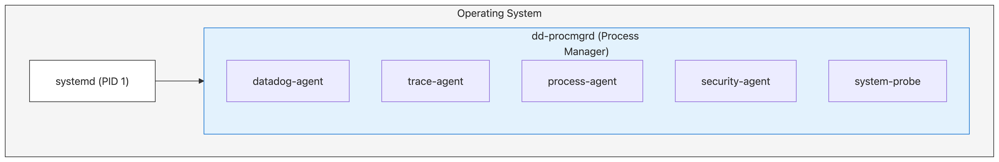
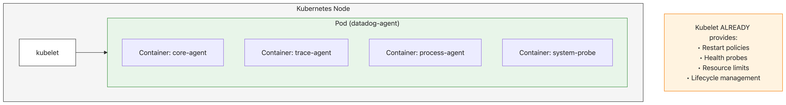
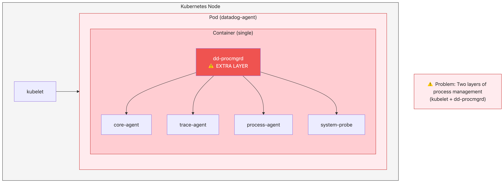
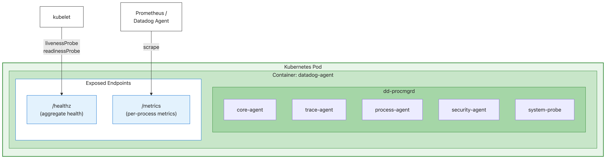
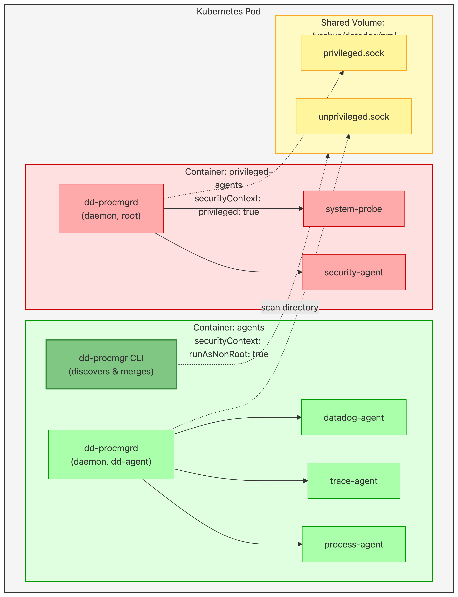
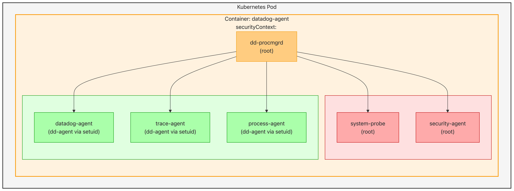

# Process Manager: Kubernetes Deployment Analysis

| Status | Analysis Document |
|--------|-------------------|
| Author | José Manuel Almaza |
| Created | 2025-11-26 |
| Related | [RFC.md](../RFC.md) |

## Executive Summary

This document analyzes whether the Datadog Agent Process Manager can be used for Kubernetes deployments.

**The short answer is: technically yes, but there's no validated customer need.**

| Question | Answer |
|----------|--------|
| Can dd-procmgrd run in K8s? | ✅ Yes, technically feasible |
| Has any K8s customer requested this? | ❌ No |
| Are there complaints about the current multi-container approach? | ❌ No |
| Would it change how the Agent is monitored in K8s? | ⚠️ **Yes, significantly** |

The process manager is designed to replace systemd on Linux (v1). While it *could* run in K8s, this would:
- **Fundamentally change** how customers monitor the Agent in K8s (dashboards, alerts, `kubectl` commands)
- **Provide theoretical benefits** (unified behavior, faster restarts) that no one has requested
- **Break existing workflows** built around per-container observability

**Recommendation:** The current multi-container K8s approach works well. Phase 6 should only be pursued if a validated customer need emerges.

---

## Table of Contents

1. [Context: Why This Question Matters](#1-context-why-this-question-matters)
2. [Architecture Comparison](#2-architecture-comparison)
3. [Pros of Using Process Manager in K8s](#3-pros-of-using-process-manager-in-k8s)
4. [Cons of Using Process Manager in K8s](#4-cons-of-using-process-manager-in-k8s)
5. [Feature Overlap Analysis](#5-feature-overlap-analysis)
6. [When It Might Make Sense](#6-when-it-might-make-sense)
7. [Recommendation](#7-recommendation)
8. [K8s-Friendly Process Manager Architecture](#8-k8s-friendly-process-manager-architecture)
   - [8.4 Privilege Considerations in K8s](#84-privilege-considerations-in-k8s)
9. [Development Considerations](#9-development-considerations-cost-of-supporting-both-modes)
10. [Conclusion](#conclusion)

---

## 1. Context: Why This Question Matters

The Process Manager RFC explicitly marks Kubernetes as **Phase 6** (future consideration) with the scope note:

> **Scope Note**: The initial implementation (v1) will target **Linux bare-metal/VM environments only**. Kubernetes, macOS, and Windows support will be added in subsequent phases.

**Why this analysis?** This document helps inform whether Phase 6 should be pursued and, if so, what approach makes sense for K8s environments.

**Current K8s deployment model**: Today, the Datadog Agent runs in Kubernetes as a multi-container pod—each component (core-agent, trace-agent, process-agent, etc.) runs in its own container, managed by kubelet.

This raises the question: is the process manager even applicable to Kubernetes, or does K8s fundamentally change the architecture requirements?

---

## 2. Architecture Comparison

### Bare-Metal/VM (Target Environment)

In bare-metal/VM environments, **systemd** is the OS init system (PID 1), and **dd-procmgrd** runs as a single systemd service. All Datadog agent processes are managed by dd-procmgrd, not directly by systemd. This provides unified restart policies, dependency management between agent processes, graceful shutdown coordination, and a single point of control instead of 5+ separate systemd unit files.



**Value**: Process Manager replaces multiple systemd services with unified control.

### Kubernetes Environment

In Kubernetes, **kubelet** is the node agent that manages pods and containers. Each Datadog agent component runs as a separate container within a pod, following the "one process per container" best practice. Kubelet handles restart policies, health probes (liveness/readiness), resource limits, and lifecycle management natively.



**Note**: Kubelet ALREADY provides what dd-procmgrd does: restart policies, health probes, resource limits, lifecycle management.

### With Process Manager in K8s (Alternative Approach)

Running dd-procmgrd inside a Kubernetes container creates **two layers of process management**: kubelet manages the container, while dd-procmgrd manages processes inside it. This deviates from the "one process per container" convention and creates a layer of abstraction between Kubernetes and the actual processes.



**Tradeoff**: Two layers of process management (kubelet + dd-procmgrd) - but this provides encapsulation, backward compatibility, and unified behavior across platforms. See analysis below.

---

## 3. Pros of Using Process Manager in K8s

> ⚠️ **Critical Note: These Are Theoretical Benefits, Not Customer Requests**
>
> The benefits listed below are **engineering-driven hypotheticals**, not validated customer requirements:
> - **No K8s customer has requested** unified behavior between VM and K8s deployments
> - **No stakeholder has complained** about the current multi-container approach
> - These "pros" were not gathered from customer feedback, support tickets, or product requests
>
> In contrast, the [Cons section](#4-cons-of-using-process-manager-in-k8s) describes **real operational changes** that would affect existing monitoring, dashboards, alerts, and workflows that customers have already built.

| Pro | Explanation | Validated Need? |
|-----|-------------|-----------------|
| **Unified behavior across platforms** | Same restart policies, dependencies, and health checks whether running on bare-metal, VM, or K8s | ❌ No - customers don't typically run both VM and K8s and expect identical behavior |
| **Fine-grained restart control** | Agent-controlled restart logic vs. K8s pod-level restarts (which kill the entire container) | ❓ Unknown - are K8s restart policies causing real issues? |
| **Tightly coupled process lifecycle** | `binds_to` semantics ensure processes that must start/stop together actually do | ❓ Unknown - is this a real problem in current K8s deployments? |
| **Graceful shutdown coordination** | Ordered shutdown sequence in reverse dependency order | ❌ No - see note below* |
| **Internal health monitoring** | Agent-level health checks separate from and in addition to K8s probes | ❌ No - K8s probes already provide this |
| **Reduced container sprawl** | Single container instead of multiple sidecars reduces pod complexity | ❓ Unknown - is pod complexity a customer complaint? |
| **Faster internal restarts** | Process restart (ms) < Container restart (seconds) < Pod restart (seconds+) | ❓ Unknown - is restart speed an issue for agent? |
| **Configuration consistency** | Same YAML process configs work in all environments | ❌ No - K8s users expect K8s-native configs (Helm, YAML manifests) |
| **Reduced scheduling overhead** | Single container scheduled once vs. multiple containers | ❌ No - scheduling 5 containers is trivial for K8s |

### *Note on Graceful Shutdown Coordination

**Why this is NOT a valid benefit:**

The reviewer correctly pointed out:
> "If shutting down things in a given order is a requirement, then any unexpected agent exit (OOM, SIGKILL, etc.) will be problematic because it wouldn't comply with the expected shutdown ordering. If we want to support unexpected agent exit, then expected agent shutdown can be done in any order."

This is sound logic:
1. The agent **must** tolerate unexpected exits (OOM, node crash, SIGKILL)
2. Therefore, all components must be resilient to any failure order
3. If components are resilient to any failure order, ordered shutdown adds no value
4. Needing ordered shutdown suggests design flaws (tight coupling that shouldn't exist)

**Crash-only design principle:** If your software can handle crashes gracefully, it doesn't need special shutdown procedures. The agent components should (and likely do) handle any exit order gracefully.

### Key Question: Who Is the Target Audience?

Before pursuing K8s support (Phase 6), we should validate:

1. **Are K8s customers asking for this?** → If not, why invest in it?
2. **What problem are we solving?** → The current approach works; is there a pain point?
3. **Would customers accept the observability changes?** → Existing dashboards and alerts would need rework

---

## 4. Cons of Using Process Manager in K8s

| Con | Explanation | Severity | Mitigation |
|-----|-------------|----------|------------|
| **Deviates from K8s convention** | Running multiple processes in one container differs from "1 process = 1 container" | Medium | This is a tradeoff, not an absolute wrong—provides encapsulation benefits |
| **Duplicated functionality** | K8s already provides restart policies, health probes, resource limits | Medium | dd-procmgrd handles internal restarts faster; K8s handles container-level |
| **Observability gaps** | K8s can only see container health, not individual process health | Medium | Expose `/metrics` endpoint and structured logs for opt-in visibility |
| **Resource attribution** | K8s sees total container resources, cannot attribute to specific processes | Medium | Expose per-process metrics via Prometheus/DogStatsD |
| **Independent scaling impossible** | Can't scale trace-agent separately from core-agent | Medium | Scale entire containers; unified scaling can be a feature |
| **Rolling update granularity** | Updates affect entire pod, not individual processes | Low | Atomic updates ensure component version consistency |
| **Debugging complexity** | `kubectl logs` shows mixed output from all processes | Medium | Use structured JSON logs with process identifiers |
| **Init container incompatibility** | K8s init containers pattern doesn't work within process manager | Low | Use dd-procmgrd's dependency system instead |
| **PodDisruptionBudgets** | Applied at pod level, not process level | Low | Simpler management—one policy for all components |
| **Service mesh integration** | Sidecars expect one process per container | Low | Most sidecars work at pod level anyway |

### Deep Dive: Why "1 Process = 1 Container" Matters

Kubernetes was designed around the assumption that each container runs a single process. This enables:

1. **Clean lifecycle management**: Container exit = process exit
   - When the process exits, Kubernetes immediately knows and can take action (restart, alert, reschedule)
   - Exit codes are unambiguous - they represent exactly one process's outcome
   - Example: If `trace-agent` crashes with exit code 137 (OOM killed), K8s knows exactly which component failed
   - **dd-procmgrd also provides this**: Tracks each process's exit code and state, can restart based on policy. The difference is K8s only sees container-level events, not individual process failures.

2. **Resource isolation**: Resources tied to single process
   - CPU/memory limits apply directly to the process, not shared across multiple
   - Kubernetes scheduler can make informed decisions about placement
   - Example: Setting `resources.limits.memory: 256Mi` guarantees trace-agent gets exactly that - not competing with other processes in the same container
   - **dd-procmgrd also provides this**: Uses cgroups v2 to enforce per-process CPU, memory, and PID limits internally. The difference is K8s scheduler doesn't see these limits for placement decisions.

3. **Log aggregation**: stdout/stderr from one source
   - **dd-procmgrd also provides this**: Each managed process can have separate log handling, but `kubectl logs` sees combined output.

4. **Health signals**: Container health = process health
   - **dd-procmgrd also provides this**: HTTP, TCP, and Exec health probes per process. The difference is K8s probes only see container health, not individual process health.
5. **Horizontal scaling**: Scale individual components independently
   - K8s can scale trace-agent to 5 replicas while keeping core-agent at 1
   - **dd-procmgrd doesn't provide this**: Cannot scale individual processes within the manager. However, you can scale entire containers running dd-procmgrd (e.g., 3 replicas of the agent pod, each running dd-procmgrd with all components).

When you run multiple processes in one container:

```yaml
# K8s can only do this:
resources:
  limits:
    cpu: "2"        # Total for ALL processes
    memory: "1Gi"   # Total for ALL processes

# Process Manager wants this:
# - core-agent: 500m CPU, 256Mi memory
# - trace-agent: 200m CPU, 128Mi memory
# - process-agent: 300m CPU, 64Mi memory
# But K8s can't enforce per-process limits!
```

### The Core Problem: Loss of External Visibility

The fundamental issue with running dd-procmgrd inside Kubernetes is that **external monitoring tools lose visibility** into individual process states BUT:

> **Counter-argument: Encapsulation as a Feature**
>
> From an OOP perspective, exposing every process as a separate container is like making all class members `public`. With dd-procmgrd, processes are encapsulated - the container is the "class" and processes are `private` implementation details. External systems shouldn't need to know whether the agent is 1 process or 5 - they just need to know: *"Is the agent healthy? Is it doing its job?"*
>
> This is proper abstraction: hide implementation complexity, expose a clean interface (container health, logs, metrics).
>
> **Backward Compatibility Advantage**: When you have public variables in a class, refactoring breaks tests and consumers. The same applies here - **in the multi-container approach**, exposing each process as a container creates tight coupling between deployments and internal structure:
> - Adding a new agent component (e.g., `otel-agent`) requires updating K8s manifests, Helm charts, and monitoring configs
> - Removing or merging processes becomes a breaking change for all deployments
> - Renaming a component (e.g., `trace-agent` → `apm-agent`) breaks dashboards, alerts, and automation scripts that reference the old container name
>
> **With dd-procmgrd**, internal restructuring is transparent - the container interface stays stable regardless of how many processes run inside. Rename `trace-agent` internally? The container is still called `datadog-agent` - nothing external breaks.

| What K8s/Monitoring Tools See | What dd-procmgrd Knows (but K8s doesn't) |
|-------------------------------|------------------------------------------|
| Container running ✅ | trace-agent crashed 3 times |
| Container memory: 800Mi | core-agent: 400Mi, trace-agent: 200Mi, process-agent: 200Mi |
| Container CPU: 1.5 cores | Which process is consuming CPU |
| Container healthy (probe passed) | system-probe is unhealthy, others healthy |
| 1 pod restart | 15 internal process restarts |

**Affected tools and integrations:**

- **Prometheus/Grafana** - Cannot alert on individual process metrics
- **kubectl top** - Shows combined resource usage only
- **Kubernetes Dashboard** - No visibility into process states
- **Datadog K8s integration** - Ironically, our own K8s monitoring can't see inside dd-procmgrd!
- **PagerDuty/OpsGenie alerts** - Cannot trigger on specific process failures
- **Kubernetes audit logs** - Events don't capture internal process restarts
- **Cost attribution tools** - Cannot attribute resources to specific agent components

> **Potential Mitigation: Expose Internal State**
>
> dd-procmgrd could bridge this visibility gap with minimal changes:
>
> | Tool | How dd-procmgrd Could Help |
> |------|---------------------------|
> | Prometheus/Grafana | Expose `/metrics` endpoint with per-process CPU, memory, restart counts |
> | Datadog integration | Emit DogStatsD metrics or use Datadog API for per-process telemetry |
> | Alerting (PagerDuty, etc.) | Expose process state via health endpoint or emit events to stdout |
> | Audit/logging | Write structured logs (JSON) to stdout with process-level events |
> | Cost attribution | Include process-level resource metrics in exposed telemetry |
>
> This approach maintains encapsulation while providing **opt-in visibility** - external tools can consume the exposed data without tight coupling to internal structure.

---

## 5. Feature Overlap Analysis

### Features K8s Already Provides

| Feature | Process Manager | Kubernetes | Notes |
|---------|----------------|------------|-------|
| **Restart policies** | `always`, `on-failure`, `on-success`, `never` | `Always`, `OnFailure`, `Never` | Near parity |
| **Health checks** | HTTP, TCP, Exec probes | Liveness, Readiness, Startup probes | K8s has more probe types |
| **Resource limits** | cgroups v2 (CPU, memory, PIDs) | Container resource requests/limits | K8s integrates with scheduler |
| **Exponential backoff** | Configurable | Built-in with CrashLoopBackOff | K8s is more aggressive |
| **Graceful shutdown** | Ordered by dependency | `preStop` hooks, `terminationGracePeriodSeconds` | Both work; ordered shutdown is "nice to have" if components tolerate any exit order |

**Detailed breakdown:**

1. **Restart policies**: Both offer similar options. dd-procmgrd adds `on-success` (restart only if exit code 0) which K8s doesn't have natively. However, dd-procmgrd restarts are internal (milliseconds), while K8s restarts the entire container (seconds).

2. **Health checks**: K8s distinguishes between Liveness (is it alive?), Readiness (can it receive traffic?), and Startup (is it still starting?). dd-procmgrd currently has a single health check concept but applies it per-process.

   > **Potential Enhancement**: dd-procmgrd could support K8s-style probe types:
   > ```yaml
   > probes:
   >   liveness:    # Is it alive? Failure = restart
   >     type: http
   >     endpoint: "http://localhost:8080/live"
   >   readiness:   # Can it handle traffic? Failure = don't route
   >     type: http
   >     endpoint: "http://localhost:8080/ready"
   >   startup:     # Is it still starting? Delays liveness checks
   >     type: tcp
   >     port: 8080
   >     period: 60
   > ```
   > dd-procmgrd could then expose aggregate endpoints (`/healthz/live`, `/healthz/ready`) for K8s to probe, providing per-process health visibility while maintaining encapsulation.

3. **Resource limits**: K8s integrates with the scheduler—if a node doesn't have enough resources, the pod isn't scheduled there. dd-procmgrd enforces limits via cgroups but the K8s scheduler doesn't see them.

4. **Exponential backoff**: K8s `CrashLoopBackOff` is aggressive and not configurable. dd-procmgrd allows custom backoff configuration (`restart_sec`, `restart_max_delay_sec`) with automatic exponential backoff (2^failures).

5. **Graceful shutdown**: dd-procmgrd shuts down processes in reverse dependency order automatically. K8s requires manual `preStop` hooks for coordination. **However:** As noted in Section 3, if components must tolerate unexpected exits (OOM, SIGKILL), they must handle any shutdown order—making ordered shutdown a "nice to have" rather than a requirement.

### Features Process Manager Provides That K8s Doesn't

| Feature | Process Manager | Kubernetes Equivalent | Gap |
|---------|-----------------|----------------------|-----|
| **Process dependencies** | `requires`, `wants`, `binds_to`, `after`, `before` | Init containers (limited) | Significant |
| **Conflict resolution** | `conflicts` directive | None | Moderate |
| **Socket activation** | systemd-compatible | None native | Moderate |
| **Internal restart without container restart** | Yes | No | Significant |
| **Cascading stops** | `binds_to` propagation | None | Moderate |

**Detailed breakdown:**

1. **Process dependencies**: dd-procmgrd supports rich dependency semantics:
   - `requires`: Hard dependency, fails if dependency fails
   - `wants`: Soft dependency, continues if dependency fails
   - `binds_to`: Lifecycle binding, stops when dependency stops
   - `after`/`before`: Ordering without dependency
   
   K8s init containers are one-time setup tasks that run sequentially before main containers start. They can't express runtime dependencies like "restart if dependency crashes" or ordering between main containers.

2. **Conflict resolution**: dd-procmgrd's `conflicts` directive ensures mutually exclusive processes can't run together. K8s has no equivalent—you'd need external logic.

3. **Socket activation**: dd-procmgrd can start processes on-demand when a socket receives a connection (systemd-compatible). Useful for rarely-used services. K8s has no native equivalent.

4. **Internal restart without container restart**: 
   ```
   With dd-procmgrd:    Process crash → Restart in ~10ms → K8s sees nothing
   Without dd-procmgrd: Process crash → Container exits → K8s restarts container (~seconds)
   ```
   This means faster recovery and no `CrashLoopBackOff` risk for transient failures.

5. **Cascading stops (`binds_to`)**: If `trace-agent` has `binds_to: ["core-agent"]` and `core-agent` crashes, `trace-agent` is automatically stopped. This prevents orphaned processes running without their dependencies. K8s would leave `trace-agent` running (and failing) until manually stopped.

### Features K8s Provides That Process Manager Doesn't

> **Note**: Most K8s features (service discovery, load balancing, scaling, rolling updates, network policies) are orchestrator/platform concerns, not process management concerns. They operate at different layers and complement rather than compete with dd-procmgrd.

| Feature | Kubernetes | Process Manager |
|---------|------------|-----------------|
| **Secrets management** | Native secrets, CSI drivers | Environment files |

**Secrets management** is the main relevant comparison:

**Kubernetes approach:**
- Native `Secret` objects stored in etcd (encrypted at rest)
- Mounted as files in `/var/run/secrets/` or injected as environment variables
- CSI drivers for external secret stores (Vault, AWS Secrets Manager, etc.)
- Automatic rotation support with some CSI drivers

**dd-procmgrd approach:**
- Reads environment files (e.g., `/etc/dd-agent/environment`)
- Supports `EnvironmentFile=` directive (systemd-compatible)
- No native secret store integration

**In K8s, this is NOT a conflict:**
```yaml
# K8s mounts secret as a file
volumes:
  - name: api-key
    secret:
      secretName: datadog-api-key

# dd-procmgrd reads it as environment file
volumeMounts:
  - name: api-key
    mountPath: /etc/dd-agent/secrets
    readOnly: true

# Process config
environment_file: /etc/dd-agent/secrets/api-key
```

dd-procmgrd consumes K8s secrets the same way any containerized process does—no special integration needed.

---

## 6. When dd-procmgrd Makes Sense in K8s

Based on our analysis, dd-procmgrd provides value in K8s when these priorities matter:

### 6.1 Deployment Stability & Backward Compatibility

When you want internal changes to be transparent to **K8s-level** tooling:
- Adding/removing agent components doesn't require Helm chart updates
- Internal restructuring doesn't affect K8s manifests or `kubectl` commands
- Container name stays stable regardless of internal process changes
- Like proper encapsulation in OOP: private implementation, stable public interface

> **Note**: If you expose per-process metrics or structured logs (opt-in visibility), dashboards/alerts using those **would** need updates when renaming processes. The encapsulation benefit applies to K8s-native tooling, not custom monitoring built on exposed telemetry.

### 6.2 Unified Behavior Across Platforms

When consistency across environments matters:
- Same config works on bare-metal, VM, and K8s
- Same restart policies, dependencies, and health checks everywhere
- One codebase to test and maintain
- Easier migration between platforms

### 6.3 Faster Recovery

When minimizing downtime is critical:
- Process restart: ~10ms (K8s doesn't notice)
- Container restart: ~seconds (image pull, startup)
- No CrashLoopBackOff risk for transient failures
- Internal restarts don't show up as pod restarts in metrics

### 6.4 DaemonSet Deployments

When running the agent on every node:
- Single container reduces scheduling overhead
- Shared memory footprint (shared libraries)
- Simpler pod spec and resource management

### 6.5 Tightly Coupled Components

When processes must stay in sync:
- `binds_to` ensures trace-agent stops if core-agent crashes
- K8s would leave trace-agent running (orphaned, failing)
- Ordered startup and shutdown by dependency

### 6.6 Edge/Constrained Environments

In resource-constrained K8s clusters (edge, IoT):
- Fewer container runtimes
- Reduced kubelet bookkeeping
- Lower overall resource footprint

---

## 7. Recommendation

### For All K8s Deployments: Continue Current Approach

The current multi-container approach (trace-agent, process-agent, etc. as separate containers) **works well and should not change**:

- ✅ Existing users have built dashboards, alerts, and automation around this structure
- ✅ K8s-native observability works as expected
- ✅ Per-container resource limits and health probes function correctly
- ✅ No complaints or pain points have been reported

### For Phase 6 Planning: Deprioritize

**Phase 6 (Kubernetes Consideration) should be deprioritized** because:

| Factor | Assessment |
|--------|------------|
| Customer demand | ❌ None identified |
| Technical necessity | ❌ K8s already handles process lifecycle |
| Pain points with current approach | ❌ None reported |
| Development cost | ⚠️ Significant (new deployment mode, testing, docs) |
| Maintenance cost | ⚠️ Ongoing (two modes to support) |
| Risk to existing users | ⚠️ High (observability changes) |

### When to Reconsider

Phase 6 should only be revisited if:

1. **Customer demand emerges**: K8s users explicitly request unified behavior with VM deployments
2. **Pain points are identified**: Current multi-container approach causes documented issues
3. **Business case exists**: Clear ROI for the development investment

### What About the Detailed Analysis Below?

Sections 8 and 9 below describe *how* dd-procmgrd could work in K8s if it were pursued. This is included for completeness and future reference, but **should not be interpreted as a recommendation to proceed**.

---

## 8. K8s-Friendly Process Manager Architecture

> ⚠️ **Note**: This section describes *how* dd-procmgrd could work in K8s, not *whether* it should be pursued. See [Section 7 (Recommendation)](#7-recommendation) for the current guidance: **deprioritize Phase 6 until customer demand emerges**.

The following architecture *would* enable dd-procmgrd to run in Kubernetes while providing opt-in visibility through standard interfaces:

### 8.1 Recommended Architecture



dd-procmgrd runs inside a single container, managing all agent processes. It would expose (proposed enhancements):
- `/healthz/live` - Liveness probe: are all processes running?
- `/healthz/ready` - Readiness probe: are all processes ready to handle requests?
- `/metrics` - Per-process metrics for Prometheus/Datadog scraping

> **Note**: These endpoints are proposed enhancements for K8s mode, not currently implemented.

### 8.2 Integration Points

| Integration | Implementation |
|-------------|----------------|
| **Health Probes** | Process manager exposes `/healthz/live` and `/healthz/ready` endpoints |
| **Metrics** | Process manager metrics scraped by Prometheus/Datadog |
| **Logging** | Structured JSON logs to stdout for K8s log aggregation |
| **Graceful Shutdown** | Process manager handles SIGTERM from K8s |
| **Resource Reporting** | Per-process resource usage in metrics (even if K8s can't limit) |

### 8.3 Feature Matrix for K8s Mode

| Feature | Bare-Metal Mode | K8s Lightweight Mode |
|---------|----------------|---------------------|
| Restart policies | Process Manager | Process Manager (internal) |
| Health checks | Process Manager | Process Manager → K8s probe |
| Resource limits | Process Manager (cgroups) | K8s (container level) |
| Dependencies | Process Manager | Process Manager |
| Socket activation | Process Manager | Disabled (K8s Services instead) |
| Log output | File/syslog | stdout (K8s logging) |

### 8.4 Privilege Considerations in K8s

A critical consideration for dd-procmgrd in Kubernetes is **privilege requirements**. Some agent components require elevated privileges, which impacts container security policies.

#### Current Privilege Model

| Process | Privilege Level | Why |
|---------|----------------|-----|
| **dd-procmgrd** | root | Must run as root to `setuid`/`setgid` child processes, manage cgroups, grant capabilities |
| **system-probe** | root | eBPF access requires root/privileged container |
| **security-agent** | root | Security monitoring requires root |
| **datadog-agent** | dd-agent (unprivileged) | No special privileges needed |
| **trace-agent** | dd-agent (unprivileged) | No special privileges needed |
| **process-agent** | dd-agent (unprivileged) | No special privileges needed |

#### K8s Security Policy Impact

Many K8s clusters enforce security policies that **block privileged containers**. This affects the Datadog Agent because:

- **system-probe** requires `privileged: true` for eBPF access
- **security-agent** requires root for security monitoring
- **dd-procmgrd** requires root to `setuid` child processes

In clusters with strict security policies, attempting to deploy a privileged dd-procmgrd container will **fail**—the K8s API server rejects the pod before it's created, unless security teams grant an exception.

| Policy Level | Datadog Agent Impact |
|--------------|---------------------|
| **Privileged** | No restrictions - dd-procmgrd works as-is |
| **Baseline** | system-probe needs exception; other agents OK |
| **Restricted** | Single container blocked - use two-container split (Option A) |

#### Option A: Two-Container Split (Recommended for Strict Policies)

Split the agent into two containers within the same pod, each with its own dd-procmgrd daemon:

- **Privileged container**: dd-procmgrd daemon (root) manages system-probe and security-agent
- **Unprivileged container**: dd-procmgrd daemon (dd-agent user) manages core-agent, trace-agent, process-agent
- **Unified CLI**: `dd-procmgr` (CLI) queries both daemons and merges results for a single view

The unprivileged dd-procmgrd doesn't need root because it's not doing privilege dropping—all its child processes already run as `dd-agent`.



**Pros:**
- Unprivileged components run in restricted container (passes strict security policies)
- Minimizes attack surface of privileged container
- Each container still benefits from dd-procmgrd (dependencies, health checks, fast restarts)
- Single CLI entry point for managing all processes (queries multiple daemons)

**Compared to current multi-container approach:**
- Two containers instead of 5+ (simpler)
- Requires shared volume for socket directory (minor addition)
- Helm chart logic is actually simpler (fewer containers to manage)

#### CLI Multi-Daemon Discovery (Proposed Enhancement)

The CLI could automatically discover and query multiple daemons using a **socket directory convention**:

> **Note**: Current implementation uses a single socket file (`/var/run/datadog/process-manager.sock`). This section describes a proposed enhancement for multi-daemon support.

```
/var/run/datadog/pm/              # Shared volume between containers
├── privileged.sock               # Daemon in privileged container
└── unprivileged.sock             # Daemon in unprivileged container
```

**Discovery logic:**
```rust
// Scan socket directory, connect to all discovered daemons
let socket_dir = env::var("DD_PM_SOCKET_DIR")
    .unwrap_or_else(|_| "/var/run/datadog/pm".to_string());

let daemons = fs::read_dir(socket_dir)
    .filter(|p| p.extension() == "sock")
    .map(|p| (p.file_stem(), p))  // ("privileged", path)
    .collect();
```

**Benefits:**
- Zero configuration - just drop sockets in the directory
- Adding/removing daemons is automatic
- Backward compatible with single daemon

#### Enhanced CLI Output (Proposed Enhancement)

The `list` command would add columns to show daemon namespace and K8s context:

**Standard output (multiple daemons):**
```
DAEMON          NAME                 PID    STATE    RUNS  COMMAND
--------------  -------------------  -----  -------  ----  ------------------------
privileged      system-probe         1234   Running  1     /opt/.../system-probe
privileged      security-agent       1235   Running  1     /opt/.../security-agent
unprivileged    datadog-agent        1236   Running  1     /opt/.../agent
unprivileged    trace-agent          1237   Running  1     /opt/.../trace-agent
unprivileged    process-agent        1238   Running  1     /opt/.../process-agent
```

**K8s-aware output (with `--show-k8s` or auto-detected):**
```
POD                     CONTAINER            DAEMON          NAME                 STATE
----------------------  -------------------  --------------  -------------------  -------
datadog-agent-node1     privileged-agents    privileged      system-probe         Running
datadog-agent-node1     privileged-agents    privileged      security-agent       Running
datadog-agent-node1     agents               unprivileged    datadog-agent        Running
datadog-agent-node1     agents               unprivileged    trace-agent          Running
datadog-agent-node1     agents               unprivileged    process-agent        Running
```

**How dd-procmgrd gets K8s context:**

The [Kubernetes Downward API](https://kubernetes.io/docs/concepts/workloads/pods/downward-api/) allows pods to expose their own metadata as environment variables. This is configured in the Helm chart / pod spec:

```yaml
# In the container spec (Helm chart or Deployment YAML)
containers:
  - name: privileged-agents
    env:
      - name: DD_POD_NAME
        valueFrom:
          fieldRef:
            fieldPath: metadata.name    # K8s injects the pod name at runtime
      - name: DD_CONTAINER_NAME
        value: "privileged-agents"      # Static value identifying this container
```

When the pod starts, K8s automatically sets `DD_POD_NAME` to the actual pod name (e.g., `datadog-agent-node1-abc123`). The dd-procmgrd daemon would read these environment variables and expose them via:

- **`GetStatus` RPC** (existing method) - add `pod_name` and `container_name` fields to response
- **`List` RPC** (existing method) - add fields to each process entry

The CLI would then merge this info when displaying processes from multiple daemons.

#### Option B: Single Privileged Container (Simpler, Internal Separation)

Run all processes in a single privileged container, with dd-procmgrd handling internal privilege separation:



**Pros:**
- Full dd-procmgrd benefits: unified dependencies, coordinated shutdown, fast restarts
- Simpler deployment (single container)
- Internal privilege separation via `setuid`/`setgid` and capabilities

**Cons:**
- Container must be privileged (may not pass strict security policies)
- External tools see a privileged container, even though most processes inside are unprivileged
- Security teams may require justification

#### Recommendation by Environment

| Environment | Recommended Option | Rationale |
|-------------|-------------------|-----------|
| **Production with strict policies** | Option A (Two-Container) | Compliance with security policies |
| **Production with baseline policies** | Option B (Single Container) | Simpler, full dd-procmgrd benefits |
| **Development/Testing** | Option B (Single Container) | Simpler setup |
| **Edge/IoT** | Option B (Single Container) | Lower resource overhead |

---

## 9. Development Considerations: Cost of Supporting Both Modes

> ⚠️ **Note**: This section is included for completeness. Given the lack of customer demand, this investment is **not currently recommended**.

Supporting both multi-container and dd-procmgrd modes in K8s has development and maintenance implications.

### What's Shared (No Extra Cost)

| Component | Notes |
|-----------|-------|
| **Agent code** (Go binaries) | Same code, same logic - deployment doesn't affect this |
| **Agent configuration** | Same `datadog.yaml` format |
| **Core functionality** | Same metrics collection, APM, logs, etc. |

### What's Different (Extra Effort)

> **Note**: The Datadog Agent already uses **s6** (a process supervisor) inside a single container image for K8s.
> dd-procmgrd would **replace s6**, not introduce a new pattern. This significantly reduces the effort.

| Component | Current (s6) | dd-procmgrd | Extra Work |
|-----------|--------------|-------------|------------|
| **Container images** | Single (all components) | Same | Minimal - swap s6 for dd-procmgrd |
| **Helm charts** | Current charts | Same charts | May need new env vars/config |
| **E2E tests** | Current tests | Same tests | Behavioral tests should pass |
| **Documentation** | Current docs | Update process manager section | Minor updates |

### Strategies to Minimize Overhead

1. **Single Helm chart with deployment mode flag**:
   ```yaml
   # values.yaml
   deploymentMode: "multi-container"  # default (backward compatible)
   # deploymentMode: "process-manager"  # opt-in
   ```
   One chart, conditional templates based on mode.

2. **Shared container base image**: Both modes can share the same base layers, reducing image build complexity.

3. **Behavioral tests over deployment tests**: Test agent functionality (metrics work, traces flow, etc.) rather than deployment specifics. These tests are shared across modes.

4. **Feature flags in agent**: Agent can detect its environment and adjust behavior (e.g., log to stdout in K8s, file on bare-metal).

### Cost-Benefit Summary

| Deployment Mode | Current State | dd-procmgrd Effort |
|-----------------|---------------|-------------------|
| **Single-container** | Uses s6 as process supervisor | **Minimal** - replace s6 with dd-procmgrd |
| **Multi-container** | Each component in separate container | **No change** - keep as-is for backward compatibility |

For single-container mode (where s6 is already used):

| Cost | Benefit |
|------|---------|
| Swap s6 for dd-procmgrd in Dockerfile | Unified codebase (no separate s6 config) |
| Update health endpoints | Better K8s integration (liveness/readiness) |
| Minor Helm chart updates | Consistent behavior across all platforms |

### Recommendation

The extra development effort is **minimal for single-container mode** because:
- Agent already runs multiple processes in one container (via s6)
- dd-procmgrd replaces s6, doesn't add a new pattern
- Container image structure stays the same

**Multi-container mode remains unchanged** for users who prefer K8s-native per-component visibility.

---

## Conclusion

The Process Manager is **well-designed for its target environment** (bare-metal/VM Linux systems). For Kubernetes, the analysis reveals a critical gap:

### The Core Issue: No Validated Customer Need

| Question | Finding |
|----------|---------|
| Has any K8s customer requested dd-procmgrd? | ❌ No |
| Are there complaints about current multi-container approach? | ❌ No |
| Would existing monitoring/alerting need rework? | ⚠️ Yes, significantly |
| Is there a target audience for K8s support? | ❓ Unknown/unvalidated |

### Arguments Against K8s Support (Practical View)

1. **No customer demand**: The "pros" are theoretical engineering benefits, not customer requests
2. **Breaks existing workflows**: Dashboards, alerts, and `kubectl` patterns would need rework
3. **Duplicates K8s functionality**: Restart policies, health probes, resource limits already exist
4. **Changes monitoring model**: External tools lose per-process visibility

### Arguments For K8s Support (Theoretical View)

These benefits are technically valid but **unvalidated**:
- Unified behavior across platforms (but who needs this?)
- Faster process restarts (but is this a real problem?)
- Encapsulation/abstraction (but at what cost to observability?)

### Recommendation

1. **v1**: Focus on Linux bare-metal/VM as planned ✅
2. **Phase 6**: **Do not pursue** unless a validated customer need emerges
3. **K8s deployments**: Continue with current multi-container approach

### Final Thought: Should We Invest in K8s Support?

**No, not without validated customer demand.**

The theoretical benefits (unified behavior, faster restarts, encapsulation) are engineering-driven hypotheticals. Meanwhile, the costs are concrete:
- Rework of existing K8s monitoring patterns
- Loss of per-container observability that customers rely on
- Development/maintenance overhead for a second deployment mode

**Phase 6 should be deprioritized** until/unless:
- Customers explicitly request unified behavior between VM and K8s
- Significant pain points are identified with the current multi-container approach
- There's a clear business case for the investment

The process manager adds tremendous value where there's no orchestrator (bare-metal, VM). In K8s, the orchestrator already handles process lifecycle—adding another layer provides marginal benefit at significant cost.

---

## References

- [RFC: Datadog Agent Process Manager](../RFC.md)
- [Kubernetes Best Practices: One Process Per Container](https://kubernetes.io/docs/concepts/workloads/pods/#how-pods-manage-multiple-containers)
- [Kubernetes Probes Documentation](https://kubernetes.io/docs/tasks/configure-pod-container/configure-liveness-readiness-startup-probes/)


