# End to End testing

# ToC
- [How it works](#how-it-works)
  * [Setup instance](#setup-instance)
  * [Run instance](#run-instance)
  * [Command line](#command-line)
    * [AWS development](#aws-development)
    * [Locally](#locally)
- [Argo workflow](#argo-workflow)
  * [argo assertion](#argo-assertion)
  * [argo container](#argo-container)
- [Upgrade](#upgrade---bump)

# How it works

There are 3 main directories:
- [argo-workflows](./argo-workflows)
    Specification of the end to end testing

- [containers](./containers)
    Custom container images needed within the workflows

- [scripts](./scripts)
    - [`setup-instance`](./scripts/setup-instance)
      Entrypoint and scripts dedicated for environments (locally, AWS dev, AWS gitlab)
    - [`run-instance`](./scripts/run-instance)
      Scripts executed in the argo-machine (locally, AWS instance)

## `setup-instance`



## `run-instance`


## Command line

### AWS development

```bash
$ cd ${GOPATH}/src/github.com/DataDog/datadog-agent
$ aws-vault exec ${DEV} -- inv -e e2e-tests -t dev --agent-image datadog/agent-dev:master --dca-image datadog/cluster-agent-dev:master
```

### Locally (Linux only)

```bash
$ inv -e e2e-tests -t local --agent-image datadog/agent-dev:master --dca-image datadog/cluster-agent-dev:master
```

# Argo workflow

The argo documentation is available [here](https://argo-cd.readthedocs.io/en/stable/), there are a lot of examples [here](https://github.com/argoproj/argo/tree/master/examples) too.

## Argo assertion

To assert something in an argo workflow, you need to create a mongodb query:
```yaml
name: find-kubernetes-state-deployments
activeDeadlineSeconds: 200
script:
  image: mongo:3.6.3
  command: [mongo, "fake-datadog.default.svc.cluster.local/datadog"]
  source: |
    while (1) {
      var nb = db.series.find({
      metric: "kubernetes_state.deployment.replicas_available",
      tags: {$all: ["namespace:default", "deployment:fake-datadog"] },
      "points.0.1": { $eq: 1} });
      print("find: " + nb)
      if (nb != 0) {
        break;
      }
      prevNb = nb;
      sleep(2000);
    }
```

This is an infinite loop with a timeout set by `activeDeadlineSeconds: 200`.
The source is EOF to the command, equivalent to:
```bash
mongo "fake-datadog.default.svc.cluster.local/datadog" << EOF
while (1)
[...]
EOF
```

Try to maximise the usage of MongoDB query system without rewriting too much logic in JavaScript.

See some examples [here](./containers/fake_datadog/README.md#find)

To discover more MongoDB capabilities:
- [find](https://docs.mongodb.com/manual/tutorial/query-documents/)
- [aggregation](https://docs.mongodb.com/manual/aggregation/)

## Argo container

If you need to add a non existing public container in the workflow, create it in the [container directory](./containers).

But, keep in mind this become an additional piece of software to maintain.

# Upgrade - bump

This section helps you to upgrade any part of the end to end testing.

The current end to end testing pipeline relies on:
* [Argo](https://github.com/argoproj/argo)

Upgrade Argo version by changing version in `test/e2e/scripts/run-instance/20-argo-download.sh` and setting new checksum value in `test/e2e/scripts/run-instance/argo.sha512sum`

* [Kind](https://kind.sigs.k8s.io/)

Upgrade Kind version by changing version in `test/e2e/scripts/run-instance/10-setup-kind.sh`.
By default Kind will use the latest stable Kubernetes known at the time of Kind release.

* [Fedora CoreOS](https://getfedora.org/en/coreos?stream=stable)

You don't need to update CoreOS version as the setup script (`test/e2e/scripts/setup-instance/00-entrypoint-[dev|gitlab].sh`) always uses the latest `stable` version by default.

If needed, use the [ignition-linter](https://coreos.com/validate/) to validate any changes.
