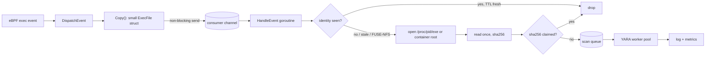

# YARA Exec Scanner PoC — Work Plan

**Area:** CWS / system-probe · **Status:** Planning · **Platforms:** Linux amd64 / arm64
**Threat model (PoC):** unprivileged attacker on local filesystems

Goal: scan every executed binary with YARA rules, once per distinct file content, without slowing the event path.

---

## 1. Why this design

Hooking YARA into security-profile insertion does not work:

- Activity-tree nodes are matched on path, lineage and args (`ProcessInfo.matches`, `pkg/security/security_profile/activity_tree/process_node.go:339`). The file hash is never used for matching.
- Hashes are computed only when a new node is created (`NewProcessNode`, `process_node.go:194`).
- So a binary replaced in place at a known path, or a new image tag with changed binaries, never creates a new node and would never be scanned.
- V2 profiles (`manager_v2.go:580`) skip host processes (null container context).

Instead the PoC registers an **event-monitor consumer for exec events**:

- `DispatchEvent` calls `sendEventToConsumers` for every event (`pkg/security/probe/probe_ebpf.go:1225`).
- Each consumer's `Copy()` runs on the hot path, then the result goes into a buffered channel with a non-blocking send (`pkg/security/probe/probe.go:349`). When the channel is full, the event is dropped and counted.
- All heavy work (open, hash, scan) runs on the consumer's own goroutines.

Two dedupe levels keep the cost low:

1. **File identity** `(MountID, Inode, CTime)`, taken from the exec event in memory with no syscall. Most execs stop here. An unprivileged user can't set ctime, and any content write changes it.
2. **Content**: an in-memory sha256 set. The same binary across many containers or paths is scanned once.

The file is read once. The same bytes are hashed and scanned, so the file can't change between the two (no TOCTOU).

## 2. Scope

**In the PoC**
- All execs, host and containers, eBPF probe
- The main binary, plus the script file for interpreter execs
- Identity cache and sha256 set, both in memory
- Always re-hash on FUSE / network filesystems
- Periodic re-check TTL on identity hits
- Rules loaded from a local directory at startup
- Output: structured log line and metrics
- Off by default behind a config flag

**Out of the PoC**
- Protection against a root attacker (clock change, raw block-device writes, debugfs)
- `inode->i_version` from eBPF as the identity key
- IMA measurement log
- Scanning opened (non-exec) files
- Rule delivery via Remote Config
- Backend event or signal, and UI
- Storing verdicts in security profiles
- Windows, macOS, ebpfless mode

## 3. Data flow



## 4. Shared contracts

Agree on these types first, so WS-B, C, D and F can build against each other using stand-in implementations. Suggested package: `pkg/eventmonitor/consumers/yara` (WS-B makes the final call).

```go
// ExecFile is what Copy() extracts from the event. Keep it small: it is built on the hot path.
type ExecFile struct {
    PID         uint32
    CGroupID    containerutils.CGroupID
    ContainerID containerutils.ContainerID
    Path        string // Process.FileEvent.PathnameStr
    MountID     uint32 // FileEvent.PathKey.MountID
    Inode       uint64 // FileEvent.PathKey.Inode
    CTime       uint64 // FileEvent.FileFields.CTime
    Filesystem  string // for the FUSE/NFS bypass
    IsScript    bool   // true for LinuxBinprm.FileEvent (interpreter execs)
    SeenAt      time.Time
}

type Identity struct {
    MountID uint32
    Inode   uint64
    CTime   uint64
}

// Deduper holds both dedupe levels. Must be safe for concurrent use.
type Deduper interface {
    IdentityFresh(id Identity, now time.Time) bool // true: skip, no I/O
    MarkIdentity(id Identity, now time.Time)
    ClaimHash(sum [32]byte) bool                  // true: caller owns the scan
    ReleaseHash(sum [32]byte)                     // on drop/failure, so a later exec retries
}

// Scanner wraps the YARA engine. Rules are compiled once at startup.
type Scanner interface {
    Scan(ctx context.Context, data []byte) ([]Match, error)
    RulesVersion() string
}

type Match struct {
    Rule      string
    Namespace string
    Tags      []string
}

// Reporter emits results. PoC: log + metrics.
type Reporter interface {
    Report(f ExecFile, sum [32]byte, matches []Match, err error)
}
```

> Note: `FileFields` has no size field (`pkg/security/secl/model/model_unix.go`). The identity key is therefore `(MountID, Inode, CTime)`. The worker gets the size from `fstat` after opening the file.

## 5. Workstreams

### WS-A — YARA engine spike and decision
**Size:** M · **Can start:** now

Pick between yara-x (Rust, C API + Go bindings) and libyara via go-yara. Either one adds cgo to system-probe.

- [ ] Hello-world scan with each engine, linked into a Go binary, linux amd64 and arm64
- [ ] Measure scan time for 1 MB / 20 MB / 100 MB binaries against a realistic ruleset (~500 rules)
- [ ] Measure memory used by compiled rules, and the binary size delta (the size quality gate checks it)
- [ ] Check static linking, glibc floor, license (both BSD-3) and CVE history
- [ ] With the build team, check that the native lib can be built under Bazel (and omnibus if needed)

**Done when:** a short decision doc with numbers is agreed, plus a throwaway `Scanner` prototype on the chosen engine.

### WS-B — Exec consumer, config and wiring
**Size:** M · **Can start:** now, with stand-ins

Consumer skeleton: receive exec events, build `ExecFile`, hand it to the dedupe pipeline. Model it on `pkg/eventmonitor/consumers/process.go`.

- [ ] Implement `probe.EventConsumerHandler` (`ID`, `ChanSize`, `EventTypes` = exec, `Copy`, `HandleEvent`); interface at `pkg/security/probe/eventconsumer.go`
- [ ] Implement `eventmonitor.EventConsumer` (`ID`, `Start`, `Stop`); interface at `pkg/eventmonitor/consumer.go`
- [ ] `Copy()`: extract the main binary's fields. When `HasInterpreter()`, also emit the `LinuxBinprm.FileEvent` entry. Skip kworkers. Resolve `Filesystem` in `Copy()` only if it's cheap, otherwise in the worker
- [ ] Register in `cmd/system-probe/modules/eventmonitor_linux.go` (next to `createProcessMonitorConsumer`), gated by config
- [ ] Ensure enabling YARA turns on the event monitor module even when CWS rules are off (check the adjust logic in `pkg/system-probe/config`)
- [ ] Add config under `event_monitoring_config.yara.*` in `pkg/config/schema/yaml/system-probe_schema.yaml` (use the `/create-config-field` skill)
- [ ] Split by build tag: the real consumer behind the `yara` tag, a no-op stub otherwise, so the default build stays cgo-free until WS-E lands

**Done when:** with stand-in Deduper and Scanner implementations, running `/bin/true` on a dev VM logs an `ExecFile` line with correct fields, for both host and container execs.

### WS-C — Dedupe and file access
**Size:** M · **Can start:** now

- [ ] Identity LRU (`Identity → lastChecked`), size from config. `IdentityFresh` returns false after `recheck_ttl`
- [ ] sha256 set with an in-flight state: `ClaimHash` marks the hash, `ReleaseHash` clears it on queue-full or scan error
- [ ] Skip the identity level when `Filesystem` is fuse or a network filesystem (nfs, nfs4, cifs, smb3, 9p)
- [ ] Open order:
  1. `/proc/<pid>/exe` (`utils.ProcExePath`, `pkg/security/utils/proc_linux.go:146`)
  2. `utils.ProcRootFilePath(pid, path)`
  3. The container's other PIDs, from the cgroup resolver

  Copy the loop in `pkg/security/resolvers/hash/resolver_linux.go:329-372`, or extract a shared helper if that's clean.
- [ ] For script entries, skip `/proc/pid/exe` (it points at the interpreter)
- [ ] Call `fstat`. Skip non-regular files, and skip files over `max_file_size` (counted)
- [ ] Read once into a pooled buffer, sha256 those bytes, and pass the **same** buffer to the scanner
- [ ] Unit tests: identity hit, ctime change, TTL expiry, FUSE bypass, claim/release, concurrent claims

**Done when:** unit tests pass. Running the same binary 10,000 times causes one read, and rewriting the binary causes exactly one more.

### WS-D — Scanner pool and rule loading
**Size:** M · **Can start:** now with a stand-in scanner; real engine after WS-A

- [ ] Bounded queue (`queue_size`) and `workers` goroutines. Submit is non-blocking; when the queue is full, call `ReleaseHash` and count a drop
- [ ] Per-scan timeout (`scan_timeout`). On timeout, count it and release the hash
- [ ] At start, load and compile every rule file in `rules_dir`. On a compile error, log it and disable scanning; never crash system-probe
- [ ] `RulesVersion()` returns a hash of the rule file contents; include it in every report
- [ ] Stand-in scanner that matches a marker string, for tests and M1
- [ ] Real engine implementation once WS-A decides
- [ ] Cap memory: buffered bytes ≤ `workers × max_file_size`

**Done when:** with the stand-in scanner, flooding the queue drops scans cleanly without blocking. With the real engine, a test rule matches a test binary.

### WS-E — Build and packaging
**Size:** L · **Can start:** after WS-A

Likely the longest task. Involve the build and packaging owners early.

- [ ] Add the native lib and Go binding as dependencies (Bazel; see `bazel/AGENTS.md`)
- [ ] Add a `yara` build tag to the system-probe flavors in `tasks/build_tags.bzl`, Linux only
- [ ] Package with the agent (`packages/`; omnibus only if unavoidable)
- [ ] Update `LICENSE-3rdparty.csv`
- [ ] Run the size quality gate and report the delta
- [ ] Confirm `dda inv system-probe.build` works with and without the tag

**Done when:** a CI-built system-probe (amd64 and arm64) includes the scanner, and the size delta is known and accepted.

### WS-F — Reporting and metrics
**Size:** S · **Can start:** now

- [ ] Structured log on match: path, pid, container ID, sha256, rule names, namespace, tags, rules version
- [ ] Counters:
  - execs received
  - channel drops (the probe already exposes `eventDropped`)
  - identity hits, sha hits
  - reads, read errors by reason, too-big
  - scans, matches, scan errors, timeouts, queue drops
- [ ] Gauges: identity cache size, sha set size, queue depth. Distribution: scan duration
- [ ] Stretch goal, scoped as a separate follow-up: send a custom event to the CWS backend (the consumer needs a way to reach the CWS event sender)

**Done when:** metrics are visible in a dev-org dashboard during the M1 dry run.

### WS-G — Tests and performance
**Size:** M · **Can start:** after WS-B, C, D

- [ ] Integration test using `pkg/eventmonitor/consumers/testutil`: exec a test binary that contains a marker string, and assert exactly one match report
- [ ] Scenarios:
  - same binary run many times → one scan
  - binary rewritten in place → re-scan
  - same binary copied to two paths → one scan
  - interpreter exec → the script file is scanned
  - container exec
  - deleted binary still running
- [ ] Exec-storm benchmark (a tight `/bin/true` loop plus a realistic mix): CPU, RSS, channel drops and event latency, feature on vs off
- [ ] Cold-start test: many distinct binaries at once (image pull, then start); measure time to drain the queue
- [ ] Tune the defaults for `chan_size`, `workers`, `queue_size` and `max_file_size`

**Done when:** tests run in CI, and a benchmark report with the steady-state overhead per exec is attached.

## 6. Dependencies

| Workstream | Size | Depends on | Can start |
|---|---|---|---|
| WS-A Engine spike | M | — | now |
| WS-B Consumer + config | M | shared contracts | now, with stand-ins |
| WS-C Dedupe + file access | M | shared contracts | now |
| WS-D Scanner pool | M | WS-A (real engine) | now, stand-in scanner |
| WS-E Build + packaging | L | WS-A | after decision |
| WS-F Reporting | S | shared contracts | now |
| WS-G Tests + perf | M | B, C, D (E for CI) | after M1 |

Sizes are relative: S ≈ a few days, M ≈ 1–2 weeks, L ≈ several weeks (mostly waiting on build infrastructure).

## 7. Milestones

1. **M1: dry run with no cgo.** WS-B + WS-C + WS-D with the stand-in scanner + WS-F. Logs `would scan sha256=…` and emits metrics on a dev VM. Shows the dedupe ratio and overhead before any native code.
2. **M2: real engine in a local build.** WS-A decided and WS-D has the real engine. A test rule matches a test binary on a locally built system-probe.
3. **M3: CI build and tests.** WS-E lands; WS-G integration tests run in CI on amd64 and arm64.
4. **M4: performance validated.** WS-G benchmark report, defaults tuned, go/no-go for a wider pilot.

## 8. Config (proposed)

Keys under `event_monitoring_config.yara`:

| Key | Default | Meaning |
|---|---|---|
| `enabled` | `false` | Turns the consumer on |
| `rules_dir` | unset | Directory of `.yar` files compiled at startup; scanning stays off if unset |
| `chan_size` | `500` | Consumer channel size (exec events) |
| `workers` | `2` | Concurrent YARA scans |
| `queue_size` | `64` | Pending scans before drop |
| `max_file_size` | `64MB` | Larger files are skipped and counted |
| `scan_timeout` | `10s` | Per-file scan limit |
| `identity_cache_size` | `20000` | Identity LRU entries |
| `recheck_ttl` | `24h` | Re-hash an identity after this long, even if it hasn't changed |

These defaults are starting guesses; WS-G tunes them.

## 9. Risks

- **Native dependency in system-probe.** Build, packaging, size and security review may take longer than the code. Mitigation: M1 needs no cgo; start the WS-E conversations during WS-A.
- **Exec bursts overflow the channel.** Some execs are missed. The next exec of the same binary retries, so persistent malware is still caught, but one-shot binaries may not be. Watch the drop metric.
- **Short-lived processes.** `/proc/pid/exe` may be gone before the worker runs. The path fallback covers most cases; a deleted binary run by a short-lived process is lost.
- **Cold start cost.** On agent start or a large deploy, every binary is new at once. Queue bounds and drops keep this safe, but the backlog clears slowly.
- **Overlayfs identity.** We haven't verified how mount ID and inode behave across containers that share a layer. If the assumption is wrong, the cost is extra reads only; the sha256 level still dedupes scans.
- **Privileged forging.** Root can forge ctime (clock change, raw disk writes). Out of scope for the PoC; `i_version` is the follow-up.

## 10. Open questions

- Which team owns the consumer long term: CWS or event monitor?
- After the PoC, where do rules come from: bundled, customer-supplied, or Remote Config?
- What per-host CPU and memory budget is acceptable for the pilot?
- Where should matches go after the PoC (signal, event, or profile annotation)?
